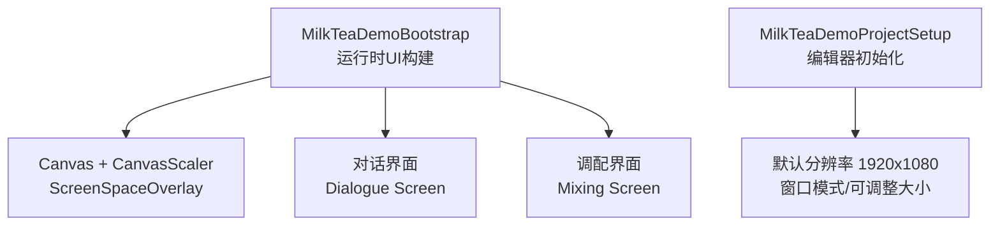
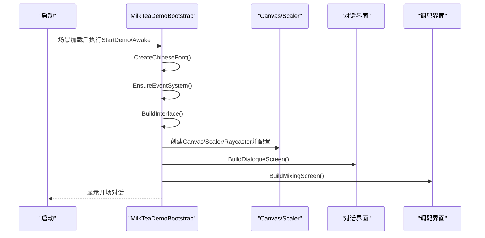
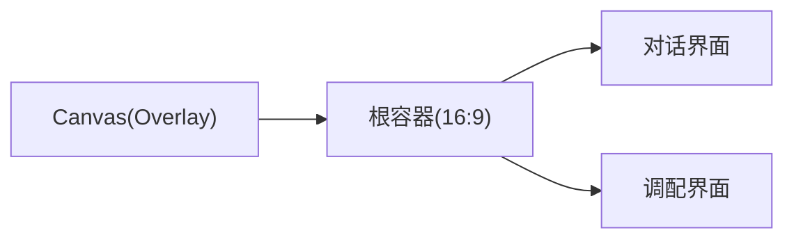
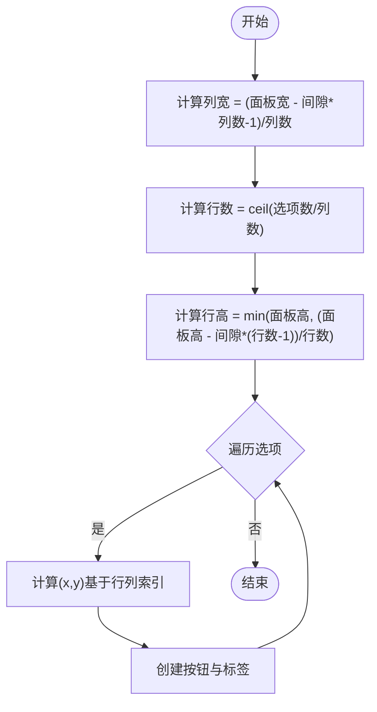
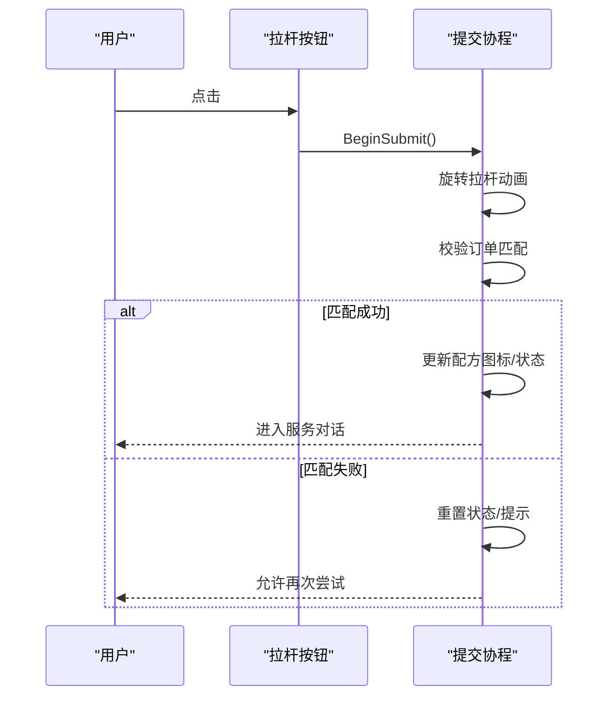
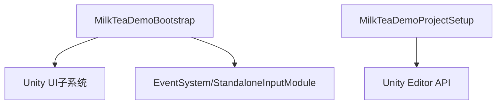

# UI架构设计

<cite>
**本文引用的文件**
- [MilkTeaDemoBootstrap.cs](file://Assets/Scripts/MilkTeaDemoBootstrap.cs)
- [MilkTeaDemoProjectSetup.cs](file://Assets/Editor/MilkTeaDemoProjectSetup.cs)
</cite>

## 目录
1. [简介](#简介)
2. [项目结构](#项目结构)
3. [核心组件](#核心组件)
4. [架构总览](#架构总览)
5. [详细组件分析](#详细组件分析)
6. [依赖关系分析](#依赖关系分析)
7. [性能考量](#性能考量)
8. [故障排查指南](#故障排查指南)
9. [结论](#结论)
10. [附录：扩展新UI组件的实践](#附录：扩展新ui组件的实践)

## 简介
本文件面向程序化UI构建系统，聚焦于通过代码动态创建Canvas、面板、文本、按钮等UI元素的设计与实现。文档重点解释BuildInterface()方法如何组织UI层次、布局算法与响应式缩放策略，并说明颜色主题系统、字体管理与样式统一机制。同时给出RectTransform的锚点设置与自适应布局模式，以及扩展新UI组件的最佳实践与性能优化建议。

## 项目结构
- 运行时脚本：负责在场景启动时动态创建整个UI树，包括Canvas、屏幕适配、对话界面与调配界面。
- 编辑器脚本：在项目初始化时配置默认窗口尺寸、全屏模式与演示场景，确保运行体验一致。

图表来源
- [MilkTeaDemoBootstrap.cs:83-114](file://Assets/Scripts/MilkTeaDemoBootstrap.cs#L83-L114)
- [MilkTeaDemoProjectSetup.cs:27-55](file://Assets/Editor/MilkTeaDemoProjectSetup.cs#L27-L55)

章节来源
- [MilkTeaDemoBootstrap.cs:83-114](file://Assets/Scripts/MilkTeaDemoBootstrap.cs#L83-L114)
- [MilkTeaDemoProjectSetup.cs:27-55](file://Assets/Editor/MilkTeaDemoProjectSetup.cs#L27-L55)

## 核心组件
- 程序化UI构建器：以单一入口类集中管理UI生命周期与构建流程，避免手工摆放GameObject带来的维护成本。
- 响应式Canvas：使用ScreenSpaceOverlay渲染模式与CanvasScaler按参考分辨率进行等比缩放，保证在不同分辨率下布局一致。
- 主题与样式：集中定义背景、面板、强调色等颜色常量；统一字体创建与回退策略；按钮状态色由基色派生，保持视觉一致性。
- 布局工具：提供SetRect与Stretch两个基础方法，分别用于“绝对定位”和“撑满父容器”两种常见布局模式。
- 交互系统：自动检测并注入EventSystem与StandaloneInputModule，确保按钮点击事件可用。

章节来源
- [MilkTeaDemoBootstrap.cs:19-30](file://Assets/Scripts/MilkTeaDemoBootstrap.cs#L19-L30)
- [MilkTeaDemoBootstrap.cs:62-81](file://Assets/Scripts/MilkTeaDemoBootstrap.cs#L62-L81)
- [MilkTeaDemoBootstrap.cs:697-718](file://Assets/Scripts/MilkTeaDemoBootstrap.cs#L697-L718)

## 架构总览
下图展示了从启动到UI构建的关键调用链，以及各模块的职责边界。

图表来源
- [MilkTeaDemoBootstrap.cs:62-81](file://Assets/Scripts/MilkTeaDemoBootstrap.cs#L62-L81)
- [MilkTeaDemoBootstrap.cs:83-114](file://Assets/Scripts/MilkTeaDemoBootstrap.cs#L83-L114)
- [MilkTeaDemoBootstrap.cs:116-192](file://Assets/Scripts/MilkTeaDemoBootstrap.cs#L116-L192)

## 详细组件分析

### BuildInterface() 方法与UI层次结构
- Canvas层：创建Canvas、CanvasScaler、GraphicRaycaster，设置RenderMode为ScreenSpaceOverlay，排序层级提升以避免被游戏画面遮挡。
- 根容器：创建一个撑满屏幕的根面板，并附加AspectRatioFitter强制16:9内容区域，保证在不同分辨率下内容不被拉伸变形。
- 子屏切换：创建“对话界面”和“调配界面”两个全屏面板，初始隐藏其中一个，运行时通过SetActive切换。

图表来源
- [MilkTeaDemoBootstrap.cs:83-114](file://Assets/Scripts/MilkTeaDemoBootstrap.cs#L83-L114)

章节来源
- [MilkTeaDemoBootstrap.cs:83-114](file://Assets/Scripts/MilkTeaDemoBootstrap.cs#L83-L114)

### 对话框界面（Dialogue Screen）
- 标题、顾客立绘占位区、店铺俯视小场景、底部对话框（说话人、台词、继续按钮）。
- 所有元素通过CreatePanel/CreateText/CreateButton组合构建，位置与尺寸通过SetRect精确控制。

章节来源
- [MilkTeaDemoBootstrap.cs:116-156](file://Assets/Scripts/MilkTeaDemoBootstrap.cs#L116-L156)

### 调配界面（Mixing Screen）
- 顶部订单提示框：显示当前订单需求。
- 后厨俯视图：工作台、萃茶机、奶底区、角色Q版占位。
- 右侧操作面板：配方手册、原料选择、机器拉杆。
- 布局采用“固定坐标+固定尺寸”的方式，配合根容器的16:9约束，在不同分辨率下保持一致比例。

章节来源
- [MilkTeaDemoBootstrap.cs:158-192](file://Assets/Scripts/MilkTeaDemoBootstrap.cs#L158-L192)

### 原料选择与网格布局算法
- 通过BuildChoicePanel根据选项数量与列数计算每个选项卡宽高与间距，形成规则网格。
- 行数和列数由选项总数与目标列数推导，行高受面板高度与行数限制，确保不溢出。
- 选中态通过Image颜色切换实现，未选中项使用面板浅色，选中项使用强调色。

图表来源
- [MilkTeaDemoBootstrap.cs:268-293](file://Assets/Scripts/MilkTeaDemoBootstrap.cs#L268-L293)

章节来源
- [MilkTeaDemoBootstrap.cs:268-293](file://Assets/Scripts/MilkTeaDemoBootstrap.cs#L268-L293)

### 机器拉杆动画与提交流程
- 点击拉杆后，通过协程逐步旋转RectTransform.localRotation，模拟拉动效果。
- 校验所选原料与糖度、冰度是否符合订单要求，正确则解锁配方图标并进入服务对话，否则提示重新调配。

图表来源
- [MilkTeaDemoBootstrap.cs:465-514](file://Assets/Scripts/MilkTeaDemoBootstrap.cs#L465-L514)

章节来源
- [MilkTeaDemoBootstrap.cs:465-514](file://Assets/Scripts/MilkTeaDemoBootstrap.cs#L465-L514)

### RectTransform使用模式、锚点与自适应布局
- SetRect：将anchorMin/anchorMax设为零，pivot设为左下角，通过anchoredPosition与sizeDelta进行绝对定位，适合固定布局。
- Stretch：将anchorMin/anchorMax设为零与一，pivot居中，offset归零，使子对象撑满父容器，适合全屏或容器背景。
- 根容器使用AspectRatioFitter强制16:9，结合CanvasScaler的ScaleWithScreenSize，实现跨分辨率一致显示。

章节来源
- [MilkTeaDemoBootstrap.cs:679-695](file://Assets/Scripts/MilkTeaDemoBootstrap.cs#L679-L695)
- [MilkTeaDemoBootstrap.cs:92-105](file://Assets/Scripts/MilkTeaDemoBootstrap.cs#L92-L105)

### 颜色主题系统与样式统一
- 主题色集中声明：背景、面板、强调色、文字色等，便于全局替换与风格切换。
- 按钮状态色由基色派生：高亮、按下、禁用通过Color.Lerp生成，保证对比度与一致性。
- 边框效果：通过Outline组件统一添加描边，增强可读性与层次感。

章节来源
- [MilkTeaDemoBootstrap.cs:19-28](file://Assets/Scripts/MilkTeaDemoBootstrap.cs#L19-L28)
- [MilkTeaDemoBootstrap.cs:649-677](file://Assets/Scripts/MilkTeaDemoBootstrap.cs#L649-L677)

### 字体管理与样式统一
- 动态字体：优先尝试系统中文常用字体，失败时回退至内置Arial，确保多平台可用性。
- 文本样式：统一字体引用、字号、对齐方式、换行策略，避免散落配置导致不一致。

章节来源
- [MilkTeaDemoBootstrap.cs:697-708](file://Assets/Scripts/MilkTeaDemoBootstrap.cs#L697-L708)
- [MilkTeaDemoBootstrap.cs:631-647](file://Assets/Scripts/MilkTeaDemoBootstrap.cs#L631-L647)

## 依赖关系分析
- MilkTeaDemoBootstrap依赖Unity UI组件（Canvas、CanvasScaler、GraphicRaycaster、Text、Button、Image、Outline）、事件系统（EventSystem、StandaloneInputModule）与资源访问（Font）。
- 编辑器脚本MilkTeaDemoProjectSetup仅在编辑器环境下运行，负责项目级初始化与场景管理，不影响运行时UI逻辑。

图表来源
- [MilkTeaDemoBootstrap.cs:697-718](file://Assets/Scripts/MilkTeaDemoBootstrap.cs#L697-L718)
- [MilkTeaDemoProjectSetup.cs:1-18](file://Assets/Editor/MilkTeaDemoProjectSetup.cs#L1-L18)

章节来源
- [MilkTeaDemoBootstrap.cs:697-718](file://Assets/Scripts/MilkTeaDemoBootstrap.cs#L697-L718)
- [MilkTeaDemoProjectSetup.cs:1-18](file://Assets/Editor/MilkTeaDemoProjectSetup.cs#L1-L18)

## 性能考量
- 减少重复创建：将通用面板、按钮、文本的创建封装为工厂方法，避免样板代码与重复分配。
- 合理锚点与布局：对全屏背景使用Stretch，对固定布局使用SetRect，避免过度使用LayoutGroup造成额外计算。
- 字体复用：全局单例字体对象，避免频繁创建或查找字体。
- 事件监听清理：在切换对话框或销毁对象前移除不必要的onClick监听，防止内存泄漏。
- 协程节流：动画与等待使用协程分帧执行，避免阻塞主线程。

[本节为通用指导，不直接分析具体文件]

## 故障排查指南
- 无事件系统：若场景中没有EventSystem，按钮无法响应。脚本已自动检测并创建，如仍异常请检查是否被其他脚本覆盖。
- 字体不可用：当系统缺少中文字体时，会回退到Arial。若出现乱码，确认目标平台字体支持情况。
- 布局错位：检查是否误用了SetRect与Stretch的组合；全屏背景应使用Stretch，局部控件使用SetRect。
- 按钮无响应：确认Button的targetGraphic指向自身Image，且EventSystem存在。

章节来源
- [MilkTeaDemoBootstrap.cs:710-718](file://Assets/Scripts/MilkTeaDemoBootstrap.cs#L710-L718)
- [MilkTeaDemoBootstrap.cs:649-670](file://Assets/Scripts/MilkTeaDemoBootstrap.cs#L649-L670)

## 结论
该UI架构通过程序化构建实现了高度可控、易于扩展的界面体系。以单一入口集中管理Canvas、主题、布局与交互，结合响应式缩放与统一的样式规范，能够在不同分辨率与平台上保持一致体验。通过合理的RectTransform策略与工厂化创建方法，既保证了开发效率，也兼顾了性能与维护性。

[本节为总结，不直接分析具体文件]

## 附录：扩展新UI组件的实践
以下示例展示如何在现有框架基础上扩展一个新的“设置面板”组件，遵循既有模式与最佳实践。

步骤概览
- 新建一个面板容器：使用CreatePanel创建，并通过SetRect或Stretch设置布局。
- 添加文本与按钮：使用CreateText与CreateButton，传入统一的颜色与字体。
- 绑定交互：为按钮添加onClick监听，调用业务逻辑。
- 统一管理：将面板加入某个父容器（如调配界面），并在需要时通过SetActive控制显隐。

关键要点
- 颜色与字体：使用类内主题色与全局字体，避免硬编码。
- 布局：优先使用SetRect进行精确定位；如需自适应，使用Stretch并结合父容器约束。
- 命名：为GameObject赋予清晰名称，便于调试与查找。
- 事件：在切换界面或销毁对象时，移除不再需要的监听，避免内存泄漏。

章节来源
- [MilkTeaDemoBootstrap.cs:616-670](file://Assets/Scripts/MilkTeaDemoBootstrap.cs#L616-L670)
- [MilkTeaDemoBootstrap.cs:679-695](file://Assets/Scripts/MilkTeaDemoBootstrap.cs#L679-L695)