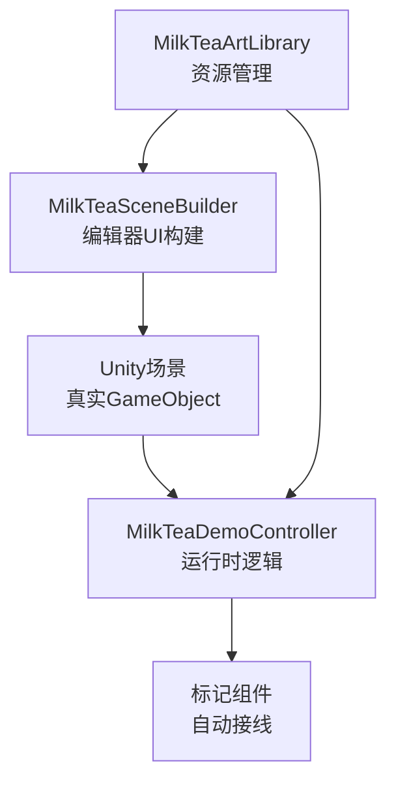
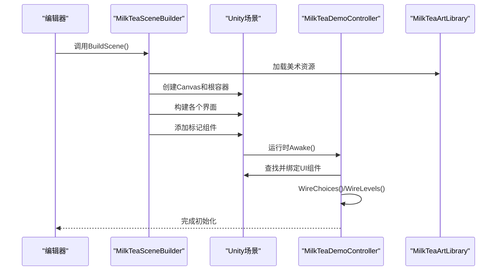
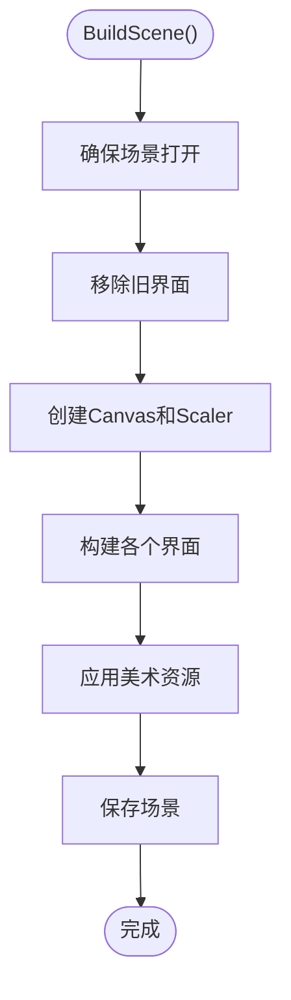
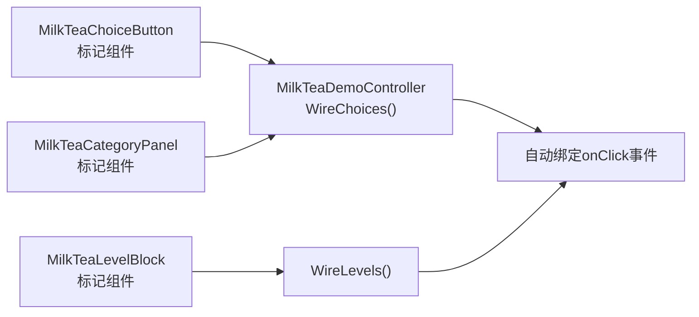
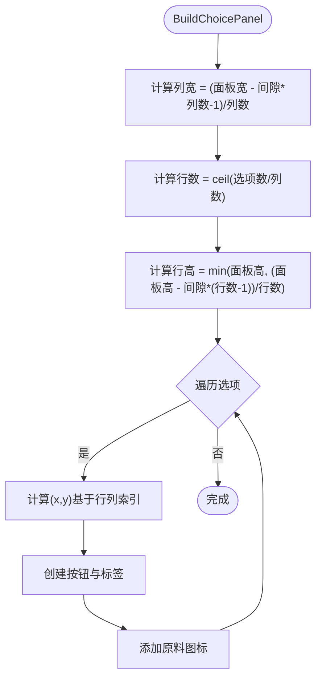
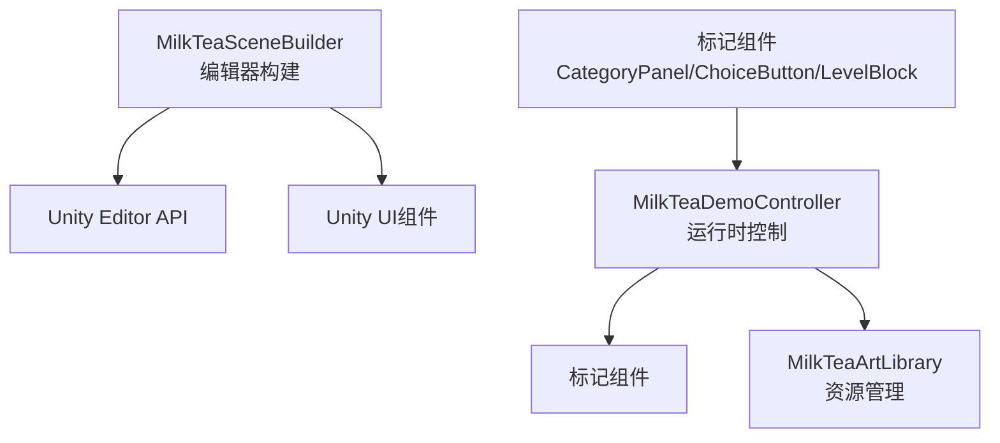

# UI架构设计

<cite>
**本文引用的文件**
- [MilkTeaSceneBuilder.cs](file://Assets/Editor/MilkTeaSceneBuilder.cs)
- [MilkTeaDemoController.cs](file://Assets/Scripts/MilkTeaDemoController.cs)
- [MilkTeaArtLibrary.cs](file://Assets/Scripts/MilkTeaArtLibrary.cs)
- [MilkTeaCategoryPanel.cs](file://Assets/Scripts/MilkTeaCategoryPanel.cs)
- [MilkTeaChoiceButton.cs](file://Assets/Scripts/MilkTeaChoiceButton.cs)
- [MilkTeaLevelBlock.cs](file://Assets/Scripts/MilkTeaLevelBlock.cs)
</cite>

## 更新摘要
**变更内容**
- 完全重构UI构建系统，从运行时动态创建改为编辑器程序化生成
- 新增MilkTeaSceneBuilder作为核心UI构建器，支持一键生成完整界面
- 实现多屏幕切换系统：对话界面、调配界面、结算界面、休息界面、开始界面、设置面板、开场动画
- 引入标记组件系统：通过MilkTeaCategoryPanel、MilkTeaChoiceButton、MilkTeaLevelBlock等标记组件实现自动接线
- 增强资源管理：通过MilkTeaArtLibrary统一管理美术资源，支持占位符回退机制

## 目录
1. [简介](#简介)
2. [项目结构](#项目结构)
3. [核心组件](#核心组件)
4. [架构总览](#架构总览)
5. [详细组件分析](#详细组件分析)
6. [依赖关系分析](#依赖关系分析)
7. [性能考量](#性能考量)
8. [故障排查指南](#故障排查指南)
9. [结论](#结论)
10. [附录：扩展新UI组件的实践](#附录：扩展新ui组件的实践)

## 简介
本文件面向奶茶店模拟经营的程序化UI构建系统，重点说明通过MilkTeaSceneBuilder在编辑器中自动生成完整UI界面的设计与实现。该系统采用"编辑器构建 + 运行时控制"的分离架构，通过BuildInterface()方法动态创建Canvas、面板、文本、按钮等所有UI元素，并建立完整的屏幕切换和交互逻辑。

## 项目结构
- **编辑器构建器**：MilkTeaSceneBuilder负责在编辑器中生成完整的UI场景，包括所有界面和组件
- **运行时控制器**：MilkTeaDemoController持有对场景中UI组件的引用，驱动业务逻辑
- **标记组件系统**：通过专用标记组件实现UI与逻辑的松耦合绑定
- **资源管理系统**：MilkTeaArtLibrary统一管理美术资源，提供占位符回退机制



**图表来源**
- [MilkTeaSceneBuilder.cs:38-55](file://Assets/Editor/MilkTeaSceneBuilder.cs#L38-L55)
- [MilkTeaDemoController.cs:196-206](file://Assets/Scripts/MilkTeaDemoController.cs#L196-L206)

**章节来源**
- [MilkTeaSceneBuilder.cs:38-55](file://Assets/Editor/MilkTeaSceneBuilder.cs#L38-L55)
- [MilkTeaDemoController.cs:196-206](file://Assets/Scripts/MilkTeaDemoController.cs#L196-L206)

## 核心组件
- **程序化UI构建器**：MilkTeaSceneBuilder提供一键构建功能，在编辑器中生成完整的UI场景树
- **响应式Canvas系统**：使用ScreenSpaceOverlay渲染模式，配置CanvasScaler实现跨分辨率适配
- **多屏幕切换架构**：支持对话界面、调配界面、结算界面、休息界面、开始界面、设置面板、开场动画的无缝切换
- **标记组件系统**：通过MilkTeaCategoryPanel、MilkTeaChoiceButton、MilkTeaLevelBlock等标记组件实现UI与逻辑的自动绑定
- **资源回退机制**：当美术资源缺失时自动使用纯色占位符，确保系统稳定性

**章节来源**
- [MilkTeaSceneBuilder.cs:87-150](file://Assets/Editor/MilkTeaSceneBuilder.cs#L87-L150)
- [MilkTeaDemoController.cs:226-253](file://Assets/Scripts/MilkTeaDemoController.cs#L226-L253)

## 架构总览
下图展示了从编辑器构建到运行时控制的完整流程，以及各模块的职责边界。



**图表来源**
- [MilkTeaSceneBuilder.cs:38-55](file://Assets/Editor/MilkTeaSceneBuilder.cs#L38-L55)
- [MilkTeaDemoController.cs:196-206](file://Assets/Scripts/MilkTeaDemoController.cs#L196-L206)

## 详细组件分析

### MilkTeaSceneBuilder - 核心UI构建器
MilkTeaSceneBuilder是整个UI系统的核心，负责在编辑器中生成完整的UI场景。主要功能包括：

- **场景管理**：确保目标场景存在并打开，清理旧界面后重新构建
- **Canvas配置**：创建Canvas、CanvasScaler、GraphicRaycaster，设置ScreenSpaceOverlay渲染模式
- **界面构建**：依次构建对话界面、调配界面、结算界面、休息界面、开始界面、设置面板、开场动画
- **资源应用**：尝试应用美术资源，失败时使用占位符



**图表来源**
- [MilkTeaSceneBuilder.cs:38-55](file://Assets/Editor/MilkTeaSceneBuilder.cs#L38-L55)

**章节来源**
- [MilkTeaSceneBuilder.cs:38-55](file://Assets/Editor/MilkTeaSceneBuilder.cs#L38-L55)

### 多屏幕切换系统
系统包含七个主要界面，通过SetActive进行切换：

- **对话界面**：显示顾客对话、店铺场景、角色立绘
- **调配界面**：配方手册、原料选择、机器操作区
- **结算界面**：每日营业统计和营收展示
- **休息界面**：出租屋场景、手机菜单、下一天入口
- **开始界面**：游戏Logo、开始游戏、读取存档按钮
- **设置面板**：音量、分辨率、语言设置
- **开场动画**：视频播放或倒计时占位

**章节来源**
- [MilkTeaSceneBuilder.cs:112-150](file://Assets/Editor/MilkTeaSceneBuilder.cs#L112-L150)
- [MilkTeaDemoController.cs:447-480](file://Assets/Scripts/MilkTeaDemoController.cs#L447-L480)

### 标记组件系统与自动接线
通过专用标记组件实现UI与逻辑的松耦合绑定：

- **MilkTeaCategoryPanel**：标记原料分类容器，记录所属类别（茶底/奶底/配料）
- **MilkTeaChoiceButton**：标记原料选择按钮，记录选项名称和类别
- **MilkTeaLevelBlock**：标记糖度/冰度方块，记录类型和索引

运行时通过GetComponentsInChildren自动发现并绑定这些标记组件。



**图表来源**
- [MilkTeaDemoController.cs:226-253](file://Assets/Scripts/MilkTeaDemoController.cs#L226-L253)
- [MilkTeaDemoController.cs:255-283](file://Assets/Scripts/MilkTeaDemoController.cs#L255-L283)

**章节来源**
- [MilkTeaCategoryPanel.cs:1-11](file://Assets/Scripts/MilkTeaCategoryPanel.cs#L1-L11)
- [MilkTeaChoiceButton.cs:1-12](file://Assets/Scripts/MilkTeaChoiceButton.cs#L1-L12)
- [MilkTeaLevelBlock.cs:1-12](file://Assets/Scripts/MilkTeaLevelBlock.cs#L1-L12)
- [MilkTeaDemoController.cs:226-283](file://Assets/Scripts/MilkTeaDemoController.cs#L226-L283)

### 原料选择网格布局算法
BuildChoicePanel方法实现了智能的网格布局算法：

- **动态计算**：根据选项数量和列数自动计算每个选项卡的宽高与间距
- **自适应行高**：根据面板高度和行数限制计算最优行高
- **图标支持**：为每个选项添加对应的原料图标（如果资源存在）



**图表来源**
- [MilkTeaSceneBuilder.cs:507-545](file://Assets/Editor/MilkTeaSceneBuilder.cs#L507-L545)

**章节来源**
- [MilkTeaSceneBuilder.cs:507-545](file://Assets/Editor/MilkTeaSceneBuilder.cs#L507-L545)

### 机器拉杆动画与提交流程
点击拉杆后执行完整的提交流程：

- **动画效果**：通过协程逐步旋转RectTransform.localRotation，模拟拉动效果
- **订单校验**：检查所选原料与糖度、冰度是否符合当前订单要求
- **状态反馈**：正确则解锁配方图标并进入服务对话，否则提示重新调配

**章节来源**
- [MilkTeaDemoController.cs:307-311](file://Assets/Scripts/MilkTeaDemoController.cs#L307-L311)

### RectTransform使用模式与布局策略
系统采用两种主要的布局模式：

- **SetRect**：绝对定位模式，将anchorMin/anchorMax设为零，pivot设为左下角，通过anchoredPosition与sizeDelta精确控制位置
- **Stretch**：撑满模式，将anchorMin/anchorMax设为零与一，pivot居中，使子对象撑满父容器

根容器使用AspectRatioFitter强制16:9比例，配合CanvasScaler的ScaleWithScreenSize实现跨分辨率适配。

**章节来源**
- [MilkTeaSceneBuilder.cs:673-689](file://Assets/Editor/MilkTeaSceneBuilder.cs#L673-L689)

### 颜色主题系统与样式统一
系统定义了统一的颜色主题：

- **基础色**：背景(#111827)、面板(#243247)、面板浅色(#33445E)
- **强调色**：薄荷绿(#69D8C5)、珊瑚红(#F28B82)、黄色(#F3C84B)
- **功能色**：蓝色(#62B5F5)、灰色(#657184)、深色(#101722)
- **文字色**：奶油白(#FFF4D6)

按钮状态色通过Color.Lerp派生，保证视觉一致性。

**章节来源**
- [MilkTeaSceneBuilder.cs:23-32](file://Assets/Editor/MilkTeaSceneBuilder.cs#L23-L32)
- [MilkTeaSceneBuilder.cs:633-650](file://Assets/Editor/MilkTeaSceneBuilder.cs#L633-L650)

### 字体管理与资源回退
系统实现了健壮的字体和资源管理机制：

- **字体优先**：优先使用MilkTeaArtLibrary中的自定义字体
- **回退策略**：字体缺失时回退至LegacyRuntime.ttf或Arial
- **资源占位**：美术资源缺失时使用纯色面板或文字占位
- **运行时适配**：运行时通过ApplyRuntimeFont()统一设置字体

**章节来源**
- [MilkTeaSceneBuilder.cs:716-720](file://Assets/Editor/MilkTeaSceneBuilder.cs#L716-L720)
- [MilkTeaDemoController.cs:208-224](file://Assets/Scripts/MilkTeaDemoController.cs#L208-L224)

## 依赖关系分析
系统采用清晰的依赖层次：

- **MilkTeaSceneBuilder**：编辑器脚本，依赖Unity Editor API和UI组件
- **MilkTeaDemoController**：运行时脚本，依赖UI组件和标记组件
- **标记组件**：轻量级数据载体，无外部依赖
- **MilkTeaArtLibrary**：ScriptableObject资源，被构建器和控制器共同使用



**图表来源**
- [MilkTeaSceneBuilder.cs:1-16](file://Assets/Editor/MilkTeaSceneBuilder.cs#L1-L16)
- [MilkTeaDemoController.cs:1-24](file://Assets/Scripts/MilkTeaDemoController.cs#L1-L24)

**章节来源**
- [MilkTeaSceneBuilder.cs:1-16](file://Assets/Editor/MilkTeaSceneBuilder.cs#L1-L16)
- [MilkTeaDemoController.cs:1-24](file://Assets/Scripts/MilkTeaDemoController.cs#L1-L24)

## 性能考量
- **一次性构建**：UI在编辑器中预先构建，运行时无需动态创建，减少内存分配
- **组件复用**：通过工厂方法CreatePanel、CreateText、CreateButton复用通用逻辑
- **资源优化**：使用SpriteAtlas和按需加载策略，避免资源浪费
- **事件管理**：通过标记组件自动绑定事件，避免手动维护大量监听器
- **内存泄漏防护**：在界面切换时正确管理协程和事件监听器的生命周期

## 故障排查指南
- **场景无法构建**：检查是否已打开正确的场景文件，确认MilkTeaArtLibrary资源存在
- **UI组件未响应**：验证标记组件是否正确挂载，检查EventSystem是否存在
- **资源显示异常**：确认MilkTeaArtLibrary中的资源引用是否正确，检查命名匹配
- **布局错位**：检查RectTransform的锚点和尺寸设置，确认AspectRationFitter配置
- **字体显示问题**：验证字体资源可用性，检查运行时字体回退逻辑

**章节来源**
- [MilkTeaSceneBuilder.cs:706-720](file://Assets/Editor/MilkTeaSceneBuilder.cs#L706-L720)
- [MilkTeaDemoController.cs:208-224](file://Assets/Scripts/MilkTeaDemoController.cs#L208-L224)

## 结论
该UI架构通过程序化构建实现了高度可维护、易于扩展的界面体系。MilkTeaSceneBuilder作为单一入口集中管理UI生命周期，结合标记组件系统和资源回退机制，在保证开发效率的同时提供了强大的灵活性。这种"编辑器构建 + 运行时控制"的分离架构既满足了可视化编辑的需求，又保持了运行时的性能和稳定性。

## 附录：扩展新UI组件的实践

### 添加新界面步骤
1. **在MilkTeaSceneBuilder中添加构建方法**：
   ```csharp
   private static void BuildNewScreen(Transform parent) {
       GameObject screen = CreatePanel("New Screen", parent, backgroundColor);
       Stretch(screen.GetComponent<RectTransform>());
       controller.newScreen = screen;
       // 添加界面内容...
   }
   ```

2. **在BuildInterface()中调用**：
   ```csharp
   GameObject newScreen = CreatePanel("New Screen", root.transform, backgroundColor);
   Stretch(newScreen.GetComponent<RectTransform>());
   controller.newScreen = newScreen;
   BuildNewScreen(newScreen.transform);
   newScreen.SetActive(false);
   ```

3. **在MilkTeaDemoController中添加引用和逻辑**：
   ```csharp
   public GameObject newScreen;
   // 添加相关的UI组件引用和业务逻辑...
   ```

### 添加新标记组件
1. **创建标记类**：
   ```csharp
   public sealed class MyMarker : MonoBehaviour {
       public string option;
       public int index;
   }
   ```

2. **在构建器中添加到相应组件**：
   ```csharp
   MyMarker marker = button.gameObject.AddComponent<MyMarker>();
   marker.option = "OptionName";
   marker.index = 0;
   ```

3. **在控制器中自动发现和处理**：
   ```csharp
   MyMarker[] markers = GetComponentsInChildren<MyMarker>(true);
   foreach (MyMarker marker in markers) {
       // 处理标记组件...
   }
   ```

### 最佳实践建议
- **保持命名规范**：为GameObject和组件使用清晰的英文名称
- **合理使用占位符**：确保美术资源缺失时系统仍能正常运行
- **模块化设计**：将相关功能封装为独立的方法，便于维护和测试
- **资源管理**：通过MilkTeaArtLibrary统一管理所有美术资源
- **错误处理**：添加适当的日志输出和错误提示，便于调试

**章节来源**
- [MilkTeaSceneBuilder.cs:87-150](file://Assets/Editor/MilkTeaSceneBuilder.cs#L87-L150)
- [MilkTeaDemoController.cs:226-283](file://Assets/Scripts/MilkTeaDemoController.cs#L226-L283)