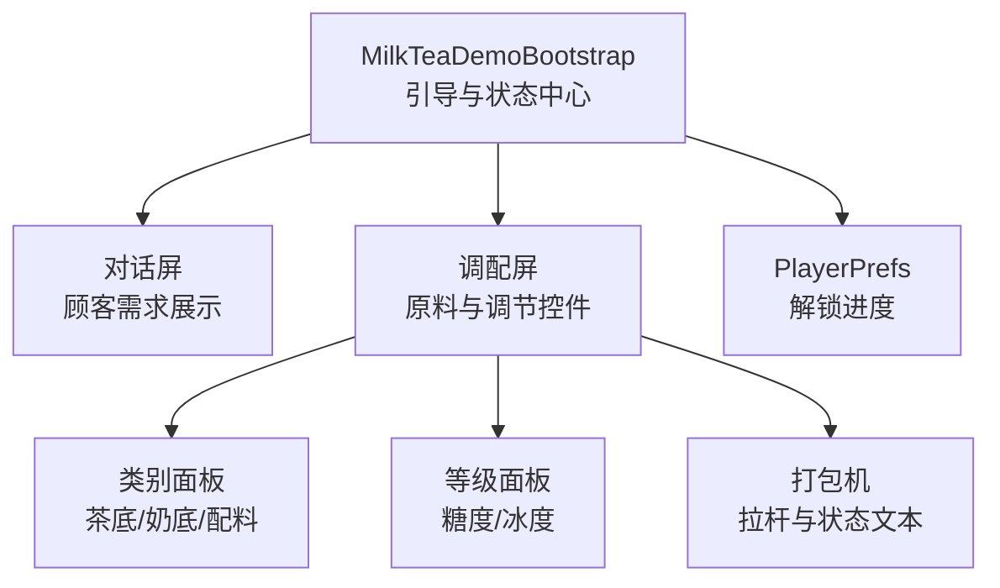
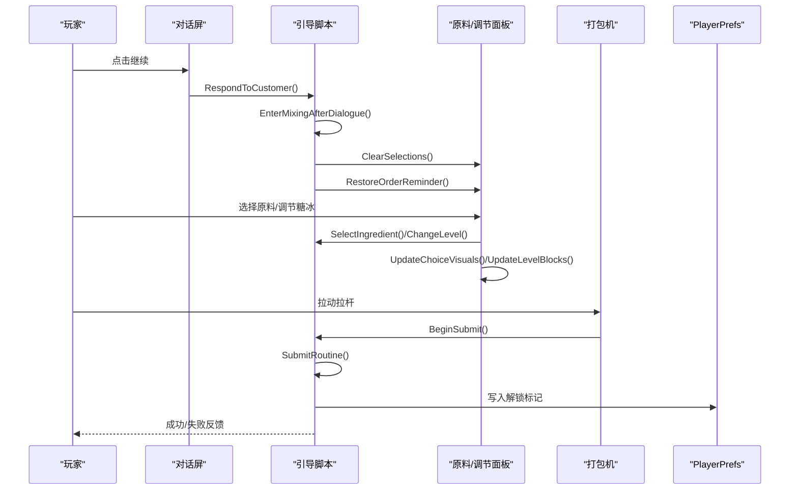
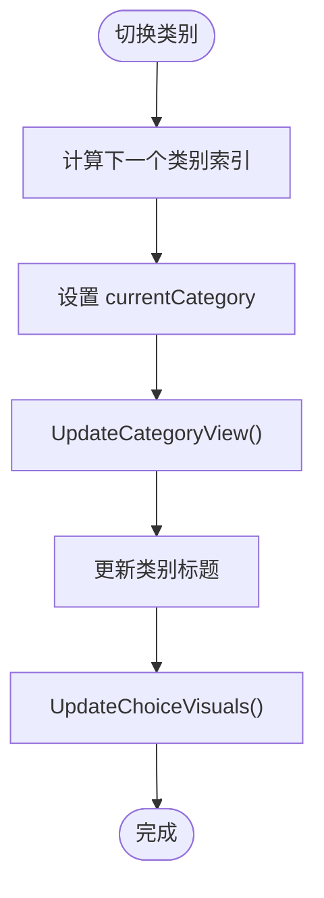
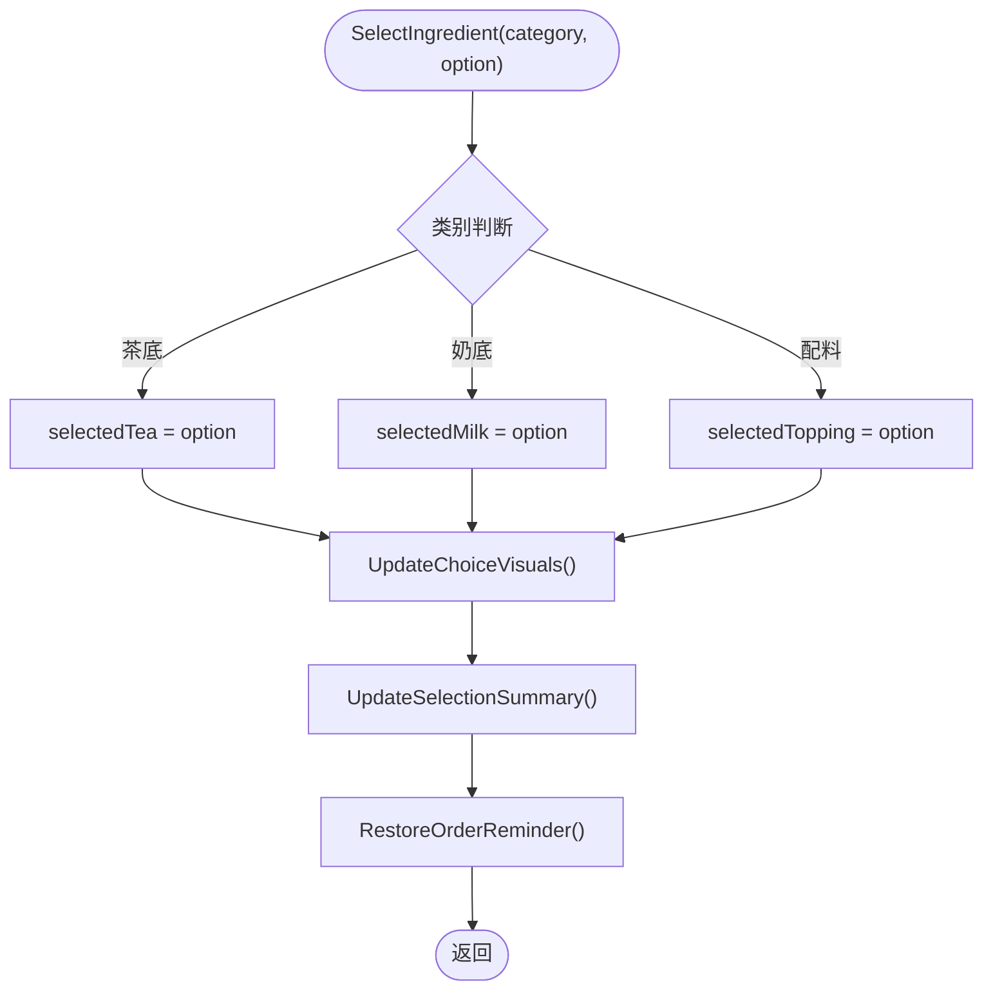
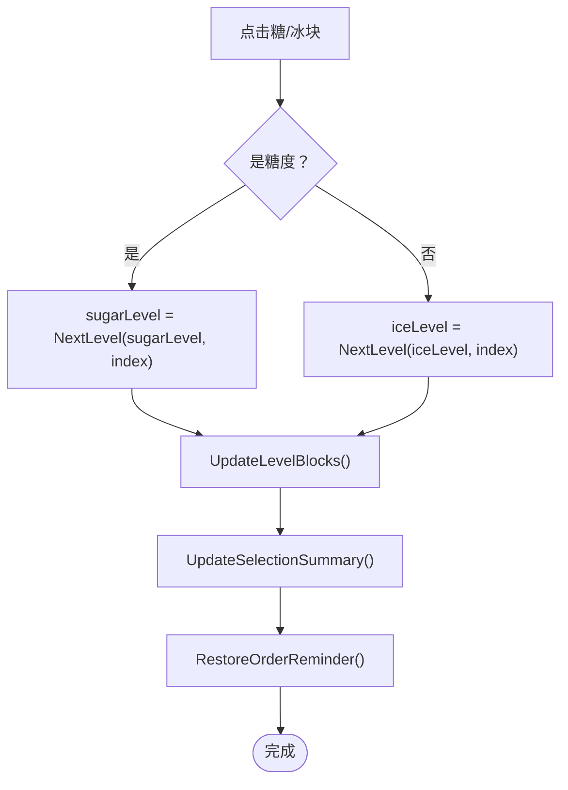
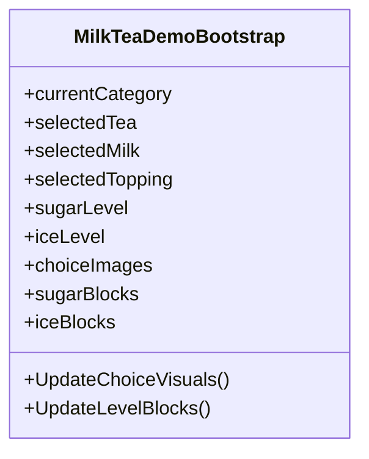
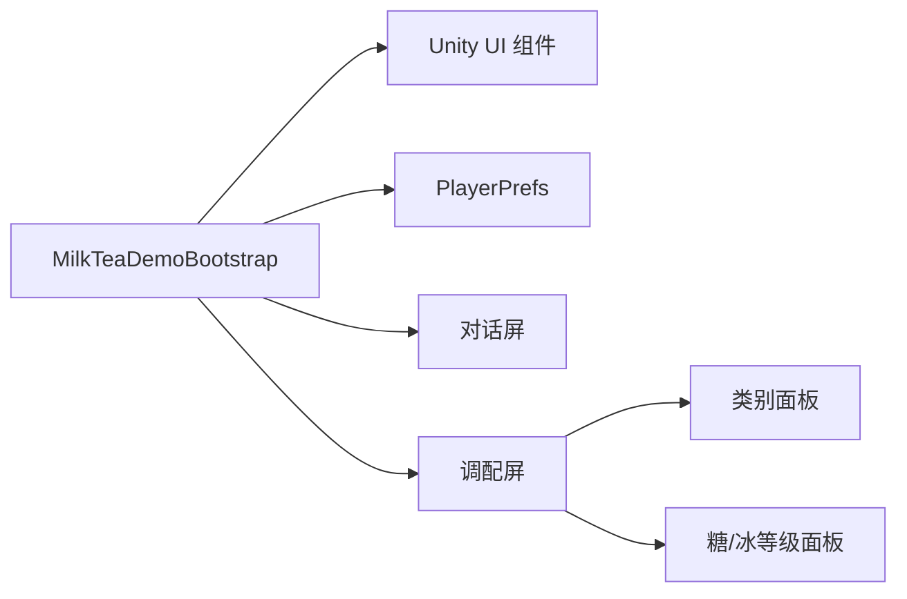

# 原料管理机制

<cite>
**本文引用的文件**   
- [MilkTeaDemoBootstrap.cs](file://Assets/Scripts/MilkTeaDemoBootstrap.cs)
</cite>

## 目录
1. [引言](#引言)
2. [项目结构](#项目结构)
3. [核心组件](#核心组件)
4. [架构总览](#架构总览)
5. [详细组件分析](#详细组件分析)
6. [依赖关系分析](#依赖关系分析)
7. [性能与扩展性](#性能与扩展性)
8. [故障排查指南](#故障排查指南)
9. [结论](#结论)
10. [附录：扩展指南](#附录扩展指南)

## 引言
本技术文档围绕奶茶店模拟经营中的“原料管理系统”展开，重点解释以下方面：
- IngredientCategory 枚举的设计与分类管理机制
- SelectIngredient() 的状态更新、视觉反馈与选择验证流程
- 糖度与冰度的三级状态管理算法
- UpdateChoiceVisuals() 与 UpdateLevelBlocks() 的视觉效果更新机制
- 数据持久化与进度保存的实现细节
- 如何添加新原料选项与自定义调节级别

该系统的核心由一个单例风格的引导脚本承载，负责界面构建、用户交互、状态管理与结果判定。

## 项目结构
当前仓库中与原料管理直接相关的代码集中在单个引导脚本中，采用“单一职责 + 内聚式 UI 构建”的方式组织逻辑：
- 入口与生命周期：启动 Demo、创建 Canvas、初始化字体与事件系统
- 界面构建：对话屏与调配屏的动态创建与布局
- 原料面板：按类别（茶底、奶底、配料）动态生成可点击选项
- 调节面板：糖度与冰度的三态可视化控件
- 提交与校验：拉杆动画、配方正确性判断、解锁标记与提示

图表来源
- [MilkTeaDemoBootstrap.cs:62-81](file://Assets/Scripts/MilkTeaDemoBootstrap.cs#L62-L81)
- [MilkTeaDemoBootstrap.cs:83-114](file://Assets/Scripts/MilkTeaDemoBootstrap.cs#L83-L114)
- [MilkTeaDemoBootstrap.cs:158-192](file://Assets/Scripts/MilkTeaDemoBootstrap.cs#L158-L192)
- [MilkTeaDemoBootstrap.cs:220-266](file://Assets/Scripts/MilkTeaDemoBootstrap.cs#L220-L266)
- [MilkTeaDemoBootstrap.cs:295-312](file://Assets/Scripts/MilkTeaDemoBootstrap.cs#L295-L312)
- [MilkTeaDemoBootstrap.cs:490-497](file://Assets/Scripts/MilkTeaDemoBootstrap.cs#L490-L497)

章节来源
- [MilkTeaDemoBootstrap.cs:62-114](file://Assets/Scripts/MilkTeaDemoBootstrap.cs#L62-L114)
- [MilkTeaDemoBootstrap.cs:158-192](file://Assets/Scripts/MilkTeaDemoBootstrap.cs#L158-L192)

## 核心组件
- 枚举与常量
  - IngredientCategory：定义三类原料（茶底、奶底、配料），用于切换显示与选择逻辑
  - UnlockKey：用于 PlayerPrefs 的键名，记录经典珍珠奶茶是否已解锁
- 状态字段
  - currentCategory：当前显示的原料类别
  - selectedTea / selectedMilk / selectedTopping：当前选择的茶底、奶底、配料
  - sugarLevel / iceLevel：糖度与冰度的三态值（0/1/2）
  - isSubmitting：防止重复提交的锁
- 视觉映射
  - categoryPanels：类别面板字典
  - choiceImages：每个类别下选项到 Image 的映射
  - sugarBlocks / iceBlocks：糖度与冰度块数组
  - selectionSummary / machineStatus：汇总文本与机器状态文本

章节来源
- [MilkTeaDemoBootstrap.cs:10-17](file://Assets/Scripts/MilkTeaDemoBootstrap.cs#L10-L17)
- [MilkTeaDemoBootstrap.cs:47-60](file://Assets/Scripts/MilkTeaDemoBootstrap.cs#L47-L60)

## 架构总览
整体流程从对话屏进入调配屏，随后进行原料选择与调节，最后通过拉杆提交并校验结果。

图表来源
- [MilkTeaDemoBootstrap.cs:314-334](file://Assets/Scripts/MilkTeaDemoBootstrap.cs#L314-L334)
- [MilkTeaDemoBootstrap.cs:381-427](file://Assets/Scripts/MilkTeaDemoBootstrap.cs#L381-L427)
- [MilkTeaDemoBootstrap.cs:465-514](file://Assets/Scripts/MilkTeaDemoBootstrap.cs#L465-L514)
- [MilkTeaDemoBootstrap.cs:490-497](file://Assets/Scripts/MilkTeaDemoBootstrap.cs#L490-L497)

## 详细组件分析

### IngredientCategory 枚举与分类管理
- 设计目的
  - 将原料分为三类：茶底、奶底、配料，便于统一渲染与选择
- 分类切换
  - ChangeCategory() 根据方向在枚举值间循环切换
  - UpdateCategoryView() 控制各分类面板的显隐，并刷新标题与选中项视觉
- 名称映射
  - CategoryName() 提供中文类别名，用于标题显示

图表来源
- [MilkTeaDemoBootstrap.cs:361-379](file://Assets/Scripts/MilkTeaDemoBootstrap.cs#L361-L379)
- [MilkTeaDemoBootstrap.cs:566-579](file://Assets/Scripts/MilkTeaDemoBootstrap.cs#L566-L579)

章节来源
- [MilkTeaDemoBootstrap.cs:10-15](file://Assets/Scripts/MilkTeaDemoBootstrap.cs#L10-L15)
- [MilkTeaDemoBootstrap.cs:361-379](file://Assets/Scripts/MilkTeaDemoBootstrap.cs#L361-L379)
- [MilkTeaDemoBootstrap.cs:566-579](file://Assets/Scripts/MilkTeaDemoBootstrap.cs#L566-L579)

### SelectIngredient() 实现逻辑
- 功能概述
  - 根据传入类别与选项，更新对应选择字段
  - 刷新选项视觉高亮
  - 更新选择摘要与订单提醒
- 关键步骤
  - 状态更新：selectedTea / selectedMilk / selectedTopping
  - 视觉反馈：UpdateChoiceVisuals() 遍历所有类别与选项，匹配选中项并着色
  - 辅助信息：UpdateSelectionSummary() 与 RestoreOrderReminder()

图表来源
- [MilkTeaDemoBootstrap.cs:381-399](file://Assets/Scripts/MilkTeaDemoBootstrap.cs#L381-L399)
- [MilkTeaDemoBootstrap.cs:401-411](file://Assets/Scripts/MilkTeaDemoBootstrap.cs#L401-L411)
- [MilkTeaDemoBootstrap.cs:457-463](file://Assets/Scripts/MilkTeaDemoBootstrap.cs#L457-L463)
- [MilkTeaDemoBootstrap.cs:531-535](file://Assets/Scripts/MilkTeaDemoBootstrap.cs#L531-L535)

章节来源
- [MilkTeaDemoBootstrap.cs:381-399](file://Assets/Scripts/MilkTeaDemoBootstrap.cs#L381-L399)
- [MilkTeaDemoBootstrap.cs:401-411](file://Assets/Scripts/MilkTeaDemoBootstrap.cs#L401-L411)
- [MilkTeaDemoBootstrap.cs:457-463](file://Assets/Scripts/MilkTeaDemoBootstrap.cs#L457-L463)
- [MilkTeaDemoBootstrap.cs:531-535](file://Assets/Scripts/MilkTeaDemoBootstrap.cs#L531-L535)

### 糖度与冰度调节：三级状态管理算法
- 状态定义
  - 糖度与冰度均为 0/1/2 三态：无糖/少糖/多糖；去冰/少冰/多冰
- 状态转换
  - NextLevel(current, clickedIndex) 根据点击位置决定下一状态
  - 规则要点：
    - 当前为 0：点击第一个块→1，点击第二个块→2
    - 当前为 1：点击第一个块→0，点击第二个块→2
    - 当前为 2：点击第一个块→1，点击第二个块→0
- 视觉更新
  - UpdateLevelBlocks() 根据 level 点亮对应数量的方块，未点亮为灰色

图表来源
- [MilkTeaDemoBootstrap.cs:413-427](file://Assets/Scripts/MilkTeaDemoBootstrap.cs#L413-L427)
- [MilkTeaDemoBootstrap.cs:429-442](file://Assets/Scripts/MilkTeaDemoBootstrap.cs#L429-L442)
- [MilkTeaDemoBootstrap.cs:444-455](file://Assets/Scripts/MilkTeaDemoBootstrap.cs#L444-L455)
- [MilkTeaDemoBootstrap.cs:457-463](file://Assets/Scripts/MilkTeaDemoBootstrap.cs#L457-L463)
- [MilkTeaDemoBootstrap.cs:531-535](file://Assets/Scripts/MilkTeaDemoBootstrap.cs#L531-L535)

章节来源
- [MilkTeaDemoBootstrap.cs:413-455](file://Assets/Scripts/MilkTeaDemoBootstrap.cs#L413-L455)
- [MilkTeaDemoBootstrap.cs:457-463](file://Assets/Scripts/MilkTeaDemoBootstrap.cs#L457-L463)
- [MilkTeaDemoBootstrap.cs:531-535](file://Assets/Scripts/MilkTeaDemoBootstrap.cs#L531-L535)

### UpdateChoiceVisuals() 与 UpdateLevelBlocks() 视觉效果更新机制
- UpdateChoiceVisuals()
  - 遍历所有类别与其选项映射
  - 若选项等于当前选中项，则使用强调色；否则使用面板浅色
- UpdateLevelBlocks()
  - 对糖度与冰度分别遍历其方块数组
  - 若索引小于当前等级，则使用激活色；否则使用灰色

图表来源
- [MilkTeaDemoBootstrap.cs:401-411](file://Assets/Scripts/MilkTeaDemoBootstrap.cs#L401-L411)
- [MilkTeaDemoBootstrap.cs:444-455](file://Assets/Scripts/MilkTeaDemoBootstrap.cs#L444-L455)

章节来源
- [MilkTeaDemoBootstrap.cs:401-411](file://Assets/Scripts/MilkTeaDemoBootstrap.cs#L401-L411)
- [MilkTeaDemoBootstrap.cs:444-455](file://Assets/Scripts/MilkTeaDemoBootstrap.cs#L444-L455)

### 提交与校验流程
- 触发点：BeginSubmit() 调用协程 SubmitRoutine()
- 动画：拉杆旋转动画，完成后复位
- 校验：对比当前选择与目标配方（红茶+鲜奶+珍珠+少糖+少冰）
- 结果：
  - 正确：写入解锁标记、刷新配方图标、显示服务对话
  - 错误：提示重新调配、清空选择、恢复按钮可用

图表来源
- [MilkTeaDemoBootstrap.cs:465-514](file://Assets/Scripts/MilkTeaDemoBootstrap.cs#L465-L514)
- [MilkTeaDemoBootstrap.cs:490-497](file://Assets/Scripts/MilkTeaDemoBootstrap.cs#L490-L497)
- [MilkTeaDemoBootstrap.cs:543-549](file://Assets/Scripts/MilkTeaDemoBootstrap.cs#L543-L549)

章节来源
- [MilkTeaDemoBootstrap.cs:465-514](file://Assets/Scripts/MilkTeaDemoBootstrap.cs#L465-L514)
- [MilkTeaDemoBootstrap.cs:543-549](file://Assets/Scripts/MilkTeaDemoBootstrap.cs#L543-L549)

## 依赖关系分析
- 内部依赖
  - 界面构建方法相互调用（BuildInterface → BuildDialogueScreen/BuildMixingScreen → 子面板构建）
  - 状态更新与视觉更新解耦：SelectIngredient/ChangeLevel 仅更新状态，再由 UpdateChoiceVisuals/UpdateLevelBlocks 刷新 UI
- 外部依赖
  - Unity UI 组件：Canvas、Text、Button、Image、Outline、EventSystem
  - 平台存储：PlayerPrefs（用于解锁标记）

图表来源
- [MilkTeaDemoBootstrap.cs:62-81](file://Assets/Scripts/MilkTeaDemoBootstrap.cs#L62-L81)
- [MilkTeaDemoBootstrap.cs:83-114](file://Assets/Scripts/MilkTeaDemoBootstrap.cs#L83-L114)
- [MilkTeaDemoBootstrap.cs:490-497](file://Assets/Scripts/MilkTeaDemoBootstrap.cs#L490-L497)

章节来源
- [MilkTeaDemoBootstrap.cs:62-114](file://Assets/Scripts/MilkTeaDemoBootstrap.cs#L62-L114)
- [MilkTeaDemoBootstrap.cs:490-497](file://Assets/Scripts/MilkTeaDemoBootstrap.cs#L490-L497)

## 性能与扩展性
- 性能
  - 视觉更新采用局部刷新（仅变更颜色），避免重建 UI
  - 协程处理动画与延时，不阻塞主线程
- 扩展性
  - 新增原料选项：在 BuildIngredientPanel 中为对应类别追加选项数组元素
  - 新增调节级别：需扩展 NextLevel 与 UpdateLevelBlocks 的逻辑，并调整方块数量与状态映射

[本节为通用指导，不直接分析具体文件]

## 故障排查指南
- 常见问题
  - 中文显示异常：检查字体创建与回退逻辑
  - 按钮无响应：确认 EventSystem 是否存在且 StandaloneInputModule 已挂载
  - 选择未高亮：检查 GetSelectedIngredient 与 UpdateChoiceVisuals 的映射一致性
  - 糖/冰状态异常：核对 NextLevel 的点击索引与期望状态映射
  - 解锁标记未生效：确认 PlayerPrefs 键名与写入时机
- 定位建议
  - 观察 UpdateSelectionSummary 与 RestoreOrderReminder 的输出文本
  - 检查 machineStatus 文本与颜色变化以判断提交分支

章节来源
- [MilkTeaDemoBootstrap.cs:697-708](file://Assets/Scripts/MilkTeaDemoBootstrap.cs#L697-L708)
- [MilkTeaDemoBootstrap.cs:710-718](file://Assets/Scripts/MilkTeaDemoBootstrap.cs#L710-L718)
- [MilkTeaDemoBootstrap.cs:457-463](file://Assets/Scripts/MilkTeaDemoBootstrap.cs#L457-L463)
- [MilkTeaDemoBootstrap.cs:429-442](file://Assets/Scripts/MilkTeaDemoBootstrap.cs#L429-L442)
- [MilkTeaDemoBootstrap.cs:490-497](file://Assets/Scripts/MilkTeaDemoBootstrap.cs#L490-L497)

## 结论
该系统通过清晰的枚举分类、简洁的状态字段与直观的视觉反馈，实现了奶茶调配的核心玩法。糖度与冰度的三态算法简单可靠，提交校验与持久化逻辑明确。整体代码结构紧凑，适合在此基础上扩展更多原料与调节维度。

[本节为总结性内容，不直接分析具体文件]

## 附录：扩展指南

### 添加新原料选项
- 步骤
  - 在 BuildIngredientPanel 中，找到对应类别的选项数组（如茶底、奶底、配料）
  - 在数组末尾追加新的选项字符串
  - 确保 columns 参数合理，以保证网格布局美观
- 注意事项
  - 如果新增选项较多，可适当调整 columns 或行高
  - 如需为新选项配置独立资源，可在 choiceImages 映射基础上扩展资源加载逻辑

章节来源
- [MilkTeaDemoBootstrap.cs:220-266](file://Assets/Scripts/MilkTeaDemoBootstrap.cs#L220-L266)
- [MilkTeaDemoBootstrap.cs:268-293](file://Assets/Scripts/MilkTeaDemoBootstrap.cs#L268-L293)

### 自定义调节级别（糖度/冰度）
- 步骤
  - 增加方块数量：扩展 sugarBlocks / iceBlocks 数组长度
  - 修改 NextLevel：根据新的级别数与点击索引重写状态转换表
  - 更新 UpdateLevelBlocks：根据新级别点亮对应数量的方块
  - 更新文本映射：SugarName/IceName 返回新的级别名称
- 注意事项
  - 保持视觉一致：激活色与禁用色的区分要清晰
  - 测试边界情况：确保任意点击都能得到合法的新状态

章节来源
- [MilkTeaDemoBootstrap.cs:413-455](file://Assets/Scripts/MilkTeaDemoBootstrap.cs#L413-L455)
- [MilkTeaDemoBootstrap.cs:586-594](file://Assets/Scripts/MilkTeaDemoBootstrap.cs#L586-L594)

### 数据持久化与进度保存
- 实现要点
  - 使用 PlayerPrefs.SetInt 写入解锁标记
  - 调用 PlayerPrefs.Save 确保立即落盘
  - 读取时通过 PlayerPrefs.GetInt 获取默认值，避免空值异常
- 最佳实践
  - 将键名集中管理（如 UnlockKey）
  - 在关键节点（如提交成功后）写入，减少频繁 IO

章节来源
- [MilkTeaDemoBootstrap.cs:17-17](file://Assets/Scripts/MilkTeaDemoBootstrap.cs#L17-L17)
- [MilkTeaDemoBootstrap.cs:490-497](file://Assets/Scripts/MilkTeaDemoBootstrap.cs#L490-L497)
- [MilkTeaDemoBootstrap.cs:543-549](file://Assets/Scripts/MilkTeaDemoBootstrap.cs#L543-L549)