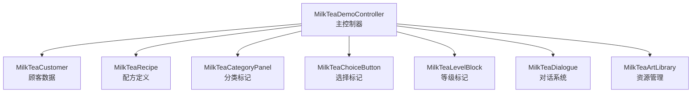
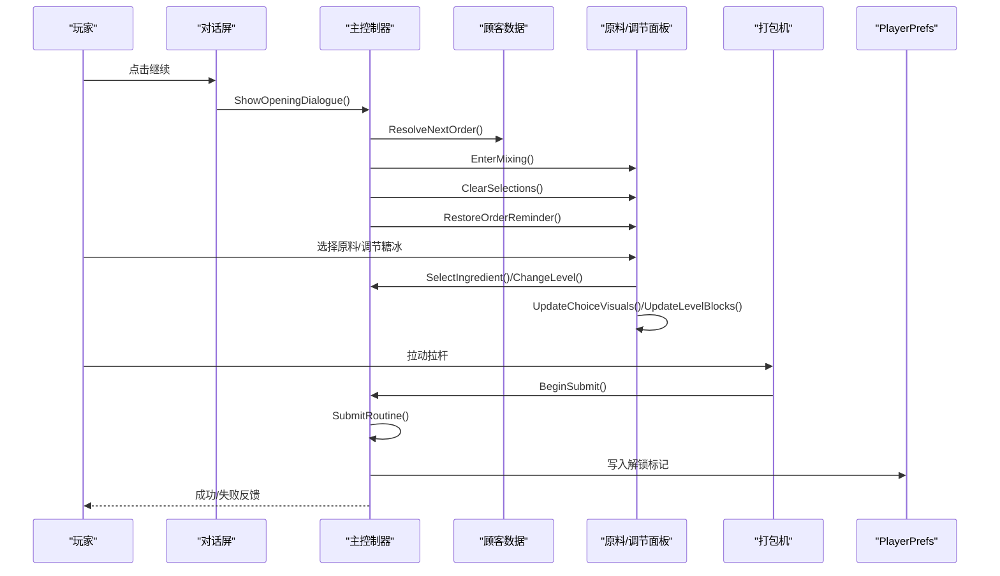
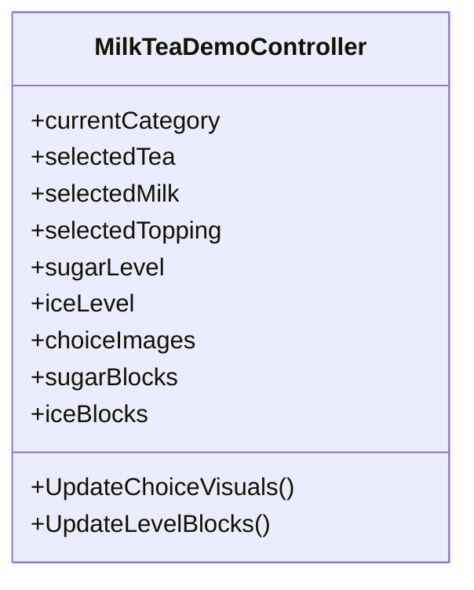
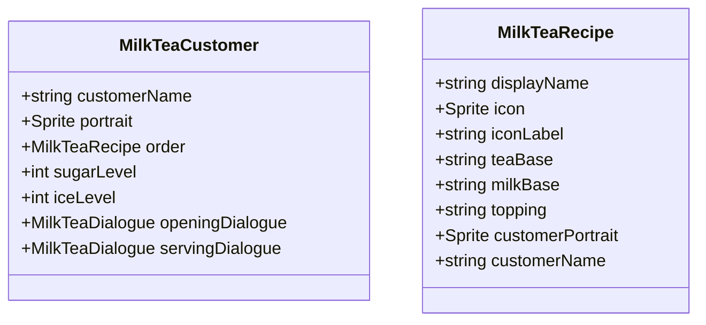
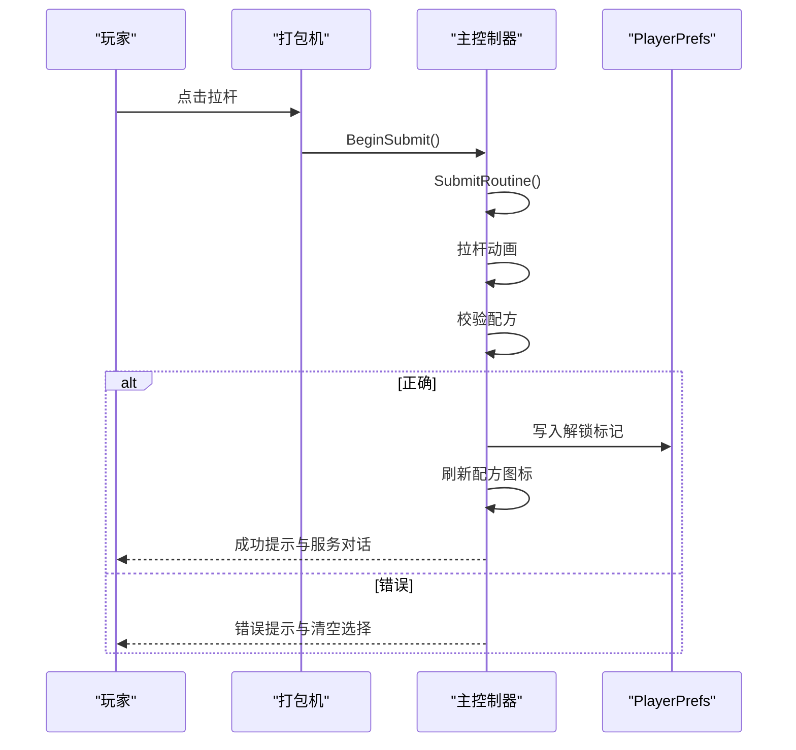
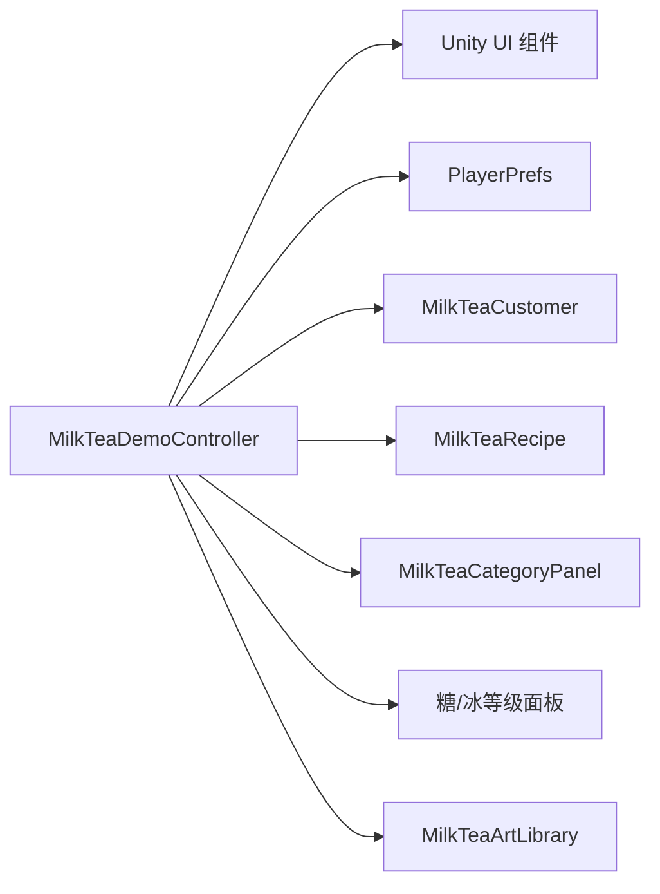

# 原料管理机制

<cite>
**本文引用的文件**   
- [MilkTeaDemoController.cs](file://Assets/Scripts/MilkTeaDemoController.cs)
- [MilkTeaCustomer.cs](file://Assets/Scripts/MilkTeaCustomer.cs)
- [MilkTeaRecipe.cs](file://Assets/Scripts/MilkTeaRecipe.cs)
- [MilkTeaCategoryPanel.cs](file://Assets/Scripts/MilkTeaCategoryPanel.cs)
- [MilkTeaChoiceButton.cs](file://Assets/Scripts/MilkTeaChoiceButton.cs)
- [MilkTeaLevelBlock.cs](file://Assets/Scripts/MilkTeaLevelBlock.cs)
- [MilkTeaDialogue.cs](file://Assets/Scripts/MilkTeaDialogue.cs)
- [MilkTeaArtLibrary.cs](file://Assets/Scripts/MilkTeaArtLibrary.cs)
</cite>

## 更新摘要
**变更内容**   
- 重构了原料管理系统架构，从单一引导脚本拆分为多个专门组件
- 新增顾客数据管理组件（MilkTeaCustomer）
- 新增配方定义组件（MilkTeaRecipe）
- 新增原料分类标记组件（MilkTeaCategoryPanel）
- 优化了选择按钮和等级块的标记系统
- 改进了数据持久化和进度保存机制

## 目录
1. [引言](#引言)
2. [项目结构](#项目结构)
3. [核心组件](#核心组件)
4. [架构总览](#架构总览)
5. [详细组件分析](#详细组件分析)
6. [依赖关系分析](#依赖关系分析)
7. [性能与扩展性](#性能与扩展性)
8. [故障排查指南](#故障排查指南)
9. [结论](#结论)
10. [附录：扩展指南](#附录扩展指南)

## 引言
本技术文档围绕奶茶店模拟经营中的"原料管理系统"展开，重点解释以下方面：
- IngredientCategory 枚举的设计与分类管理机制
- SelectIngredient() 的状态更新、视觉反馈与选择验证流程
- 糖度与冰度的三级状态管理算法
- UpdateChoiceVisuals() 与 UpdateLevelBlocks() 的视觉效果更新机制
- 数据持久化与进度保存的实现细节
- 如何添加新原料选项与自定义调节级别

该系统的核心由 MilkTeaDemoController 承载，采用模块化设计，将顾客数据、配方定义、界面控制等职责分离到不同组件中。

## 项目结构
当前仓库采用模块化架构，将原料管理逻辑分散到多个专门组件中：
- 主控制器：MilkTeaDemoController 负责整体流程控制和状态管理
- 数据组件：MilkTeaCustomer 和 MilkTeaRecipe 分别管理顾客数据和配方定义
- UI标记组件：MilkTeaCategoryPanel、MilkTeaChoiceButton、MilkTeaLevelBlock 提供运行时标记
- 对话系统：MilkTeaDialogue 管理对话流程和文本显示
- 资源管理：MilkTeaArtLibrary 统一管理美术资源和配置数据

图表来源
- [MilkTeaDemoController.cs:25-26](file://Assets/Scripts/MilkTeaDemoController.cs#L25-L26)
- [MilkTeaCustomer.cs:10-36](file://Assets/Scripts/MilkTeaCustomer.cs#L10-L36)
- [MilkTeaRecipe.cs:8-31](file://Assets/Scripts/MilkTeaRecipe.cs#L8-L31)
- [MilkTeaCategoryPanel.cs:7-10](file://Assets/Scripts/MilkTeaCategoryPanel.cs#L7-L10)

章节来源
- [MilkTeaDemoController.cs:18-24](file://Assets/Scripts/MilkTeaDemoController.cs#L18-L24)
- [MilkTeaCustomer.cs:3-36](file://Assets/Scripts/MilkTeaCustomer.cs#L3-L36)
- [MilkTeaRecipe.cs:3-31](file://Assets/Scripts/MilkTeaRecipe.cs#L3-L31)

## 核心组件
### 枚举与常量
- IngredientCategory：定义三类原料（茶底、奶底、配料），用于切换显示与选择逻辑
- UnlockPrefix：用于 PlayerPrefs 的键名前缀，记录配方解锁状态

### 数据组件
- MilkTeaCustomer：包含顾客信息、点单需求、糖度冰度设置和对话数据
- MilkTeaRecipe：包含配方名称、图标、基础配方要求和顾客信息

### 状态字段
- currentCategory：当前显示的原料类别
- selectedTea / selectedMilk / selectedTopping：当前选择的茶底、奶底、配料
- sugarLevel / iceLevel：糖度与冰度的三态值（0/1/2）
- isSubmitting：防止重复提交的锁
- activeRecipe：当前激活的配方对象
- currentCustomer：当前服务的顾客对象

### 视觉映射
- categoryPanels：类别面板字典
- choiceImages：每个类别下选项到 Image 的映射
- sugarBlocks / iceBlocks：糖度与冰度块数组
- selectionSummary / machineStatus：汇总文本与机器状态文本

章节来源
- [MilkTeaDemoController.cs:11-16](file://Assets/Scripts/MilkTeaDemoController.cs#L11-L16)
- [MilkTeaDemoController.cs:162-175](file://Assets/Scripts/MilkTeaDemoController.cs#L162-L175)
- [MilkTeaCustomer.cs:12-35](file://Assets/Scripts/MilkTeaCustomer.cs#L12-L35)
- [MilkTeaRecipe.cs:10-30](file://Assets/Scripts/MilkTeaRecipe.cs#L10-L30)

## 架构总览
整体流程从对话屏进入调配屏，随后进行原料选择与调节，最后通过拉杆提交并校验结果。新的架构采用数据驱动设计，通过 ScriptableObject 管理配置数据。

图表来源
- [MilkTeaDemoController.cs:447-480](file://Assets/Scripts/MilkTeaDemoController.cs#L447-L480)
- [MilkTeaDemoController.cs:482-516](file://Assets/Scripts/MilkTeaDemoController.cs#L482-L516)
- [MilkTeaDemoController.cs:531-542](file://Assets/Scripts/MilkTeaDemoController.cs#L531-L542)
- [MilkTeaDemoController.cs:1082-1148](file://Assets/Scripts/MilkTeaDemoController.cs#L1082-L1148)

## 详细组件分析

### IngredientCategory 枚举与分类管理
- 设计目的
  - 将原料分为三类：茶底、奶底、配料，便于统一渲染与选择
- 分类切换
  - ChangeCategory() 根据方向在枚举值间循环切换
  - UpdateCategoryView() 控制各分类面板的显隐，并刷新标题与选中项视觉
- 名称映射
  - CategoryName() 提供中文类别名，用于标题显示

图表来源
- [MilkTeaDemoController.cs:969-987](file://Assets/Scripts/MilkTeaDemoController.cs#L969-L987)
- [MilkTeaDemoController.cs:1260-1273](file://Assets/Scripts/MilkTeaDemoController.cs#L1260-L1273)

章节来源
- [MilkTeaDemoController.cs:11-16](file://Assets/Scripts/MilkTeaDemoController.cs#L11-L16)
- [MilkTeaDemoController.cs:969-987](file://Assets/Scripts/MilkTeaDemoController.cs#L969-L987)
- [MilkTeaDemoController.cs:1260-1273](file://Assets/Scripts/MilkTeaDemoController.cs#L1260-L1273)

### SelectIngredient() 实现逻辑
- 功能概述
  - 根据传入类别与选项，更新对应选择字段
  - 刷新选项视觉高亮
  - 更新选择摘要与订单提醒
- 关键步骤
  - 状态更新：selectedTea / selectedMilk / selectedTopping
  - 视觉反馈：UpdateChoiceVisuals() 遍历所有类别与选项，匹配选中项并着色
  - 辅助信息：UpdateSelectionSummary() 与 RestoreOrderReminder()

图表来源
- [MilkTeaDemoController.cs:989-1007](file://Assets/Scripts/MilkTeaDemoController.cs#L989-L1007)
- [MilkTeaDemoController.cs:1009-1022](file://Assets/Scripts/MilkTeaDemoController.cs#L1009-L1022)
- [MilkTeaDemoController.cs:1074-1080](file://Assets/Scripts/MilkTeaDemoController.cs#L1074-L1080)
- [MilkTeaDemoController.cs:1165-1171](file://Assets/Scripts/MilkTeaDemoController.cs#L1165-L1171)

章节来源
- [MilkTeaDemoController.cs:989-1007](file://Assets/Scripts/MilkTeaDemoController.cs#L989-L1007)
- [MilkTeaDemoController.cs:1009-1022](file://Assets/Scripts/MilkTeaDemoController.cs#L1009-L1022)
- [MilkTeaDemoController.cs:1074-1080](file://Assets/Scripts/MilkTeaDemoController.cs#L1074-L1080)
- [MilkTeaDemoController.cs:1165-1171](file://Assets/Scripts/MilkTeaDemoController.cs#L1165-L1171)

### 糖度与冰度调节：三级状态管理算法
- 状态定义
  - 糖度与冰度均为 0/1/2 三态：无糖/少糖/多糖；去冰/少冰/多冰
- 状态转换
  - NextLevel(current, clickedIndex) 根据点击位置决定下一状态
  - 规则要点：
    - 当前为 0：点击第一个块→1，点击第二个块→2
    - 当前为 1：点击第一个块→0，点击第二个块→2
    - 当前为 2：点击第一个块→1，点击第二个块→0
- 视觉更新
  - UpdateLevelBlocks() 根据 level 点亮对应数量的方块，未点亮为灰色

图表来源
- [MilkTeaDemoController.cs:1024-1038](file://Assets/Scripts/MilkTeaDemoController.cs#L1024-L1038)
- [MilkTeaDemoController.cs:1040-1053](file://Assets/Scripts/MilkTeaDemoController.cs#L1040-L1053)
- [MilkTeaDemoController.cs:1055-1072](file://Assets/Scripts/MilkTeaDemoController.cs#L1055-L1072)
- [MilkTeaDemoController.cs:1074-1080](file://Assets/Scripts/MilkTeaDemoController.cs#L1074-L1080)
- [MilkTeaDemoController.cs:1165-1171](file://Assets/Scripts/MilkTeaDemoController.cs#L1165-L1171)

章节来源
- [MilkTeaDemoController.cs:1024-1072](file://Assets/Scripts/MilkTeaDemoController.cs#L1024-L1072)
- [MilkTeaDemoController.cs:1074-1080](file://Assets/Scripts/MilkTeaDemoController.cs#L1074-L1080)
- [MilkTeaDemoController.cs:1165-1171](file://Assets/Scripts/MilkTeaDemoController.cs#L1165-L1171)

### UpdateChoiceVisuals() 与 UpdateLevelBlocks() 视觉效果更新机制
- UpdateChoiceVisuals()
  - 遍历所有类别与其选项映射
  - 若选项等于当前选中项，则使用强调色；否则使用面板浅色
- UpdateLevelBlocks()
  - 对糖度与冰度分别遍历其方块数组
  - 若索引小于当前等级，则使用激活色；否则使用灰色

图表来源
- [MilkTeaDemoController.cs:1009-1022](file://Assets/Scripts/MilkTeaDemoController.cs#L1009-L1022)
- [MilkTeaDemoController.cs:1055-1072](file://Assets/Scripts/MilkTeaDemoController.cs#L1055-L1072)

章节来源
- [MilkTeaDemoController.cs:1009-1022](file://Assets/Scripts/MilkTeaDemoController.cs#L1009-L1022)
- [MilkTeaDemoController.cs:1055-1072](file://Assets/Scripts/MilkTeaDemoController.cs#L1055-L1072)

### 顾客与配方管理系统
- MilkTeaCustomer 组件
  - 管理顾客身份信息、立绘、点单需求和对话数据
  - 支持独立的糖度和冰度设置
  - 可配置专属的进店和交付对话
- MilkTeaRecipe 组件
  - 定义奶茶配方的基础信息、图标和配方要求
  - 支持自定义顾客信息和立绘
  - 作为数据资源存储在 Unity 编辑器中

图表来源
- [MilkTeaCustomer.cs:10-36](file://Assets/Scripts/MilkTeaCustomer.cs#L10-L36)
- [MilkTeaRecipe.cs:8-31](file://Assets/Scripts/MilkTeaRecipe.cs#L8-L31)

章节来源
- [MilkTeaCustomer.cs:3-36](file://Assets/Scripts/MilkTeaCustomer.cs#L3-L36)
- [MilkTeaRecipe.cs:3-31](file://Assets/Scripts/MilkTeaRecipe.cs#L3-L31)

### 提交与校验流程
- 触发点：BeginSubmit() 调用协程 SubmitRoutine()
- 动画：拉杆旋转动画，完成后复位
- 校验：对比当前选择与目标配方（茶底+奶底+配料+糖度+冰度）
- 结果：
  - 正确：写入解锁标记、刷新配方图标、显示服务对话
  - 错误：提示重新调配、清空选择、恢复按钮可用

图表来源
- [MilkTeaDemoController.cs:1082-1148](file://Assets/Scripts/MilkTeaDemoController.cs#L1082-L1148)
- [MilkTeaDemoController.cs:1234-1243](file://Assets/Scripts/MilkTeaDemoController.cs#L1234-L1243)
- [MilkTeaDemoController.cs:1179-1204](file://Assets/Scripts/MilkTeaDemoController.cs#L1179-L1204)

章节来源
- [MilkTeaDemoController.cs:1082-1148](file://Assets/Scripts/MilkTeaDemoController.cs#L1082-L1148)
- [MilkTeaDemoController.cs:1234-1243](file://Assets/Scripts/MilkTeaDemoController.cs#L1234-L1243)
- [MilkTeaDemoController.cs:1179-1204](file://Assets/Scripts/MilkTeaDemoController.cs#L1179-L1204)

## 依赖关系分析
- 内部依赖
  - 主控制器协调各个组件之间的交互
  - 数据组件（Customer/Recipe）被控制器引用但不反向依赖
  - UI标记组件通过控制器自动接线
- 外部依赖
  - Unity UI 组件：Canvas、Text、Button、Image、Outline、EventSystem
  - Unity 资源系统：Resources.Load 加载美术库
  - 平台存储：PlayerPrefs（用于解锁标记和设置）

图表来源
- [MilkTeaDemoController.cs:196-206](file://Assets/Scripts/MilkTeaDemoController.cs#L196-L206)
- [MilkTeaDemoController.cs:226-253](file://Assets/Scripts/MilkTeaDemoController.cs#L226-L253)
- [MilkTeaDemoController.cs:1234-1243](file://Assets/Scripts/MilkTeaDemoController.cs#L1234-L1243)

章节来源
- [MilkTeaDemoController.cs:196-206](file://Assets/Scripts/MilkTeaDemoController.cs#L196-L206)
- [MilkTeaDemoController.cs:226-253](file://Assets/Scripts/MilkTeaDemoController.cs#L226-L253)
- [MilkTeaDemoController.cs:1234-1243](file://Assets/Scripts/MilkTeaDemoController.cs#L1234-L1243)

## 性能与扩展性
- 性能
  - 视觉更新采用局部刷新（仅变更颜色），避免重建 UI
  - 协程处理动画与延时，不阻塞主线程
  - 使用 Dictionary 缓存 UI 引用，减少查找开销
- 扩展性
  - 新增原料选项：通过 MilkTeaChoiceButton 标记组件添加
  - 新增调节级别：需扩展 NextLevel 与 UpdateLevelBlocks 的逻辑
  - 新增顾客类型：通过 MilkTeaCustomer 数据组件扩展
  - 新增配方：通过 MilkTeaRecipe 数据组件扩展

## 故障排查指南
- 常见问题
  - 中文显示异常：检查字体创建与回退逻辑
  - 按钮无响应：确认 EventSystem 是否存在且 StandaloneInputModule 已挂载
  - 选择未高亮：检查 GetSelectedIngredient 与 UpdateChoiceVisuals 的映射一致性
  - 糖/冰状态异常：核对 NextLevel 的点击索引与期望状态映射
  - 解锁标记未生效：确认 PlayerPrefs 键名与写入时机
  - 顾客数据为空：检查 MilkTeaCustomer 组件是否正确配置
  - 配方无法加载：确认 MilkTeaRecipe 资源是否正确创建和引用
- 定位建议
  - 观察 UpdateSelectionSummary 与 RestoreOrderReminder 的输出文本
  - 检查 machineStatus 文本与颜色变化以判断提交分支
  - 验证 MilkTeaArtLibrary 资源是否正确加载

章节来源
- [MilkTeaDemoController.cs:1304-1315](file://Assets/Scripts/MilkTeaDemoController.cs#L1304-L1315)
- [MilkTeaDemoController.cs:1074-1080](file://Assets/Scripts/MilkTeaDemoController.cs#L1074-L1080)
- [MilkTeaDemoController.cs:1165-1171](file://Assets/Scripts/MilkTeaDemoController.cs#L1165-L1171)
- [MilkTeaDemoController.cs:1040-1053](file://Assets/Scripts/MilkTeaDemoController.cs#L1040-L1053)
- [MilkTeaDemoController.cs:1234-1243](file://Assets/Scripts/MilkTeaDemoController.cs#L1234-L1243)

## 结论
该系统通过清晰的枚举分类、模块化的组件设计和直观的视觉反馈，实现了奶茶调配的核心玩法。新的架构将数据管理与界面控制分离，提高了代码的可维护性和扩展性。糖度与冰度的三态算法简单可靠，提交校验与持久化逻辑明确。整体代码结构清晰，适合在此基础上扩展更多原料与调节维度。

## 附录：扩展指南

### 添加新原料选项
- 步骤
  - 在 Unity 编辑器中为新的原料按钮添加 MilkTeaChoiceButton 组件
  - 设置正确的 category（茶底/奶底/配料）和 option（选项名称）
  - 确保选项名称与 MilkTeaArtLibrary 中的资源名称一致
- 注意事项
  - 如果新增选项较多，可适当调整网格布局参数
  - 如需为新选项配置独立资源，可在 MilkTeaArtLibrary 中添加对应的 NamedSprite

章节来源
- [MilkTeaChoiceButton.cs:3-11](file://Assets/Scripts/MilkTeaChoiceButton.cs#L3-L11)
- [MilkTeaArtLibrary.cs:13-19](file://Assets/Scripts/MilkTeaArtLibrary.cs#L13-L19)

### 自定义调节级别（糖度/冰度）
- 步骤
  - 增加方块数量：扩展 sugarBlocks / iceBlocks 数组长度
  - 修改 NextLevel：根据新的级别数与点击索引重写状态转换表
  - 更新 UpdateLevelBlocks：根据新级别点亮对应数量的方块
  - 更新文本映射：SugarName/IceName 返回新的级别名称
- 注意事项
  - 保持视觉一致：激活色与禁用色的区分要清晰
  - 测试边界情况：确保任意点击都能得到合法的新状态

章节来源
- [MilkTeaDemoController.cs:1040-1072](file://Assets/Scripts/MilkTeaDemoController.cs#L1040-L1072)
- [MilkTeaDemoController.cs:1280-1288](file://Assets/Scripts/MilkTeaDemoController.cs#L1280-L1288)

### 添加新顾客类型
- 步骤
  - 在 Unity 编辑器中右键 Create → 奶茶店 Demo → 客人
  - 配置顾客基本信息（姓名、立绘）
  - 设置点单需求（关联 MilkTeaRecipe 资源）
  - 可选：配置糖度、冰度和对话数据
- 注意事项
  - 确保 MilkTeaRecipe 资源已正确创建
  - 对话数据可使用默认对话或自定义 MilkTeaDialogue

章节来源
- [MilkTeaCustomer.cs:3-36](file://Assets/Scripts/MilkTeaCustomer.cs#L3-L36)
- [MilkTeaDialogue.cs:3-28](file://Assets/Scripts/MilkTeaDialogue.cs#L3-L28)

### 添加新配方
- 步骤
  - 在 Unity 编辑器中右键 Create → 奶茶店 Demo → 配方
  - 填写配方基本信息（名称、图标、标签）
  - 设置配方要求（茶底、奶底、配料）
  - 可选：配置顾客信息和立绘
- 注意事项
  - 确保配方名称与菜单显示一致
  - 图标资源留空时会显示占位文字

章节来源
- [MilkTeaRecipe.cs:3-31](file://Assets/Scripts/MilkTeaRecipe.cs#L3-L31)

### 数据持久化与进度保存
- 实现要点
  - 使用 PlayerPrefs.SetInt 写入解锁标记，键名为 "MilkTeaDemo.Unlock." + 配方索引
  - 调用 PlayerPrefs.Save 确保立即落盘
  - 读取时通过 PlayerPrefs.GetInt 获取默认值，避免空值异常
- 最佳实践
  - 将键名前缀集中管理（如 UnlockPrefix）
  - 在关键节点（如提交成功后）写入，减少频繁 IO
  - 支持游戏存档加载，跳过开场动画直接开始营业

章节来源
- [MilkTeaDemoController.cs:39-43](file://Assets/Scripts/MilkTeaDemoController.cs#L39-L43)
- [MilkTeaDemoController.cs:1234-1243](file://Assets/Scripts/MilkTeaDemoController.cs#L1234-L1243)
- [MilkTeaDemoController.cs:749-758](file://Assets/Scripts/MilkTeaDemoController.cs#L749-L758)