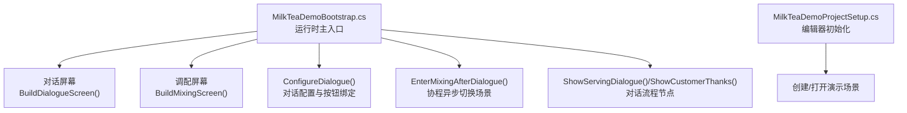
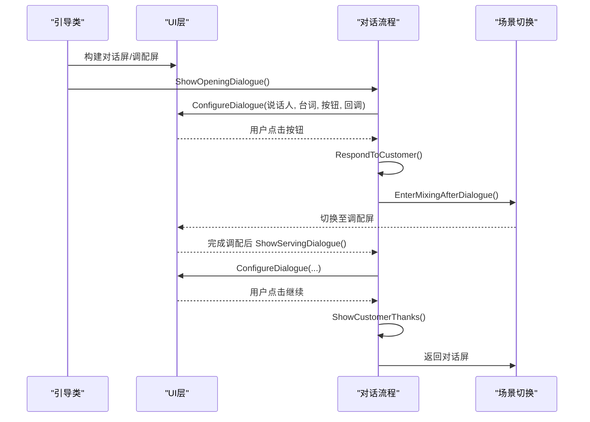
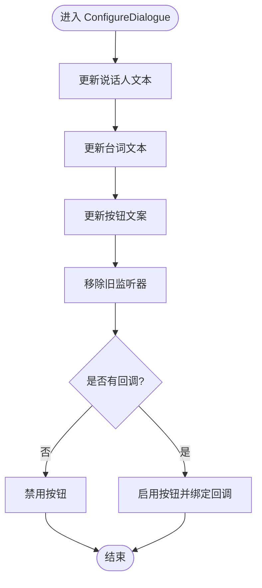
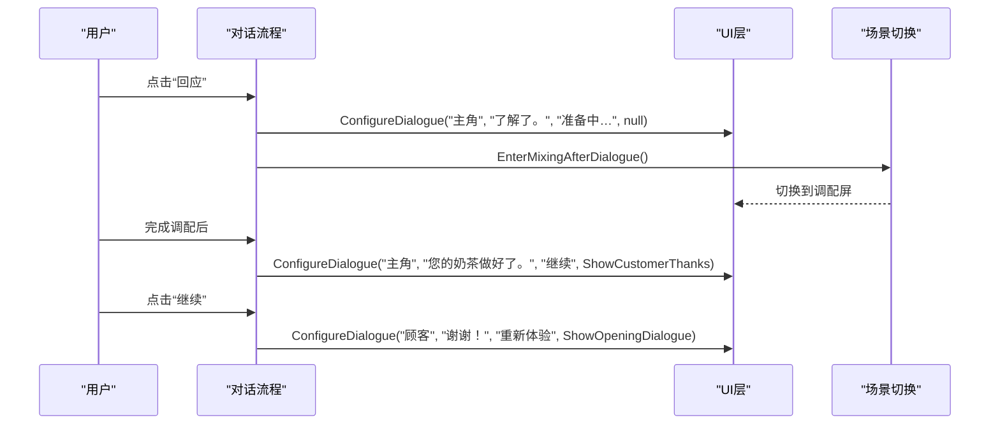
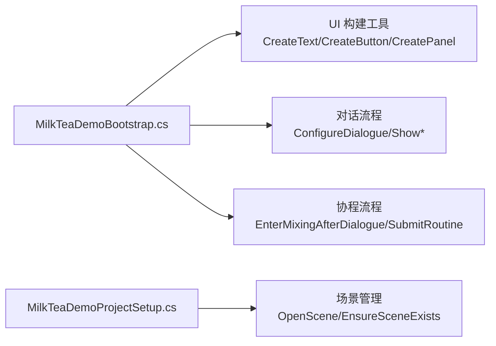

# 对话系统设计

<cite>
**本文引用的文件**
- [MilkTeaDemoBootstrap.cs](file://Assets/Scripts/MilkTeaDemoBootstrap.cs)
- [MilkTeaDemoProjectSetup.cs](file://Assets/Editor/MilkTeaDemoProjectSetup.cs)
</cite>

## 目录
1. [简介](#简介)
2. [项目结构](#项目结构)
3. [核心组件](#核心组件)
4. [架构总览](#架构总览)
5. [详细组件分析](#详细组件分析)
6. [依赖关系分析](#依赖关系分析)
7. [性能考量](#性能考量)
8. [故障排查指南](#故障排查指南)
9. [结论](#结论)
10. [附录：扩展与最佳实践](#附录：扩展与最佳实践)

## 简介
本技术文档围绕奶茶店模拟经营项目的对话系统展开，重点解析 ConfigureDialogue() 方法的工作原理，涵盖角色对话管理、流程控制、场景切换机制、对话状态管理、按钮事件处理、协程异步操作、对话数据组织与扩展方式，以及与 UI 系统的集成（文本渲染、按钮交互、界面切换）。文末提供添加新对话场景的完整示例与最佳实践，并附带调试技巧与常见问题解决方案。

## 项目结构
本项目包含运行时脚本与编辑器辅助脚本两部分：
- 运行时脚本负责动态构建 UI、管理对话与调配流程、处理用户交互。
- 编辑器脚本在项目启动时自动配置运行环境与默认场景。

图表来源
- [MilkTeaDemoBootstrap.cs:107-156](file://Assets/Scripts/MilkTeaDemoBootstrap.cs#L107-L156)
- [MilkTeaDemoBootstrap.cs:314-359](file://Assets/Scripts/MilkTeaDemoBootstrap.cs#L314-L359)
- [MilkTeaDemoProjectSetup.cs:20-25](file://Assets/Editor/MilkTeaDemoProjectSetup.cs#L20-L25)

章节来源
- [MilkTeaDemoBootstrap.cs:62-114](file://Assets/Scripts/MilkTeaDemoBootstrap.cs#L62-L114)
- [MilkTeaDemoProjectSetup.cs:8-55](file://Assets/Editor/MilkTeaDemoProjectSetup.cs#L8-L55)

## 核心组件
- 对话管理器：通过 ConfigureDialogue() 统一设置说话人、台词、按钮文案与点击行为，驱动对话流程。
- 场景控制器：在对话与调配界面之间切换，使用协程进行延时与过渡。
- UI 构建器：动态创建 Canvas、面板、文本、按钮等 UI 元素，并绑定事件。
- 状态管理：维护当前选择、糖度/冰度、类别切换、提交状态等。
- 编辑器初始化：确保场景存在、窗口尺寸、运行模式等环境配置。

章节来源
- [MilkTeaDemoBootstrap.cs:31-60](file://Assets/Scripts/MilkTeaDemoBootstrap.cs#L31-L60)
- [MilkTeaDemoBootstrap.cs:83-114](file://Assets/Scripts/MilkTeaDemoBootstrap.cs#L83-L114)
- [MilkTeaDemoBootstrap.cs:348-359](file://Assets/Scripts/MilkTeaDemoBootstrap.cs#L348-L359)
- [MilkTeaDemoProjectSetup.cs:27-55](file://Assets/Editor/MilkTeaDemoProjectSetup.cs#L27-L55)

## 架构总览
对话系统采用“单例式引导 + 动态 UI”的轻量架构：
- 引导类在场景加载后创建 Canvas 与两个主要界面（对话屏、调配屏），并启动初始对话。
- 对话流程以函数为节点，通过 ConfigureDialogue() 将 UI 与逻辑解耦。
- 场景切换通过协程实现，避免阻塞主线程，保证流畅的用户体验。
- UI 构建与事件绑定集中在工具方法中，便于复用与维护。

图表来源
- [MilkTeaDemoBootstrap.cs:314-359](file://Assets/Scripts/MilkTeaDemoBootstrap.cs#L314-L359)
- [MilkTeaDemoBootstrap.cs:327-334](file://Assets/Scripts/MilkTeaDemoBootstrap.cs#L327-L334)

## 详细组件分析

### ConfigureDialogue() 工作原理
ConfigureDialogue() 是对话系统的核心配置方法，负责：
- 更新说话人与台词文本。
- 设置按钮文案。
- 移除旧监听器，避免重复触发。
- 根据是否提供回调启用/禁用按钮。
- 绑定新的点击事件到回调 Action。

该方法实现了“数据驱动”的对话展示：只需传入说话人、台词、按钮文案与后续动作，即可快速生成一段对话节点。

图表来源
- [MilkTeaDemoBootstrap.cs:348-359](file://Assets/Scripts/MilkTeaDemoBootstrap.cs#L348-L359)

章节来源
- [MilkTeaDemoBootstrap.cs:348-359](file://Assets/Scripts/MilkTeaDemoBootstrap.cs#L348-L359)

### 角色对话管理与流程控制
- 角色对话：通过传入不同说话人名称区分角色（如“顾客”、“主角”）。
- 流程控制：每个对话节点对应一个回调方法，形成链式调用，例如：
  - ShowOpeningDialogue -> RespondToCustomer -> EnterMixingAfterDialogue -> ShowServingDialogue -> ShowCustomerThanks -> ShowOpeningDialogue
- 场景切换：在对话结束后通过协程延迟切换界面，确保动画或阅读节奏。

图表来源
- [MilkTeaDemoBootstrap.cs:314-359](file://Assets/Scripts/MilkTeaDemoBootstrap.cs#L314-L359)
- [MilkTeaDemoBootstrap.cs:327-334](file://Assets/Scripts/MilkTeaDemoBootstrap.cs#L327-L334)

章节来源
- [MilkTeaDemoBootstrap.cs:314-359](file://Assets/Scripts/MilkTeaDemoBootstrap.cs#L314-L359)

### 对话状态管理
- 当前类别：currentCategory 用于切换原料分类视图。
- 已选原料：selectedTea、selectedMilk、selectedTopping 记录用户选择。
- 糖度/冰度：sugarLevel、iceLevel 表示等级，支持循环切换。
- 提交状态：isSubmitting 防止重复提交。
- 订单提示：orderSpeaker/orderLine 显示顾客需求，便于对照。

这些状态在 UI 更新、选择变更、提交校验时保持一致性。

章节来源
- [MilkTeaDemoBootstrap.cs:47-60](file://Assets/Scripts/MilkTeaDemoBootstrap.cs#L47-L60)
- [MilkTeaDemoBootstrap.cs:361-427](file://Assets/Scripts/MilkTeaDemoBootstrap.cs#L361-L427)
- [MilkTeaDemoBootstrap.cs:465-514](file://Assets/Scripts/MilkTeaDemoBootstrap.cs#L465-L514)

### 按钮事件处理
- 对话按钮：通过 CreateButton() 创建，并在 ConfigureDialogue() 中动态绑定回调。
- 原料选择：每个选项按钮绑定 SelectIngredient()，更新选择并刷新视觉。
- 糖度/冰度：CreateLevelBlock() 创建可点击方块，ChangeLevel() 处理循环切换。
- 拉杆提交：BeginSubmit() 触发 SubmitRoutine() 协程，执行动画与校验。

章节来源
- [MilkTeaDemoBootstrap.cs:268-312](file://Assets/Scripts/MilkTeaDemoBootstrap.cs#L268-L312)
- [MilkTeaDemoBootstrap.cs:381-427](file://Assets/Scripts/MilkTeaDemoBootstrap.cs#L381-L427)
- [MilkTeaDemoBootstrap.cs:465-514](file://Assets/Scripts/MilkTeaDemoBootstrap.cs#L465-L514)
- [MilkTeaDemoBootstrap.cs:649-670](file://Assets/Scripts/MilkTeaDemoBootstrap.cs#L649-L670)

### 协程异步操作
- EnterMixingAfterDialogue()：等待短暂时间后切换界面，清理选择并恢复订单提示。
- SubmitRoutine()：执行拉杆旋转动画、校验配方、保存解锁状态、更新 UI 并跳转下一段对话。

协程的使用避免了阻塞主线程，同时提供了清晰的时序控制。

章节来源
- [MilkTeaDemoBootstrap.cs:327-334](file://Assets/Scripts/MilkTeaDemoBootstrap.cs#L327-L334)
- [MilkTeaDemoBootstrap.cs:473-514](file://Assets/Scripts/MilkTeaDemoBootstrap.cs#L473-L514)

### 对话数据的组织方式与扩展机制
- 数据组织：对话节点以方法形式存在，参数化传入说话人、台词、按钮文案与回调，易于扩展。
- 扩展机制：新增对话场景只需：
  - 定义新的对话方法，调用 ConfigureDialogue()。
  - 在适当时机调用该方法（如用户交互或流程节点）。
  - 如需持久化或条件分支，可在回调中加入判断逻辑。
- 建议：将对话数据外置为配置文件（如 JSON/ScriptableObject）以实现更灵活的编辑与热更新。

章节来源
- [MilkTeaDemoBootstrap.cs:314-359](file://Assets/Scripts/MilkTeaDemoBootstrap.cs#L314-L359)

### 与 UI 系统的集成
- 文本渲染：CreateText() 统一管理字体、字号、颜色、对齐与换行模式。
- 按钮交互：CreateButton() 创建按钮并绑定回调；ConfigureDialogue() 动态更新按钮状态与事件。
- 界面切换：通过 SetActive(true/false) 切换对话屏与调配屏，配合协程实现平滑过渡。
- 布局适配：CanvasScaler 与 AspectRatioFitter 确保在不同分辨率下保持比例与缩放。

章节来源
- [MilkTeaDemoBootstrap.cs:83-114](file://Assets/Scripts/MilkTeaDemoBootstrap.cs#L83-L114)
- [MilkTeaDemoBootstrap.cs:631-670](file://Assets/Scripts/MilkTeaDemoBootstrap.cs#L631-L670)
- [MilkTeaDemoBootstrap.cs:314-359](file://Assets/Scripts/MilkTeaDemoBootstrap.cs#L314-L359)

## 依赖关系分析
- MilkTeaDemoBootstrap 依赖 Unity UI 组件（Text、Button、Image、Canvas、EventSystem）。
- 编辑器脚本依赖 UnityEditor 与 SceneManager，用于项目初始化与场景管理。
- 对话流程与 UI 构建解耦：ConfigureDialogue() 仅关注数据与事件绑定，不关心具体 UI 细节。

图表来源
- [MilkTeaDemoBootstrap.cs:631-670](file://Assets/Scripts/MilkTeaDemoBootstrap.cs#L631-L670)
- [MilkTeaDemoBootstrap.cs:314-359](file://Assets/Scripts/MilkTeaDemoBootstrap.cs#L314-L359)
- [MilkTeaDemoProjectSetup.cs:20-25](file://Assets/Editor/MilkTeaDemoProjectSetup.cs#L20-L25)

章节来源
- [MilkTeaDemoBootstrap.cs:631-670](file://Assets/Scripts/MilkTeaDemoBootstrap.cs#L631-L670)
- [MilkTeaDemoProjectSetup.cs:20-25](file://Assets/Editor/MilkTeaDemoProjectSetup.cs#L20-L25)

## 性能考量
- 动态 UI 创建：在 Awake/Start 阶段一次性构建，避免运行时频繁 Instantiate。
- 协程优化：使用 WaitForSeconds 与 Time.deltaTime 控制动画时长，避免 CPU 占用过高。
- 事件监听：每次配置对话前移除旧监听器，防止内存泄漏与重复触发。
- 资源管理：字体创建失败时回退到内置字体，提升兼容性。

[本节为通用指导，无需特定文件引用]

## 故障排查指南
- 对话按钮无响应：
  - 检查 ConfigureDialogue() 是否正确传入 action。
  - 确认按钮未被其他逻辑禁用（interactable=false）。
- 场景切换异常：
  - 检查协程是否被正确启动（StartCoroutine）。
  - 确认目标屏幕对象存在且命名一致。
- 文本显示乱码：
  - 检查字体创建逻辑，确保系统存在中文字体。
  - 若失败，回退到 Arial 字体。
- 重复提交问题：
  - 检查 isSubmitting 标志位是否正确设置与重置。
  - 确保协程完成后恢复按钮可点击状态。

章节来源
- [MilkTeaDemoBootstrap.cs:348-359](file://Assets/Scripts/MilkTeaDemoBootstrap.cs#L348-L359)
- [MilkTeaDemoBootstrap.cs:465-514](file://Assets/Scripts/MilkTeaDemoBootstrap.cs#L465-L514)
- [MilkTeaDemoBootstrap.cs:697-708](file://Assets/Scripts/MilkTeaDemoBootstrap.cs#L697-L708)

## 结论
该对话系统以轻量、可扩展的方式实现了角色对话、流程控制与场景切换。ConfigureDialogue() 作为核心方法，将 UI 与逻辑解耦，便于快速迭代与扩展。结合协程与事件系统，保证了良好的用户体验与可维护性。建议在后续版本中将对话数据外置，进一步提升灵活性与可配置性。

[本节为总结，无需特定文件引用]

## 附录：扩展与最佳实践

### 添加新对话场景的步骤
1. 定义新的对话方法，调用 ConfigureDialogue() 设置说话人、台词、按钮文案与回调。
2. 在合适的时机调用该方法（如用户交互或流程节点）。
3. 如需条件分支，在回调中加入判断逻辑。
4. 如需持久化或解锁内容，使用 PlayerPrefs 或外部存储。
5. 测试不同分辨率下的 UI 表现，确保布局适配。

章节来源
- [MilkTeaDemoBootstrap.cs:314-359](file://Assets/Scripts/MilkTeaDemoBootstrap.cs#L314-L359)

### 最佳实践
- 将对话节点模块化：每个场景或剧情片段封装为独立方法，提高可读性。
- 使用数据驱动：将对话文本与流程配置外置，便于策划编辑与热更新。
- 统一 UI 风格：通过工具方法集中管理样式与布局，减少重复代码。
- 错误处理：对字体、资源加载、网络请求等可能失败的步骤增加回退逻辑。
- 性能监控：在关键路径加入日志或性能计数器，定位瓶颈。

[本节为通用指导，无需特定文件引用]