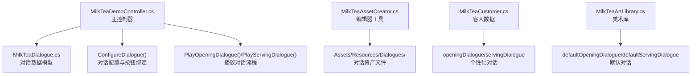
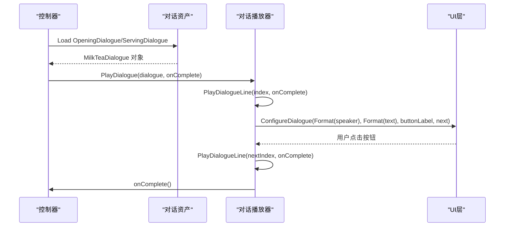
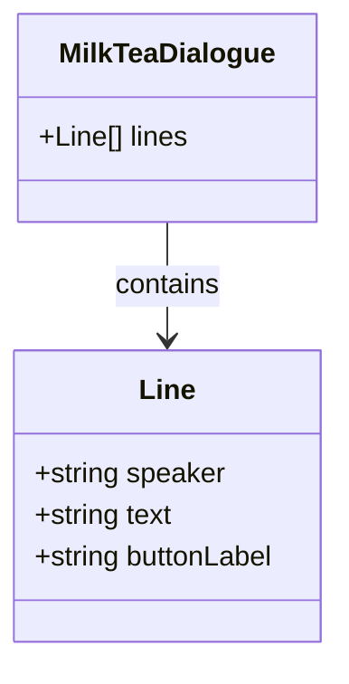
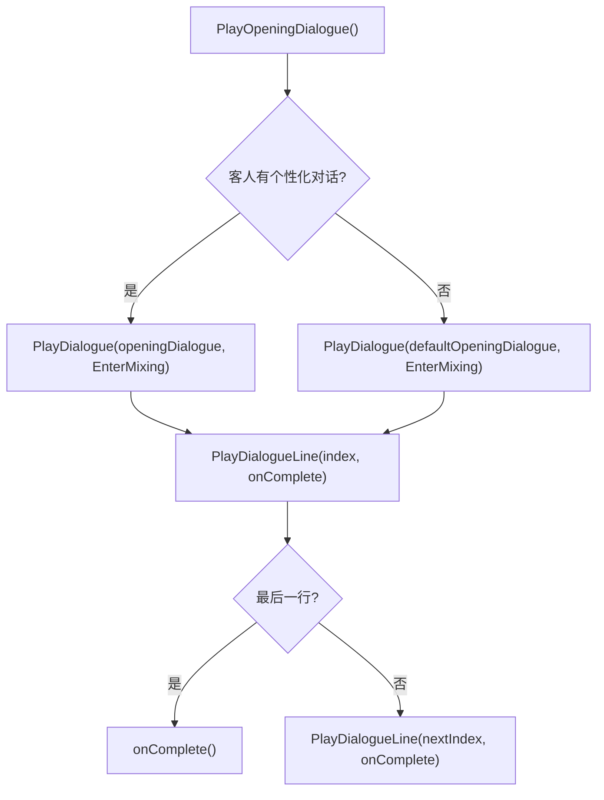
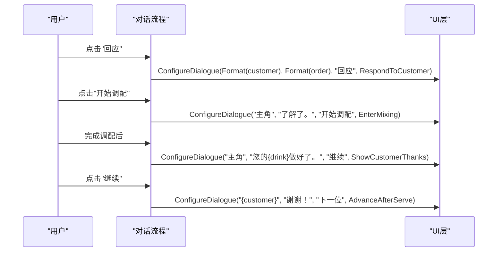
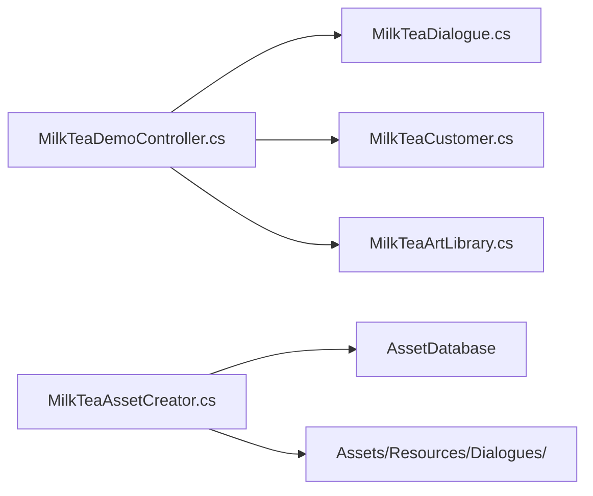

# 对话系统设计

<cite>
**本文引用的文件**
- [MilkTeaDialogue.cs](file://Assets/Scripts/MilkTeaDialogue.cs)
- [MilkTeaDemoController.cs](file://Assets/Scripts/MilkTeaDemoController.cs)
- [MilkTeaCustomer.cs](file://Assets/Scripts/MilkTeaCustomer.cs)
- [MilkTeaArtLibrary.cs](file://Assets/Scripts/MilkTeaArtLibrary.cs)
- [MilkTeaAssetCreator.cs](file://Assets/Editor/MilkTeaAssetCreator.cs)
- [OpeningDialogue.asset](file://Assets/Resources/Dialogues/OpeningDialogue.asset)
- [ServingDialogue.asset](file://Assets/Resources/Dialogues/ServingDialogue.asset)
</cite>

## 更新摘要
**所做更改**
- 新增数据驱动的对话系统架构，支持 ScriptableObject 对话资产
- 实现 MilkTeaDialogue 类用于管理对话行和占位符替换
- 集成 Assets/Resources/Dialogues/ 目录中的序列化对话资产
- 增强 ConfigureDialogue() 方法以支持动态对话流程
- 添加编辑器工具自动生成和管理对话资产

## 目录
1. [简介](#简介)
2. [项目结构](#项目结构)
3. [核心组件](#核心组件)
4. [架构总览](#架构总览)
5. [详细组件分析](#详细组件分析)
6. [依赖关系分析](#依赖关系分析)
7. [性能考量](#性能考量)
8. [故障排查指南](#故障排查指南)
9. [结论](#结论)
10. [附录：扩展与最佳实践](#附录：扩展与最佳实践)

## 简介
本技术文档围绕奶茶店模拟经营项目的增强型对话系统展开，重点解析基于 ScriptableObject 的数据驱动对话架构。新系统通过 MilkTeaDialogue.cs 实现了可序列化的对话资产，支持在 Assets/Resources/Dialogues/ 目录中管理对话数据，并提供灵活的占位符替换机制。文档涵盖角色对话管理、流程控制、场景切换机制、对话状态管理、按钮事件处理、协程异步操作、对话数据的组织方式与扩展机制，以及与 UI 系统的集成（文本渲染、按钮交互、界面切换）。文末提供添加新对话场景的完整示例与最佳实践，并附带调试技巧与常见问题解决方案。

## 项目结构
本项目采用数据驱动的对话系统架构，包含运行时脚本、编辑器辅助脚本和数据资产三部分：
- 运行时脚本负责动态构建 UI、管理对话流程与调配逻辑、处理用户交互。
- 编辑器脚本在项目启动时自动配置运行环境与默认场景，并生成对话资产。
- 数据资产存储在 Assets/Resources/Dialogues/ 中，支持 Unity 编辑器和序列化。

图表来源
- [MilkTeaDemoController.cs:447-575](file://Assets/Scripts/MilkTeaDemoController.cs#L447-L575)
- [MilkTeaDialogue.cs:1-29](file://Assets/Scripts/MilkTeaDialogue.cs#L1-L29)
- [MilkTeaAssetCreator.cs:85-126](file://Assets/Editor/MilkTeaAssetCreator.cs#L85-L126)

章节来源
- [MilkTeaDemoController.cs:1-25](file://Assets/Scripts/MilkTeaDemoController.cs#L1-L25)
- [MilkTeaDialogue.cs:1-29](file://Assets/Scripts/MilkTeaDialogue.cs#L1-L29)
- [MilkTeaAssetCreator.cs:1-12](file://Assets/Editor/MilkTeaAssetCreator.cs#L1-L12)

## 核心组件
- **对话数据模型**：MilkTeaDialogue 类定义对话行结构，支持说话人、台词、按钮文案和占位符替换。
- **对话播放器**：PlayOpeningDialogue() 和 PlayServingDialogue() 方法负责加载和播放对话资产。
- **配置管理器**：ConfigureDialogue() 统一设置说话人、台词、按钮文案与点击行为，驱动对话流程。
- **客人系统**：MilkTeaCustomer 支持为每个客人配置个性化的 openingDialogue 和 servingDialogue。
- **美术库集成**：MilkTeaArtLibrary 提供默认的 openingDialogue 和 servingDialogue。
- **编辑器工具**：MilkTeaAssetCreator 自动生成和管理对话资产文件。

章节来源
- [MilkTeaDialogue.cs:10-28](file://Assets/Scripts/MilkTeaDialogue.cs#L10-L28)
- [MilkTeaDemoController.cs:544-598](file://Assets/Scripts/MilkTeaDemoController.cs#L544-L598)
- [MilkTeaCustomer.cs:30-35](file://Assets/Scripts/MilkTeaCustomer.cs#L30-L35)
- [MilkTeaArtLibrary.cs:61-63](file://Assets/Scripts/MilkTeaArtLibrary.cs#L61-L63)
- [MilkTeaAssetCreator.cs:85-126](file://Assets/Editor/MilkTeaAssetCreator.cs#L85-L126)

## 架构总览
对话系统采用"数据驱动 + 动态播放"的现代化架构：
- 对话数据以 ScriptableObject 形式存储在 Resources 目录中，支持 Unity 编辑器可视化编辑。
- 运行时通过 MilkTeaDemoController 加载对话资产并动态播放。
- 支持占位符替换机制，如 {customer}、{drink}、{sugar}、{ice} 等。
- 每个客人可以拥有个性化的对话，未设置时使用默认对话。
- 编辑器工具自动生成和管理对话资产，简化开发流程。

图表来源
- [MilkTeaDemoController.cs:544-598](file://Assets/Scripts/MilkTeaDemoController.cs#L544-L598)
- [MilkTeaDialogue.cs:14-25](file://Assets/Scripts/MilkTeaDialogue.cs#L14-L25)

## 详细组件分析

### MilkTeaDialogue 数据模型
MilkTeaDialogue 是数据驱动对话系统的核心，定义了对话行的结构和行为：
- **Line 结构体**：包含 speaker（说话人）、text（台词）、buttonLabel（按钮文案）三个字段。
- **占位符支持**：支持 {customer}、{drink}、{sugar}、{ice} 等占位符，运行时由 Format() 方法替换。
- **ScriptableObject 属性**：可在 Unity 编辑器中右键创建和编辑对话资产。
- **序列化支持**：对话数据保存在 .asset 文件中，支持版本控制和团队协作。

图表来源
- [MilkTeaDialogue.cs:11-28](file://Assets/Scripts/MilkTeaDialogue.cs#L11-L28)

章节来源
- [MilkTeaDialogue.cs:1-29](file://Assets/Scripts/MilkTeaDialogue.cs#L1-L29)

### ConfigureDialogue() 工作原理
ConfigureDialogue() 是对话系统的核心配置方法，负责：
- 更新说话人与台词文本。
- 设置按钮文案。
- 移除旧监听器，避免重复触发。
- 根据是否提供回调启用/禁用按钮。
- 绑定新的点击事件到回调 Action。

该方法实现了"数据驱动"的对话展示：只需传入说话人、台词、按钮文案与后续动作，即可快速生成一段对话节点。

图表来源
- [MilkTeaDemoController.cs:956-967](file://Assets/Scripts/MilkTeaDemoController.cs#L956-L967)

章节来源
- [MilkTeaDemoController.cs:956-967](file://Assets/Scripts/MilkTeaDemoController.cs#L956-L967)

### 对话播放流程
对话播放系统通过递归方式逐行播放对话：
- **PlayOpeningDialogue()**：播放开场对话，优先使用客人的个性化对话，否则使用默认对话。
- **PlayServingDialogue()**：播放交付对话，同样支持个性化对话和默认对话。
- **PlayDialogue()**：通用对话播放方法，接收对话对象和完成回调。
- **PlayDialogueLine()**：递归播放单行对话，处理下一行的跳转逻辑。
- **Format()**：占位符替换方法，将 {customer}、{drink}、{sugar}、{ice} 替换为实际值。

图表来源
- [MilkTeaDemoController.cs:544-598](file://Assets/Scripts/MilkTeaDemoController.cs#L544-L598)

章节来源
- [MilkTeaDemoController.cs:544-598](file://Assets/Scripts/MilkTeaDemoController.cs#L544-L598)

### 角色对话管理与流程控制
- **角色对话**：通过 MilkTeaCustomer 为每个客人配置个性化对话，支持不同的说话人和台词。
- **流程控制**：对话流程通过回调链式调用，例如：
  - PlayOpeningDialogue -> EnterMixing -> ShowServingDialogue -> AdvanceAfterServe -> PlayOpeningDialogue
- **场景切换**：在对话结束后通过 EnterMixing() 和 AdvanceAfterServe() 切换界面。
- **优先级机制**：客人个性化对话 > 默认对话 > 内置回退对话。

图表来源
- [MilkTeaDemoController.cs:447-575](file://Assets/Scripts/MilkTeaDemoController.cs#L447-L575)

章节来源
- [MilkTeaDemoController.cs:447-575](file://Assets/Scripts/MilkTeaDemoController.cs#L447-L575)

### 对话状态管理
- **当前订单**：orderIndex、orderSugar、orderIce 记录当前顾客需求。
- **活跃配方**：activeRecipe 存储当前正在制作的饮品信息。
- **客人信息**：currentCustomer 保存当前顾客的详细信息。
- **进度跟踪**：dayNumber、servedToday、perfectToday、mistakesToday、earningsToday 跟踪游戏进度。
- **选择状态**：selectedTea、selectedMilk、selectedTopping、sugarLevel、iceLevel 记录用户选择。

这些状态在 UI 更新、选择变更、提交校验时保持一致性。

章节来源
- [MilkTeaDemoController.cs:167-194](file://Assets/Scripts/MilkTeaDemoController.cs#L167-L194)
- [MilkTeaDemoController.cs:482-516](file://Assets/Scripts/MilkTeaDemoController.cs#L482-L516)

### 按钮事件处理
- **对话按钮**：通过 ConfigureDialogue() 动态绑定回调，支持条件启用/禁用。
- **原料选择**：SelectIngredient() 更新选择并刷新视觉状态。
- **糖度/冰度**：ChangeLevel() 处理循环切换和视觉反馈。
- **拉杆提交**：BeginSubmit() 触发 SubmitRoutine() 协程，执行动画与校验。
- **导航按钮**：ChangeCategory()、ChangeManualPage() 等处理界面导航。

章节来源
- [MilkTeaDemoController.cs:989-1007](file://Assets/Scripts/MilkTeaDemoController.cs#L989-L1007)
- [MilkTeaDemoController.cs:1024-1038](file://Assets/Scripts/MilkTeaDemoController.cs#L1024-L1038)
- [MilkTeaDemoController.cs:1082-1148](file://Assets/Scripts/MilkTeaDemoController.cs#L1082-L1148)

### 协程异步操作
- **SubmitRoutine()**：执行拉杆旋转动画、校验配方、保存解锁状态、更新 UI 并跳转下一段对话。
- **IntroCountdown()**：开场倒计时协程，支持视频播放或数字倒计时。
- **异步流程控制**：协程避免了阻塞主线程，同时提供了清晰的时序控制。

章节来源
- [MilkTeaDemoController.cs:1090-1148](file://Assets/Scripts/MilkTeaDemoController.cs#L1090-L1148)
- [MilkTeaDemoController.cs:821-837](file://Assets/Scripts/MilkTeaDemoController.cs#L821-L837)

### 对话数据的组织方式与扩展机制
- **数据组织**：对话数据以 MilkTeaDialogue.ScriptableObject 形式存储在 Assets/Resources/Dialogues/ 目录中。
- **序列化支持**：Unity 自动序列化对话资产，支持版本控制和团队协作。
- **占位符系统**：Format() 方法支持 {customer}、{drink}、{sugar}、{ice} 等占位符的动态替换。
- **优先级机制**：客人个性化对话 > 默认对话 > 内置回退对话。
- **编辑器工具**：MilkTeaAssetCreator 自动生成和管理对话资产。

扩展机制：
- 新增对话场景：创建新的 MilkTeaDialogue 资产，在 MilkTeaCustomer 或 MilkTeaArtLibrary 中引用。
- 自定义占位符：扩展 Format() 方法支持更多占位符类型。
- 条件分支：在回调中加入判断逻辑实现复杂对话流程。

章节来源
- [MilkTeaDemoController.cs:600-613](file://Assets/Scripts/MilkTeaDemoController.cs#L600-L613)
- [MilkTeaAssetCreator.cs:85-126](file://Assets/Editor/MilkTeaAssetCreator.cs#L85-L126)

### 与 UI 系统的集成
- **文本渲染**：CreateText() 统一管理字体、字号、颜色、对齐与换行模式。
- **按钮交互**：CreateButton() 创建按钮并绑定回调；ConfigureDialogue() 动态更新按钮状态与事件。
- **界面切换**：通过 SetActive(true/false) 切换对话屏与调配屏，配合协程实现平滑过渡。
- **布局适配**：CanvasScaler 与 AspectRatioFitter 确保在不同分辨率下保持比例与缩放。
- **资源管理**：字体创建失败时回退到内置字体，提升兼容性。

章节来源
- [MilkTeaDemoController.cs:956-967](file://Assets/Scripts/MilkTeaDemoController.cs#L956-L967)
- [MilkTeaSceneBuilder.cs:615-650](file://Assets/Editor/MilkTeaSceneBuilder.cs#L615-L650)

## 依赖关系分析
- MilkTeaDemoController 依赖 Unity UI 组件（Text、Button、Image、Canvas、EventSystem）。
- 对话系统依赖 MilkTeaDialogue 数据模型和 MilkTeaCustomer 客人数据。
- 编辑器脚本依赖 UnityEditor 与 AssetDatabase，用于资产管理和场景构建。
- 对话流程与 UI 构建解耦：ConfigureDialogue() 仅关注数据与事件绑定，不关心具体 UI 细节。

图表来源
- [MilkTeaDemoController.cs:1-25](file://Assets/Scripts/MilkTeaDemoController.cs#L1-L25)
- [MilkTeaAssetCreator.cs:1-12](file://Assets/Editor/MilkTeaAssetCreator.cs#L1-L12)

章节来源
- [MilkTeaDemoController.cs:1-25](file://Assets/Scripts/MilkTeaDemoController.cs#L1-L25)
- [MilkTeaAssetCreator.cs:1-12](file://Assets/Editor/MilkTeaAssetCreator.cs#L1-L12)

## 性能考量
- **数据加载**：对话资产通过 Resources.Load 懒加载，避免启动时内存占用过高。
- **字符串优化**：Format() 方法使用 Replace() 进行占位符替换，对于大量对话可考虑预编译模板。
- **事件管理**：每次配置对话前移除旧监听器，防止内存泄漏与重复触发。
- **协程优化**：使用 WaitForSeconds 与 Time.deltaTime 控制动画时长，避免 CPU 占用过高。
- **资源管理**：字体创建失败时回退到内置字体，提升兼容性。

## 故障排查指南
- **对话按钮无响应**：
  - 检查 ConfigureDialogue() 是否正确传入 action。
  - 确认按钮未被其他逻辑禁用（interactable=false）。
- **对话资产加载失败**：
  - 检查 Assets/Resources/Dialogues/ 目录是否存在。
  - 确认对话资产文件名正确且已序列化。
- **占位符替换异常**：
  - 检查 activeRecipe 是否为空。
  - 确认 Format() 方法中的占位符名称正确。
- **场景切换异常**：
  - 检查协程是否被正确启动（StartCoroutine）。
  - 确认目标屏幕对象存在且命名一致。
- **文本显示乱码**：
  - 检查字体创建逻辑，确保系统存在中文字体。
  - 若失败，回退到 Arial 字体。

章节来源
- [MilkTeaDemoController.cs:956-967](file://Assets/Scripts/MilkTeaDemoController.cs#L956-L967)
- [MilkTeaDemoController.cs:600-613](file://Assets/Scripts/MilkTeaDemoController.cs#L600-L613)

## 结论
该对话系统通过引入数据驱动的架构，显著提升了灵活性和可维护性。MilkTeaDialogue 作为核心数据模型，结合 MilkTeaDemoController 的播放逻辑，实现了完整的对话管理系统。ConfigureDialogue() 作为核心方法，将 UI 与逻辑解耦，便于快速迭代与扩展。新的系统支持 ScriptableObject 资产、占位符替换、个性化对话和编辑器工具，为未来的功能扩展奠定了坚实基础。建议在后续版本中进一步扩展占位符系统，支持更复杂的对话逻辑和条件分支。

## 附录：扩展与最佳实践

### 添加新对话场景的步骤
1. **创建对话资产**：在 Unity 中右键 Create → 奶茶店 Demo → 对话，或在 Assets/Resources/Dialogues/ 中手动创建。
2. **编辑对话内容**：在 Inspector 中设置说话人、台词、按钮文案，支持占位符替换。
3. **关联到客人或默认对话**：在 MilkTeaCustomer 或 MilkTeaArtLibrary 中引用新创建的对话资产。
4. **测试对话流程**：运行游戏验证对话播放、占位符替换和按钮交互。
5. **优化性能**：对于大量对话，考虑预编译模板或使用对象池。

章节来源
- [MilkTeaDialogue.cs:10-28](file://Assets/Scripts/MilkTeaDialogue.cs#L10-L28)
- [MilkTeaAssetCreator.cs:85-126](file://Assets/Editor/MilkTeaAssetCreator.cs#L85-L126)

### 最佳实践
- **数据驱动设计**：将对话文本与流程配置外置为 ScriptableObject，便于策划编辑与热更新。
- **占位符规范**：统一使用 {customer}、{drink}、{sugar}、{ice} 等标准占位符，避免硬编码。
- **优先级管理**：合理使用客人个性化对话和默认对话，确保对话内容的层次性。
- **错误处理**：对字体、资源加载、网络请求等可能失败的步骤增加回退逻辑。
- **性能监控**：在关键路径加入日志或性能计数器，定位瓶颈。
- **版本控制**：利用 Unity 的版本控制系统管理对话资产，支持团队协作。

### 高级功能扩展
- **条件分支**：在回调中加入判断逻辑实现复杂对话流程。
- **多语言支持**：扩展 Format() 方法支持多语言占位符。
- **动画集成**：在对话播放过程中触发角色动画或特效。
- **存档系统**：保存对话进度和用户选择，支持游戏存档功能。
- **调试工具**：添加对话调试面板，实时查看和修改对话状态。