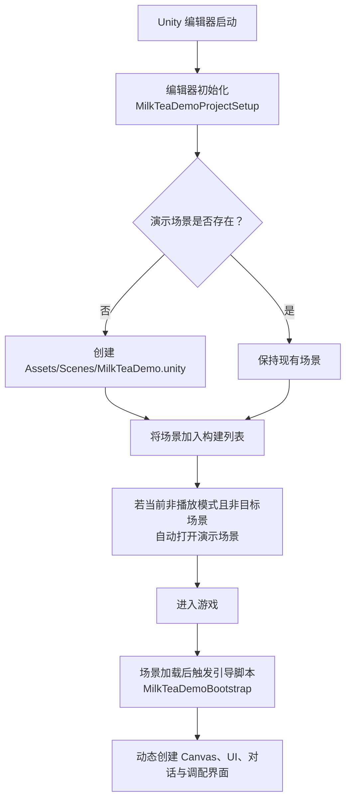
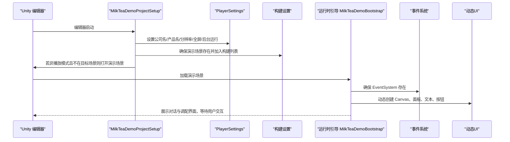
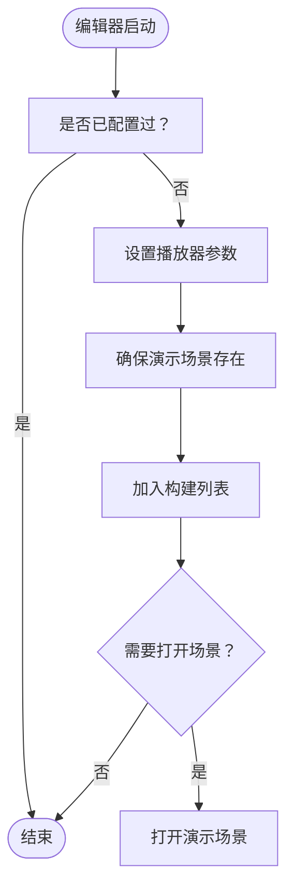
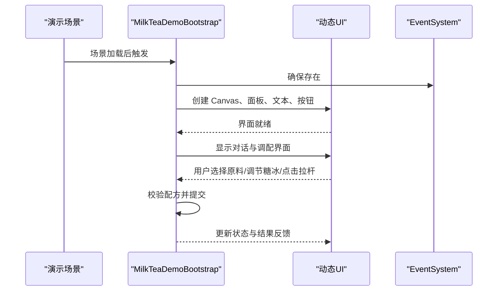
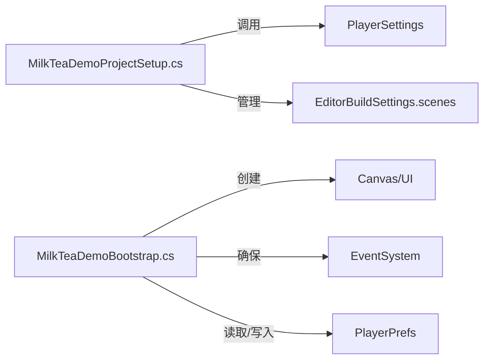

# 快速开始

<cite>
**本文引用的文件**
- [MilkTeaDemoProjectSetup.cs](file://Assets/Editor/MilkTeaDemoProjectSetup.cs)
- [MilkTeaDemoBootstrap.cs](file://Assets/Scripts/MilkTeaDemoBootstrap.cs)
- [ProjectVersion.txt](file://ProjectSettings/ProjectVersion.txt)
</cite>

## 目录
1. [简介](#简介)
2. [项目结构](#项目结构)
3. [核心组件](#核心组件)
4. [架构总览](#架构总览)
5. [详细组件分析](#详细组件分析)
6. [依赖关系分析](#依赖关系分析)
7. [性能注意事项](#性能注意事项)
8. [故障排除指南](#故障排除指南)
9. [结论](#结论)
10. [附录：完整操作步骤](#附录完整操作步骤)

## 简介
本指南面向首次接触“奶茶店模拟经营”项目的开发者与体验者，目标是让你在最短时间内完成环境准备、导入项目并成功运行游戏。你将了解：
- 推荐的 Unity 版本与环境要求
- 如何通过 Unity Hub 打开并运行项目
- 编辑器启动时的自动配置逻辑（场景创建、播放器设置等）
- 运行时如何进入演示界面并进行交互
- 常见问题（字体缺失、事件系统未配置等）的快速解决思路

## 项目结构
本项目采用精简的脚本驱动方式，核心由两部分组成：
- 编辑器侧自动配置：在编辑器启动时自动设置播放器参数、确保演示场景存在并加入构建列表，同时提供菜单入口快速打开演示场景。
- 运行时引导：在游戏场景加载后动态创建 UI、对话与调配界面，无需预先布置复杂层级。

图表来源
- [MilkTeaDemoProjectSetup.cs:15-55](file://Assets/Editor/MilkTeaDemoProjectSetup.cs#L15-L55)
- [MilkTeaDemoBootstrap.cs:62-81](file://Assets/Scripts/MilkTeaDemoBootstrap.cs#L62-L81)

章节来源
- [MilkTeaDemoProjectSetup.cs:1-71](file://Assets/Editor/MilkTeaDemoProjectSetup.cs#L1-L71)
- [MilkTeaDemoBootstrap.cs:1-81](file://Assets/Scripts/MilkTeaDemoBootstrap.cs#L1-L81)

## 核心组件
- 编辑器自动配置（MilkTeaDemoProjectSetup）
  - 在编辑器启动时执行一次性配置：设置公司名称、产品名称、默认分辨率、窗口模式、后台运行等；确保演示场景存在并加入构建列表；必要时自动打开演示场景。
  - 提供菜单项“奶茶店 Demo/打开演示场景”，便于快速定位与打开演示场景。
- 运行时引导（MilkTeaDemoBootstrap）
  - 使用 RuntimeInitializeOnLoadMethod 在场景加载后注入引导对象，避免重复实例化。
  - 动态创建 UI（Canvas、面板、文本、按钮）、对话系统与调配界面，确保事件系统存在，并自动创建中文字体以显示中文内容。
  - 实现基础交互：选择茶底/奶底/配料、调节糖度与冰度、拉动拉杆提交订单、根据正确配方解锁提示等。

章节来源
- [MilkTeaDemoProjectSetup.cs:15-68](file://Assets/Editor/MilkTeaDemoProjectSetup.cs#L15-L68)
- [MilkTeaDemoBootstrap.cs:62-81](file://Assets/Scripts/MilkTeaDemoBootstrap.cs#L62-L81)
- [MilkTeaDemoBootstrap.cs:314-359](file://Assets/Scripts/MilkTeaDemoBootstrap.cs#L314-L359)
- [MilkTeaDemoBootstrap.cs:361-549](file://Assets/Scripts/MilkTeaDemoBootstrap.cs#L361-L549)

## 架构总览
下图展示了从编辑器启动到游戏运行的关键流程与模块协作关系。

图表来源
- [MilkTeaDemoProjectSetup.cs:15-55](file://Assets/Editor/MilkTeaDemoProjectSetup.cs#L15-L55)
- [MilkTeaDemoBootstrap.cs:62-81](file://Assets/Scripts/MilkTeaDemoBootstrap.cs#L62-L81)
- [MilkTeaDemoBootstrap.cs:710-718](file://Assets/Scripts/MilkTeaDemoBootstrap.cs#L710-L718)

## 详细组件分析

### 编辑器自动配置（MilkTeaDemoProjectSetup）
- 启动时机：通过 InitializeOnLoad 在编辑器加载时注册延迟回调，确保只执行一次配置。
- 播放器设置：统一公司名称、产品名称、默认分辨率（1920x1080）、窗口模式、可调整窗口大小、后台运行等。
- 场景保障：检查 Assets/Scenes/MilkTeaDemo.unity 是否存在，不存在则创建空场景并保存；将该场景加入 EditorBuildSettings.scenes，并设置为可构建。
- 自动打开：当不在播放模式且当前活动场景不是目标场景时，自动打开演示场景，减少新手操作成本。
- 快捷菜单：提供“奶茶店 Demo/打开演示场景”菜单项，方便随时打开演示场景。

图表来源
- [MilkTeaDemoProjectSetup.cs:15-55](file://Assets/Editor/MilkTeaDemoProjectSetup.cs#L15-L55)
- [MilkTeaDemoProjectSetup.cs:57-68](file://Assets/Editor/MilkTeaDemoProjectSetup.cs#L57-L68)

章节来源
- [MilkTeaDemoProjectSetup.cs:1-71](file://Assets/Editor/MilkTeaDemoProjectSetup.cs#L1-L71)

### 运行时引导（MilkTeaDemoBootstrap）
- 注入时机：使用 RuntimeInitializeOnLoadMethod 在场景加载后自动创建引导对象，避免重复实例化。
- 资源与系统：
  - 动态创建中文字体，优先尝试系统常用中文字体，回退到内置 Arial。
  - 确保 EventSystem 存在，避免 UI 无法响应输入。
- 界面构建：
  - 动态创建 Canvas、缩放器、背景与 16:9 内容容器。
  - 构建对话屏幕与调配屏幕，包含顾客头像占位、店铺俯视图、配方手册、原料选择、机器状态与拉杆按钮等。
- 交互逻辑：
  - 原料分类切换（茶底/奶底/配料），选择后更新视觉与摘要。
  - 糖度与冰度三级调节，实时更新状态与摘要。
  - 拉杆提交动画与校验：若符合“经典珍珠奶茶·少糖·少冰”的预设配方，则解锁配方图标并进入服务对话；否则提示重新调配。
  - 使用 PlayerPrefs 记录解锁状态，刷新配方图标显示。

图表来源
- [MilkTeaDemoBootstrap.cs:62-81](file://Assets/Scripts/MilkTeaDemoBootstrap.cs#L62-L81)
- [MilkTeaDemoBootstrap.cs:314-359](file://Assets/Scripts/MilkTeaDemoBootstrap.cs#L314-L359)
- [MilkTeaDemoBootstrap.cs:361-549](file://Assets/Scripts/MilkTeaDemoBootstrap.cs#L361-L549)
- [MilkTeaDemoBootstrap.cs:697-718](file://Assets/Scripts/MilkTeaDemoBootstrap.cs#L697-L718)

章节来源
- [MilkTeaDemoBootstrap.cs:62-81](file://Assets/Scripts/MilkTeaDemoBootstrap.cs#L62-L81)
- [MilkTeaDemoBootstrap.cs:314-359](file://Assets/Scripts/MilkTeaDemoBootstrap.cs#L314-L359)
- [MilkTeaDemoBootstrap.cs:361-549](file://Assets/Scripts/MilkTeaDemoBootstrap.cs#L361-L549)
- [MilkTeaDemoBootstrap.cs:697-718](file://Assets/Scripts/MilkTeaDemoBootstrap.cs#L697-L718)

## 依赖关系分析
- 编辑器脚本依赖 Unity 编辑器 API（EditorApplication、EditorSceneManager、PlayerSettings、AssetDatabase）。
- 运行时脚本依赖 Unity 引擎与 UI 子系统（Canvas、Text、Button、EventSystem、StandaloneInputModule、PlayerPrefs）。
- 无外部第三方库依赖，项目结构简洁，耦合度低，便于扩展与移植。

图表来源
- [MilkTeaDemoProjectSetup.cs:15-55](file://Assets/Editor/MilkTeaDemoProjectSetup.cs#L15-L55)
- [MilkTeaDemoBootstrap.cs:62-81](file://Assets/Scripts/MilkTeaDemoBootstrap.cs#L62-L81)
- [MilkTeaDemoBootstrap.cs:490-549](file://Assets/Scripts/MilkTeaDemoBootstrap.cs#L490-L549)

章节来源
- [MilkTeaDemoProjectSetup.cs:1-71](file://Assets/Editor/MilkTeaDemoProjectSetup.cs#L1-L71)
- [MilkTeaDemoBootstrap.cs:1-726](file://Assets/Scripts/MilkTeaDemoBootstrap.cs#L1-L726)

## 性能注意事项
- 编辑器启动仅执行一次配置，避免重复开销。
- 运行时 UI 全部动态创建，适合演示与原型阶段；生产环境建议预构建预制体以提升加载性能。
- 对话框与拉杆动画使用协程与增量时间推进，帧率友好。
- 使用 PlayerPrefs 存储轻量状态，注意在发布前清理或迁移至更合适的持久化方案。

## 故障排除指南
- 字体显示异常或中文乱码
  - 现象：界面中文显示为方块或英文。
  - 原因：系统缺少中文字体导致动态字体创建失败。
  - 处理：脚本会尝试多种常见中文字体，最终回退到内置 Arial；如仍异常，请安装系统级中文字体或在系统中启用对应字体。
  - 参考位置：[MilkTeaDemoBootstrap.cs:697-708](file://Assets/Scripts/MilkTeaDemoBootstrap.cs#L697-L708)

- UI 无法点击或交互无效
  - 现象：按钮无响应、无法拖动拉杆。
  - 原因：场景中缺少 EventSystem。
  - 处理：脚本会在运行时自动创建 EventSystem 与 StandaloneInputModule；若仍异常，请在场景中手动添加 EventSystem。
  - 参考位置：[MilkTeaDemoBootstrap.cs:710-718](file://Assets/Scripts/MilkTeaDemoBootstrap.cs#L710-L718)

- 找不到演示场景或无法打开
  - 现象：菜单项不可用或打开失败。
  - 原因：演示场景尚未创建或未加入构建列表。
  - 处理：编辑器启动会自动创建并加入构建列表；也可通过菜单“奶茶店 Demo/打开演示场景”手动打开。
  - 参考位置：[MilkTeaDemoProjectSetup.cs:20-25](file://Assets/Editor/MilkTeaDemoProjectSetup.cs#L20-L25)、[MilkTeaDemoProjectSetup.cs:57-68](file://Assets/Editor/MilkTeaDemoProjectSetup.cs#L57-L68)

- 分辨率或窗口行为不符合预期
  - 现象：窗口大小、全屏模式与后台运行设置不生效。
  - 原因：未在编辑器启动时应用播放器设置。
  - 处理：编辑器启动时会设置默认分辨率、窗口模式与后台运行；若被其他脚本覆盖，请检查相关设置。
  - 参考位置：[MilkTeaDemoProjectSetup.cs:35-42](file://Assets/Editor/MilkTeaDemoProjectSetup.cs#L35-L42)

- 配方解锁状态异常
  - 现象：配方图标未解锁或状态不一致。
  - 原因：PlayerPrefs 数据未保存或被其他流程修改。
  - 处理：正确提交配方后会保存解锁标记；如需重置，可在编辑器中清除 PlayerPrefs 或重启应用。
  - 参考位置：[MilkTeaDemoBootstrap.cs:490-549](file://Assets/Scripts/MilkTeaDemoBootstrap.cs#L490-L549)

章节来源
- [MilkTeaDemoBootstrap.cs:697-718](file://Assets/Scripts/MilkTeaDemoBootstrap.cs#L697-L718)
- [MilkTeaDemoProjectSetup.cs:20-68](file://Assets/Editor/MilkTeaDemoProjectSetup.cs#L20-L68)
- [MilkTeaDemoBootstrap.cs:490-549](file://Assets/Scripts/MilkTeaDemoBootstrap.cs#L490-L549)

## 结论
本项目通过编辑器自动配置与运行时动态 UI，极大降低了上手门槛。你只需按步骤打开项目并运行，即可体验完整的对话与调配流程。若遇到字体或事件系统问题，可依据故障排除指南快速修复。建议在熟悉流程后，逐步替换动态 UI 为预制体，以获得更好的性能与维护性。

## 附录：完整操作步骤
- 环境要求
  - Unity 版本：建议使用 2022.3.x（项目内记录为 2022.3.62f1）。
  - 操作系统：Windows（脚本优先尝试 Windows 常用中文字体）。
- 使用 Unity Hub 打开项目
  - 打开 Unity Hub，选择“添加项目”或“打开本地项目”。
  - 导航到仓库根目录并确认项目文件夹。
  - 使用与项目一致的 Unity 版本（推荐 2022.3.62f1）打开。
- 编辑器自动配置
  - 首次打开后，编辑器将自动设置播放器参数并确保演示场景存在。
  - 若未自动打开，可通过顶部菜单“奶茶店 Demo/打开演示场景”手动打开。
- 运行游戏
  - 在编辑器中点击“播放”按钮，进入演示场景。
  - 跟随对话提示，进入调配界面。
  - 选择茶底、奶底、配料，调节糖度与冰度，然后点击“拉杆”提交。
  - 若配方正确，将看到解锁提示与服务对话；否则根据提示重新调配。
- 验证与排错
  - 若中文显示异常，检查系统字体或等待脚本回退到内置字体。
  - 若 UI 无响应，确认场景中已存在 EventSystem（脚本会自动创建）。
  - 若无法打开演示场景，使用菜单项或检查构建列表中的场景。

章节来源
- [ProjectVersion.txt:1-2](file://ProjectSettings/ProjectVersion.txt#L1-L2)
- [MilkTeaDemoProjectSetup.cs:20-25](file://Assets/Editor/MilkTeaDemoProjectSetup.cs#L20-L25)
- [MilkTeaDemoProjectSetup.cs:35-47](file://Assets/Editor/MilkTeaDemoProjectSetup.cs#L35-L47)
- [MilkTeaDemoBootstrap.cs:62-81](file://Assets/Scripts/MilkTeaDemoBootstrap.cs#L62-L81)
- [MilkTeaDemoBootstrap.cs:314-359](file://Assets/Scripts/MilkTeaDemoBootstrap.cs#L314-L359)
- [MilkTeaDemoBootstrap.cs:490-549](file://Assets/Scripts/MilkTeaDemoBootstrap.cs#L490-L549)