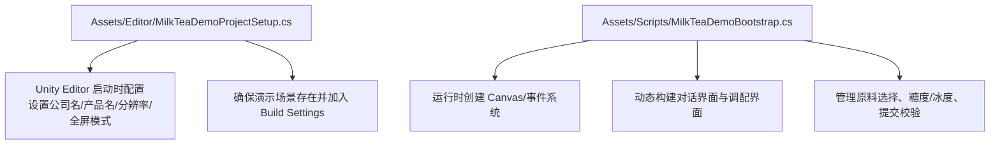
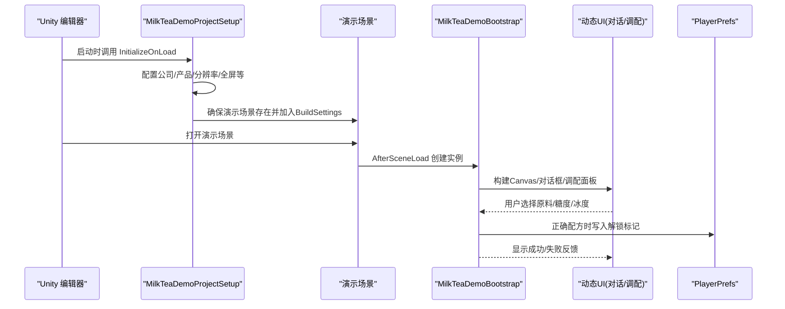
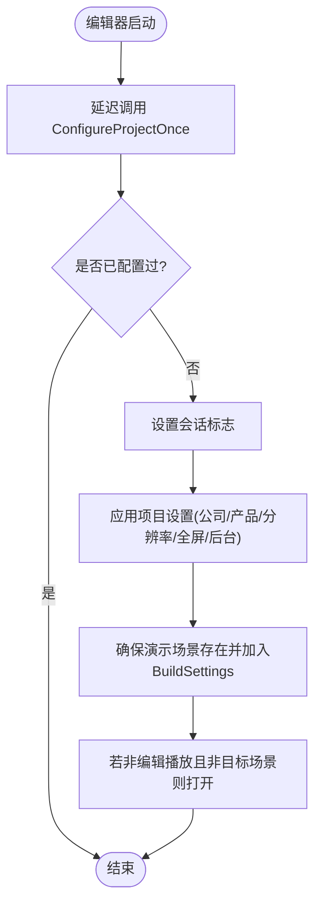
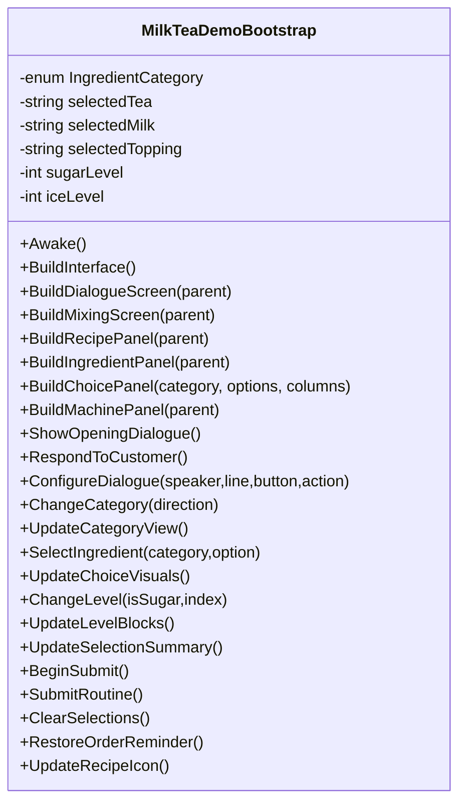
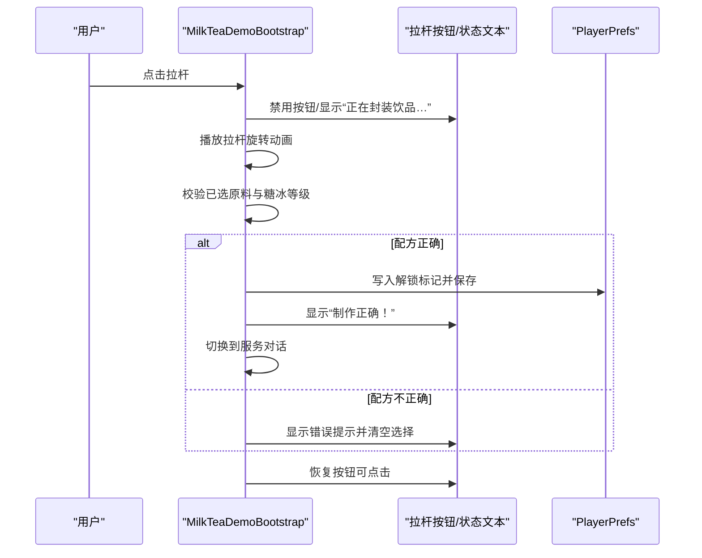
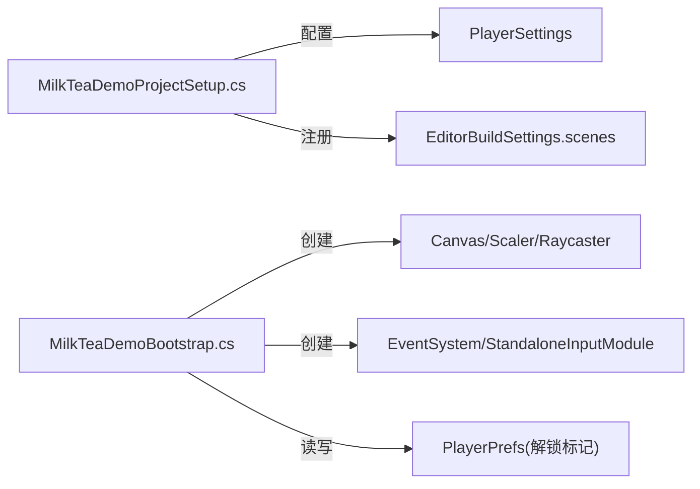

# 扩展开发指南

<cite>
**本文引用的文件**
- [MilkTeaDemoProjectSetup.cs](file://Assets/Editor/MilkTeaDemoProjectSetup.cs)
- [MilkTeaDemoBootstrap.cs](file://Assets/Scripts/MilkTeaDemoBootstrap.cs)
</cite>

## 目录
1. [简介](#简介)
2. [项目结构](#项目结构)
3. [核心组件](#核心组件)
4. [架构总览](#架构总览)
5. [详细组件分析](#详细组件分析)
6. [依赖关系分析](#依赖关系分析)
7. [性能与可维护性建议](#性能与可维护性建议)
8. [故障排查指南](#故障排查指南)
9. [结论](#结论)
10. [附录：扩展清单与示例路径](#附录：扩展清单与示例路径)

## 简介
本指南面向希望在现有奶茶店模拟经营 Demo 基础上进行功能扩展的开发者。你将学会如何添加新的奶茶配方、扩展原料选项、自定义 UI 样式，并理解代码结构与扩展点（枚举、配置参数、UI 组件）的位置与用法。文档同时提供最佳实践、命名规范、组织原则以及测试与调试方法，帮助你安全、高效地迭代功能。

## 项目结构
当前仓库包含编辑器初始化脚本与运行时引导脚本，负责演示场景准备与运行时 UI 构建。

**图表来源**
- [MilkTeaDemoProjectSetup.cs:8-68](file://Assets/Editor/MilkTeaDemoProjectSetup.cs#L8-L68)
- [MilkTeaDemoBootstrap.cs:62-114](file://Assets/Scripts/MilkTeaDemoBootstrap.cs#L62-L114)

**章节来源**
- [MilkTeaDemoProjectSetup.cs:8-68](file://Assets/Editor/MilkTeaDemoProjectSetup.cs#L8-L68)
- [MilkTeaDemoBootstrap.cs:62-114](file://Assets/Scripts/MilkTeaDemoBootstrap.cs#L62-L114)

## 核心组件
- 编辑器初始化器：在 Unity 编辑器启动后自动配置项目基础设置，并确保演示场景可用。
- 运行时引导器：在场景加载后创建 UI 根节点、事件系统、对话框与调配面板，处理用户交互与配方校验。

关键职责划分：
- 编辑器侧：一次性项目配置、菜单打开演示场景、保证场景文件存在。
- 运行侧：UI 构建、状态管理（已选茶底/奶底/配料、糖度/冰度）、配方提交与结果反馈、解锁记录持久化。

**章节来源**
- [MilkTeaDemoProjectSetup.cs:8-68](file://Assets/Editor/MilkTeaDemoProjectSetup.cs#L8-L68)
- [MilkTeaDemoBootstrap.cs:62-114](file://Assets/Scripts/MilkTeaDemoBootstrap.cs#L62-L114)

## 架构总览
下图展示了从编辑器到运行的整体流程，以及运行时 UI 与业务逻辑的交互关系。

**图表来源**
- [MilkTeaDemoProjectSetup.cs:8-68](file://Assets/Editor/MilkTeaDemoProjectSetup.cs#L8-L68)
- [MilkTeaDemoBootstrap.cs:62-114](file://Assets/Scripts/MilkTeaDemoBootstrap.cs#L62-L114)
- [MilkTeaDemoBootstrap.cs:465-514](file://Assets/Scripts/MilkTeaDemoBootstrap.cs#L465-L514)

## 详细组件分析

### 编辑器初始化器（MilkTeaDemoProjectSetup）
- 作用：在编辑器启动后延迟执行一次配置，设置公司名称、产品名称、默认分辨率、窗口化与后台运行；确保演示场景文件存在并注册到 Build Settings；提供菜单项快速打开演示场景。
- 扩展点：
  - 修改默认分辨率或全屏模式以适配不同目标平台。
  - 调整演示场景路径或名称以匹配你的工程布局。
  - 在 EnsureSceneExists 中增加场景模板或预设资源检查。

**图表来源**
- [MilkTeaDemoProjectSetup.cs:15-55](file://Assets/Editor/MilkTeaDemoProjectSetup.cs#L15-L55)

**章节来源**
- [MilkTeaDemoProjectSetup.cs:8-68](file://Assets/Editor/MilkTeaDemoProjectSetup.cs#L8-L68)

### 运行时引导器（MilkTeaDemoBootstrap）
- 作用：在场景加载后创建全局 UI 根节点与事件系统，动态构建对话界面与调配界面，管理用户选择与提交流程，并在正确配方时写入解锁标记。
- 关键数据结构与状态：
  - 原料分类枚举：用于切换与渲染不同类别的选项。
  - 已选状态：茶底、奶底、配料字符串；糖度与冰度整数等级。
  - 视图映射：按类别缓存选项按钮与图片引用，便于更新选中态。
- 关键流程：
  - 界面构建：创建 Canvas、缩放、背景、对话框、调配区、配方手册、原料选择区、机器面板。
  - 交互逻辑：切换类别、选择原料、调节糖度/冰度、提交封装动画与校验。
  - 结果处理：正确则解锁配方图标并进入服务对话；错误则提示重新调配。

**图表来源**
- [MilkTeaDemoBootstrap.cs:8-726](file://Assets/Scripts/MilkTeaDemoBootstrap.cs#L8-L726)

#### 配方提交序列图

**图表来源**
- [MilkTeaDemoBootstrap.cs:465-514](file://Assets/Scripts/MilkTeaDemoBootstrap.cs#L465-L514)

**章节来源**
- [MilkTeaDemoBootstrap.cs:62-114](file://Assets/Scripts/MilkTeaDemoBootstrap.cs#L62-L114)
- [MilkTeaDemoBootstrap.cs:194-312](file://Assets/Scripts/MilkTeaDemoBootstrap.cs#L194-L312)
- [MilkTeaDemoBootstrap.cs:314-359](file://Assets/Scripts/MilkTeaDemoBootstrap.cs#L314-L359)
- [MilkTeaDemoBootstrap.cs:361-463](file://Assets/Scripts/MilkTeaDemoBootstrap.cs#L361-L463)
- [MilkTeaDemoBootstrap.cs:465-514](file://Assets/Scripts/MilkTeaDemoBootstrap.cs#L465-L514)

## 依赖关系分析
- 编辑器脚本依赖 Unity Editor API 与场景管理，仅影响编辑器行为。
- 运行时脚本依赖 Unity UI 与事件系统，完全通过代码动态创建 UI，不依赖预制体。
- 数据持久化使用 PlayerPrefs 存储解锁状态，跨场景保持。

**图表来源**
- [MilkTeaDemoProjectSetup.cs:27-55](file://Assets/Editor/MilkTeaDemoProjectSetup.cs#L27-L55)
- [MilkTeaDemoBootstrap.cs:62-114](file://Assets/Scripts/MilkTeaDemoBootstrap.cs#L62-L114)
- [MilkTeaDemoBootstrap.cs:490-497](file://Assets/Scripts/MilkTeaDemoBootstrap.cs#L490-L497)

**章节来源**
- [MilkTeaDemoProjectSetup.cs:27-55](file://Assets/Editor/MilkTeaDemoProjectSetup.cs#L27-L55)
- [MilkTeaDemoBootstrap.cs:62-114](file://Assets/Scripts/MilkTeaDemoBootstrap.cs#L62-L114)
- [MilkTeaDemoBootstrap.cs:490-497](file://Assets/Scripts/MilkTeaDemoBootstrap.cs#L490-L497)

## 性能与可维护性建议
- 避免在每帧执行昂贵操作：当前实现将动画与状态更新集中在必要时机，符合良好实践。
- 集中配置：颜色、字体、尺寸等常量集中在类顶部或工具方法中，便于统一替换。
- 解耦 UI 与业务：当前通过方法拆分职责清晰，新增配方或选项时只需改动少量位置。
- 可扩展性：通过枚举与数组驱动 UI 生成，新增类别或选项无需重构主流程。

[本节为通用建议，不直接分析具体文件]

## 故障排查指南
- 中文显示异常：字体创建失败会回退到内置 Arial，建议在工程中引入中文字体资源并修改字体创建逻辑。
- 无法点击或无响应：确保事件系统已创建；若手动清理了场景中的 EventSystem，引导器会自动重建。
- 配方始终判定错误：检查提交校验逻辑与期望值是否一致；确认糖度/冰度等级与选项映射是否正确。
- 解锁状态未生效：确认 PlayerPrefs 键名未被覆盖；可在编辑器控制台打印或临时读取验证。

**章节来源**
- [MilkTeaDemoBootstrap.cs:697-718](file://Assets/Scripts/MilkTeaDemoBootstrap.cs#L697-L718)
- [MilkTeaDemoBootstrap.cs:490-514](file://Assets/Scripts/MilkTeaDemoBootstrap.cs#L490-L514)

## 结论
本项目采用“编辑器初始化 + 运行时引导”的双阶段设计，通过纯代码动态构建 UI，具备良好的可移植性与扩展性。基于现有结构，你可以轻松扩展配方、原料与 UI 主题，并通过枚举与数组驱动的方式最小化改动范围。遵循本文的扩展点说明与最佳实践，可显著提升迭代效率与代码质量。

[本节为总结性内容，不直接分析具体文件]

## 附录：扩展清单与示例路径

### 1) 添加新奶茶配方
- 目标：在不破坏现有流程的前提下，新增一个或多个配方，并支持解锁展示。
- 步骤要点：
  - 在提交校验处增加新配方的判定分支，或在外部维护配方表并在运行时合并。
  - 为每个配方定义唯一标识与解锁键，避免冲突。
  - 在配方手册区域增加翻页或列表展示逻辑。
- 参考路径：
  - 提交校验与解锁写入：[MilkTeaDemoBootstrap.cs:465-514](file://Assets/Scripts/MilkTeaDemoBootstrap.cs#L465-L514)
  - 配方图标更新：[MilkTeaDemoBootstrap.cs:543-549](file://Assets/Scripts/MilkTeaDemoBootstrap.cs#L543-L549)
  - 配方手册区域构建：[MilkTeaDemoBootstrap.cs:194-218](file://Assets/Scripts/MilkTeaDemoBootstrap.cs#L194-L218)

### 2) 扩展原料选项
- 目标：新增茶底、奶底或配料选项，或新增类别。
- 步骤要点：
  - 在对应类别的选项数组中添加新条目；如需新类别，扩展枚举并在构建时注册。
  - 确保选择逻辑与视觉高亮能识别新选项。
  - 更新摘要文本与订单提示，使其反映新选项。
- 参考路径：
  - 类别枚举与选择逻辑：[MilkTeaDemoBootstrap.cs:10-15](file://Assets/Scripts/MilkTeaDemoBootstrap.cs#L10-L15), [MilkTeaDemoBootstrap.cs:381-399](file://Assets/Scripts/MilkTeaDemoBootstrap.cs#L381-L399)
  - 选项构建与列数计算：[MilkTeaDemoBootstrap.cs:268-293](file://Assets/Scripts/MilkTeaDemoBootstrap.cs#L268-L293)
  - 摘要与提示更新：[MilkTeaDemoBootstrap.cs:457-463](file://Assets/Scripts/MilkTeaDemoBootstrap.cs#L457-L463), [MilkTeaDemoBootstrap.cs:531-535](file://Assets/Scripts/MilkTeaDemoBootstrap.cs#L531-L535)

### 3) 自定义 UI 样式
- 目标：更换主题色、字体、控件外观或布局比例。
- 步骤要点：
  - 修改颜色常量与字体创建逻辑，必要时引入资源字体。
  - 调整 Canvas 缩放策略与参考分辨率以适配多分辨率。
  - 复用 CreateButton/CreateText 等工具方法保持一致风格。
- 参考路径：
  - 颜色与字体：[MilkTeaDemoBootstrap.cs:19-30](file://Assets/Scripts/MilkTeaDemoBootstrap.cs#L19-L30), [MilkTeaDemoBootstrap.cs:697-708](file://Assets/Scripts/MilkTeaDemoBootstrap.cs#L697-L708)
  - Canvas 与缩放：[MilkTeaDemoBootstrap.cs:83-106](file://Assets/Scripts/MilkTeaDemoBootstrap.cs#L83-L106)
  - 按钮与文本工具：[MilkTeaDemoBootstrap.cs:631-670](file://Assets/Scripts/MilkTeaDemoBootstrap.cs#L631-L670)

### 4) 枚举扩展与配置参数
- 枚举扩展：当需要新增原料大类（如糖浆、小料、装饰）时，扩展枚举并在构建与切换逻辑中注册。
- 配置参数：可将硬编码的文案、阈值、动画时长等抽取为可配置字段，便于策划或本地化调整。
- 参考路径：
  - 枚举定义与切换：[MilkTeaDemoBootstrap.cs:10-15](file://Assets/Scripts/MilkTeaDemoBootstrap.cs#L10-L15), [MilkTeaDemoBootstrap.cs:361-379](file://Assets/Scripts/MilkTeaDemoBootstrap.cs#L361-L379)

### 5) 测试与调试
- 单元测试思路：
  - 针对 NextLevel、SugarName、IceName 等纯函数编写用例，覆盖边界输入。
  - 对 SelectIngredient 与 UpdateSelectionSummary 的组合行为进行断言。
- 集成测试思路：
  - 在编辑器中运行完整流程，验证不同组合下的提交结果与解锁状态。
  - 使用 PlayerPrefs 查看解锁标记是否按预期写入与读取。
- 调试技巧：
  - 在提交前后打印当前选择与等级，定位问题。
  - 若 UI 无响应，检查事件系统是否存在与按钮监听是否绑定。
- 参考路径：
  - 等级切换与名称映射：[MilkTeaDemoBootstrap.cs:429-442](file://Assets/Scripts/MilkTeaDemoBootstrap.cs#L429-L442), [MilkTeaDemoBootstrap.cs:586-594](file://Assets/Scripts/MilkTeaDemoBootstrap.cs#L586-L594)
  - 事件系统保障：[MilkTeaDemoBootstrap.cs:710-718](file://Assets/Scripts/MilkTeaDemoBootstrap.cs#L710-L718)

### 6) 最佳实践与命名规范
- 命名规范：
  - 变量与方法使用驼峰命名；私有成员以下划线前缀区分（可选）。
  - 枚举值使用语义化名词，避免缩写。
- 代码组织：
  - 将 UI 构建、交互、状态管理分方法拆分，保持单一职责。
  - 将易变配置集中放置，便于统一修改。
- 扩展原则：
  - 优先通过数据驱动（数组/字典）扩展内容，而非复制粘贴逻辑。
  - 新增功能尽量向后兼容，避免破坏已有流程。

[本节为通用指导，不直接分析具体文件]