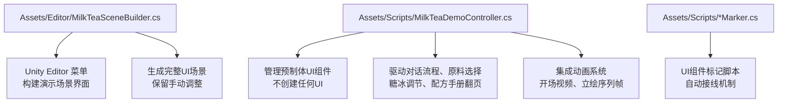
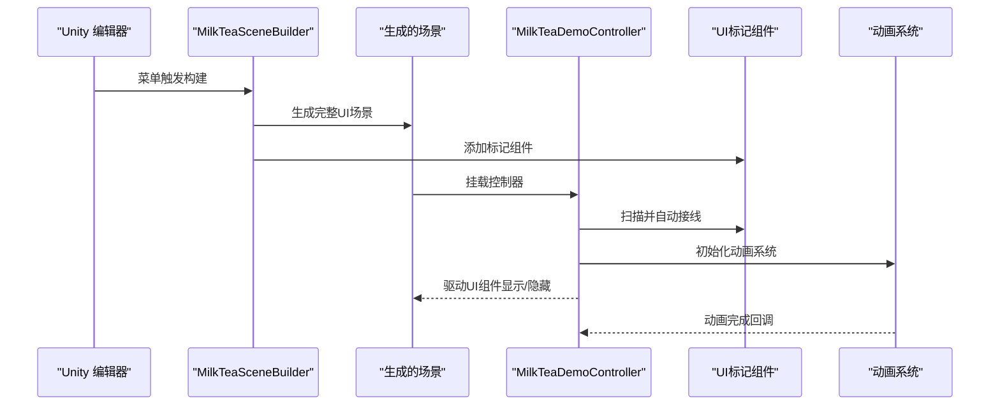
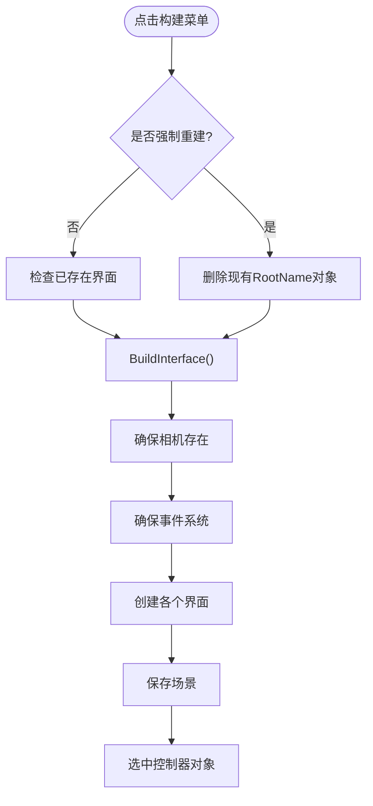
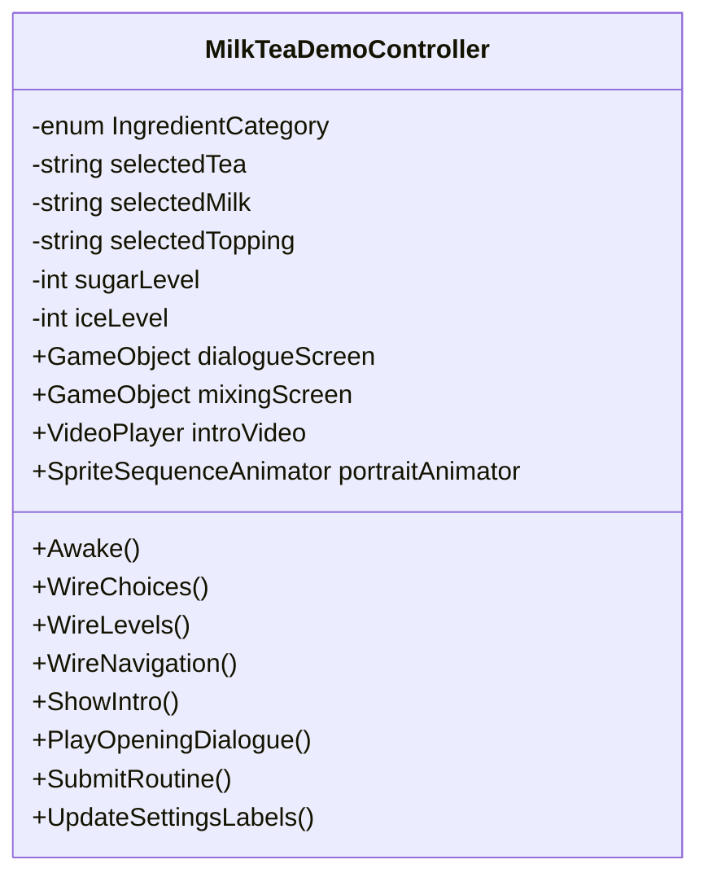
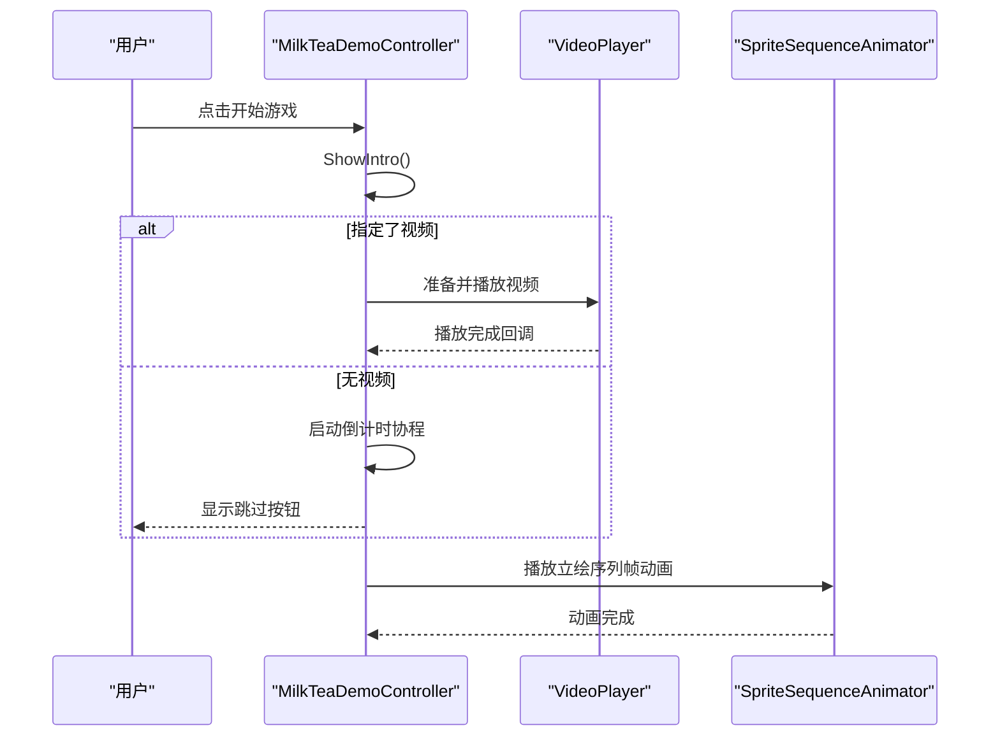
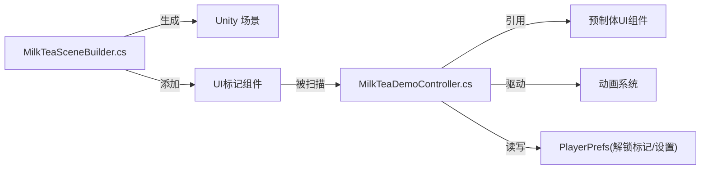

# 扩展开发指南

<cite>
**本文引用的文件**
- [MilkTeaDemoController.cs](file://Assets/Scripts/MilkTeaDemoController.cs)
- [MilkTeaSceneBuilder.cs](file://Assets/Editor/MilkTeaSceneBuilder.cs)
- [MilkTeaChoiceButton.cs](file://Assets/Scripts/MilkTeaChoiceButton.cs)
- [MilkTeaCategoryPanel.cs](file://Assets/Scripts/MilkTeaCategoryPanel.cs)
- [MilkTeaLevelBlock.cs](file://Assets/Scripts/MilkTeaLevelBlock.cs)
- [MilkTeaCustomer.cs](file://Assets/Scripts/MilkTeaCustomer.cs)
- [MilkTeaDialogue.cs](file://Assets/Scripts/MilkTeaDialogue.cs)
- [MilkTeaArtLibrary.cs](file://Assets/Scripts/MilkTeaArtLibrary.cs)
</cite>

## 更新摘要
**变更内容**
- MilkTeaDemoController.cs 重构为预制体/场景驱动架构，增强动画系统集成和UI组件管理
- MilkTeaSceneBuilder.cs 升级场景构建逻辑，支持更多界面元素和配置选项
- 新增开场动画系统（视频播放、倒计时）、立绘序列帧动画支持
- 增强设置面板功能（音量、分辨率、语言切换）
- 改进UI组件标记系统和自动接线机制

## 目录
1. [简介](#简介)
2. [项目结构](#项目结构)
3. [核心组件](#核心组件)
4. [架构总览](#架构总览)
5. [详细组件分析](#详细组件分析)
6. [依赖关系分析](#依赖关系分析)
7. [性能与可维护性建议](#性能与可维护性建议)
8. [故障排查指南](#故障排查指南)
9. [结论](#结论)
10. [附录：扩展清单与示例路径](#附录：扩展清单与示例路径)

## 简介
本指南面向希望在现有奶茶店模拟经营 Demo 基础上进行功能扩展的开发者。你将学会如何添加新的奶茶配方、扩展原料选项、自定义 UI 样式，并理解代码结构与扩展点（枚举、配置参数、UI 组件）的位置与用法。文档同时提供最佳实践、命名规范、组织原则以及测试与调试方法，帮助你安全、高效地迭代功能。

**重要更新**：项目已从纯代码动态构建UI升级为预制体/场景驱动架构，支持更丰富的动画效果和UI组件管理。

## 项目结构
当前仓库采用"编辑器构建 + 运行时控制"的双层架构，编辑器负责生成场景UI，运行时控制器管理业务逻辑和动画效果。

```mermaid
graph TB
A["Assets/Editor/MilkTeaSceneBuilder.cs"] --> B["Unity Editor 菜单<br/>构建演示场景界面"]
A --> C["生成完整UI场景<br/>保留手动调整"]
D["Assets/Scripts/MilkTeaDemoController.cs"] --> E["管理预制体UI组件<br/>不创建任何UI"]
D --> F["驱动对话流程、原料选择<br/>糖冰调节、配方手册翻页"]
D --> G["集成动画系统<br/>开场视频、立绘序列帧"]
H["Assets/Scripts/*Marker.cs"] --> I["UI组件标记脚本<br/>自动接线机制"]
```

**图表来源**
- [MilkTeaSceneBuilder.cs:40-72](file://Assets/Editor/MilkTeaSceneBuilder.cs#L40-L72)
- [MilkTeaDemoController.cs:19-24](file://Assets/Scripts/MilkTeaDemoController.cs#L19-L24)
- [MilkTeaChoiceButton.cs:3-11](file://Assets/Scripts/MilkTeaChoiceButton.cs#L3-L11)

**章节来源**
- [MilkTeaSceneBuilder.cs:40-72](file://Assets/Editor/MilkTeaSceneBuilder.cs#L40-L72)
- [MilkTeaDemoController.cs:19-24](file://Assets/Scripts/MilkTeaDemoController.cs#L19-L24)

## 核心组件
- **场景构建器**：在Unity编辑器中一键生成完整的UI场景，支持增量构建和手动调整保留。
- **运行控制器**：管理所有业务逻辑，通过引用驱动场景中已有的UI组件，不再动态创建UI。
- **标记脚本**：轻量级组件，用于标识UI元素的用途，供控制器自动接线。
- **数据资产**：ScriptableObject定义配方、客人、对话等游戏数据。

关键职责划分：
- 编辑器侧：一次性场景构建、UI布局设计、资源绑定。
- 运行侧：状态管理、动画控制、用户交互处理、数据持久化。

**章节来源**
- [MilkTeaSceneBuilder.cs:11-18](file://Assets/Editor/MilkTeaSceneBuilder.cs#L11-L18)
- [MilkTeaDemoController.cs:19-24](file://Assets/Scripts/MilkTeaDemoController.cs#L19-L24)

## 架构总览
下图展示了从编辑器到运行的整体流程，以及新的动画系统集成和UI组件管理机制。

```mermaid
sequenceDiagram
participant Editor as "Unity 编辑器"
participant Builder as "MilkTeaSceneBuilder"
participant Scene as "生成的场景"
participant Controller as "MilkTeaDemoController"
participant Markers as "UI标记组件"
participant Animation as "动画系统"
Editor->>Builder : 菜单触发构建
Builder->>Scene : 生成完整UI场景
Builder->>Markers : 添加标记组件
Scene->>Controller : 挂载控制器
Controller->>Markers : 扫描并自动接线
Controller->>Animation : 初始化动画系统
Controller-->>Scene : 驱动UI组件显示/隐藏
Animation-->>Controller : 动画完成回调
```

**图表来源**
- [MilkTeaSceneBuilder.cs:52-72](file://Assets/Editor/MilkTeaSceneBuilder.cs#L52-L72)
- [MilkTeaDemoController.cs:199-209](file://Assets/Scripts/MilkTeaDemoController.cs#L199-L209)
- [MilkTeaDemoController.cs:229-256](file://Assets/Scripts/MilkTeaDemoController.cs#L229-L256)

## 详细组件分析

### 场景构建器（MilkTeaSceneBuilder）
- **作用**：在Unity编辑器中一键生成完整的UI场景，支持增量构建和强制重建模式。
- **核心特性**：
  - 智能检测已存在界面，仅创建缺失部分
  - 支持保留手动调整的UI布局
  - 自动生成Canvas、事件系统、相机等基础组件
  - 支持多种界面类型（对话、调配、结算、休息、开始、开场动画、设置）

```mermaid
flowchart TD
Start(["点击构建菜单"]) --> Check{"是否强制重建?"}
Check --> |否| Preserve["检查已存在界面"]
Check --> |是| Remove["删除现有RootName对象"]
Preserve --> Build["BuildInterface()"]
Remove --> Build
Build --> EnsureCamera["确保相机存在"]
EnsureCamera --> EnsureEventSystem["确保事件系统"]
EnsureEventSystem --> CreateScreens["创建各个界面"]
CreateScreens --> Save["保存场景"]
Save --> Select["选中控制器对象"]
```

**图表来源**
- [MilkTeaSceneBuilder.cs:52-72](file://Assets/Editor/MilkTeaSceneBuilder.cs#L52-L72)

**章节来源**
- [MilkTeaSceneBuilder.cs:40-72](file://Assets/Editor/MilkTeaSceneBuilder.cs#L40-L72)
- [MilkTeaSceneBuilder.cs:104-230](file://Assets/Editor/MilkTeaSceneBuilder.cs#L104-L230)

### 运行控制器（MilkTeaDemoController）
- **作用**：管理所有业务逻辑，通过引用驱动场景中已有的UI组件，集成动画系统。
- **关键数据结构与状态**：
  - 原料分类枚举：用于切换与渲染不同类别的选项。
  - 已选状态：茶底、奶底、配料字符串；糖度与冰度整数等级。
  - 视图映射：按类别缓存选项按钮与图片引用，便于更新选中态。
  - 动画系统：开场视频播放器、立绘序列帧动画管理器。
  - 设置系统：音量、分辨率、语言配置。

```mermaid
classDiagram
class MilkTeaDemoController {
-enum IngredientCategory
-string selectedTea
-string selectedMilk
-string selectedTopping
-int sugarLevel
-int iceLevel
+GameObject dialogueScreen
+GameObject mixingScreen
+VideoPlayer introVideo
+SpriteSequenceAnimator portraitAnimator
+Awake()
+WireChoices()
+WireLevels()
+WireNavigation()
+ShowIntro()
+PlayOpeningDialogue()
+SubmitRoutine()
+UpdateSettingsLabels()
}
```

**图表来源**
- [MilkTeaDemoController.cs:25-196](file://Assets/Scripts/MilkTeaDemoController.cs#L25-L196)

#### 动画系统集成
新增的动画系统支持两种主要类型：

1. **开场动画**：支持视频播放或倒计时占位
2. **立绘序列帧动画**：当客人有≥2帧时循环播放动画

```mermaid
sequenceDiagram
participant U as "用户"
participant C as "MilkTeaDemoController"
participant V as "VideoPlayer"
participant A as "SpriteSequenceAnimator"
U->>C : 点击开始游戏
C->>C : ShowIntro()
alt 指定了视频
C->>V : 准备并播放视频
V-->>C : 播放完成回调
else 无视频
C->>C : 启动倒计时协程
C-->>U : 显示跳过按钮
end
C->>A : 播放立绘序列帧动画
A-->>C : 动画完成
```

**图表来源**
- [MilkTeaDemoController.cs:777-888](file://Assets/Scripts/MilkTeaDemoController.cs#L777-L888)
- [MilkTeaDemoController.cs:1223-1269](file://Assets/Scripts/MilkTeaDemoController.cs#L1223-L1269)

**章节来源**
- [MilkTeaDemoController.cs:199-209](file://Assets/Scripts/MilkTeaDemoController.cs#L199-L209)
- [MilkTeaDemoController.cs:229-390](file://Assets/Scripts/MilkTeaDemoController.cs#L229-L390)
- [MilkTeaDemoController.cs:777-888](file://Assets/Scripts/MilkTeaDemoController.cs#L777-L888)

## 依赖关系分析
- 编辑器脚本依赖 Unity Editor API 与场景管理，仅影响编辑器行为。
- 运行时脚本依赖 Unity UI 与事件系统，完全通过引用管理预制体UI，不动态创建UI。
- 动画系统依赖 VideoPlayer 和自定义 SpriteSequenceAnimator。
- 数据持久化使用 PlayerPrefs 存储解锁状态和设置信息。

```mermaid
graph LR
Builder["MilkTeaSceneBuilder.cs"] --> |生成| Scene["Unity 场景"]
Builder --> |添加| Markers["UI标记组件"]
Controller["MilkTeaDemoController.cs"] --> |引用| UIComponents["预制体UI组件"]
Controller --> |驱动| Animation["动画系统"]
Controller --> |读写| PlayerPrefs["PlayerPrefs(解锁标记/设置)"]
Markers --> |被扫描| Controller
```

**图表来源**
- [MilkTeaSceneBuilder.cs:52-72](file://Assets/Editor/MilkTeaSceneBuilder.cs#L52-L72)
- [MilkTeaDemoController.cs:199-209](file://Assets/Scripts/MilkTeaDemoController.cs#L199-L209)
- [MilkTeaDemoController.cs:229-256](file://Assets/Scripts/MilkTeaDemoController.cs#L229-L256)

**章节来源**
- [MilkTeaSceneBuilder.cs:52-72](file://Assets/Editor/MilkTeaSceneBuilder.cs#L52-L72)
- [MilkTeaDemoController.cs:199-209](file://Assets/Scripts/MilkTeaDemoController.cs#L199-L209)

## 性能与可维护性建议
- **避免动态UI创建**：新项目应优先使用预制体和场景构建方式，减少运行时开销。
- **利用标记组件**：通过轻量级标记脚本实现自动接线，降低硬编码依赖。
- **集中动画管理**：将动画逻辑集中在控制器中，便于统一管理和调试。
- **配置驱动**：将易变配置（颜色、字体、尺寸）集中在美术库资产中，便于策划调整。
- **增量构建**：利用场景构建器的增量构建特性，保护手动调整的UI布局。

## 故障排查指南
- **中文显示异常**：字体创建失败会回退到内置 Arial，建议在美术库中引入中文字体资源。
- **UI无响应**：确保场景中有 EventSystem；检查标记组件是否正确添加到UI元素上。
- **动画不播放**：检查 VideoPlayer 是否正确配置；确认 SpriteSequenceAnimator 已正确挂载。
- **配方始终判定错误**：检查提交校验逻辑与期望值是否一致；确认糖度/冰度等级与选项映射是否正确。
- **解锁状态未生效**：确认 PlayerPrefs 键名未被覆盖；可在编辑器控制台打印或临时读取验证。

**章节来源**
- [MilkTeaDemoController.cs:1341-1352](file://Assets/Scripts/MilkTeaDemoController.cs#L1341-L1352)
- [MilkTeaDemoController.cs:1107-1165](file://Assets/Scripts/MilkTeaDemoController.cs#L1107-L1165)

## 结论
本项目采用"编辑器构建 + 运行时控制"的现代架构，通过预制体和标记组件实现了更好的可维护性和扩展性。新增的动画系统集成和增强的UI组件管理机制，使得开发者可以专注于业务逻辑而无需关心底层UI创建细节。基于现有结构，你可以轻松扩展配方、原料与 UI 主题，并通过数据驱动的方式最小化改动范围。

## 附录：扩展清单与示例路径

### 1) 添加新奶茶配方
- **目标**：在不破坏现有流程的前提下，新增一个或多个配方，并支持解锁展示。
- **步骤要点**：
  - 在美术库资产的 recipes 列表中添加新配方条目。
  - 为新配方定义唯一标识与解锁键，避免冲突。
  - 在配方手册区域会自动显示新配方的翻页逻辑。
- **参考路径**：
  - 配方构建逻辑：[MilkTeaDemoController.cs:392-453](file://Assets/Scripts/MilkTeaDemoController.cs#L392-L453)
  - 配方图标更新：[MilkTeaDemoController.cs:1196-1221](file://Assets/Scripts/MilkTeaDemoController.cs#L1196-L1221)
  - 美术库资产结构：[MilkTeaArtLibrary.cs:66-75](file://Assets/Scripts/MilkTeaArtLibrary.cs#L66-L75)

### 2) 扩展原料选项
- **目标**：新增茶底、奶底或配料选项，或新增类别。
- **步骤要点**：
  - 在场景构建器的 BuildIngredientPanel 方法中添加新选项。
  - 如需新类别，扩展 IngredientCategory 枚举并在相关逻辑中注册。
  - 确保选择逻辑与视觉高亮能识别新选项。
- **参考路径**：
  - 类别枚举定义：[MilkTeaDemoController.cs:11-16](file://Assets/Scripts/MilkTeaDemoController.cs#L11-L16)
  - 选项构建逻辑：[MilkTeaSceneBuilder.cs:584-621](file://Assets/Editor/MilkTeaSceneBuilder.cs#L584-L621)
  - 选择处理逻辑：[MilkTeaDemoController.cs:1006-1024](file://Assets/Scripts/MilkTeaDemoController.cs#L1006-L1024)

### 3) 自定义 UI 样式
- **目标**：更换主题色、字体、控件外观或布局比例。
- **步骤要点**：
  - 修改美术库资产中的颜色常量和字体资源。
  - 调整 Canvas 缩放策略与参考分辨率以适配多分辨率。
  - 使用九宫格 Sprite 作为按钮皮肤以获得更好的视觉效果。
- **参考路径**：
  - 颜色常量定义：[MilkTeaSceneBuilder.cs:25-34](file://Assets/Editor/MilkTeaSceneBuilder.cs#L25-L34)
  - 字体应用逻辑：[MilkTeaDemoController.cs:211-227](file://Assets/Scripts/MilkTeaDemoController.cs#L211-L227)
  - 按钮皮肤系统：[MilkTeaSceneBuilder.cs:749-822](file://Assets/Editor/MilkTeaSceneBuilder.cs#L749-L822)

### 4) 集成动画系统
- **目标**：为游戏添加开场动画、角色动画或其他视觉效果。
- **步骤要点**：
  - 在开场动画屏幕中配置 VideoPlayer 组件。
  - 为角色立绘添加 SpriteSequenceAnimator 组件。
  - 在控制器中配置动画播放逻辑。
- **参考路径**：
  - 开场动画系统：[MilkTeaDemoController.cs:777-888](file://Assets/Scripts/MilkTeaDemoController.cs#L777-L888)
  - 立绘动画系统：[MilkTeaDemoController.cs:1223-1269](file://Assets/Scripts/MilkTeaDemoController.cs#L1223-L1269)
  - 动画屏幕构建：[MilkTeaSceneBuilder.cs:487-513](file://Assets/Editor/MilkTeaSceneBuilder.cs#L487-L513)

### 5) 扩展设置功能
- **目标**：添加新的游戏设置选项，如音效开关、画质设置等。
- **步骤要点**：
  - 在设置面板中添加新的UI元素。
  - 在控制器中添加相应的设置变量和处理逻辑。
  - 实现设置的持久化存储。
- **参考路径**：
  - 设置面板构建：[MilkTeaSceneBuilder.cs:515-551](file://Assets/Editor/MilkTeaSceneBuilder.cs#L515-L551)
  - 设置管理逻辑：[MilkTeaDemoController.cs:890-971](file://Assets/Scripts/MilkTeaDemoController.cs#L890-L971)

### 6) 使用标记组件扩展UI
- **目标**：通过标记组件机制扩展新的UI交互功能。
- **步骤要点**：
  - 创建新的标记脚本类，继承自 MonoBehaviour。
  - 在场景构建器中为UI元素添加标记组件。
  - 在控制器中扫描并处理标记组件。
- **参考路径**：
  - 标记组件示例：[MilkTeaChoiceButton.cs:3-11](file://Assets/Scripts/MilkTeaChoiceButton.cs#L3-L11)
  - 标记组件扫描：[MilkTeaDemoController.cs:229-256](file://Assets/Scripts/MilkTeaDemoController.cs#L229-L256)

### 7) 测试与调试
- **单元测试思路**：
  - 针对 NextLevel、SugarName、IceName 等纯函数编写用例，覆盖边界输入。
  - 对 SelectIngredient 与 UpdateSelectionSummary 的组合行为进行断言。
- **集成测试思路**：
  - 在编辑器中运行完整流程，验证不同组合下的提交结果与解锁状态。
  - 使用 PlayerPrefs 查看解锁标记是否按预期写入与读取。
- **调试技巧**：
  - 在提交前后打印当前选择与等级，定位问题。
  - 若 UI 无响应，检查事件系统是否存在与按钮监听是否绑定。
- **参考路径**：
  - 等级切换与名称映射：[MilkTeaDemoController.cs:1057-1070](file://Assets/Scripts/MilkTeaDemoController.cs#L1057-L1070), [MilkTeaDemoController.cs:1317-1325](file://Assets/Scripts/MilkTeaDemoController.cs#L1317-L1325)
  - 事件系统保障：[MilkTeaSceneBuilder.cs:878-886](file://Assets/Editor/MilkTeaSceneBuilder.cs#L878-L886)

### 8) 最佳实践与命名规范
- **命名规范**：
  - 变量与方法使用驼峰命名；私有成员以下划线前缀区分。
  - 枚举值使用语义化名词，避免缩写。
  - 标记组件类名以功能描述命名，如 MilkTeaChoiceButton。
- **代码组织**：
  - 将 UI 构建、交互、状态管理分方法拆分，保持单一职责。
  - 将易变配置集中放置，便于统一修改。
  - 使用 ScriptableObject 管理游戏数据，便于策划编辑。
- **扩展原则**：
  - 优先通过数据驱动（数组/字典）扩展内容，而非复制粘贴逻辑。
  - 新增功能尽量向后兼容，避免破坏已有流程。
  - 使用标记组件机制解耦UI和业务逻辑。