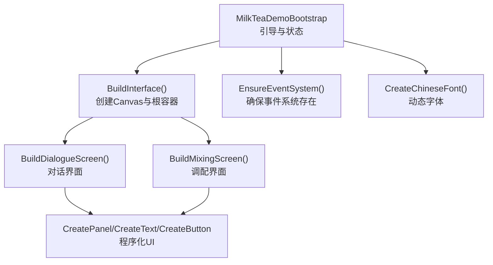
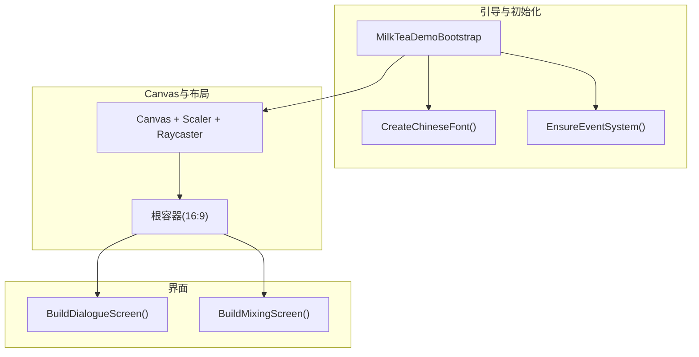
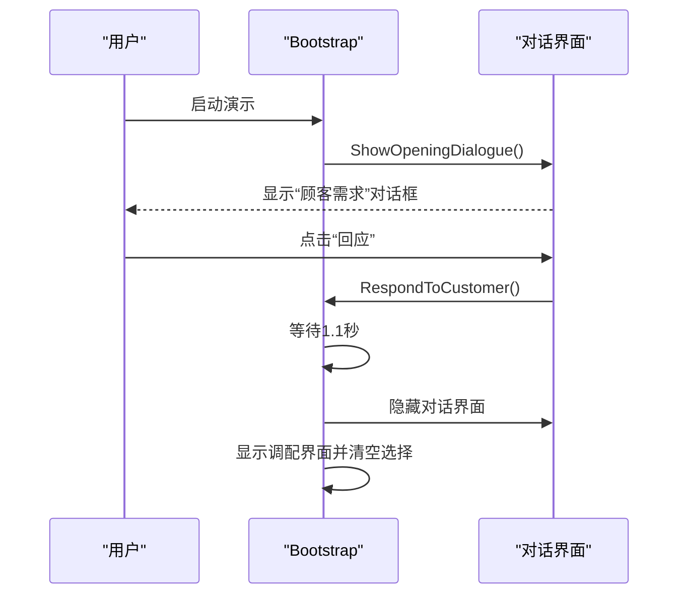
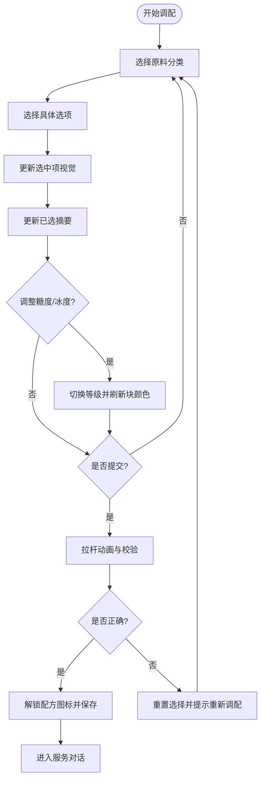
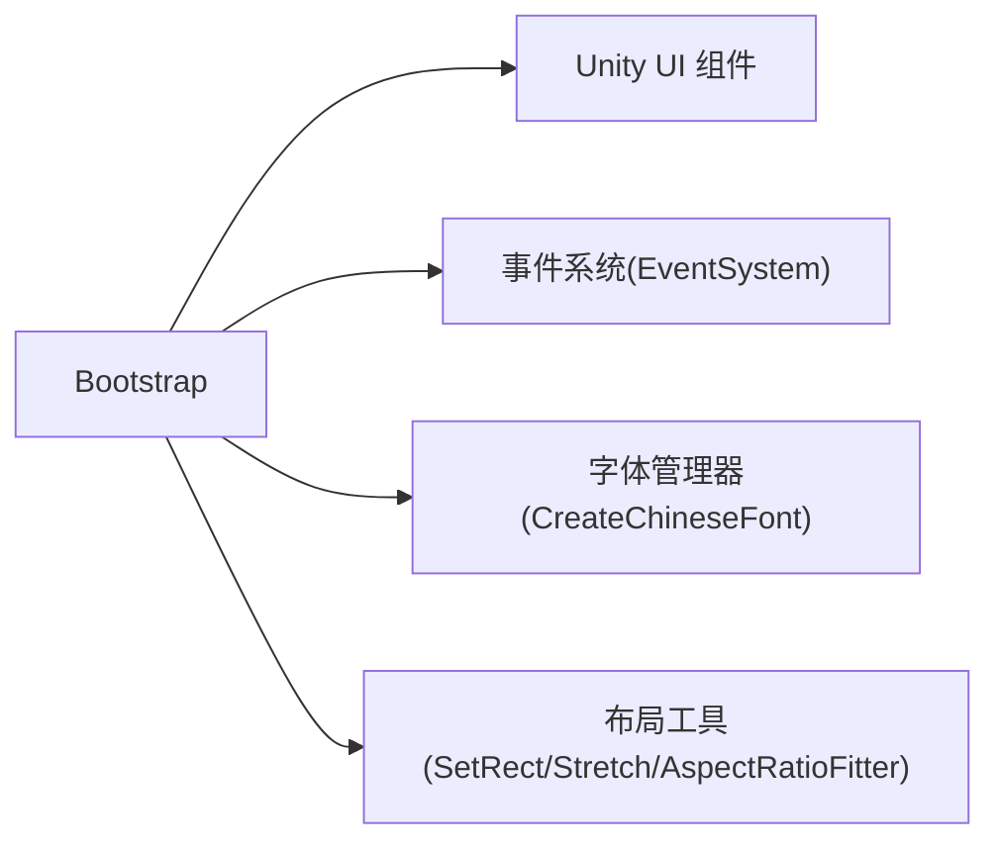

# UI系统架构

<cite>
**本文引用的文件**
- [MilkTeaDemoBootstrap.cs](file://Assets/Scripts/MilkTeaDemoBootstrap.cs)
</cite>

## 目录
1. [简介](#简介)
2. [项目结构](#项目结构)
3. [核心组件](#核心组件)
4. [架构总览](#架构总览)
5. [详细组件分析](#详细组件分析)
6. [依赖关系分析](#依赖关系分析)
7. [性能考量](#性能考量)
8. [故障排查指南](#故障排查指南)
9. [结论](#结论)
10. [附录：扩展新UI组件类型示例](#附录：扩展新ui组件类型示例)

## 简介
本技术文档围绕奶茶店模拟经营的UI系统，系统性解析其动态UI构建机制。该系统在运行时通过代码创建Canvas、面板、文本与按钮等UI元素，实现对话界面与调配界面的切换与交互；同时提供响应式布局适配、事件系统保障、字体处理与生命周期管理。重点说明以下方法的作用与协作：
- BuildInterface()：创建主界面结构与Canvas缩放配置
- BuildDialogueScreen()：构建对话界面（标题、人物立绘占位、店铺小场景、对话框）
- BuildMixingScreen()：构建调配界面（后厨场景、订单提示、配方手册、原料选择区、机器操作区）
- CreatePanel()/CreateText()/CreateButton()：程序化创建UI元素的辅助方法
- 事件系统、字体处理、生命周期管理等支撑能力

## 项目结构
该UI系统由单个脚本集中实现，采用“单例引导+运行时构建”的方式：
- 入口引导：启动时自动创建宿主GameObject并挂载引导脚本
- 运行时初始化：Awake中完成字体创建、事件系统检查、界面构建与开场对话
- 界面构建：BuildInterface()负责Canvas与根容器设置，随后分别构建对话与调配两个全屏面板
- 子模块构建：BuildDialogueScreen()与BuildMixingScreen()各自组织内部UI层次与交互

图表来源
- [MilkTeaDemoBootstrap.cs:62-81](file://Assets/Scripts/MilkTeaDemoBootstrap.cs#L62-L81)
- [MilkTeaDemoBootstrap.cs:83-114](file://Assets/Scripts/MilkTeaDemoBootstrap.cs#L83-L114)
- [MilkTeaDemoBootstrap.cs:116-156](file://Assets/Scripts/MilkTeaDemoBootstrap.cs#L116-L156)
- [MilkTeaDemoBootstrap.cs:158-192](file://Assets/Scripts/MilkTeaDemoBootstrap.cs#L158-L192)
- [MilkTeaDemoBootstrap.cs:697-718](file://Assets/Scripts/MilkTeaDemoBootstrap.cs#L697-L718)

章节来源
- [MilkTeaDemoBootstrap.cs:62-81](file://Assets/Scripts/MilkTeaDemoBootstrap.cs#L62-L81)
- [MilkTeaDemoBootstrap.cs:83-114](file://Assets/Scripts/MilkTeaDemoBootstrap.cs#L83-L114)

## 核心组件
- Canvas与缩放管理
  - 运行时创建Canvas、CanvasScaler、GraphicRaycaster，设置渲染模式为屏幕覆盖层，排序层级提升，避免被其他UI遮挡
  - 使用ScaleWithScreenSize模式，参考分辨率1920x1080，按宽度或高度匹配，保证在不同分辨率下比例一致
  - 根内容容器使用宽高比约束器保持16:9显示，适配不同屏幕尺寸
- 程序化UI元素创建
  - CreatePanel()：创建带RectTransform与Image的面板，设置父节点与颜色
  - CreateText()：创建Text，绑定统一字体、字号、颜色、对齐方式、换行策略
  - CreateButton()：创建Button，配置颜色状态（正常、高亮、按下、禁用），附加点击监听，并在中心添加Label
- 响应式布局适配
  - SetRect()：以锚点左下角为基准设置位置与尺寸，便于绝对定位
  - Stretch()：将RectTransform拉伸至父容器四边，用于背景与全屏面板
  - AspectRatioFitter：强制根容器保持16:9，配合Canvas缩放实现自适应
- 事件系统与字体处理
  - EnsureEventSystem()：若场景中不存在EventSystem与StandaloneInputModule则自动创建，确保UI交互可用
  - CreateChineseFont()：尝试从系统字体创建中文支持字体，失败回退到内置Arial，保证文本可读性

章节来源
- [MilkTeaDemoBootstrap.cs:83-114](file://Assets/Scripts/MilkTeaDemoBootstrap.cs#L83-L114)
- [MilkTeaDemoBootstrap.cs:616-670](file://Assets/Scripts/MilkTeaDemoBootstrap.cs#L616-L670)
- [MilkTeaDemoBootstrap.cs:679-695](file://Assets/Scripts/MilkTeaDemoBootstrap.cs#L679-L695)
- [MilkTeaDemoBootstrap.cs:697-718](file://Assets/Scripts/MilkTeaDemoBootstrap.cs#L697-L718)

## 架构总览
下图展示了UI系统的整体架构与数据流：引导脚本负责初始化与构建，Canvas作为根容器承载对话与调配两个全屏面板；用户交互通过按钮触发状态更新与界面切换。

图表来源
- [MilkTeaDemoBootstrap.cs:62-81](file://Assets/Scripts/MilkTeaDemoBootstrap.cs#L62-L81)
- [MilkTeaDemoBootstrap.cs:83-114](file://Assets/Scripts/MilkTeaDemoBootstrap.cs#L83-L114)
- [MilkTeaDemoBootstrap.cs:116-156](file://Assets/Scripts/MilkTeaDemoBootstrap.cs#L116-L156)
- [MilkTeaDemoBootstrap.cs:158-192](file://Assets/Scripts/MilkTeaDemoBootstrap.cs#L158-L192)

## 详细组件分析

### BuildInterface()：主界面结构创建
- 职责
  - 创建Canvas对象并挂载必要组件（Canvas、CanvasScaler、GraphicRaycaster）
  - 设置渲染模式与排序层级，确保UI在最上层显示
  - 配置CanvasScaler的缩放模式与参考分辨率，启用宽高匹配策略
  - 创建背景与根内容容器，应用拉伸与宽高比约束
  - 创建并构建对话与调配两个全屏面板
- 关键点
  - 使用Stretch()使背景与根容器铺满Canvas
  - 使用AspectRatioFitter固定16:9内容区域，避免内容变形
  - 通过CreatePanel()创建面板，并通过BuildDialogueScreen()/BuildMixingScreen()填充内容

章节来源
- [MilkTeaDemoBootstrap.cs:83-114](file://Assets/Scripts/MilkTeaDemoBootstrap.cs#L83-L114)

### BuildDialogueScreen()：对话界面构建
- 职责
  - 创建标题文本、顾客立绘占位面板、店铺俯视小场景（吧台、桌子、后厨、Q版角色）
  - 创建对话框面板，包含说话人、台词文本与“继续”按钮
  - 通过ConfigureDialogue()动态设置对话内容与回调
- 交互流程
  - ShowOpeningDialogue()进入对话界面并配置初始对话
  - RespondToCustomer()响应后延迟切换到调配界面
  - ShowServingDialogue()/ShowCustomerThanks()完成服务流程与重玩循环

图表来源
- [MilkTeaDemoBootstrap.cs:116-156](file://Assets/Scripts/MilkTeaDemoBootstrap.cs#L116-L156)
- [MilkTeaDemoBootstrap.cs:314-334](file://Assets/Scripts/MilkTeaDemoBootstrap.cs#L314-L334)
- [MilkTeaDemoBootstrap.cs:336-346](file://Assets/Scripts/MilkTeaDemoBootstrap.cs#L336-L346)
- [MilkTeaDemoBootstrap.cs:348-359](file://Assets/Scripts/MilkTeaDemoBootstrap.cs#L348-L359)

章节来源
- [MilkTeaDemoBootstrap.cs:116-156](file://Assets/Scripts/MilkTeaDemoBootstrap.cs#L116-L156)
- [MilkTeaDemoBootstrap.cs:314-359](file://Assets/Scripts/MilkTeaDemoBootstrap.cs#L314-L359)

### BuildMixingScreen()：调配界面构建
- 职责
  - 创建后厨俯视场景（工作台、萃茶机、奶底区、Q版角色）
  - 创建订单提示面板，显示当前顾客需求
  - 创建配方手册、原料选择区、机器操作区
  - 通过BuildRecipePanel()/BuildIngredientPanel()/BuildMachinePanel()组织子模块
- 交互要点
  - 原料选择区支持分类切换与选项勾选，实时更新视觉与摘要
  - 糖度/冰度通过LevelBlock按钮切换，颜色反馈当前等级
  - 拉杆按钮触发提交动画与校验逻辑，正确则解锁配方图标并进入服务对话

图表来源
- [MilkTeaDemoBootstrap.cs:158-192](file://Assets/Scripts/MilkTeaDemoBootstrap.cs#L158-L192)
- [MilkTeaDemoBootstrap.cs:194-312](file://Assets/Scripts/MilkTeaDemoBootstrap.cs#L194-L312)
- [MilkTeaDemoBootstrap.cs:361-427](file://Assets/Scripts/MilkTeaDemoBootstrap.cs#L361-L427)
- [MilkTeaDemoBootstrap.cs:465-514](file://Assets/Scripts/MilkTeaDemoBootstrap.cs#L465-L514)

章节来源
- [MilkTeaDemoBootstrap.cs:158-192](file://Assets/Scripts/MilkTeaDemoBootstrap.cs#L158-L192)
- [MilkTeaDemoBootstrap.cs:194-312](file://Assets/Scripts/MilkTeaDemoBootstrap.cs#L194-L312)
- [MilkTeaDemoBootstrap.cs:361-427](file://Assets/Scripts/MilkTeaDemoBootstrap.cs#L361-L427)
- [MilkTeaDemoBootstrap.cs:465-514](file://Assets/Scripts/MilkTeaDemoBootstrap.cs#L465-L514)

### CreatePanel()/CreateText()/CreateButton()：辅助方法与使用模式
- CreatePanel(name, parent, color)
  - 创建带有RectTransform与Image的面板，设置父节点与颜色
  - 常用于背景、容器、按钮底色等
- CreateText(name, parent, content, size, color, alignment, position, dimensions, bold)
  - 创建Text并绑定统一字体、字号、颜色、对齐方式、换行策略
  - 通过SetRect()设置位置与尺寸，bold控制粗体样式
- CreateButton(name, parent, caption, position, dimensions, color, action, out label)
  - 创建Button并配置颜色状态（正常、高亮、按下、禁用）
  - 可选注册onClick监听，自动在按钮中心创建Label文本
  - 返回Button引用以便后续操作（如禁用、动画）

使用模式示例（路径引用）
- 创建面板与文本：[MilkTeaDemoBootstrap.cs:616-647](file://Assets/Scripts/MilkTeaDemoBootstrap.cs#L616-L647)
- 创建按钮与标签：[MilkTeaDemoBootstrap.cs:649-670](file://Assets/Scripts/MilkTeaDemoBootstrap.cs#L649-L670)
- 组合使用（对话框按钮）：[MilkTeaDemoBootstrap.cs:150-156](file://Assets/Scripts/MilkTeaDemoBootstrap.cs#L150-L156)
- 组合使用（原料选项按钮网格）：[MilkTeaDemoBootstrap.cs:268-293](file://Assets/Scripts/MilkTeaDemoBootstrap.cs#L268-L293)

章节来源
- [MilkTeaDemoBootstrap.cs:616-670](file://Assets/Scripts/MilkTeaDemoBootstrap.cs#L616-L670)
- [MilkTeaDemoBootstrap.cs:150-156](file://Assets/Scripts/MilkTeaDemoBootstrap.cs#L150-L156)
- [MilkTeaDemoBootstrap.cs:268-293](file://Assets/Scripts/MilkTeaDemoBootstrap.cs#L268-L293)

### 生命周期管理与事件系统配置
- 生命周期
  - StartDemo()：运行时首次加载场景时查找是否存在实例，不存在则创建宿主对象并挂载引导脚本
  - Awake()：标记不销毁、创建字体、确保事件系统、构建界面、展示开场对话
  - 界面切换：通过SetActive()切换对话与调配面板，协程延时过渡
- 事件系统
  - EnsureEventSystem()：检测并创建EventSystem与StandaloneInputModule，确保UI可交互
  - Button.onClick.AddListener()：为按钮注册点击回调，支持匿名委托与命名方法
  - ConfigureDialogue()：动态设置对话框文本与按钮行为，移除旧监听并绑定新回调

章节来源
- [MilkTeaDemoBootstrap.cs:62-81](file://Assets/Scripts/MilkTeaDemoBootstrap.cs#L62-L81)
- [MilkTeaDemoBootstrap.cs:314-359](file://Assets/Scripts/MilkTeaDemoBootstrap.cs#L314-L359)
- [MilkTeaDemoBootstrap.cs:710-718](file://Assets/Scripts/MilkTeaDemoBootstrap.cs#L710-L718)

### 字体处理机制
- CreateChineseFont()：优先尝试从系统字体创建支持中文的动态字体（微软雅黑、黑体等），失败回退到内置Arial
- 所有Text均绑定该字体，保证跨平台中文显示一致性
- 字号与粗细通过CreateText()参数控制，粗体用于标题与强调文本

章节来源
- [MilkTeaDemoBootstrap.cs:697-708](file://Assets/Scripts/MilkTeaDemoBootstrap.cs#L697-L708)
- [MilkTeaDemoBootstrap.cs:631-647](file://Assets/Scripts/MilkTeaDemoBootstrap.cs#L631-L647)

## 依赖关系分析
- 外部依赖
  - UnityEngine.UI：Canvas、CanvasScaler、GraphicRaycaster、Text、Button、Image、Outline等
  - UnityEngine.EventSystems：EventSystem、StandaloneInputModule
- 内部耦合
  - Bootstrap集中管理UI构建与状态，低耦合于各子模块（通过Transform传递父节点）
  - 通过字典缓存类别面板与选项图像，降低重复查找开销
- 潜在风险
  - 单脚本过大可能导致维护成本上升，建议按功能拆分（对话、调配、工具方法）
  - 硬编码坐标与尺寸不利于多分辨率适配，建议使用相对布局或锚点系统优化

图表来源
- [MilkTeaDemoBootstrap.cs:83-114](file://Assets/Scripts/MilkTeaDemoBootstrap.cs#L83-L114)
- [MilkTeaDemoBootstrap.cs:616-670](file://Assets/Scripts/MilkTeaDemoBootstrap.cs#L616-L670)
- [MilkTeaDemoBootstrap.cs:679-695](file://Assets/Scripts/MilkTeaDemoBootstrap.cs#L679-L695)
- [MilkTeaDemoBootstrap.cs:697-718](file://Assets/Scripts/MilkTeaDemoBootstrap.cs#L697-L718)

章节来源
- [MilkTeaDemoBootstrap.cs:83-114](file://Assets/Scripts/MilkTeaDemoBootstrap.cs#L83-L114)
- [MilkTeaDemoBootstrap.cs:616-670](file://Assets/Scripts/MilkTeaDemoBootstrap.cs#L616-L670)
- [MilkTeaDemoBootstrap.cs:679-695](file://Assets/Scripts/MilkTeaDemoBootstrap.cs#L679-L695)
- [MilkTeaDemoBootstrap.cs:697-718](file://Assets/Scripts/MilkTeaDemoBootstrap.cs#L697-L718)

## 性能考量
- 运行时创建UI对象会带来GC压力，建议在频繁创建场景中使用对象池复用面板与按钮
- 大量Text与Image的Update或颜色变更可能影响渲染性能，尽量减少每帧修改频率
- 使用CanvasScaler与AspectRatioFitter进行适配时，注意避免过多嵌套导致的布局计算开销
- 动画（拉杆旋转）使用协程与增量时间推进，避免阻塞主线程

## 故障排查指南
- 无事件系统导致按钮不可用
  - 现象：按钮无法点击
  - 排查：确认EnsureEventSystem()是否执行，场景中是否存在EventSystem与StandaloneInputModule
  - 参考：[MilkTeaDemoBootstrap.cs:710-718](file://Assets/Scripts/MilkTeaDemoBootstrap.cs#L710-L718)
- 中文显示异常或乱码
  - 现象：文本显示为方框或英文
  - 排查：检查CreateChineseFont()是否成功创建字体，必要时手动指定字体资源
  - 参考：[MilkTeaDemoBootstrap.cs:697-708](file://Assets/Scripts/MilkTeaDemoBootstrap.cs#L697-L708)
- 界面错位或比例失真
  - 现象：内容超出屏幕或比例不对
  - 排查：检查SetRect()与Stretch()的使用是否正确，根容器是否应用了AspectRatioFitter
  - 参考：[MilkTeaDemoBootstrap.cs:679-695](file://Assets/Scripts/MilkTeaDemoBootstrap.cs#L679-L695)
- 按钮点击无效或重复绑定
  - 现象：点击多次触发多个回调
  - 排查：在动态设置对话框时先RemoveAllListeners再AddListener
  - 参考：[MilkTeaDemoBootstrap.cs:348-359](file://Assets/Scripts/MilkTeaDemoBootstrap.cs#L348-L359)

章节来源
- [MilkTeaDemoBootstrap.cs:348-359](file://Assets/Scripts/MilkTeaDemoBootstrap.cs#L348-L359)
- [MilkTeaDemoBootstrap.cs:679-695](file://Assets/Scripts/MilkTeaDemoBootstrap.cs#L679-L695)
- [MilkTeaDemoBootstrap.cs:697-718](file://Assets/Scripts/MilkTeaDemoBootstrap.cs#L697-L718)

## 结论
该UI系统通过单一引导脚本实现了完整的动态UI构建与交互流程，具备响应式布局、事件系统保障与字体处理能力。其优势在于快速原型与演示友好，适合小规模项目或教学用途。对于更大规模项目，建议将构建逻辑模块化、引入对象池与资源管理，以提升可维护性与性能表现。

## 附录：扩展新UI组件类型示例
以下示例展示如何在现有框架基础上扩展新的UI组件类型（例如“进度条”或“开关”），遵循统一的创建与配置模式：

- 步骤概览
  - 新增CreateXxx()工厂方法，封装GameObject创建、RectTransform设置、组件添加与样式配置
  - 在BuildMixingScreen()或BuildDialogueScreen()中调用该方法，传入父Transform与必要参数
  - 如需交互，注册onClick或其他事件监听，并在状态变化时更新UI

- 示例：创建“进度条”组件（概念性步骤）
  - 定义CreateProgressBar(parent, min, max, value, callback)
  - 创建背景面板与前景条面板，设置锚点与尺寸
  - 根据value计算前景条宽度，更新其sizeDelta
  - 注册onChange事件，当value变化时重绘进度条
  - 在调配界面中添加一个示例进度条，用于演示制作进度

- 示例：创建“开关”组件（概念性步骤）
  - 定义CreateToggle(parent, label, onColor, offColor, callback)
  - 创建按钮与标签，配置颜色状态（开/关）
  - 注册onClick事件，切换布尔状态并更新颜色与文本
  - 在配方手册或订单提示中添加开关，用于开启/关闭某些提示

- 参考路径（现有创建模式）
  - 面板创建：[MilkTeaDemoBootstrap.cs:616-629](file://Assets/Scripts/MilkTeaDemoBootstrap.cs#L616-L629)
  - 文本创建：[MilkTeaDemoBootstrap.cs:631-647](file://Assets/Scripts/MilkTeaDemoBootstrap.cs#L631-L647)
  - 按钮创建：[MilkTeaDemoBootstrap.cs:649-670](file://Assets/Scripts/MilkTeaDemoBootstrap.cs#L649-L670)
  - 布局设置：[MilkTeaDemoBootstrap.cs:679-695](file://Assets/Scripts/MilkTeaDemoBootstrap.cs#L679-L695)