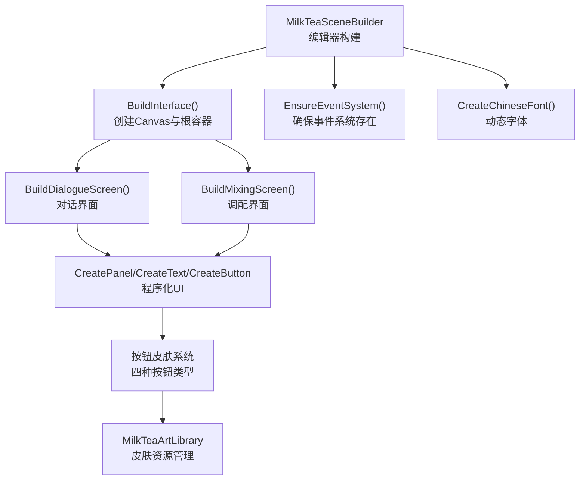
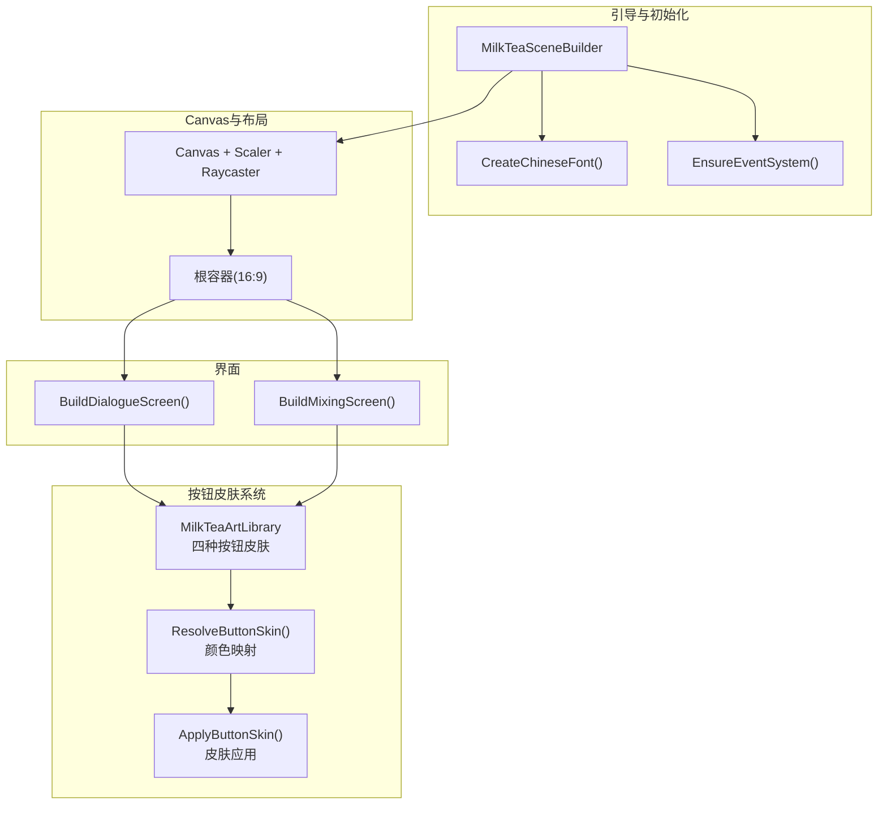
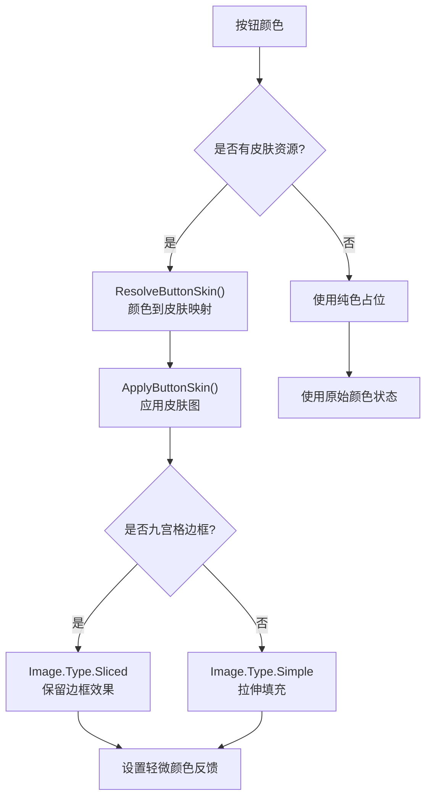
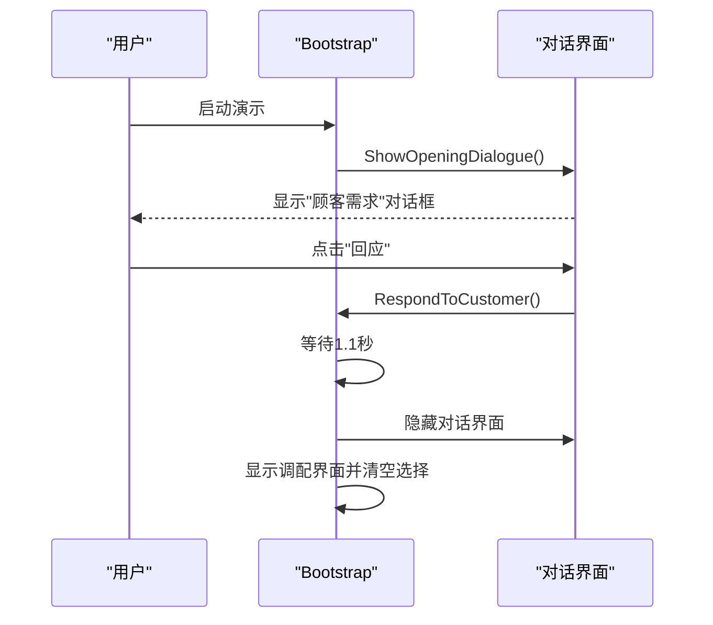
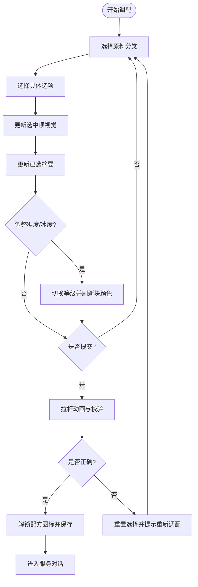
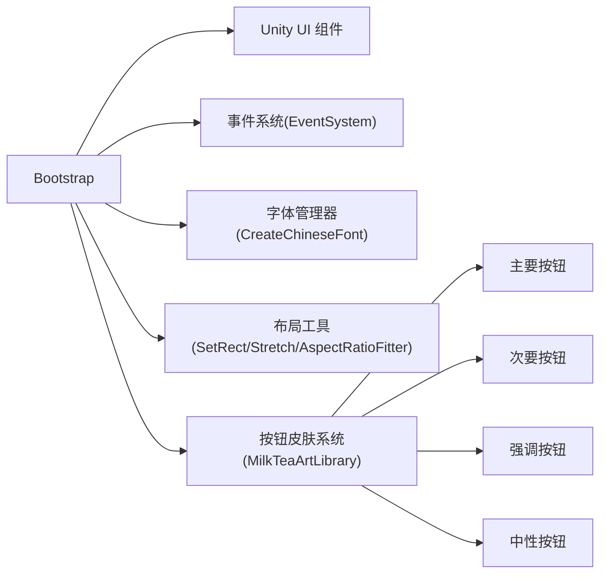

# UI系统架构

<cite>
**本文引用的文件**
- [MilkTeaArtLibrary.cs](file://Assets/Scripts/MilkTeaArtLibrary.cs)
- [MilkTeaSceneBuilder.cs](file://Assets/Editor/MilkTeaSceneBuilder.cs)
</cite>

## 更新摘要
**所做更改**
- 新增按钮皮肤系统章节，详细说明四种按钮类型（主要、次要、强调、中性）的实现
- 更新CreateButton()方法说明，反映新的皮肤应用逻辑
- 添加按钮皮肤映射机制的详细分析
- 扩展视觉样式配置部分，包含九宫格边框支持和颜色状态管理

## 目录
1. [简介](#简介)
2. [项目结构](#项目结构)
3. [核心组件](#核心组件)
4. [架构总览](#架构总览)
5. [详细组件分析](#详细组件分析)
6. [依赖关系分析](#依赖关系分析)
7. [性能考量](#性能考量)
8. [故障排查指南](#故障排查指南)
9. [结论](#结论)
10. [附录：扩展新UI组件类型示例](#附录：扩展新ui组件类型示例)

## 简介
本技术文档围绕奶茶店模拟经营的UI系统，系统性解析其动态UI构建机制。该系统在运行时通过代码创建Canvas、面板、文本与按钮等UI元素，实现对话界面与调配界面的切换与交互；同时提供响应式布局适配、事件系统保障、字体处理与生命周期管理。**最新更新**：系统现已支持完整的按钮皮肤系统，包含四种语义化按钮类型，提供丰富的视觉反馈和样式定制能力。重点说明以下方法的作用与协作：
- BuildInterface()：创建主界面结构与Canvas缩放配置
- BuildDialogueScreen()：构建对话界面（标题、人物立绘占位、店铺小场景、对话框）
- BuildMixingScreen()：构建调配界面（后厨场景、订单提示、配方手册、原料选择区、机器操作区）
- CreatePanel()/CreateText()/CreateButton()：程序化创建UI元素的辅助方法
- **新增**：按钮皮肤系统（主要、次要、强调、中性按钮）
- 事件系统、字体处理、生命周期管理等支撑能力

## 项目结构
该UI系统由编辑器脚本集中实现，采用"单例引导+运行时构建"的方式：
- 入口引导：启动时自动创建宿主GameObject并挂载引导脚本
- 运行时初始化：Awake中完成字体创建、事件系统检查、界面构建与开场对话
- 界面构建：BuildInterface()负责Canvas与根容器设置，随后分别构建对话与调配两个全屏面板
- 子模块构建：BuildDialogueScreen()与BuildMixingScreen()各自组织内部UI层次与交互
- **新增**：按钮皮肤系统通过MilkTeaArtLibrary统一管理四种按钮类型的视觉资源

```mermaid
graph TB
A["MilkTeaSceneBuilder<br/>编辑器构建"] --> B["BuildInterface()<br/>创建Canvas与根容器"]
B --> C["BuildDialogueScreen()<br/>对话界面"]
B --> D["BuildMixingScreen()<br/>调配界面"]
C --> E["CreatePanel/CreateText/CreateButton<br/>程序化UI"]
D --> E
E --> F["按钮皮肤系统<br/>四种按钮类型"]
F --> G["MilkTeaArtLibrary<br/>皮肤资源管理"]
A --> H["EnsureEventSystem()<br/>确保事件系统存在"]
A --> I["CreateChineseFont()<br/>动态字体"]
```

图表来源
- [MilkTeaSceneBuilder.cs:104-219](file://Assets/Editor/MilkTeaSceneBuilder.cs#L104-L219)
- [MilkTeaSceneBuilder.cs:749-781](file://Assets/Editor/MilkTeaSceneBuilder.cs#L749-L781)
- [MilkTeaArtLibrary.cs:53-61](file://Assets/Scripts/MilkTeaArtLibrary.cs#L53-L61)

章节来源
- [MilkTeaSceneBuilder.cs:104-219](file://Assets/Editor/MilkTeaSceneBuilder.cs#L104-L219)

## 核心组件
- Canvas与缩放管理
  - 运行时创建Canvas、CanvasScaler、GraphicRaycaster，设置渲染模式为屏幕覆盖层，排序层级提升，避免被其他UI遮挡
  - 使用ScaleWithScreenSize模式，参考分辨率1920x1080，按宽度或高度匹配，保证在不同分辨率下比例一致
  - 根内容容器使用宽高比约束器保持16:9显示，适配不同屏幕尺寸
- 程序化UI元素创建
  - CreatePanel()：创建带RectTransform与Image的面板，设置父节点与颜色
  - CreateText()：创建Text，绑定统一字体、字号、颜色、对齐方式、换行策略
  - **增强版** CreateButton()：创建Button，支持四种按钮皮肤类型，配置颜色状态（正常、高亮、按下、禁用），附加点击监听，并在中心添加Label
- **新增** 按钮皮肤系统
  - 四种语义化按钮类型：主要按钮（青色）、次要按钮（深蓝）、强调按钮（珊瑚色）、中性按钮（深灰）
  - 智能皮肤映射：根据按钮颜色自动选择合适的皮肤资源
  - 九宫格边框支持：自动检测Sprite边框属性，选择合适的渲染模式
  - 颜色状态管理：有皮肤时使用白色底色配合轻微反馈，无皮肤时沿用纯色占位
- 响应式布局适配
  - SetRect()：以锚点左下角为基准设置位置与尺寸，便于绝对定位
  - Stretch()：将RectTransform拉伸至父容器四边，用于背景与全屏面板
  - AspectRatioFitter：强制根容器保持16:9，配合Canvas缩放实现自适应
- 事件系统与字体处理
  - EnsureEventSystem()：若场景中不存在EventSystem与StandaloneInputModule则自动创建，确保UI交互可用
  - CreateChineseFont()：尝试从系统字体创建中文支持字体，失败回退到内置Arial，保证文本可读性

章节来源
- [MilkTeaSceneBuilder.cs:104-219](file://Assets/Editor/MilkTeaSceneBuilder.cs#L104-L219)
- [MilkTeaSceneBuilder.cs:749-781](file://Assets/Editor/MilkTeaSceneBuilder.cs#L749-L781)
- [MilkTeaArtLibrary.cs:53-61](file://Assets/Scripts/MilkTeaArtLibrary.cs#L53-L61)

## 架构总览
下图展示了UI系统的整体架构与数据流：引导脚本负责初始化与构建，Canvas作为根容器承载对话与调配两个全屏面板；用户交互通过按钮触发状态更新与界面切换。**新增**按钮皮肤系统通过MilkTeaArtLibrary统一管理视觉资源，提供统一的样式接口。

```mermaid
graph TB
subgraph "引导与初始化"
Boot["MilkTeaSceneBuilder"]
Font["CreateChineseFont()"]
Event["EnsureEventSystem()"]
end
subgraph "Canvas与布局"
Canvas["Canvas + Scaler + Raycaster"]
Root["根容器(16:9)"]
end
subgraph "界面"
Dialogue["BuildDialogueScreen()"]
Mixing["BuildMixingScreen()"]
end
subgraph "按钮皮肤系统"
SkinLib["MilkTeaArtLibrary<br/>四种按钮皮肤"]
SkinMap["ResolveButtonSkin()<br/>颜色映射"]
SkinApply["ApplyButtonSkin()<br/>皮肤应用"]
end
Boot --> Font
Boot --> Event
Boot --> Canvas
Canvas --> Root
Root --> Dialogue
Root --> Mixing
Dialogue --> SkinLib
Mixing --> SkinLib
SkinLib --> SkinMap
SkinMap --> SkinApply
```

图表来源
- [MilkTeaSceneBuilder.cs:104-219](file://Assets/Editor/MilkTeaSceneBuilder.cs#L104-L219)
- [MilkTeaSceneBuilder.cs:749-822](file://Assets/Editor/MilkTeaSceneBuilder.cs#L749-L822)
- [MilkTeaArtLibrary.cs:53-61](file://Assets/Scripts/MilkTeaArtLibrary.cs#L53-L61)

## 详细组件分析

### BuildInterface()：主界面结构创建
- 职责
  - 创建Canvas对象并挂载必要组件（Canvas、CanvasScaler、GraphicRaycaster）
  - 设置渲染模式与排序层级，确保UI在最上层显示
  - 配置CanvasScaler的缩放模式与参考分辨率，启用宽高匹配策略
  - 创建背景与根内容容器，应用拉伸与宽高比约束
  - 创建并构建对话、调配、结算、休息、开始、动画等多个全屏面板
- 关键点
  - 使用Stretch()使背景与根容器铺满Canvas
  - 使用AspectRatioFitter固定16:9内容区域，避免内容变形
  - 通过CreatePanel()创建面板，并通过各BuildXxxScreen()方法填充内容

章节来源
- [MilkTeaSceneBuilder.cs:104-219](file://Assets/Editor/MilkTeaSceneBuilder.cs#L104-L219)

### 按钮皮肤系统：四种按钮类型详解
**新增功能**：系统现已支持完整的按钮皮肤系统，提供四种语义化的按钮类型：

- **主要按钮（Primary Button）**
  - 颜色：青色（#69D8C5）
  - 用途：正向操作，如"开始游戏"、"进入下一天"
  - 视觉特征：最醒目的按钮类型，通常用于主要操作流程

- **次要按钮（Secondary Button）**
  - 颜色：深蓝色（#33445E）
  - 用途：辅助操作，如"读取存档"、"翻页"、"再休息一会儿"
  - 视觉特征：中等重要性，不干扰主要操作流程

- **强调按钮（Accent Button）**
  - 颜色：珊瑚色（#F28B82）
  - 用途：强调或危险操作，如"跳过"、"完成"、"继续"
  - 视觉特征：高对比度，吸引用户注意力的特殊操作

- **中性按钮（Neutral Button）**
  - 颜色：深灰色（#657184）
  - 用途：默认或通用操作，如"设置"及其他常规功能
  - 视觉特征：低调且通用的外观，适合各种场景

**皮肤映射机制**：
- ResolveButtonSkin()方法根据按钮颜色自动选择合适的皮肤资源
- ApplyButtonSkin()方法智能应用皮肤图，支持九宫格边框检测
- 有皮肤时使用白色底色配合轻微悬停/按下反馈
- 无皮肤时自动回退到纯色占位模式

```mermaid
flowchart TD
Color["按钮颜色"] --> Check{"是否有皮肤资源?"}
Check --> |是| MapSkin["ResolveButtonSkin()<br/>颜色到皮肤映射"]
Check --> |否| Fallback["使用纯色占位"]
MapSkin --> Apply["ApplyButtonSkin()<br/>应用皮肤图"]
Apply --> NineGrid{"是否九宫格边框?"}
NineGrid --> |是| Sliced["Image.Type.Sliced<br/>保留边框效果"]
NineGrid --> |否| Simple["Image.Type.Simple<br/>拉伸填充"]
Sliced --> Feedback["设置轻微颜色反馈"]
Simple --> Feedback
Fallback --> PureColor["使用原始颜色状态"]
```

图表来源
- [MilkTeaSceneBuilder.cs:783-822](file://Assets/Editor/MilkTeaSceneBuilder.cs#L783-L822)
- [MilkTeaArtLibrary.cs:53-61](file://Assets/Scripts/MilkTeaArtLibrary.cs#L53-L61)

章节来源
- [MilkTeaSceneBuilder.cs:783-822](file://Assets/Editor/MilkTeaSceneBuilder.cs#L783-L822)
- [MilkTeaArtLibrary.cs:53-61](file://Assets/Scripts/MilkTeaArtLibrary.cs#L53-L61)

### BuildDialogueScreen()：对话界面构建
- 职责
  - 创建标题文本、顾客立绘占位面板、店铺俯视小场景（吧台、桌子、后厨、Q版角色）
  - 创建对话框面板，包含说话人、台词文本与"继续"按钮
  - 通过ConfigureDialogue()动态设置对话内容与回调
- 交互流程
  - ShowOpeningDialogue()进入对话界面并配置初始对话
  - RespondToCustomer()响应后延迟切换到调配界面
  - ShowServingDialogue()/ShowCustomerThanks()完成服务流程与重玩循环

```mermaid
sequenceDiagram
participant U as "用户"
participant B as "Bootstrap"
participant D as "对话界面"
U->>B : 启动演示
B->>D : ShowOpeningDialogue()
D-->>U : 显示"顾客需求"对话框
U->>D : 点击"回应"
D->>B : RespondToCustomer()
B->>B : 等待1.1秒
B->>D : 隐藏对话界面
B->>B : 显示调配界面并清空选择
```

图表来源
- [MilkTeaSceneBuilder.cs:157-165](file://Assets/Editor/MilkTeaSceneBuilder.cs#L157-L165)

章节来源
- [MilkTeaSceneBuilder.cs:157-165](file://Assets/Editor/MilkTeaSceneBuilder.cs#L157-L165)

### BuildMixingScreen()：调配界面构建
- 职责
  - 创建后厨俯视场景（工作台、萃茶机、奶底区、Q版角色）
  - 创建订单提示面板，显示当前顾客需求
  - 创建配方手册、原料选择区、机器操作区
  - 通过BuildRecipePanel()/BuildIngredientPanel()/BuildMachinePanel()组织子模块
- 交互要点
  - 原料选择区支持分类切换与选项勾选，实时更新视觉与摘要
  - 糖度/冰度通过LevelBlock按钮切换，颜色反馈当前等级
  - 拉杆按钮触发提交动画与校验逻辑，正确则解锁配方图标并进入服务对话

```mermaid
flowchart TD
Start(["开始调配"]) --> SelectCategory["选择原料分类"]
SelectCategory --> SelectOption["选择具体选项"]
SelectOption --> UpdateVisuals["更新选中项视觉"]
UpdateVisuals --> UpdateSummary["更新已选摘要"]
UpdateSummary --> LevelAdjust{"调整糖度/冰度?"}
LevelAdjust --> |是| ChangeLevel["切换等级并刷新块颜色"]
LevelAdjust --> |否| SubmitCheck{"是否提交?"}
ChangeLevel --> SubmitCheck
SubmitCheck --> |否| SelectCategory
SubmitCheck --> |是| SubmitRoutine["拉杆动画与校验"]
SubmitRoutine --> Correct{"是否正确?"}
Correct --> |是| Unlock["解锁配方图标并保存"]
Correct --> |否| Reset["重置选择并提示重新调配"]
Unlock --> Serve["进入服务对话"]
Reset --> SelectCategory
```

图表来源
- [MilkTeaSceneBuilder.cs:167-175](file://Assets/Editor/MilkTeaSceneBuilder.cs#L167-L175)

章节来源
- [MilkTeaSceneBuilder.cs:167-175](file://Assets/Editor/MilkTeaSceneBuilder.cs#L167-L175)

### CreatePanel()/CreateText()/CreateButton()：辅助方法与使用模式
- CreatePanel(name, parent, color)
  - 创建带有RectTransform与Image的面板，设置父节点与颜色
  - 常用于背景、容器、按钮底色等
- CreateText(name, parent, content, size, color, alignment, position, dimensions, bold)
  - 创建Text并绑定统一字体、字号、颜色、对齐方式、换行策略
  - 通过SetRect()设置位置与尺寸，bold控制粗体样式
- **增强版** CreateButton(name, parent, caption, position, dimensions, color, out label)
  - 创建Button并支持四种按钮皮肤类型（主要、次要、强调、中性）
  - 智能皮肤映射：根据颜色自动选择合适的皮肤资源
  - 九宫格边框支持：自动检测Sprite边框属性，选择合适的渲染模式
  - 颜色状态管理：有皮肤时使用白色底色配合轻微反馈，无皮肤时沿用纯色占位
  - 可选注册onClick监听，自动在按钮中心创建Label文本
  - 返回Button引用以便后续操作（如禁用、动画）

使用模式示例（路径引用）
- 创建面板与文本：[MilkTeaSceneBuilder.cs:716-747](file://Assets/Editor/MilkTeaSceneBuilder.cs#L716-L747)
- **增强版** 创建按钮与标签：[MilkTeaSceneBuilder.cs:749-781](file://Assets/Editor/MilkTeaSceneBuilder.cs#L749-L781)
- 组合使用（对话框按钮）：[MilkTeaSceneBuilder.cs:157-165](file://Assets/Editor/MilkTeaSceneBuilder.cs#L157-L165)

章节来源
- [MilkTeaSceneBuilder.cs:716-781](file://Assets/Editor/MilkTeaSceneBuilder.cs#L716-L781)

### 生命周期管理与事件系统配置
- 生命周期
  - StartDemo()：运行时首次加载场景时查找是否存在实例，不存在则创建宿主对象并挂载引导脚本
  - Awake()：标记不销毁、创建字体、确保事件系统、构建界面、展示开场对话
  - 界面切换：通过SetActive()切换对话与调配面板，协程延时过渡
- 事件系统
  - EnsureEventSystem()：检测并创建EventSystem与StandaloneInputModule，确保UI可交互
  - Button.onClick.AddListener()：为按钮注册点击回调，支持匿名委托与命名方法
  - ConfigureDialogue()：动态设置对话框文本与按钮行为，移除旧监听并绑定新回调

章节来源
- [MilkTeaSceneBuilder.cs:52-72](file://Assets/Editor/MilkTeaSceneBuilder.cs#L52-L72)

### 字体处理机制
- CreateChineseFont()：优先尝试从系统字体创建支持中文的动态字体（微软雅黑、黑体等），失败回退到内置Arial
- 所有Text均绑定该字体，保证跨平台中文显示一致性
- 字号与粗细通过CreateText()参数控制，粗体用于标题与强调文本

章节来源
- [MilkTeaSceneBuilder.cs:888-892](file://Assets/Editor/MilkTeaSceneBuilder.cs#L888-L892)

## 依赖关系分析
- 外部依赖
  - UnityEngine.UI：Canvas、CanvasScaler、GraphicRaycaster、Text、Button、Image、Outline等
  - UnityEngine.EventSystems：EventSystem、StandaloneInputModule
- 内部耦合
  - Bootstrap集中管理UI构建与状态，低耦合于各子模块（通过Transform传递父节点）
  - 通过字典缓存类别面板与选项图像，降低重复查找开销
  - **新增** MilkTeaArtLibrary统一管理按钮皮肤资源，提供统一的样式接口
- 潜在风险
  - 单脚本过大可能导致维护成本上升，建议按功能拆分（对话、调配、工具方法）
  - 硬编码坐标与尺寸不利于多分辨率适配，建议使用相对布局或锚点系统优化
  - **新增** 按钮皮肤资源缺失时需要良好的降级处理机制

```mermaid
graph LR
Boot["Bootstrap"] --> UI["Unity UI 组件"]
Boot --> EVT["事件系统(EventSystem)"]
Boot --> FONT["字体管理器(CreateChineseFont)"]
Boot --> LAYOUT["布局工具(SetRect/Stretch/AspectRatioFitter)"]
Boot --> SKIN["按钮皮肤系统(MilkTeaArtLibrary)"]
SKIN --> PRIMARY["主要按钮"]
SKIN --> SECONDARY["次要按钮"]
SKIN --> ACCENT["强调按钮"]
SKIN --> NEUTRAL["中性按钮"]
```

图表来源
- [MilkTeaSceneBuilder.cs:104-219](file://Assets/Editor/MilkTeaSceneBuilder.cs#L104-L219)
- [MilkTeaArtLibrary.cs:53-61](file://Assets/Scripts/MilkTeaArtLibrary.cs#L53-L61)

章节来源
- [MilkTeaSceneBuilder.cs:104-219](file://Assets/Editor/MilkTeaSceneBuilder.cs#L104-L219)
- [MilkTeaArtLibrary.cs:53-61](file://Assets/Scripts/MilkTeaArtLibrary.cs#L53-L61)

## 性能考量
- 运行时创建UI对象会带来GC压力，建议在频繁创建场景中使用对象池复用面板与按钮
- 大量Text与Image的Update或颜色变更可能影响渲染性能，尽量减少每帧修改频率
- 使用CanvasScaler与AspectRatioFitter进行适配时，注意避免过多嵌套导致的布局计算开销
- 动画（拉杆旋转）使用协程与增量时间推进，避免阻塞主线程
- **新增** 按钮皮肤系统通过预加载资源减少运行时开销，九宫格边框检测仅在首次应用时执行

## 故障排查指南
- 无事件系统导致按钮不可用
  - 现象：按钮无法点击
  - 排查：确认EnsureEventSystem()是否执行，场景中是否存在EventSystem与StandaloneInputModule
  - 参考：[MilkTeaSceneBuilder.cs:878-886](file://Assets/Editor/MilkTeaSceneBuilder.cs#L878-L886)
- 中文显示异常或乱码
  - 现象：文本显示为方框或英文
  - 排查：检查CreateChineseFont()是否成功创建字体，必要时手动指定字体资源
  - 参考：[MilkTeaSceneBuilder.cs:888-892](file://Assets/Editor/MilkTeaSceneBuilder.cs#L888-L892)
- 界面错位或比例失真
  - 现象：内容超出屏幕或比例不对
  - 排查：检查SetRect()与Stretch()的使用是否正确，根容器是否应用了AspectRatioFitter
  - 参考：[MilkTeaSceneBuilder.cs:845-861](file://Assets/Editor/MilkTeaSceneBuilder.cs#L845-L861)
- 按钮点击无效或重复绑定
  - 现象：点击多次触发多个回调
  - 排查：在动态设置对话框时先RemoveAllListeners再AddListener
  - 参考：[MilkTeaSceneBuilder.cs:348-359](file://Assets/Editor/MilkTeaSceneBuilder.cs#L348-L359)
- **新增** 按钮皮肤显示异常
  - 现象：按钮图片或颜色显示不正确
  - 排查：检查MilkTeaArtLibrary中的按钮皮肤资源是否正确配置，确认ResolveButtonSkin()映射逻辑
  - 参考：[MilkTeaSceneBuilder.cs:783-822](file://Assets/Editor/MilkTeaSceneBuilder.cs#L783-L822)
  - 参考：[MilkTeaArtLibrary.cs:53-61](file://Assets/Scripts/MilkTeaArtLibrary.cs#L53-L61)

章节来源
- [MilkTeaSceneBuilder.cs:878-892](file://Assets/Editor/MilkTeaSceneBuilder.cs#L878-L892)
- [MilkTeaSceneBuilder.cs:783-822](file://Assets/Editor/MilkTeaSceneBuilder.cs#L783-L822)
- [MilkTeaArtLibrary.cs:53-61](file://Assets/Scripts/MilkTeaArtLibrary.cs#L53-L61)

## 结论
该UI系统通过单一引导脚本实现了完整的动态UI构建与交互流程，具备响应式布局、事件系统保障与字体处理能力。**最新更新**：系统现已支持完整的按钮皮肤系统，提供四种语义化按钮类型和丰富的视觉反馈机制。其优势在于快速原型与演示友好，适合小规模项目或教学用途。对于更大规模项目，建议将构建逻辑模块化、引入对象池与资源管理，以提升可维护性与性能表现。

## 附录：扩展新UI组件类型示例
以下示例展示如何在现有框架基础上扩展新的UI组件类型（例如"进度条"或"开关"），遵循统一的创建与配置模式：

- 步骤概览
  - 新增CreateXxx()工厂方法，封装GameObject创建、RectTransform设置、组件添加与样式配置
  - 在BuildMixingScreen()或BuildDialogueScreen()中调用该方法，传入父Transform与必要参数
  - 如需交互，注册onClick或其他事件监听，并在状态变化时更新UI
  - **新增** 如需支持按钮皮肤，使用CreateButton()方法并传入相应的颜色参数

- 示例：创建"进度条"组件（概念性步骤）
  - 定义CreateProgressBar(parent, min, max, value, callback)
  - 创建背景面板与前景条面板，设置锚点与尺寸
  - 根据value计算前景条宽度，更新其sizeDelta
  - 注册onChange事件，当value变化时重绘进度条
  - 在调配界面中添加一个示例进度条，用于演示制作进度

- 示例：创建"开关"组件（概念性步骤）
  - 定义CreateToggle(parent, label, onColor, offColor, callback)
  - 创建按钮与标签，配置颜色状态（开/关）
  - 注册onClick事件，切换布尔状态并更新颜色与文本
  - 在配方手册或订单提示中添加开关，用于开启/关闭某些提示

- **新增** 使用按钮皮肤系统的示例
  - 主要按钮：CreateButton("MainBtn", parent, "确认", position, size, mint, callback)
  - 次要按钮：CreateButton("SecondaryBtn", parent, "取消", position, size, panelLight, callback)
  - 强调按钮：CreateButton("AccentBtn", parent, "删除", position, size, coral, callback)
  - 中性按钮：CreateButton("NeutralBtn", parent, "设置", position, size, gray, callback)

- 参考路径（现有创建模式）
  - 面板创建：[MilkTeaSceneBuilder.cs:716-729](file://Assets/Editor/MilkTeaSceneBuilder.cs#L716-L729)
  - 文本创建：[MilkTeaSceneBuilder.cs:731-747](file://Assets/Editor/MilkTeaSceneBuilder.cs#L731-L747)
  - **增强版** 按钮创建：[MilkTeaSceneBuilder.cs:749-781](file://Assets/Editor/MilkTeaSceneBuilder.cs#L749-L781)
  - 布局设置：[MilkTeaSceneBuilder.cs:845-861](file://Assets/Editor/MilkTeaSceneBuilder.cs#L845-L861)
  - 按钮皮肤映射：[MilkTeaSceneBuilder.cs:783-822](file://Assets/Editor/MilkTeaSceneBuilder.cs#L783-L822)