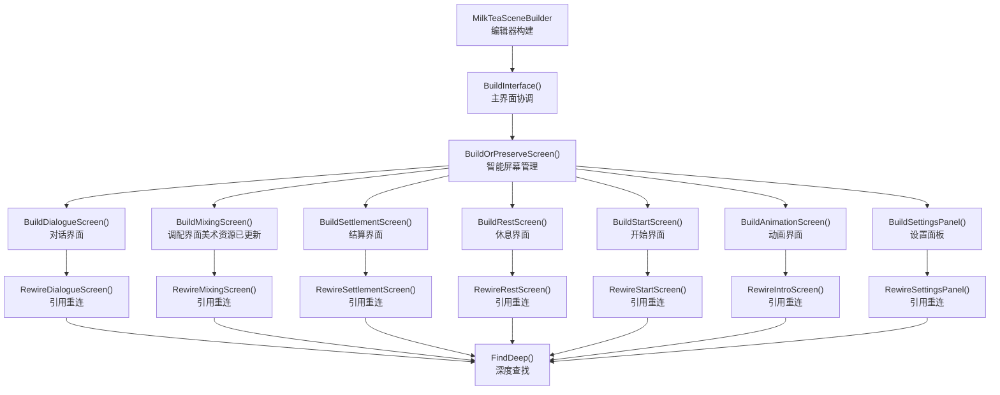
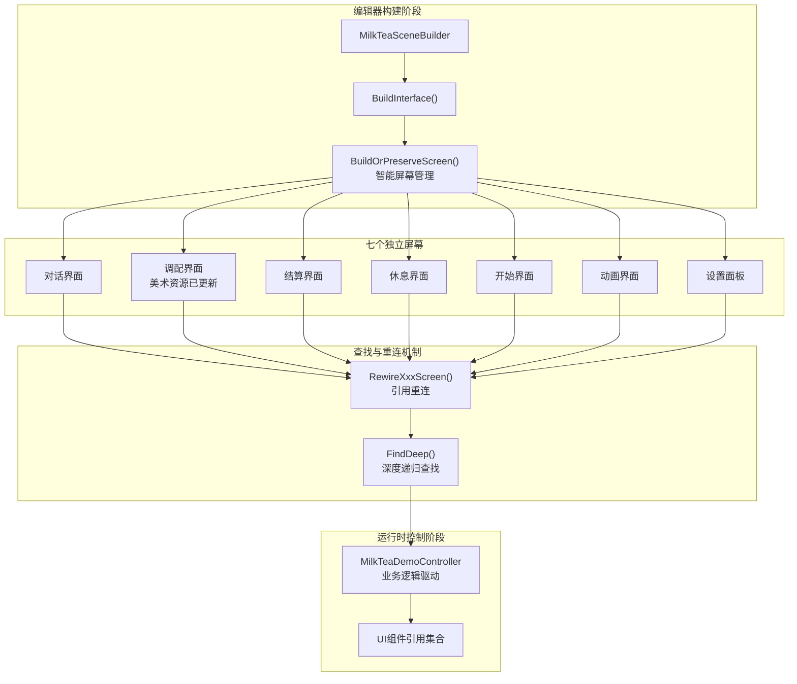
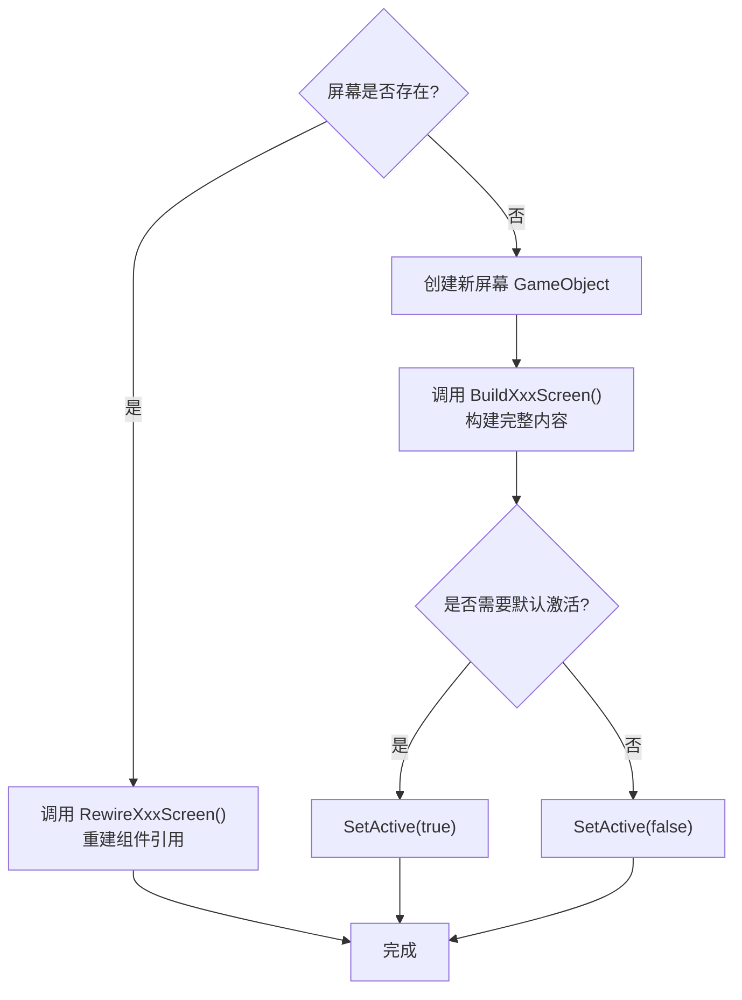
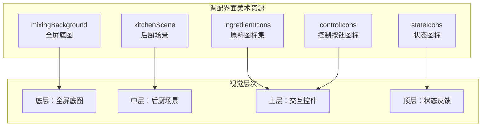
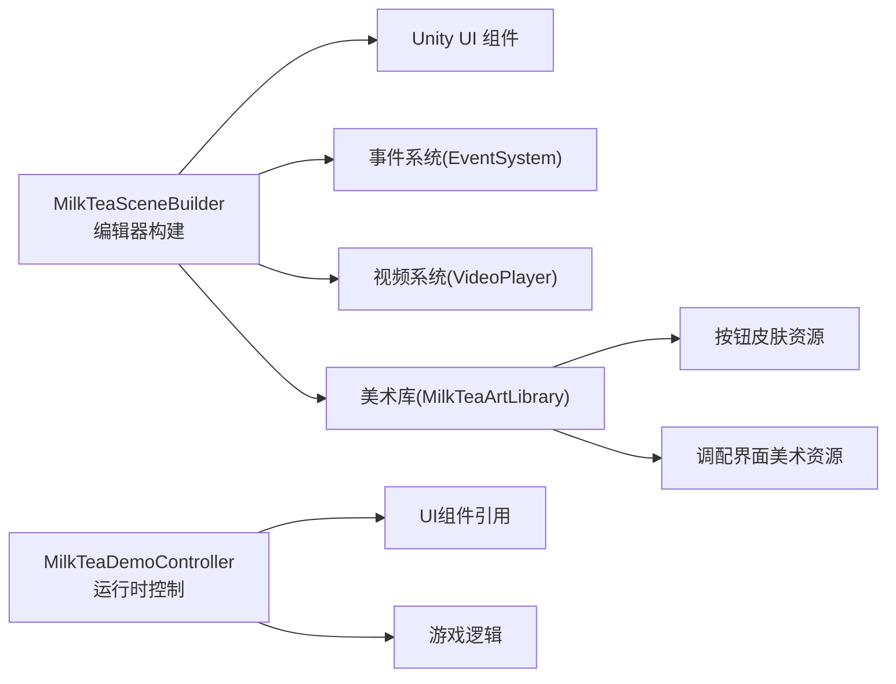

基于对代码的分析，我现在了解了调配界面美术资源更新的具体情况。让我更新UI系统架构文档以反映这些变化：

# UI系统架构

<cite>
**本文引用的文件**
- [MilkTeaArtLibrary.cs](file://Assets/Scripts/MilkTeaArtLibrary.cs)
- [MilkTeaSceneBuilder.cs](file://Assets/Editor/MilkTeaSceneBuilder.cs)
- [MilkTeaDemoController.cs](file://Assets/Scripts/MilkTeaDemoController.cs)
</cite>

## 更新摘要
**所做更改**
- 调配界面美术资源全面更新，包括新的全屏底图、后厨场景、原料瓶图标等视觉元素
- 增强了调配界面的用户体验和视觉效果
- 支持更丰富的视觉反馈和交互体验
- 优化了UI组件的视觉层次和布局结构

## 目录
1. [简介](#简介)
2. [项目结构](#项目结构)
3. [核心组件](#核心组件)
4. [架构总览](#架构总览)
5. [详细组件分析](#详细组件分析)
6. [依赖关系分析](#依赖关系分析)
7. [性能考量](#性能考量)
8. [故障排查指南](#故障排查指南)
9. [结论](#结论)
10. [附录：扩展新UI组件类型示例](#附录：扩展新ui组件类型示例)

## 简介
本技术文档围绕奶茶店模拟经营的UI系统，系统性解析其动态UI构建机制。该系统经过重大重构，现已支持**增量更新的场景构建系统**，通过BuildOrPreserveScreen方法实现智能屏幕管理，支持七个独立界面的构建与重连。**最新更新**：调配界面美术资源已全面升级，包括新的全屏底图、后厨场景、原料瓶图标、控制按钮等视觉元素，显著提升了调配界面的用户体验和视觉效果。重点说明以下核心方法的作用与协作：
- BuildInterface()：创建Canvas与根容器，协调七个独立屏幕的构建
- **新增** BuildOrPreserveScreen()：智能判断屏幕存在性，决定新建或重连引用
- BuildDialogueScreen()/BuildMixingScreen()：对话与调配界面的构建
- **新增** BuildSettlementScreen()/BuildRestScreen()/BuildStartScreen()/BuildAnimationScreen()/BuildSettingsPanel()：其他功能界面的构建
- RewireXxxScreen()系列方法：已有界面的引用重连机制
- CreatePanel()/CreateText()/CreateButton()：程序化创建UI元素的辅助方法
- **增强版** FindDeep()：深度递归查找UI组件的机制

## 项目结构
该UI系统采用**编辑器构建 + 运行时控制**的双层架构：
- **编辑器阶段**：MilkTeaSceneBuilder负责在场景中生成完整的UI GameObject层次结构
- **运行时阶段**：MilkTeaDemoController持有所有UI组件引用，驱动业务逻辑
- **增量构建**：BuildOrPreserveScreen确保已存在的界面保留手动调整，仅重新连接引用
- **智能重连**：RewireXxxScreen系列方法通过FindDeep()深度查找重建组件引用

```mermaid
graph TB
A["MilkTeaSceneBuilder<br/>编辑器构建"] --> B["BuildInterface()<br/>主界面协调"]
B --> C["BuildOrPreserveScreen()<br/>智能屏幕管理"]
C --> D["BuildDialogueScreen()<br/>对话界面"]
C --> E["BuildMixingScreen()<br/>调配界面美术资源已更新"]
C --> F["BuildSettlementScreen()<br/>结算界面"]
C --> G["BuildRestScreen()<br/>休息界面"]
C --> H["BuildStartScreen()<br/>开始界面"]
C --> I["BuildAnimationScreen()<br/>动画界面"]
C --> J["BuildSettingsPanel()<br/>设置面板"]
D --> K["RewireDialogueScreen()<br/>引用重连"]
E --> L["RewireMixingScreen()<br/>引用重连"]
F --> M["RewireSettlementScreen()<br/>引用重连"]
G --> N["RewireRestScreen()<br/>引用重连"]
H --> O["RewireStartScreen()<br/>引用重连"]
I --> P["RewireIntroScreen()<br/>引用重连"]
J --> Q["RewireSettingsPanel()<br/>引用重连"]
K --> R["FindDeep()<br/>深度查找"]
L --> R
M --> R
N --> R
O --> R
P --> R
Q --> R
```

图表来源
- [MilkTeaSceneBuilder.cs:104-230](file://Assets/Editor/MilkTeaSceneBuilder.cs#L104-L230)
- [MilkTeaSceneBuilder.cs:232-349](file://Assets/Editor/MilkTeaSceneBuilder.cs#L232-L349)

章节来源
- [MilkTeaSceneBuilder.cs:104-349](file://Assets/Editor/MilkTeaSceneBuilder.cs#L104-L349)

## 核心组件
- **Canvas与缩放管理**
  - 运行时创建Canvas、CanvasScaler、GraphicRaycaster，设置渲染模式为屏幕覆盖层，排序层级提升
  - 使用ScaleWithScreenSize模式，参考分辨率1920x1080，按宽度或高度匹配
  - 根内容容器使用宽高比约束器保持16:9显示，适配不同屏幕尺寸
- **增量屏幕管理系统**
  - **新增** BuildOrPreserveScreen()：检查屏幕是否存在，存在则调用重连方法，不存在则创建并构建
  - **新增** 七个独立屏幕：对话、调配、结算、休息、开始、动画、设置面板
  - **新增** 智能重连机制：RewireXxxScreen()系列方法通过FindDeep()重建组件引用
- **增强的UI组件查找机制**
  - **新增** FindDeep<T>()：递归遍历子节点，按名称查找指定类型的组件
  - **新增** FindButtonLabel()：专门查找按钮内部的Label子节点的Text
  - 支持深层嵌套结构的组件定位，适应复杂的UI层次
- **程序化UI元素创建**
  - CreatePanel()：创建带RectTransform与Image的面板，设置父节点与颜色
  - CreateText()：创建Text，绑定统一字体、字号、颜色、对齐方式、换行策略
  - **增强版** CreateButton()：创建Button，支持四种按钮皮肤类型，配置颜色状态，附加点击监听
- **按钮皮肤系统**
  - 四种语义化按钮类型：主要按钮（青色）、次要按钮（深蓝）、强调按钮（珊瑚色）、中性按钮（深灰）
  - 智能皮肤映射：根据按钮颜色自动选择合适的皮肤资源
  - 九宫格边框支持：自动检测Sprite边框属性，选择合适的渲染模式
  - 颜色状态管理：有皮肤时使用白色底色配合轻微反馈，无皮肤时沿用纯色占位
- **响应式布局适配**
  - SetRect()：以锚点左下角为基准设置位置与尺寸，便于绝对定位
  - Stretch()：将RectTransform拉伸至父容器四边，用于背景与全屏面板
  - AspectRatioFitter：强制根容器保持16:9，配合Canvas缩放实现自适应
- **事件系统与字体处理**
  - EnsureEventSystem()：若场景中不存在EventSystem与StandaloneInputModule则自动创建
  - CreateChineseFont()：尝试从系统字体创建中文支持字体，失败回退到内置Arial

章节来源
- [MilkTeaSceneBuilder.cs:104-230](file://Assets/Editor/MilkTeaSceneBuilder.cs#L104-L230)
- [MilkTeaSceneBuilder.cs:232-349](file://Assets/Editor/MilkTeaSceneBuilder.cs#L232-L349)
- [MilkTeaSceneBuilder.cs:887-952](file://Assets/Editor/MilkTeaSceneBuilder.cs#L887-L952)

## 架构总览
下图展示了重构后的UI系统整体架构：**增量构建引擎**负责智能管理七个独立屏幕的生命周期，**深度查找机制**确保已有界面的组件引用正确重连，**运行时控制器**持有所有UI组件引用并驱动业务逻辑。

```mermaid
graph TB
subgraph "编辑器构建阶段"
Boot["MilkTeaSceneBuilder"]
Build["BuildInterface()"]
Smart["BuildOrPreserveScreen()<br/>智能屏幕管理"]
end
subgraph "运行时控制阶段"
Controller["MilkTeaDemoController<br/>业务逻辑驱动"]
Refs["UI组件引用集合"]
end
subgraph "七个独立屏幕"
Dialogue["对话界面"]
Mixing["调配界面<br/>美术资源已更新"]
Settlement["结算界面"]
Rest["休息界面"]
Start["开始界面"]
Animation["动画界面"]
Settings["设置面板"]
end
subgraph "查找与重连机制"
Find["FindDeep()<br/>深度递归查找"]
Rewire["RewireXxxScreen()<br/>引用重连"]
end
Boot --> Build
Build --> Smart
Smart --> Dialogue
Smart --> Mixing
Smart --> Settlement
Smart --> Rest
Smart --> Start
Smart --> Animation
Smart --> Settings
Dialogue --> Rewire
Mixing --> Rewire
Settlement --> Rewire
Rest --> Rewire
Start --> Rewire
Animation --> Rewire
Settings --> Rewire
Rewire --> Find
Find --> Controller
Controller --> Refs
```

图表来源
- [MilkTeaSceneBuilder.cs:104-349](file://Assets/Editor/MilkTeaSceneBuilder.cs#L104-L349)
- [MilkTeaDemoController.cs:64-152](file://Assets/Scripts/MilkTeaDemoController.cs#L64-L152)

## 详细组件分析

### BuildInterface()：主界面结构创建与屏幕协调
- **职责**
  - 创建Canvas对象并挂载必要组件（Canvas、CanvasScaler、GraphicRaycaster）
  - 设置渲染模式与排序层级，确保UI在最上层显示
  - 配置CanvasScaler的缩放模式与参考分辨率，启用宽高匹配策略
  - 创建背景与根内容容器，应用拉伸与宽高比约束
  - **新增** 协调七个独立屏幕的构建：对话、调配、结算、休息、开始、动画、设置面板
- **关键改进**
  - **新增** BuildOrPreserveScreen()调用：每个屏幕都通过此方法进行智能管理
  - 使用Stretch()使背景与根容器铺满Canvas
  - 使用AspectRatioFitter固定16:9内容区域，避免内容变形

章节来源
- [MilkTeaSceneBuilder.cs:104-230](file://Assets/Editor/MilkTeaSceneBuilder.cs#L104-L230)

### BuildOrPreserveScreen()：智能屏幕管理系统
**新增核心功能**：这是本次重构的核心方法，实现了增量更新的场景构建系统

- **工作原理**
  - 检查父节点下是否存在指定名称的屏幕Transform
  - 如果存在：调用重连方法（rewireExisting），仅重建组件引用
  - 如果不存在：创建新屏幕，调用构建方法（buildNew），填充完整内容
  - 支持默认激活状态控制（activeByDefault参数）

- **支持的七个屏幕**
  - Dialogue Screen：对话界面（默认激活）
  - Mixing Screen：调配界面（默认激活，**美术资源已更新**）
  - Settlement Screen：结算界面（默认隐藏）
  - Rest Screen：休息界面（默认隐藏）
  - Start Screen：开始界面（默认激活）
  - Intro Screen：动画界面（默认隐藏）
  - Settings Panel：设置面板（默认隐藏）

```mermaid
flowchart TD
Check{"屏幕是否存在?"}
Check --> |是| Rewire["调用 RewireXxxScreen()<br/>重建组件引用"]
Check --> |否| Create["创建新屏幕 GameObject"]
Create --> Build["调用 BuildXxxScreen()<br/>构建完整内容"]
Build --> Active{"是否需要默认激活?"}
Active --> |是| Enable["SetActive(true)"]
Active --> |否| Disable["SetActive(false)"]
Rewire --> Done["完成"]
Enable --> Done
Disable --> Done
```

图表来源
- [MilkTeaSceneBuilder.cs:232-247](file://Assets/Editor/MilkTeaSceneBuilder.cs#L232-L247)

章节来源
- [MilkTeaSceneBuilder.cs:232-247](file://Assets/Editor/MilkTeaSceneBuilder.cs#L232-L247)

### 增强的UI组件查找机制
**新增核心功能**：FindDeep()和FindButtonLabel()方法提供了强大的UI组件定位能力

- **FindDeep<T>()方法**
  - 递归遍历指定Transform的所有子节点（包括inactive节点）
  - 按GameObject名称精确匹配目标组件
  - 返回第一个匹配的组件实例，未找到返回null
  - 泛型设计支持任意Unity组件类型的查找

- **FindButtonLabel()方法**
  - 专门用于查找Button内部Label子节点的Text组件
  - 先通过FindDeep<Button()查找按钮
  - 再在按钮Transform下查找名为"Label"的子节点
  - 返回Label中的Text组件，便于文本内容操作

- **应用场景**
  - 重连已有界面的组件引用
  - 动态查找复杂UI层次中的特定组件
  - 支持编辑器生成的预制体结构变化

章节来源
- [MilkTeaSceneBuilder.cs:251-276](file://Assets/Editor/MilkTeaSceneBuilder.cs#L251-L276)

### RewireXxxScreen()系列：引用重连机制
**新增核心功能**：每个屏幕都有对应的重连方法，确保已有界面的组件引用正确建立

- **RewireDialogueScreen()**
  - 重连对话界面的所有UI组件引用
  - 包括标题、立绘、对话框、按钮等10个组件

- **RewireMixingScreen()**
  - 重连调配界面的交互组件
  - 包括订单提示、配方导航、原料选择、拉杆按钮等6个组件

- **RewireSettlementScreen()**
  - 重连结算界面的标题、正文、按钮等4个组件

- **RewireRestScreen()**
  - 重连休息界面的提示文本、按钮等5个组件

- **RewireStartScreen()**
  - 重连开始界面的四个按钮：设置、开始游戏、读取存档、退出游戏

- **RewireIntroScreen()**
  - 重连动画界面的视频播放器、倒计时、跳过按钮等5个组件

- **RewireSettingsPanel()**
  - 重连设置面板的所有交互组件：关闭按钮、音量控制、分辨率设置、语言切换等12个组件

章节来源
- [MilkTeaSceneBuilder.cs:278-349](file://Assets/Editor/MilkTeaSceneBuilder.cs#L278-L349)

### 新增界面构建方法
**新增功能**：除了原有的对话和调配界面，新增了五个功能界面

- **BuildSettlementScreen()**
  - 创建结算卡片，显示当日营业统计信息
  - 包含标题、正文文本和"回家休息"按钮
  - 黄色边框装饰，居中显示

- **BuildRestScreen()**
  - 创建休息界面，包含手机界面和出租屋场景
  - 手机界面提供相册、角色资料、对话记录等菜单项
  - 出租屋场景展示床、书桌等家具
  - 底部显示休息提示和"进入下一天"/"再休息一会儿"按钮

- **BuildStartScreen()**
  - 创建开始界面，支持背景图和Logo图片替换
  - 左上角设置入口，右侧显示游戏Logo
  - 三个主要按钮：新的游戏、读取存档、退出游戏
  - 底部显示版本信息

- **BuildAnimationScreen()**
  - 创建开场动画界面，支持VideoPlayer播放视频
  - 未指定视频时自动回退为倒计时显示
  - 右上角提供"跳过"按钮

- **BuildSettingsPanel()**
  - 创建半透明设置面板，包含音量、分辨率、语言设置
  - 每行设置包含标签、前后按钮和当前值显示
  - 底部"完成"按钮关闭面板

章节来源
- [MilkTeaSceneBuilder.cs:511-698](file://Assets/Editor/MilkTeaSceneBuilder.cs#L511-L698)

### 调配界面美术资源更新详解
**重要更新**：调配界面已获得全面的美术资源升级，显著提升了用户体验和视觉效果

#### 全屏底图与后厨场景
- **mixingBackground**：全新的全屏底图，包含右侧操作区装饰和奶油粉底色
- **kitchenScene**：左上后厨俯视整图，叠在底图左侧，提供更丰富的视觉层次

#### 原料图标系统
- **teaCategoryIcon/milkCategoryIcon/toppingCategoryIcon**：分类图标，分别代表茶底、奶底、配料
- **ingredientIcons**：详细的原料图标列表，包括红茶瓶、抹茶瓶、乌龙茶瓶、绿茶瓶等
- **sugarIcon/iceIcon**：糖浆和冰块的专用图标

#### 控制按钮与交互元素
- **shakeButtonBackground/shakeButtonIcon**：开始摇动按钮的背景图和装饰图标
- **recipePreviousIcon/recipeNextIcon**：配方翻页箭头图标
- **categoryPreviousIcon/categoryNextIcon**：原料分类切换箭头图标
- **levelBlockEmpty/sugarBlockSelected/iceBlockSelected**：糖冰格子状态图标

#### 视觉增强特性
- **九宫格边框支持**：自动检测Sprite边框属性，选择合适的渲染模式
- **透明度控制**：支持半透明背景和前景叠加效果
- **响应式布局**：配合Canvas缩放实现自适应显示

```mermaid
graph TB
subgraph "调配界面美术资源"
Bg["mixingBackground<br/>全屏底图"]
Kitchen["kitchenScene<br/>后厨场景"]
Ingredients["ingredientIcons<br/>原料图标集"]
Controls["controlIcons<br/>控制按钮图标"]
States["stateIcons<br/>状态图标"]
end
subgraph "视觉层次"
Layer1["底层：全屏底图"]
Layer2["中层：后厨场景"]
Layer3["上层：交互控件"]
Layer4["顶层：状态反馈"]
end
Bg --> Layer1
Kitchen --> Layer2
Ingredients --> Layer3
Controls --> Layer3
States --> Layer4
```

图表来源
- [MilkTeaArtLibrary.cs:64-100](file://Assets/Scripts/MilkTeaArtLibrary.cs#L64-L100)
- [MilkTeaSceneBuilder.cs:488-562](file://Assets/Editor/MilkTeaSceneBuilder.cs#L488-L562)

章节来源
- [MilkTeaArtLibrary.cs:64-100](file://Assets/Scripts/MilkTeaArtLibrary.cs#L64-L100)
- [MilkTeaSceneBuilder.cs:488-562](file://Assets/Editor/MilkTeaSceneBuilder.cs#L488-L562)

### 生命周期管理与事件系统配置
- **生命周期**
  - BuildSceneInternal()：编辑器入口，支持普通构建和强制重建两种模式
  - EnsureSceneOpen()：确保目标场景打开，不存在则自动创建
  - RemoveExisting()：强制重建时清理旧的界面结构
  - 界面切换：通过SetActive()切换各个屏幕，协程延时过渡
- **事件系统**
  - EnsureEventSystem()：检测并创建EventSystem与StandaloneInputModule
  - Button.onClick.AddListener()：为按钮注册点击回调
  - ConfigureDialogue()：动态设置对话框文本与按钮行为

章节来源
- [MilkTeaSceneBuilder.cs:52-72](file://Assets/Editor/MilkTeaSceneBuilder.cs#L52-L72)

## 依赖关系分析
- **外部依赖**
  - UnityEngine.UI：Canvas、CanvasScaler、GraphicRaycaster、Text、Button、Image等
  - UnityEngine.EventSystems：EventSystem、StandaloneInputModule
  - UnityEngine.Video：VideoPlayer、RawImage（用于开场动画）
- **内部耦合**
  - MilkTeaSceneBuilder集中管理UI构建与重连，低耦合于各子模块
  - MilkTeaDemoController持有所有UI组件引用，通过Awake()初始化后驱动业务逻辑
  - **新增** 通过字典缓存类别面板与选项图像，降低重复查找开销
  - **新增** MilkTeaArtLibrary统一管理按钮皮肤资源，提供统一的样式接口
- **潜在风险**
  - 单脚本过大可能导致维护成本上升，建议按功能拆分
  - 硬编码坐标与尺寸不利于多分辨率适配
  - **新增** 增量构建需要良好的降级处理机制，确保组件查找失败时的容错

```mermaid
graph LR
Builder["MilkTeaSceneBuilder<br/>编辑器构建"] --> UnityUI["Unity UI 组件"]
Builder --> EventSys["事件系统(EventSystem)"]
Builder --> Video["视频系统(VideoPlayer)"]
Builder --> ArtLib["美术库(MilkTeaArtLibrary)"]
Controller["MilkTeaDemoController<br/>运行时控制"] --> UIRefs["UI组件引用"]
Controller --> GameLogic["游戏逻辑"]
ArtLib --> ButtonSkins["按钮皮肤资源"]
ArtLib --> MixingAssets["调配界面美术资源"]
```

图表来源
- [MilkTeaSceneBuilder.cs:104-349](file://Assets/Editor/MilkTeaSceneBuilder.cs#L104-L349)
- [MilkTeaDemoController.cs:64-152](file://Assets/Scripts/MilkTeaDemoController.cs#L64-L152)
- [MilkTeaArtLibrary.cs:64-100](file://Assets/Scripts/MilkTeaArtLibrary.cs#L64-L100)

章节来源
- [MilkTeaSceneBuilder.cs:104-349](file://Assets/Editor/MilkTeaSceneBuilder.cs#L104-L349)
- [MilkTeaArtLibrary.cs:64-100](file://Assets/Scripts/MilkTeaArtLibrary.cs#L64-L100)

## 性能考量
- **增量构建优势**
  - BuildOrPreserveScreen()避免重复创建已存在的界面，减少不必要的GameObject销毁与重建
  - 重连机制仅重建组件引用，不涉及UI层次重建，性能开销极小
- **运行时优化**
  - MilkTeaDemoController在Awake()中一次性完成所有组件引用查找和事件绑定
  - 使用GetComponentsInChildren()批量获取组件，避免频繁查找开销
- **内存管理**
  - 大量Text与Image的Update或颜色变更可能影响渲染性能，尽量减少每帧修改频率
  - 动画（拉杆旋转）使用协程与增量时间推进，避免阻塞主线程
- **资源加载**
  - 按钮皮肤系统通过预加载资源减少运行时开销
  - 九宫格边框检测仅在首次应用时执行
  - **新增** 调配界面美术资源采用分层加载，优先加载关键视觉元素

## 故障排查指南
- **无事件系统导致按钮不可用**
  - 现象：按钮无法点击
  - 排查：确认EnsureEventSystem()是否执行，场景中是否存在EventSystem与StandaloneInputModule
- **中文显示异常或乱码**
  - 现象：文本显示为方框或英文
  - 排查：检查CreateChineseFont()是否成功创建字体，必要时手动指定字体资源
- **界面错位或比例失真**
  - 现象：内容超出屏幕或比例不对
  - 排查：检查SetRect()与Stretch()的使用是否正确，根容器是否应用了AspectRatioFitter
- **按钮点击无效或重复绑定**
  - 现象：点击多次触发多个回调
  - 排查：在动态设置对话框时先RemoveAllListeners再AddListener
- **新增** 增量构建问题
  - 现象：重连后某些组件引用为空
  - 排查：检查FindDeep()查找逻辑，确认GameObject名称是否与代码中一致
  - 参考：[MilkTeaSceneBuilder.cs:251-276](file://Assets/Editor/MilkTeaSceneBuilder.cs#L251-L276)
- **新增** 屏幕构建失败
  - 现象：某个界面没有正确显示
  - 排查：检查BuildOrPreserveScreen()的参数配置，确认screenName与实际GameObject名称一致
  - 参考：[MilkTeaSceneBuilder.cs:232-247](file://Assets/Editor/MilkTeaSceneBuilder.cs#L232-L247)
- **新增** 按钮皮肤显示异常
  - 现象：按钮图片或颜色显示不正确
  - 排查：检查MilkTeaArtLibrary中的按钮皮肤资源是否正确配置，确认ResolveButtonSkin()映射逻辑
  - 参考：[MilkTeaSceneBuilder.cs:955-993](file://Assets/Editor/MilkTeaSceneBuilder.cs#L955-L993)
- **新增** 调配界面美术资源问题
  - 现象：调配界面背景或图标不显示
  - 排查：检查MilkTeaArtLibrary中的mixingBackground、kitchenScene等资源是否正确配置
  - 参考：[MilkTeaArtLibrary.cs:64-100](file://Assets/Scripts/MilkTeaArtLibrary.cs#L64-L100)

章节来源
- [MilkTeaSceneBuilder.cs:251-276](file://Assets/Editor/MilkTeaSceneBuilder.cs#L251-L276)
- [MilkTeaSceneBuilder.cs:955-993](file://Assets/Editor/MilkTeaSceneBuilder.cs#L955-L993)
- [MilkTeaArtLibrary.cs:64-100](file://Assets/Scripts/MilkTeaArtLibrary.cs#L64-L100)

## 结论
该UI系统经过重大重构，现已成为**支持增量更新的现代化场景构建系统**。通过BuildOrPreserveScreen()方法实现了智能的屏幕生命周期管理，支持七个独立界面的构建与重连。**核心优势**包括：
- **编辑器友好**：生成可编辑的GameObject，支持拖拽调整和Animator动画
- **增量构建**：保留手动调整，仅重建缺失部分，大幅提升开发效率
- **解耦架构**：编辑器构建与运行时控制分离，便于维护和扩展
- **健壮的重连机制**：通过深度查找确保组件引用正确建立
- **完善的视觉系统**：支持按钮皮肤、九宫格边框、响应式布局等现代UI特性
- **最新升级**：调配界面美术资源全面更新，显著提升用户体验和视觉效果

对于更大规模项目，建议将构建逻辑进一步模块化、引入对象池与资源管理，以提升可维护性与性能表现。

## 附录：扩展新UI组件类型示例
以下示例展示如何在现有框架基础上扩展新的UI组件类型，遵循统一的创建与配置模式：

- **步骤概览**
  - 新增CreateXxx()工厂方法，封装GameObject创建、RectTransform设置、组件添加与样式配置
  - 在相应的BuildXxxScreen()方法中调用该方法，传入父Transform与必要参数
  - 如需交互，注册onClick或其他事件监听，并在状态变化时更新UI
  - **新增** 如需支持按钮皮肤，使用CreateButton()方法并传入相应的颜色参数

- **示例：创建"进度条"组件（概念性步骤）**
  - 定义CreateProgressBar(parent, min, max, value, callback)
  - 创建背景面板与前景条面板，设置锚点与尺寸
  - 根据value计算前景条宽度，更新其sizeDelta
  - 注册onChange事件，当value变化时重绘进度条
  - 在调配界面中添加一个示例进度条，用于演示制作进度

- **示例：创建"开关"组件（概念性步骤）**
  - 定义CreateToggle(parent, label, onColor, offColor, callback)
  - 创建按钮与标签，配置颜色状态（开/关）
  - 注册onClick事件，切换布尔状态并更新颜色与文本
  - 在配方手册或订单提示中添加开关，用于开启/关闭某些提示

- **使用按钮皮肤系统的示例**
  - 主要按钮：CreateButton("MainBtn", parent, "确认", position, size, mint, callback)
  - 次要按钮：CreateButton("SecondaryBtn", parent, "取消", position, size, panelLight, callback)
  - 强调按钮：CreateButton("AccentBtn", parent, "删除", position, size, coral, callback)
  - 中性按钮：CreateButton("NeutralBtn", parent, "设置", position, size, gray, callback)

- **参考路径（现有创建模式）**
  - 面板创建：[MilkTeaSceneBuilder.cs:887-900](file://Assets/Editor/MilkTeaSceneBuilder.cs#L887-L900)
  - 文本创建：[MilkTeaSceneBuilder.cs:902-918](file://Assets/Editor/MilkTeaSceneBuilder.cs#L902-L918)
  - 按钮创建：[MilkTeaSceneBuilder.cs:920-952](file://Assets/Editor/MilkTeaSceneBuilder.cs#L920-L952)
  - 布局设置：[MilkTeaSceneBuilder.cs:1016-1032](file://Assets/Editor/MilkTeaSceneBuilder.cs#L1016-L1032)
  - 按钮皮肤映射：[MilkTeaSceneBuilder.cs:955-993](file://Assets/Editor/MilkTeaSceneBuilder.cs#L955-L993)