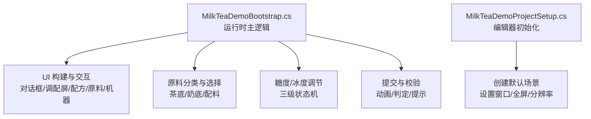
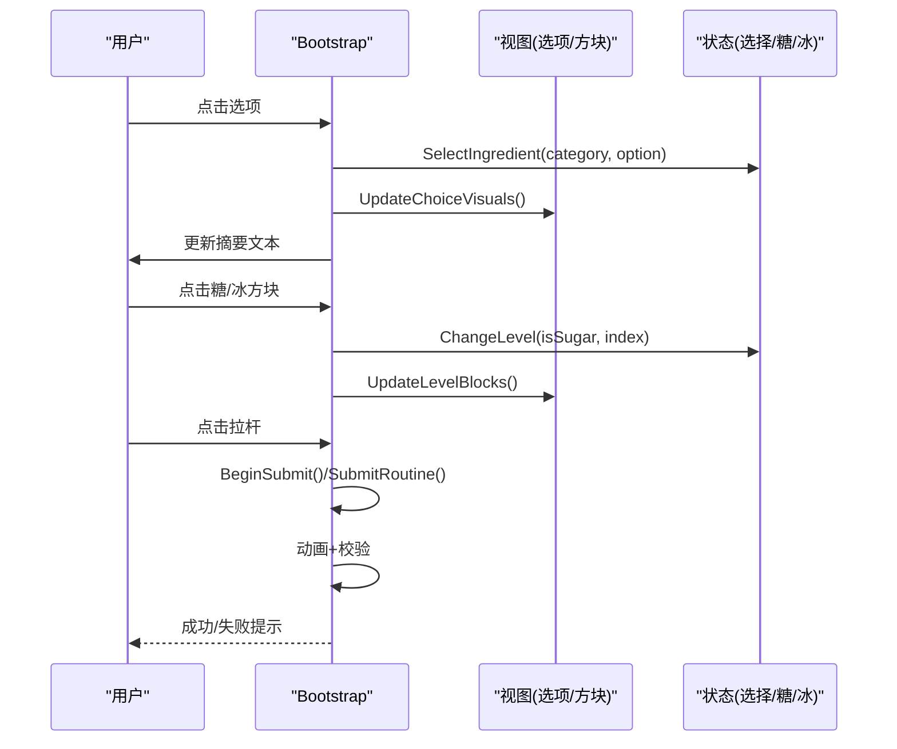
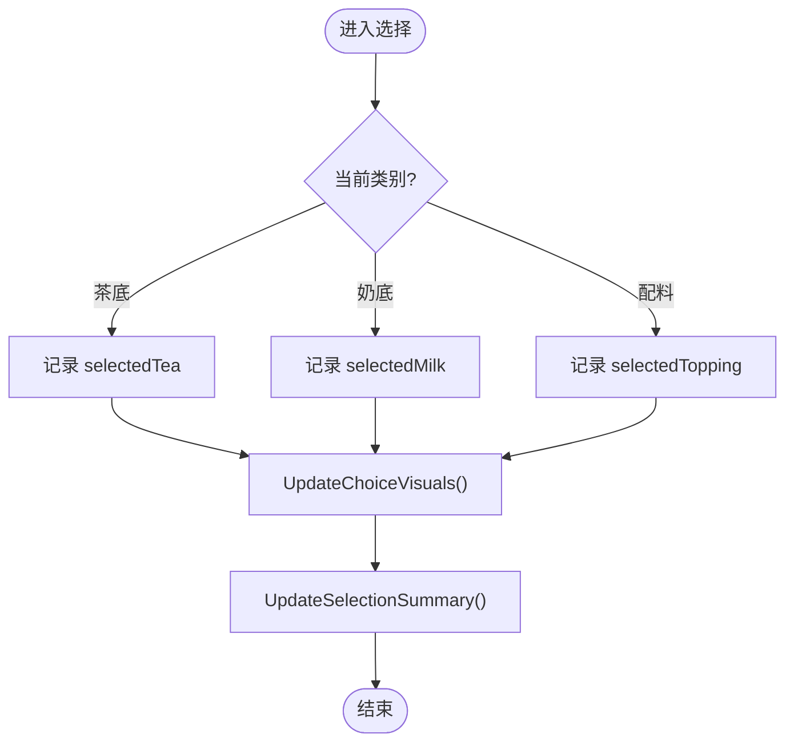
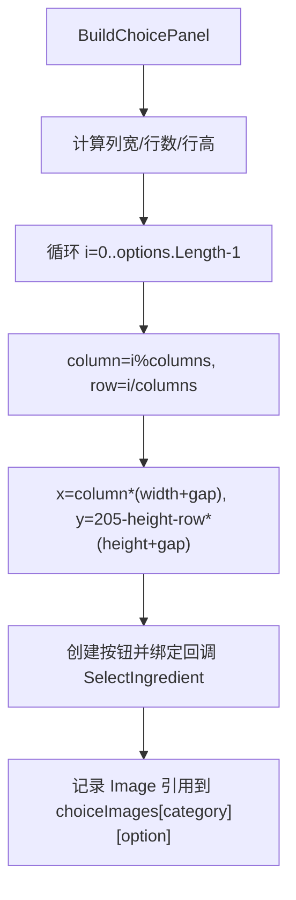
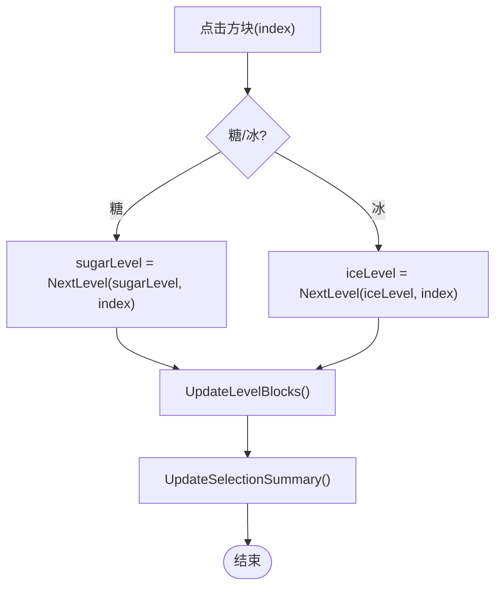
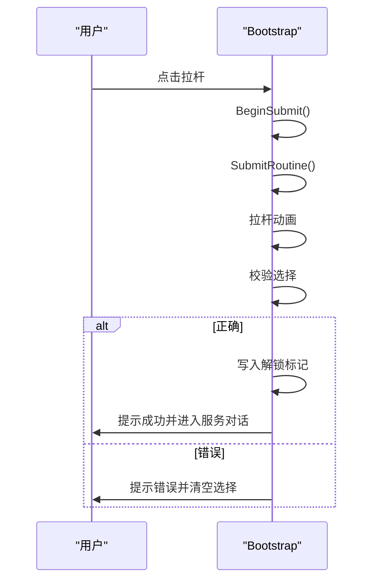
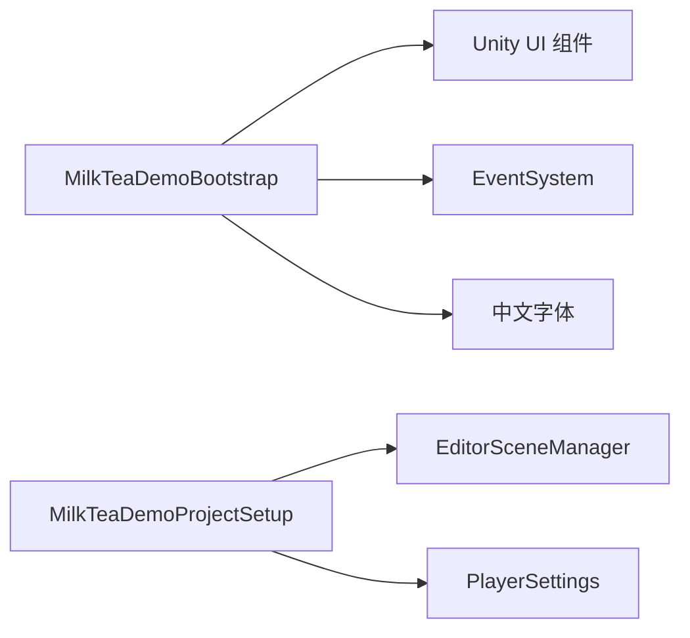

# 原料管理系统

<cite>
**本文引用的文件**
- [MilkTeaDemoBootstrap.cs](file://Assets/Scripts/MilkTeaDemoBootstrap.cs)
- [MilkTeaDemoProjectSetup.cs](file://Assets/Editor/MilkTeaDemoProjectSetup.cs)
</cite>

## 目录
1. [简介](#简介)
2. [项目结构](#项目结构)
3. [核心组件](#核心组件)
4. [架构总览](#架构总览)
5. [详细组件分析](#详细组件分析)
6. [依赖关系分析](#依赖关系分析)
7. [性能考量](#性能考量)
8. [故障排查指南](#故障排查指南)
9. [结论](#结论)
10. [附录](#附录)

## 简介
本技术文档围绕奶茶店模拟经营中的“原料管理系统”展开，重点解析以下能力：
- IngredientCategory 枚举的设计与三类原料（茶底、奶底、配料）的分类管理
- SelectIngredient() 选择逻辑、ChangeCategory() 分类切换、UpdateChoiceVisuals() 视觉反馈更新
- 选项面板的动态生成机制 BuildChoicePanel()，包括根据选项数量自动计算布局
- 糖度与冰度的三级调节系统：NextLevel() 状态转换与 UpdateLevelBlocks() 视觉更新
- 原料数据结构的扩展指南与选择状态的持久化方案

该实现以单脚本驱动 UI 的方式完成，便于快速演示与迭代。

## 项目结构
- Assets/Scripts/MilkTeaDemoBootstrap.cs：运行时主逻辑，负责界面构建、原料选择、糖冰调节、提交校验与结果展示
- Assets/Editor/MilkTeaDemoProjectSetup.cs：编辑器初始化配置，确保场景存在并设置运行参数

图表来源
- [MilkTeaDemoBootstrap.cs:83-192](file://Assets/Scripts/MilkTeaDemoBootstrap.cs#L83-L192)
- [MilkTeaDemoProjectSetup.cs:27-55](file://Assets/Editor/MilkTeaDemoProjectSetup.cs#L27-L55)

章节来源
- [MilkTeaDemoBootstrap.cs:83-192](file://Assets/Scripts/MilkTeaDemoBootstrap.cs#L83-L192)
- [MilkTeaDemoProjectSetup.cs:27-55](file://Assets/Editor/MilkTeaDemoProjectSetup.cs#L27-L55)

## 核心组件
- 原料分类枚举：IngredientCategory（茶底、奶底、配料），用于组织选项面板与当前类别切换
- 选择状态：selectedTea、selectedMilk、selectedTopping；糖度 sugarLevel；冰度 iceLevel
- 视觉映射：choiceImages 将每个选项的 Image 与名称关联，用于高亮选中项
- 布局计算：BuildChoicePanel() 根据 options.Length 和 columns 动态计算行高、列宽与间距
- 等级调节：NextLevel() 实现无糖/少糖/多糖与去冰/少冰/多冰的循环切换；UpdateLevelBlocks() 刷新方块颜色
- 提交流程：BeginSubmit() 触发拉杆动画，校验选择是否符合订单需求，成功则解锁配方并进入服务对话

章节来源
- [MilkTeaDemoBootstrap.cs:10-15](file://Assets/Scripts/MilkTeaDemoBootstrap.cs#L10-L15)
- [MilkTeaDemoBootstrap.cs:47-60](file://Assets/Scripts/MilkTeaDemoBootstrap.cs#L47-L60)
- [MilkTeaDemoBootstrap.cs:268-293](file://Assets/Scripts/MilkTeaDemoBootstrap.cs#L268-L293)
- [MilkTeaDemoBootstrap.cs:413-455](file://Assets/Scripts/MilkTeaDemoBootstrap.cs#L413-L455)
- [MilkTeaDemoBootstrap.cs:465-514](file://Assets/Scripts/MilkTeaDemoBootstrap.cs#L465-L514)

## 架构总览
整体采用“单脚本驱动 UI + 状态机”的轻量架构：
- 启动后创建 Canvas 与两个屏幕（对话屏、调配屏）
- 调配屏包含配方区、原料区、机器区
- 原料区按类别显示选项，点击后更新选择状态与视觉
- 糖/冰通过两级方块表示三级状态，点击任一方块进行状态跳转
- 机器区提供提交按钮，带动画与校验，成功后持久化解锁信息

图表来源
- [MilkTeaDemoBootstrap.cs:381-411](file://Assets/Scripts/MilkTeaDemoBootstrap.cs#L381-L411)
- [MilkTeaDemoBootstrap.cs:413-455](file://Assets/Scripts/MilkTeaDemoBootstrap.cs#L413-L455)
- [MilkTeaDemoBootstrap.cs:465-514](file://Assets/Scripts/MilkTeaDemoBootstrap.cs#L465-L514)

## 详细组件分析

### 原料分类与选择
- 分类枚举：IngredientCategory 包含 Tea、Milk、Topping，配合 CategoryName() 输出中文标签
- 类别切换：ChangeCategory(direction) 使用模运算在三个类别间循环，并调用 UpdateCategoryView() 刷新可见性与标题
- 选择逻辑：SelectIngredient(category, option) 将选项写入对应字段，随后刷新视觉与摘要
- 视觉反馈：UpdateChoiceVisuals() 遍历 choiceImages，将选中项对应的 Image 高亮为主题色，未选中恢复面板色

图表来源
- [MilkTeaDemoBootstrap.cs:361-379](file://Assets/Scripts/MilkTeaDemoBootstrap.cs#L361-L379)
- [MilkTeaDemoBootstrap.cs:381-411](file://Assets/Scripts/MilkTeaDemoBootstrap.cs#L381-L411)
- [MilkTeaDemoBootstrap.cs:457-463](file://Assets/Scripts/MilkTeaDemoBootstrap.cs#L457-L463)

章节来源
- [MilkTeaDemoBootstrap.cs:361-411](file://Assets/Scripts/MilkTeaDemoBootstrap.cs#L361-L411)

### 选项面板动态布局
- BuildChoicePanel(parent, category, options, columns)：
  - 计算列宽：width = (容器宽 - 间隙*(columns-1)) / columns
  - 计算行数：rows = ceil(options.Length / columns)
  - 计算行高：height = min(固定最大高度, (容器高 - 间隙*(rows-1)) / rows)
  - 按行列坐标放置按钮，并将选项名映射到 Image 以便后续高亮
- 不同类别传入不同 options 与 columns：
  - 茶底：4 个选项，4 列
  - 奶底：3 个选项，3 列
  - 配料：9 个选项，3 列（自动换行）

图表来源
- [MilkTeaDemoBootstrap.cs:268-293](file://Assets/Scripts/MilkTeaDemoBootstrap.cs#L268-L293)

章节来源
- [MilkTeaDemoBootstrap.cs:268-293](file://Assets/Scripts/MilkTeaDemoBootstrap.cs#L268-L293)

### 糖度与冰度的三级调节
- 状态表示：sugarLevel、iceLevel ∈ {0, 1, 2}，分别对应无糖/少糖/多糖与去冰/少冰/多冰
- 状态转换：NextLevel(current, clickedIndex)
  - 从 0 开始：点击左块→1，点击右块→2
  - 从 1 开始：点击左块→0，点击右块→2
  - 从 2 开始：点击左块→1，点击右块→0
- 视觉更新：UpdateLevelBlocks() 将前 level 个方块置为主题色，其余置灰
- 交互入口：CreateLevelBlock() 创建可点击方块，绑定 ChangeLevel(isSugar, index)

图表来源
- [MilkTeaDemoBootstrap.cs:413-455](file://Assets/Scripts/MilkTeaDemoBootstrap.cs#L413-L455)

章节来源
- [MilkTeaDemoBootstrap.cs:413-455](file://Assets/Scripts/MilkTeaDemoBootstrap.cs#L413-L455)

### 提交与校验流程
- BeginSubmit() 防止重复提交，调用协程 SubmitRoutine()
- 动画：拉杆旋转至角度，停留片刻复位
- 校验：检查茶底、奶底、配料与糖冰是否匹配订单需求
- 成功：写入 PlayerPrefs 解锁标记，更新配方图标，进入服务对话
- 失败：提示错误，清空选择，允许重新提交

图表来源
- [MilkTeaDemoBootstrap.cs:465-514](file://Assets/Scripts/MilkTeaDemoBootstrap.cs#L465-L514)

章节来源
- [MilkTeaDemoBootstrap.cs:465-514](file://Assets/Scripts/MilkTeaDemoBootstrap.cs#L465-L514)

### 数据结构与扩展指南
- 当前数据结构
  - 分类枚举：IngredientCategory（可扩展新类别）
  - 选择字段：selectedTea、selectedMilk、selectedTopping（字符串）
  - 等级字段：sugarLevel、iceLevel（整数 0-2）
  - 视觉映射：choiceImages[category][option] → Image
- 扩展建议
  - 新增类别：在枚举中添加新成员，并在 BuildIngredientPanel() 中注册新的 BuildChoicePanel() 调用
  - 新增选项：为对应类别的 options 数组追加元素，必要时调整 columns 以获得最佳布局
  - 新增等级维度：若需增加“甜度档位”或“风味强度”，可引入新的 Level 结构与 NextLevel/UpdateLevelBlocks 变体
  - 数据源抽象：将硬编码的 options 抽取为外部数据表（如 ScriptableObject/JSON），便于策划配置与本地化

章节来源
- [MilkTeaDemoBootstrap.cs:10-15](file://Assets/Scripts/MilkTeaDemoBootstrap.cs#L10-L15)
- [MilkTeaDemoBootstrap.cs:220-266](file://Assets/Scripts/MilkTeaDemoBootstrap.cs#L220-L266)
- [MilkTeaDemoBootstrap.cs:268-293](file://Assets/Scripts/MilkTeaDemoBootstrap.cs#L268-L293)

### 选择状态的持久化方案
- 现有持久化：使用 PlayerPrefs 存储“经典珍珠奶茶已解锁”标记，键名为常量 UnlockKey
- 推荐扩展
  - 保存完整选择：将 selectedTea、selectedMilk、selectedTopping、sugarLevel、iceLevel 序列化后存入 PlayerPrefs 或 JSON 文件
  - 版本兼容：在读取时处理旧格式缺失字段，提供默认值
  - 多存档：引入 slotId 区分多个订单或会话
  - 安全与体验：避免频繁写盘，仅在关键节点（提交成功/退出应用）保存；读取时延迟加载

章节来源
- [MilkTeaDemoBootstrap.cs:17-17](file://Assets/Scripts/MilkTeaDemoBootstrap.cs#L17-L17)
- [MilkTeaDemoBootstrap.cs:490-498](file://Assets/Scripts/MilkTeaDemoBootstrap.cs#L490-L498)

## 依赖关系分析
- 运行时依赖
  - Unity UI：Canvas、RectTransform、Text、Button、Image
  - 事件系统：EventSystem、StandaloneInputModule（自动创建）
  - 字体：动态创建中文字体，回退到内置 Arial
- 编辑器依赖
  - EditorSceneManager、PlayerSettings：初始化场景与窗口参数
- 耦合性
  - 单类高内聚：所有 UI 构建与业务逻辑集中在一个 MonoBehaviour，便于演示但后期需拆分
  - 低外部依赖：不依赖第三方库，易于移植

图表来源
- [MilkTeaDemoBootstrap.cs:697-718](file://Assets/Scripts/MilkTeaDemoBootstrap.cs#L697-L718)
- [MilkTeaDemoProjectSetup.cs:27-55](file://Assets/Editor/MilkTeaDemoProjectSetup.cs#L27-L55)

章节来源
- [MilkTeaDemoBootstrap.cs:697-718](file://Assets/Scripts/MilkTeaDemoBootstrap.cs#L697-L718)
- [MilkTeaDemoProjectSetup.cs:27-55](file://Assets/Editor/MilkTeaDemoProjectSetup.cs#L27-L55)

## 性能考量
- UI 构建一次性：Awake/BuildInterface 中集中创建，避免运行时频繁 Instantiate
- 布局计算 O(n)：选项数量较少，计算开销可忽略
- 视觉更新局部刷新：仅对当前类别的选项与方块进行颜色更新，避免全量重绘
- 提交动画使用协程与 Time.deltaTime，帧率友好
- 建议
  - 当选项规模扩大时，考虑对象池复用按钮与图片
  - 将颜色与尺寸等常量抽离为配置，减少魔法数字

## 故障排查指南
- 无法输入或按钮无响应
  - 确认 EventSystem 已创建（代码会在运行时自动补建）
  - 检查 Canvas 渲染模式与排序层是否正确
- 中文字体显示异常
  - 动态字体创建失败会回退到 Arial，建议在工程中预置中文字体资源
- 选项布局错乱
  - 检查 columns 与 options.Length 的组合，确保能整除或合理换行
  - 调整 gap 与容器尺寸，避免重叠
- 提交无反应或重复提交
  - 检查 isSubmitting 标志位与 leverButton.interactable 控制
  - 确认协程未被中断或提前销毁
- 糖/冰状态不更新
  - 确认 CreateLevelBlock 绑定的 action 正确传入 ChangeLevel
  - 检查 UpdateLevelBlocks 索引范围与方块数量一致

章节来源
- [MilkTeaDemoBootstrap.cs:697-718](file://Assets/Scripts/MilkTeaDemoBootstrap.cs#L697-L718)
- [MilkTeaDemoBootstrap.cs:465-514](file://Assets/Scripts/MilkTeaDemoBootstrap.cs#L465-L514)
- [MilkTeaDemoBootstrap.cs:268-293](file://Assets/Scripts/MilkTeaDemoBootstrap.cs#L268-L293)

## 结论
该原料管理系统以简洁的单脚本实现了完整的奶茶调配流程，涵盖分类选择、动态布局、三级糖冰调节与提交校验。其设计清晰、扩展点明确，适合快速原型与教学演示。后续可按“数据源抽象、模块拆分、持久化增强”的方向演进，以支撑更复杂的配方系统与多订单并发。

## 附录
- 关键方法路径参考
  - 分类切换：[ChangeCategory:361-368](file://Assets/Scripts/MilkTeaDemoBootstrap.cs#L361-L368)
  - 选择逻辑：[SelectIngredient:381-399](file://Assets/Scripts/MilkTeaDemoBootstrap.cs#L381-L399)
  - 视觉更新：[UpdateChoiceVisuals:401-411](file://Assets/Scripts/MilkTeaDemoBootstrap.cs#L401-L411)
  - 动态布局：[BuildChoicePanel:268-293](file://Assets/Scripts/MilkTeaDemoBootstrap.cs#L268-L293)
  - 等级切换：[NextLevel:429-442](file://Assets/Scripts/MilkTeaDemoBootstrap.cs#L429-L442)
  - 等级视觉：[UpdateLevelBlocks:444-455](file://Assets/Scripts/MilkTeaDemoBootstrap.cs#L444-L455)
  - 提交流程：[BeginSubmit/SubmitRoutine:465-514](file://Assets/Scripts/MilkTeaDemoBootstrap.cs#L465-L514)
  - 编辑器初始化：[MilkTeaDemoProjectSetup:27-55](file://Assets/Editor/MilkTeaDemoProjectSetup.cs#L27-L55)