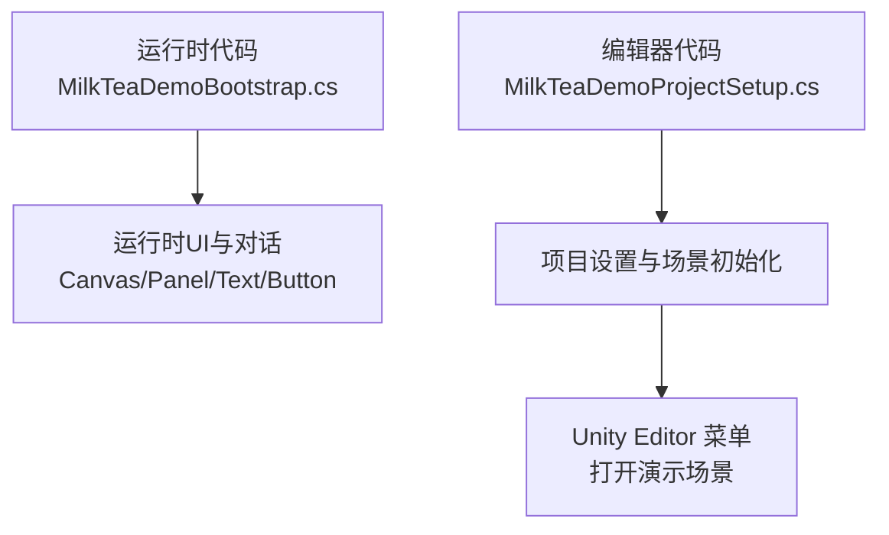
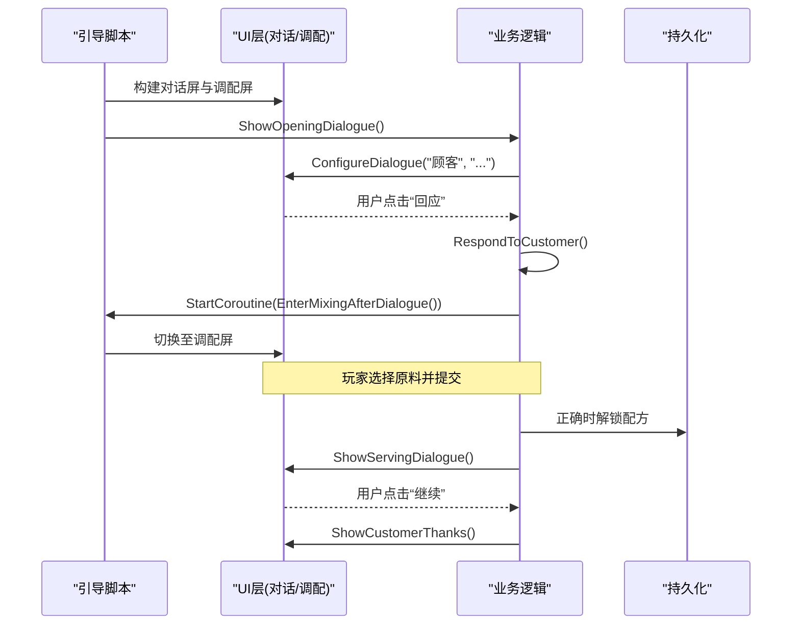
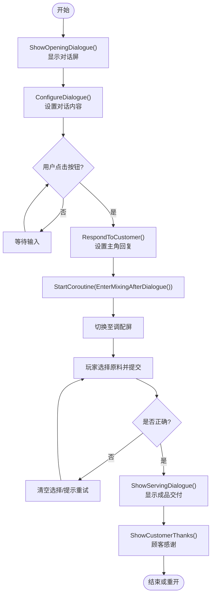
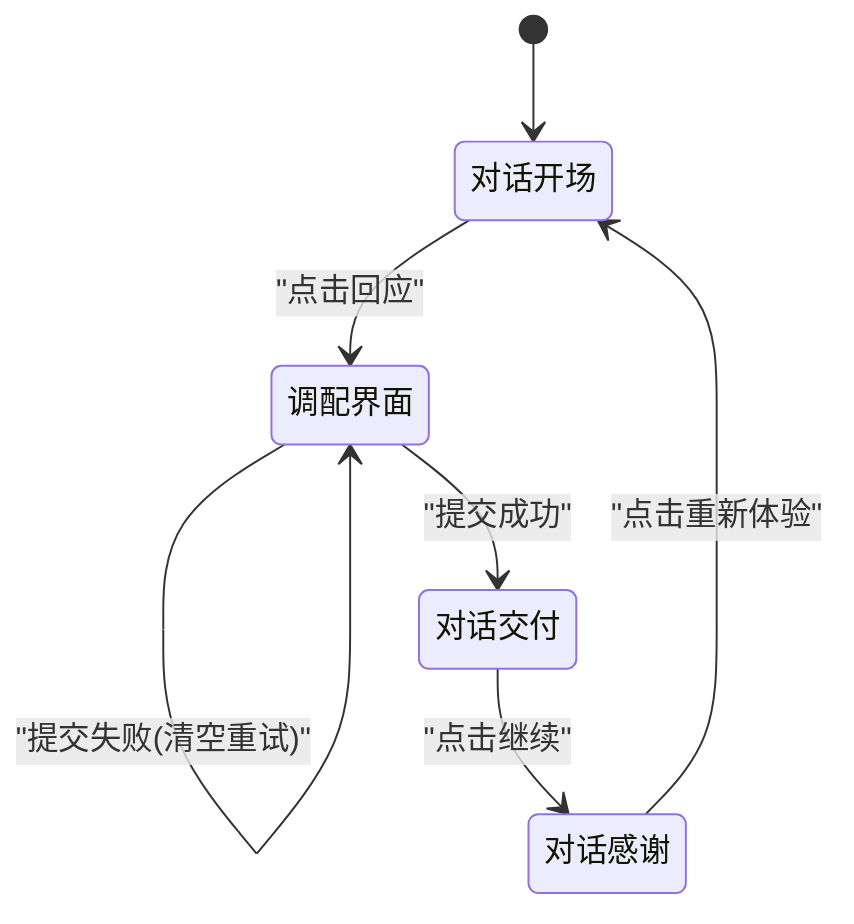
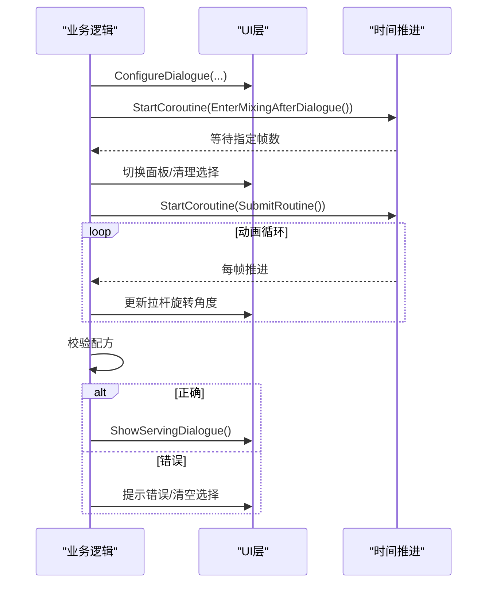
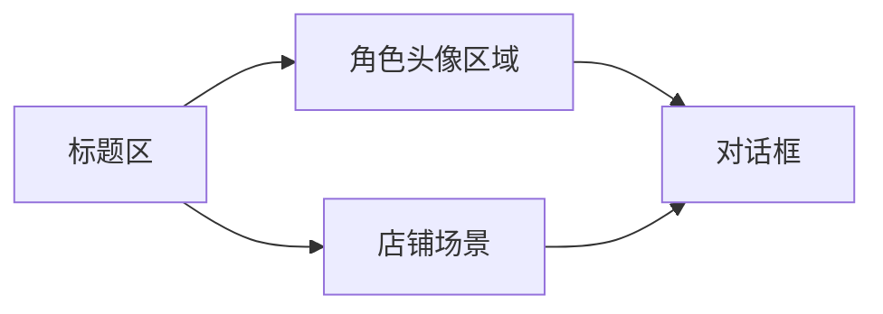
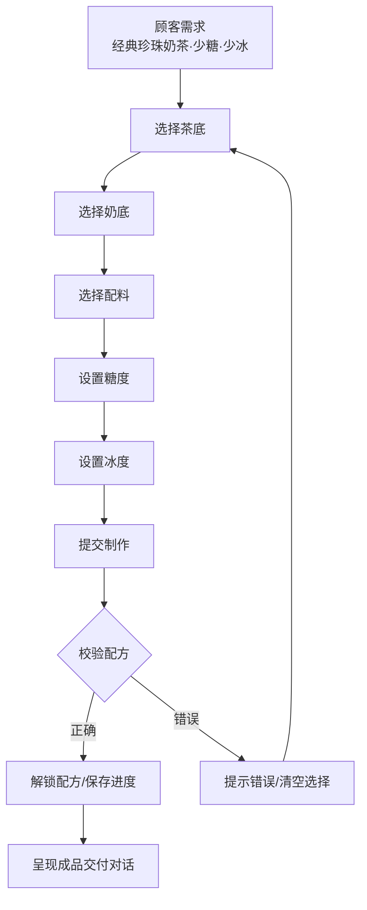
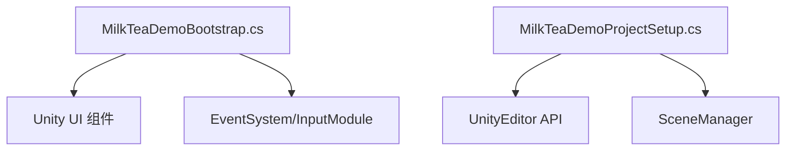

# 对话系统设计

<cite>
**本文引用的文件**
- [MilkTeaDemoBootstrap.cs](file://Assets/Scripts/MilkTeaDemoBootstrap.cs)
- [MilkTeaDemoProjectSetup.cs](file://Assets/Editor/MilkTeaDemoProjectSetup.cs)
</cite>

## 目录
1. [简介](#简介)
2. [项目结构](#项目结构)
3. [核心组件](#核心组件)
4. [架构总览](#架构总览)
5. [详细组件分析](#详细组件分析)
6. [依赖关系分析](#依赖关系分析)
7. [性能考量](#性能考量)
8. [故障排查指南](#故障排查指南)
9. [结论](#结论)
10. [附录：扩展与最佳实践](#附录：扩展与最佳实践)

## 简介
本技术文档围绕奶茶店模拟经营项目的对话系统展开，重点解析对话驱动流程的实现机制，包括开场对话、对话配置与服务对话等核心方法；说明对话状态管理、场景切换逻辑与协程控制；阐述对话界面的构建过程（角色头像区域、店铺场景、对话框布局）；提供对话流程的状态图与数据流图，覆盖从顾客点单到制作完成的完整序列；并给出自定义对话内容的扩展方法与最佳实践指导。

## 项目结构
- 运行时脚本位于 Assets/Scripts/MilkTeaDemoBootstrap.cs，负责在运行时动态创建 UI、管理对话与调配交互。
- 编辑器脚本位于 Assets/Editor/MilkTeaDemoProjectSetup.cs，用于初始化项目设置、确保演示场景存在并提供菜单入口。

图表来源
- [MilkTeaDemoBootstrap.cs:74-114](file://Assets/Scripts/MilkTeaDemoBootstrap.cs#L74-L114)
- [MilkTeaDemoProjectSetup.cs:20-55](file://Assets/Editor/MilkTeaDemoProjectSetup.cs#L20-L55)

章节来源
- [MilkTeaDemoBootstrap.cs:62-114](file://Assets/Scripts/MilkTeaDemoBootstrap.cs#L62-L114)
- [MilkTeaDemoProjectSetup.cs:8-55](file://Assets/Editor/MilkTeaDemoProjectSetup.cs#L8-L55)

## 核心组件
- 对话屏幕与调配屏幕：通过两个根面板切换显示，分别承载对话界面与调配操作界面。
- 对话框组件：包含说话者文本、对话行文本、继续按钮，统一由配置方法更新。
- 原料选择与机器面板：用于选择茶底、奶底、配料以及糖度/冰度，并通过拉杆提交制作。
- 协程控制：使用协程实现延迟与动画过渡，避免阻塞主线程。

章节来源
- [MilkTeaDemoBootstrap.cs:116-156](file://Assets/Scripts/MilkTeaDemoBootstrap.cs#L116-L156)
- [MilkTeaDemoBootstrap.cs:158-192](file://Assets/Scripts/MilkTeaDemoBootstrap.cs#L158-L192)
- [MilkTeaDemoBootstrap.cs:314-359](file://Assets/Scripts/MilkTeaDemoBootstrap.cs#L314-L359)
- [MilkTeaDemoBootstrap.cs:465-514](file://Assets/Scripts/MilkTeaDemoBootstrap.cs#L465-L514)

## 架构总览
整体采用“单脚本驱动 + 运行时动态UI”的轻量架构。启动后自动创建 Canvas 与两套全屏面板（对话屏、调配屏），通过激活/停用完成场景切换；对话流程以回调函数串联，配合协程进行时序控制。

图表来源
- [MilkTeaDemoBootstrap.cs:74-114](file://Assets/Scripts/MilkTeaDemoBootstrap.cs#L74-L114)
- [MilkTeaDemoBootstrap.cs:314-359](file://Assets/Scripts/MilkTeaDemoBootstrap.cs#L314-L359)
- [MilkTeaDemoBootstrap.cs:465-514](file://Assets/Scripts/MilkTeaDemoBootstrap.cs#L465-L514)

## 详细组件分析

### 对话驱动流程
- ShowOpeningDialogue()：隐藏调配屏、显示对话屏，调用配置方法展示顾客点单内容，并绑定“回应”回调。
- ConfigureDialogue()：统一更新说话者、对话行、按钮文案，并注册点击事件；当无动作时禁用按钮。
- RespondToCustomer()：更新主角回复，启动协程等待短暂时间后切换到调配屏。
- EnterMixingAfterDialogue()：协程中切换面板、清空选择、恢复订单提示。
- ShowServingDialogue()：制作完成后回到对话屏，展示成品交付信息。
- ShowCustomerThanks()：顾客致谢，并提供“重新体验”入口回到开场。

图表来源
- [MilkTeaDemoBootstrap.cs:314-359](file://Assets/Scripts/MilkTeaDemoBootstrap.cs#L314-L359)
- [MilkTeaDemoBootstrap.cs:465-514](file://Assets/Scripts/MilkTeaDemoBootstrap.cs#L465-L514)

章节来源
- [MilkTeaDemoBootstrap.cs:314-359](file://Assets/Scripts/MilkTeaDemoBootstrap.cs#L314-L359)
- [MilkTeaDemoBootstrap.cs:465-514](file://Assets/Scripts/MilkTeaDemoBootstrap.cs#L465-L514)

### 对话状态管理与场景切换
- 状态变量：当前类别、已选茶底/奶底/配料、糖度/冰度、是否正在提交等。
- 场景切换：通过 dialogueScreen 与 mixingScreen 的 Active 属性切换，保证同一时刻仅一个界面可见。
- 状态重置：进入调配屏时清空选择并恢复订单提示；错误提交时同样清空并重试。

图表来源
- [MilkTeaDemoBootstrap.cs:314-359](file://Assets/Scripts/MilkTeaDemoBootstrap.cs#L314-L359)
- [MilkTeaDemoBootstrap.cs:465-514](file://Assets/Scripts/MilkTeaDemoBootstrap.cs#L465-L514)

章节来源
- [MilkTeaDemoBootstrap.cs:314-359](file://Assets/Scripts/MilkTeaDemoBootstrap.cs#L314-L359)
- [MilkTeaDemoBootstrap.cs:465-514](file://Assets/Scripts/MilkTeaDemoBootstrap.cs#L465-L514)

### 协程控制与时序
- EnterMixingAfterDialogue()：使用 WaitForSeconds 实现对话后的延时切换，避免瞬间跳变。
- SubmitRoutine()：实现拉杆拉动的旋转动画，并在结束后校验配方结果，根据结果进入不同分支。

图表来源
- [MilkTeaDemoBootstrap.cs:327-334](file://Assets/Scripts/MilkTeaDemoBootstrap.cs#L327-L334)
- [MilkTeaDemoBootstrap.cs:473-514](file://Assets/Scripts/MilkTeaDemoBootstrap.cs#L473-L514)

章节来源
- [MilkTeaDemoBootstrap.cs:327-334](file://Assets/Scripts/MilkTeaDemoBootstrap.cs#L327-L334)
- [MilkTeaDemoBootstrap.cs:473-514](file://Assets/Scripts/MilkTeaDemoBootstrap.cs#L473-L514)

### 对话界面构建
- 标题区：显示“第 1 天 · 营业中”。
- 角色头像区域：左侧面板预留顾客立绘占位与说明文字。
- 店铺场景：右侧俯视小场景，含吧台、桌子、后厨与Q版角色。
- 对话框：底部深色面板，包含说话者、对话行与“继续”按钮。

图表来源
- [MilkTeaDemoBootstrap.cs:116-156](file://Assets/Scripts/MilkTeaDemoBootstrap.cs#L116-L156)

章节来源
- [MilkTeaDemoBootstrap.cs:116-156](file://Assets/Scripts/MilkTeaDemoBootstrap.cs#L116-L156)

### 数据流图（从点单到制作完成）

图表来源
- [MilkTeaDemoBootstrap.cs:381-427](file://Assets/Scripts/MilkTeaDemoBootstrap.cs#L381-L427)
- [MilkTeaDemoBootstrap.cs:465-514](file://Assets/Scripts/MilkTeaDemoBootstrap.cs#L465-L514)

章节来源
- [MilkTeaDemoBootstrap.cs:381-427](file://Assets/Scripts/MilkTeaDemoBootstrap.cs#L381-L427)
- [MilkTeaDemoBootstrap.cs:465-514](file://Assets/Scripts/MilkTeaDemoBootstrap.cs#L465-L514)

## 依赖关系分析
- MilkTeaDemoBootstrap 依赖 Unity UI 组件（Canvas、Panel、Text、Button）、Outline、EventSystem 等运行时能力。
- 编辑器脚本依赖 UnityEditor 与 SceneManager，用于项目初始化与场景管理。
- 运行时与编辑器职责清晰分离：运行时专注交互与对话流程，编辑器专注环境准备。

图表来源
- [MilkTeaDemoBootstrap.cs:74-114](file://Assets/Scripts/MilkTeaDemoBootstrap.cs#L74-L114)
- [MilkTeaDemoProjectSetup.cs:20-55](file://Assets/Editor/MilkTeaDemoProjectSetup.cs#L20-L55)

章节来源
- [MilkTeaDemoBootstrap.cs:74-114](file://Assets/Scripts/MilkTeaDemoBootstrap.cs#L74-L114)
- [MilkTeaDemoProjectSetup.cs:8-55](file://Assets/Editor/MilkTeaDemoProjectSetup.cs#L8-L55)

## 性能考量
- 动态创建 UI：Awake 阶段一次性构建界面，避免频繁 Instantiate 带来的开销。
- 协程动画：使用逐帧推进与短时间等待，保持流畅且低 CPU 占用。
- 状态最小化：仅维护必要状态（当前类别、已选项、糖冰等级、提交标志），降低内存与计算压力。
- 资源占位：当前使用文本占位替代图片，便于快速迭代；后续可替换为 Sprite 以提升表现力。

[本节为通用性能建议，不直接分析具体文件]

## 故障排查指南
- 字体显示异常：检查动态字体创建逻辑，若目标系统缺少中文字体将回退到内置 Arial。
- 事件无效：确保 EventSystem 已创建；脚本会在运行时自动检测并补充。
- 对话按钮不可用：确认 ConfigureDialogue 传入的 action 是否为空；为空时按钮会被禁用。
- 场景切换闪烁：检查协程中的等待时间与面板切换顺序，确保先隐藏再显示对应面板。
- 配方校验失败：核对选择项与期望值（茶底=红茶、奶底=鲜奶、配料=珍珠、糖度=少糖、冰度=少冰）。

章节来源
- [MilkTeaDemoBootstrap.cs:697-718](file://Assets/Scripts/MilkTeaDemoBootstrap.cs#L697-L718)
- [MilkTeaDemoBootstrap.cs:348-359](file://Assets/Scripts/MilkTeaDemoBootstrap.cs#L348-L359)
- [MilkTeaDemoBootstrap.cs:490-514](file://Assets/Scripts/MilkTeaDemoBootstrap.cs#L490-L514)

## 结论
该对话系统以单一引导脚本为核心，结合运行时动态 UI 与协程控制，实现了从顾客点单到制作交付的完整闭环。其设计简洁、职责清晰，易于扩展新的对话节点与交互流程。通过合理的状态管理与场景切换策略，保证了良好的用户体验与可维护性。

[本节为总结性内容，不直接分析具体文件]

## 附录：扩展与最佳实践
- 扩展对话内容
  - 新增对话节点：复用 ConfigureDialogue()，传入新的说话者、台词、按钮文案与回调函数。
  - 多分支对话：在回调中根据条件调用不同的 ConfigureDialogue()，形成分支树。
  - 异步加载：如需加载外部资源（立绘、音效），可在回调中使用协程进行异步处理。
- 最佳实践
  - 将对话数据外置：使用 JSON/ScriptableObject 管理台词与分支，便于本地化与策划配置。
  - 统一样式：集中管理颜色、字号与排版参数，便于主题切换。
  - 防重复提交：利用 isSubmitting 标志防止重复触发提交逻辑。
  - 可测试性：将关键逻辑（如配方校验）抽取为纯函数，便于单元测试。
  - 性能优化：批量更新 UI 文本与颜色，减少每帧多次赋值。

[本节为通用指导，不直接分析具体文件]