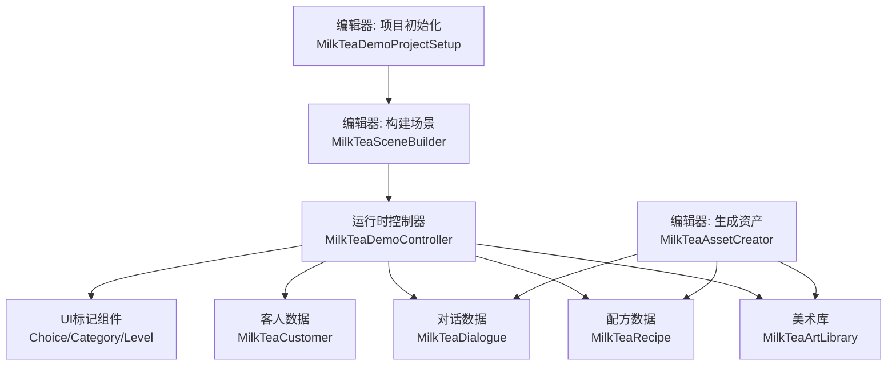
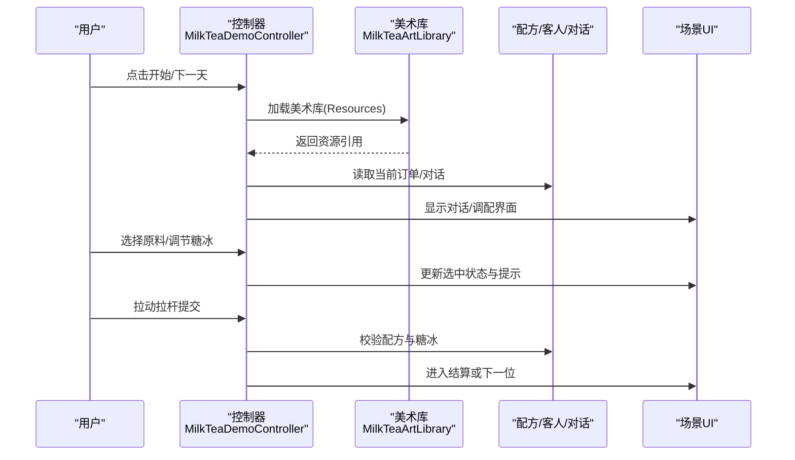
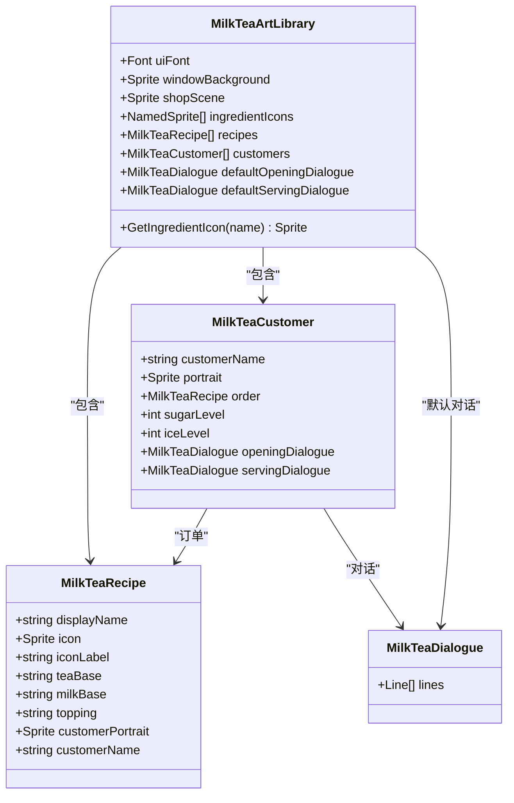
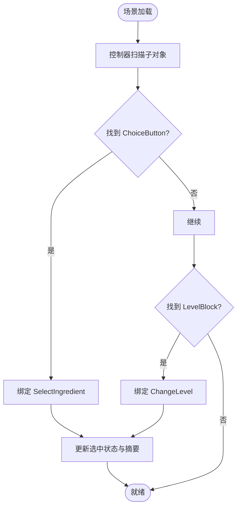
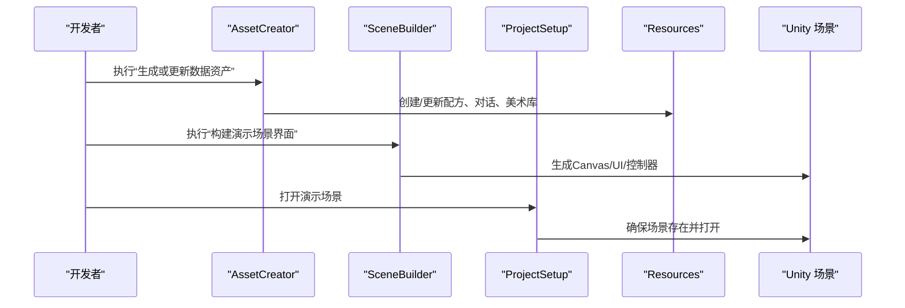
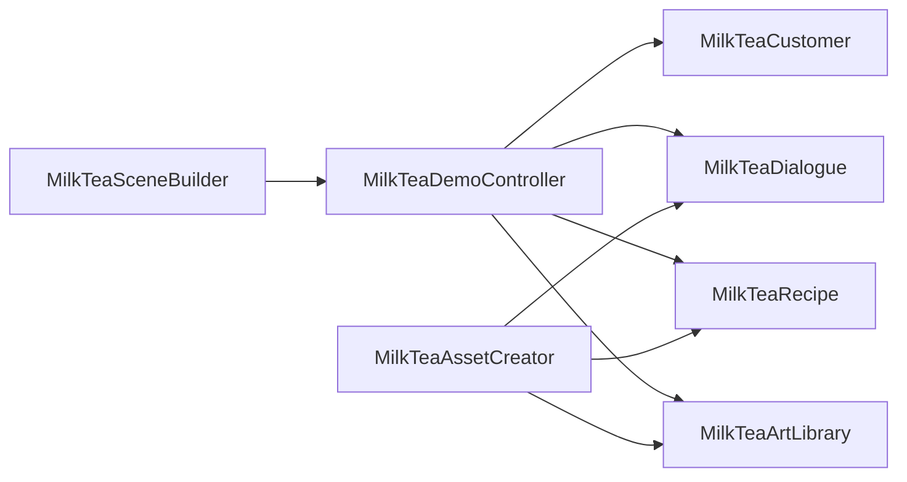

# 扩展开发指南

<cite>
**本文引用的文件**
- [MilkTeaDemoController.cs](file://Assets/Scripts/MilkTeaDemoController.cs)
- [MilkTeaRecipe.cs](file://Assets/Scripts/MilkTeaRecipe.cs)
- [MilkTeaCustomer.cs](file://Assets/Scripts/MilkTeaCustomer.cs)
- [MilkTeaDialogue.cs](file://Assets/Scripts/MilkTeaDialogue.cs)
- [MilkTeaArtLibrary.cs](file://Assets/Scripts/MilkTeaArtLibrary.cs)
- [MilkTeaChoiceButton.cs](file://Assets/Scripts/MilkTeaChoiceButton.cs)
- [MilkTeaCategoryPanel.cs](file://Assets/Scripts/MilkTeaCategoryPanel.cs)
- [MilkTeaLevelBlock.cs](file://Assets/Scripts/MilkTeaLevelBlock.cs)
- [MilkTeaAssetCreator.cs](file://Assets/Editor/MilkTeaAssetCreator.cs)
- [MilkTeaSceneBuilder.cs](file://Assets/Editor/MilkTeaSceneBuilder.cs)
- [MilkTeaDemoProjectSetup.cs](file://Assets/Editor/MilkTeaDemoProjectSetup.cs)
</cite>

## 目录
1. [简介](#简介)
2. [项目结构](#项目结构)
3. [核心组件](#核心组件)
4. [架构总览](#架构总览)
5. [详细组件分析](#详细组件分析)
6. [依赖关系分析](#依赖关系分析)
7. [性能与可维护性建议](#性能与可维护性建议)
8. [故障排查](#故障排查)
9. [结论](#结论)
10. [附录：扩展清单与步骤](#附录：扩展清单与步骤)

## 简介
本指南面向希望在“奶茶店模拟经营”Demo 基础上进行二次开发的开发者。文档从系统架构、数据模型、运行时流程、编辑器工具链等维度，说明如何扩展配方、客人、对话、UI 与场景，并给出最佳实践与常见问题排查方法。读者无需深入代码即可理解整体设计；需要落地的部分会提供精确的文件路径与行号引用。

## 项目结构
本项目采用“运行时脚本 + 编辑器工具 + 资源资产”的分层组织方式：
- 运行时脚本位于 Assets/Scripts，负责游戏逻辑、UI 驱动、数据绑定与状态流转。
- 编辑器脚本位于 Assets/Editor，提供一键生成数据资产、构建演示场景、初始化项目设置等能力。
- 资源资产位于 Assets/Resources，包含美术库、配方、对话等 ScriptableObject 数据。
- 场景位于 Assets/Scenes，由编辑器工具生成 UI 根节点与控制器挂载点。

图表来源
- [MilkTeaDemoController.cs:19-25](file://Assets/Scripts/MilkTeaDemoController.cs#L19-L25)
- [MilkTeaArtLibrary.cs:5-11](file://Assets/Scripts/MilkTeaArtLibrary.cs#L5-L11)
- [MilkTeaAssetCreator.cs:7-12](file://Assets/Editor/MilkTeaAssetCreator.cs#L7-L12)
- [MilkTeaSceneBuilder.cs:11-16](file://Assets/Editor/MilkTeaSceneBuilder.cs#L11-L16)
- [MilkTeaDemoProjectSetup.cs:8-18](file://Assets/Editor/MilkTeaDemoProjectSetup.cs#L8-L18)

章节来源
- [MilkTeaDemoController.cs:19-25](file://Assets/Scripts/MilkTeaDemoController.cs#L19-L25)
- [MilkTeaSceneBuilder.cs:11-16](file://Assets/Editor/MilkTeaSceneBuilder.cs#L11-L16)
- [MilkTeaAssetCreator.cs:7-12](file://Assets/Editor/MilkTeaAssetCreator.cs#L7-L12)
- [MilkTeaDemoProjectSetup.cs:8-18](file://Assets/Editor/MilkTeaDemoProjectSetup.cs#L8-L18)

## 核心组件
- 运行时控制器：集中管理界面切换、对话播放、原料选择、糖冰调节、提交判定、每日循环与结算。
- 数据资产：
  - 美术库：统一管理字体、背景、按钮皮肤、原料图标、配方列表、客人出场表、默认对话。
  - 配方：定义饮品名称、茶底、奶底、配料、图标与顾客信息。
  - 客人：定义顾客名、立绘、订单（配方）、糖度、冰度、开场与交付对话。
  - 对话：按行播放的台词数据，支持占位符替换。
- UI 标记组件：用于在场景中声明式地标注原料按钮、分类容器、糖冰方块，供控制器自动接线。
- 编辑器工具：
  - 资产创建器：一键生成配方、美术库、默认对话与示例客人。
  - 场景构建器：一键生成完整 UI 层级与控制器引用，便于可视化编辑与动画挂载。
  - 项目初始化：设置默认窗口尺寸、打开演示场景、注册到构建列表。

章节来源
- [MilkTeaDemoController.cs:19-25](file://Assets/Scripts/MilkTeaDemoController.cs#L19-L25)
- [MilkTeaArtLibrary.cs:5-11](file://Assets/Scripts/MilkTeaArtLibrary.cs#L5-L11)
- [MilkTeaRecipe.cs:3-8](file://Assets/Scripts/MilkTeaRecipe.cs#L3-L8)
- [MilkTeaCustomer.cs:3-10](file://Assets/Scripts/MilkTeaCustomer.cs#L3-L10)
- [MilkTeaDialogue.cs:5-11](file://Assets/Scripts/MilkTeaDialogue.cs#L5-L11)
- [MilkTeaChoiceButton.cs:3-7](file://Assets/Scripts/MilkTeaChoiceButton.cs#L3-L7)
- [MilkTeaCategoryPanel.cs:3-7](file://Assets/Scripts/MilkTeaCategoryPanel.cs#L3-L7)
- [MilkTeaLevelBlock.cs:3-7](file://Assets/Scripts/MilkTeaLevelBlock.cs#L3-L7)
- [MilkTeaAssetCreator.cs:7-12](file://Assets/Editor/MilkTeaAssetCreator.cs#L7-L12)
- [MilkTeaSceneBuilder.cs:11-16](file://Assets/Editor/MilkTeaSceneBuilder.cs#L11-L16)
- [MilkTeaDemoProjectSetup.cs:8-18](file://Assets/Editor/MilkTeaDemoProjectSetup.cs#L8-L18)

## 架构总览
运行时以 MilkTeaDemoController 为中枢，通过 Resources.Load 加载 MilkTeaArtLibrary，再读取其中的 recipes、customers、defaultOpeningDialogue/defaultServingDialogue 等资源。UI 由 MilkTeaSceneBuilder 在编辑器中一次性生成，控制器仅持有对已有 UI 组件的引用，避免运行时动态创建开销。

图表来源
- [MilkTeaDemoController.cs:196-206](file://Assets/Scripts/MilkTeaDemoController.cs#L196-L206)
- [MilkTeaDemoController.cs:447-480](file://Assets/Scripts/MilkTeaDemoController.cs#L447-L480)
- [MilkTeaDemoController.cs:531-575](file://Assets/Scripts/MilkTeaDemoController.cs#L531-L575)
- [MilkTeaDemoController.cs:615-679](file://Assets/Scripts/MilkTeaDemoController.cs#L615-L679)
- [MilkTeaSceneBuilder.cs:87-150](file://Assets/Editor/MilkTeaSceneBuilder.cs#L87-L150)

## 详细组件分析

### 运行时控制器 MilkTeaDemoController
职责
- 生命周期与初始化：加载美术库、构建配方、绑定 UI 事件、加载设置、显示开始界面。
- 对话系统：播放默认或角色专属对话，支持占位符替换与顺序推进。
- 订单解析：优先使用 customers 列表顺序点单，否则随机配方与糖冰。
- 原料选择：扫描场景中的 Choice/Category 标记，建立类别与选项映射，更新选中状态。
- 糖冰调节：根据 Level 标记更新视觉与数值。
- 提交与结算：校验选择，统计完美制作与失误，展示结算与休息界面。
- 设置与国际化：音量、分辨率、语言切换，持久化偏好。

关键流程
- 启动流程：Awake 中完成资源加载与 UI 连线，随后 ShowStartScreen。
- 每日流程：BeginDay -> ShowOpeningDialogue -> EnterMixing -> PlayOpeningDialogue -> 选择原料 -> 提交 -> ShowServingDialogue -> AdvanceAfterServe -> 结算或下一位。
- 开场动画：支持 VideoPlayer 播放或倒计时占位，支持跳过。

扩展要点
- 新增配方：在美术库中添加 MilkTeaRecipe，或在 AssetCreator 的 RecipeTable 中追加条目。
- 新增客人：在美术库 customers 列表添加 MilkTeaCustomer，并配置 opening/serving 对话。
- 自定义对话：新建 MilkTeaDialogue，使用 {customer}/{drink}/{sugar}/{ice} 占位符。
- 调整 UI：通过 SceneBuilder 生成的 Canvas 直接拖拽调整布局，或挂 Animator 做动画。

章节来源
- [MilkTeaDemoController.cs:196-206](file://Assets/Scripts/MilkTeaDemoController.cs#L196-L206)
- [MilkTeaDemoController.cs:384-445](file://Assets/Scripts/MilkTeaDemoController.cs#L384-L445)
- [MilkTeaDemoController.cs:447-516](file://Assets/Scripts/MilkTeaDemoController.cs#L447-L516)
- [MilkTeaDemoController.cs:531-575](file://Assets/Scripts/MilkTeaDemoController.cs#L531-L575)
- [MilkTeaDemoController.cs:615-679](file://Assets/Scripts/MilkTeaDemoController.cs#L615-L679)
- [MilkTeaDemoController.cs:709-800](file://Assets/Scripts/MilkTeaDemoController.cs#L709-L800)

### 数据资产模型
- MilkTeaArtLibrary：集中管理 UI 皮肤、背景、原料图标、配方列表、客人出场表、默认对话。提供 GetIngredientIcon 按名称查找图标。
- MilkTeaRecipe：定义饮品基础信息与可选剧情字段。
- MilkTeaCustomer：定义顾客身份、订单、糖冰、对话。
- MilkTeaDialogue：按行播放的对话数据结构，支持按钮标签与占位符。

图表来源
- [MilkTeaArtLibrary.cs:11-94](file://Assets/Scripts/MilkTeaArtLibrary.cs#L11-L94)
- [MilkTeaRecipe.cs:8-31](file://Assets/Scripts/MilkTeaRecipe.cs#L8-L31)
- [MilkTeaCustomer.cs:10-36](file://Assets/Scripts/MilkTeaCustomer.cs#L10-L36)
- [MilkTeaDialogue.cs:11-28](file://Assets/Scripts/MilkTeaDialogue.cs#L11-L28)

章节来源
- [MilkTeaArtLibrary.cs:11-94](file://Assets/Scripts/MilkTeaArtLibrary.cs#L11-L94)
- [MilkTeaRecipe.cs:8-31](file://Assets/Scripts/MilkTeaRecipe.cs#L8-L31)
- [MilkTeaCustomer.cs:10-36](file://Assets/Scripts/MilkTeaCustomer.cs#L10-L36)
- [MilkTeaDialogue.cs:11-28](file://Assets/Scripts/MilkTeaDialogue.cs#L11-L28)

### UI 标记组件
- MilkTeaChoiceButton：记录按钮所属类别与选项名称，供控制器扫描并绑定点击事件。
- MilkTeaCategoryPanel：标记分类容器，控制器据此切换显示对应类别。
- MilkTeaLevelBlock：标记糖/冰进度块，控制器据此更新视觉与数值。

图表来源
- [MilkTeaDemoController.cs:226-283](file://Assets/Scripts/MilkTeaDemoController.cs#L226-L283)
- [MilkTeaChoiceButton.cs:7-11](file://Assets/Scripts/MilkTeaChoiceButton.cs#L7-L11)
- [MilkTeaCategoryPanel.cs:7-10](file://Assets/Scripts/MilkTeaCategoryPanel.cs#L7-L10)
- [MilkTeaLevelBlock.cs:7-11](file://Assets/Scripts/MilkTeaLevelBlock.cs#L7-L11)

章节来源
- [MilkTeaDemoController.cs:226-283](file://Assets/Scripts/MilkTeaDemoController.cs#L226-L283)
- [MilkTeaChoiceButton.cs:7-11](file://Assets/Scripts/MilkTeaChoiceButton.cs#L7-L11)
- [MilkTeaCategoryPanel.cs:7-10](file://Assets/Scripts/MilkTeaCategoryPanel.cs#L7-L10)
- [MilkTeaLevelBlock.cs:7-11](file://Assets/Scripts/MilkTeaLevelBlock.cs#L7-L11)

### 编辑器工具链
- MilkTeaAssetCreator：一键生成 Recipes、Dialogues、Customers 与 MilkTeaArtLibrary，并写入 Resources 目录。
- MilkTeaSceneBuilder：在指定 Unity 场景中生成完整 UI 层级，挂载 MilkTeaDemoController，并填充各面板与按钮。
- MilkTeaDemoProjectSetup：初始化项目设置，确保演示场景存在并加入构建列表。

图表来源
- [MilkTeaAssetCreator.cs:44-112](file://Assets/Editor/MilkTeaAssetCreator.cs#L44-L112)
- [MilkTeaSceneBuilder.cs:38-55](file://Assets/Editor/MilkTeaSceneBuilder.cs#L38-L55)
- [MilkTeaDemoProjectSetup.cs:20-25](file://Assets/Editor/MilkTeaDemoProjectSetup.cs#L20-L25)

章节来源
- [MilkTeaAssetCreator.cs:44-112](file://Assets/Editor/MilkTeaAssetCreator.cs#L44-L112)
- [MilkTeaSceneBuilder.cs:38-55](file://Assets/Editor/MilkTeaSceneBuilder.cs#L38-L55)
- [MilkTeaDemoProjectSetup.cs:20-25](file://Assets/Editor/MilkTeaDemoProjectSetup.cs#L20-L25)

## 依赖关系分析
- 控制器依赖美术库提供的配方、客人、对话与 UI 皮肤。
- 场景构建器依赖控制器暴露的公共字段以赋值 UI 引用。
- 编辑器资产创建器依赖控制器使用的枚举 IngredientCategory 与数据模型。
- 运行时通过 Resources.Load 加载美术库，因此资产需放置在 Resources 根目录下。

图表来源
- [MilkTeaDemoController.cs:196-206](file://Assets/Scripts/MilkTeaDemoController.cs#L196-L206)
- [MilkTeaSceneBuilder.cs:87-150](file://Assets/Editor/MilkTeaSceneBuilder.cs#L87-L150)
- [MilkTeaAssetCreator.cs:44-112](file://Assets/Editor/MilkTeaAssetCreator.cs#L44-L112)

章节来源
- [MilkTeaDemoController.cs:196-206](file://Assets/Scripts/MilkTeaDemoController.cs#L196-L206)
- [MilkTeaSceneBuilder.cs:87-150](file://Assets/Editor/MilkTeaSceneBuilder.cs#L87-L150)
- [MilkTeaAssetCreator.cs:44-112](file://Assets/Editor/MilkTeaAssetCreator.cs#L44-L112)

## 性能与可维护性建议
- 资源加载：美术库通过 Resources.Load 一次加载，避免重复 IO。新增素材时保持命名一致，利用 GetIngredientIcon 按名称匹配。
- UI 构建：所有 UI 在编辑器阶段生成，运行时只做状态切换与文本更新，减少 GC 与 Instantiate 开销。
- 数据规模：配方与客人数量增长时，注意对话框与列表渲染的性能，必要时分页或懒加载。
- 可维护性：将业务规则（如配方判定、评分）集中在控制器内，便于统一修改与测试。
- 可扩展性：通过 ScriptableObject 扩展新类型（如新原料类别），并在控制器与编辑器中同步扩展处理逻辑。

[本节为通用建议，不直接分析具体文件]

## 故障排查
- 无法显示中文：检查美术库是否设置了 uiFont；若未设置，运行时会自动尝试创建中文字体。若仍乱码，确认字体文件可用且动态字体启用。
- 原料图标不显示：确认 MilkTeaArtLibrary.ingredientIcons 中 name 与按钮选项完全一致；或通过 AssetCreator 重新生成。
- 场景 UI 缺失：执行“构建演示场景界面”，确保 Canvas、EventSystem、Camera 已生成；若已有旧版本，会先清理再重建。
- 客人未出场：检查美术库 customers 是否为空；为空则回退为随机配方模式。
- 对话不播放：确认 defaultOpeningDialogue/defaultServingDialogue 已设置，或客人单独配置了对话；同时检查 Lines 列表非空。
- 提交无效：检查原料选择是否完整（茶底、奶底、配料），糖冰档位是否正确；控制器会在提交前校验并提示。

章节来源
- [MilkTeaDemoController.cs:208-224](file://Assets/Scripts/MilkTeaDemoController.cs#L208-L224)
- [MilkTeaDemoController.cs:226-283](file://Assets/Scripts/MilkTeaDemoController.cs#L226-L283)
- [MilkTeaDemoController.cs:447-516](file://Assets/Scripts/MilkTeaDemoController.cs#L447-L516)
- [MilkTeaSceneBuilder.cs:76-150](file://Assets/Editor/MilkTeaSceneBuilder.cs#L76-L150)
- [MilkTeaAssetCreator.cs:44-112](file://Assets/Editor/MilkTeaAssetCreator.cs#L44-L112)

## 结论
该 Demo 通过“运行时控制器 + 编辑器工具 + 资源资产”的清晰分层，实现了低门槛的内容扩展与高可维护性的运行时代码。开发者可通过少量配置（配方、客人、对话）快速丰富玩法，并通过编辑器工具高效搭建与迭代 UI。建议在扩展过程中遵循现有命名约定与数据模型，以保持系统的稳定性与一致性。

[本节为总结性内容，不直接分析具体文件]

## 附录：扩展清单与步骤

- 新增配方
  - 在 Assets/Resources 下新增 MilkTeaRecipe 资产，填写名称、茶底、奶底、配料、图标与顾客信息。
  - 在 MilkTeaArtLibrary.recipes 中加入该配方；或使用 AssetCreator 的 RecipeTable 批量生成。
  - 参考路径：[MilkTeaRecipe.cs:8-31](file://Assets/Scripts/MilkTeaRecipe.cs#L8-L31)、[MilkTeaAssetCreator.cs:21-34](file://Assets/Editor/MilkTeaAssetCreator.cs#L21-L34)

- 新增客人
  - 新增 MilkTeaCustomer，设置订单、糖冰、开场与交付对话。
  - 将客人加入 MilkTeaArtLibrary.customers 列表，运行后按顺序出场。
  - 参考路径：[MilkTeaCustomer.cs:10-36](file://Assets/Scripts/MilkTeaCustomer.cs#L10-L36)、[MilkTeaAssetCreator.cs:128-190](file://Assets/Editor/MilkTeaAssetCreator.cs#L128-L190)

- 自定义对话
  - 新建 MilkTeaDialogue，编写多行台词与按钮标签，使用占位符注入上下文。
  - 可在客人或美术库默认对话中引用。
  - 参考路径：[MilkTeaDialogue.cs:11-28](file://Assets/Scripts/MilkTeaDialogue.cs#L11-L28)、[MilkTeaAssetCreator.cs:85-102](file://Assets/Editor/MilkTeaAssetCreator.cs#L85-L102)

- 调整 UI 与布局
  - 执行“构建演示场景界面”，在场景中直接拖拽调整位置、添加 Animator。
  - 控制器通过公开字段引用 UI 组件，无需修改脚本。
  - 参考路径：[MilkTeaSceneBuilder.cs:87-150](file://Assets/Editor/MilkTeaSceneBuilder.cs#L87-L150)

- 扩展原料类别
  - 如需新增类别，扩展 IngredientCategory 枚举，并在控制器与编辑器中同步处理显示与选择逻辑。
  - 参考路径：[MilkTeaDemoController.cs:11-16](file://Assets/Scripts/MilkTeaDemoController.cs#L11-L16)

- 项目初始化与场景管理
  - 使用项目初始化菜单确保演示场景存在并加入构建列表。
  - 参考路径：[MilkTeaDemoProjectSetup.cs:20-55](file://Assets/Editor/MilkTeaDemoProjectSetup.cs#L20-L55)