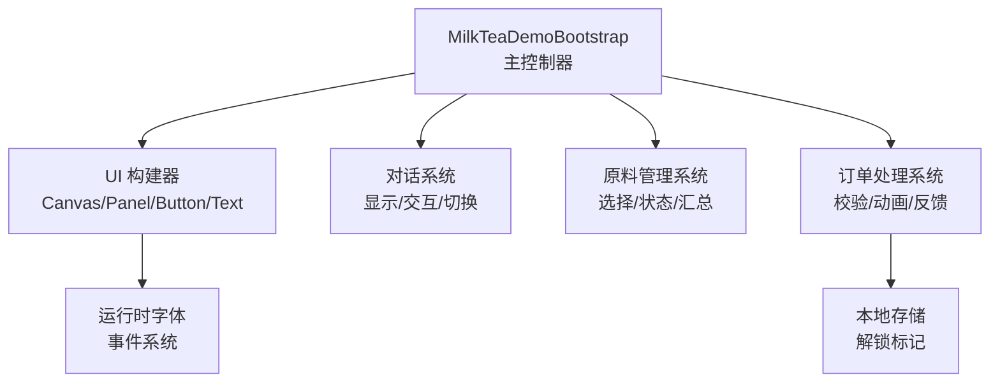
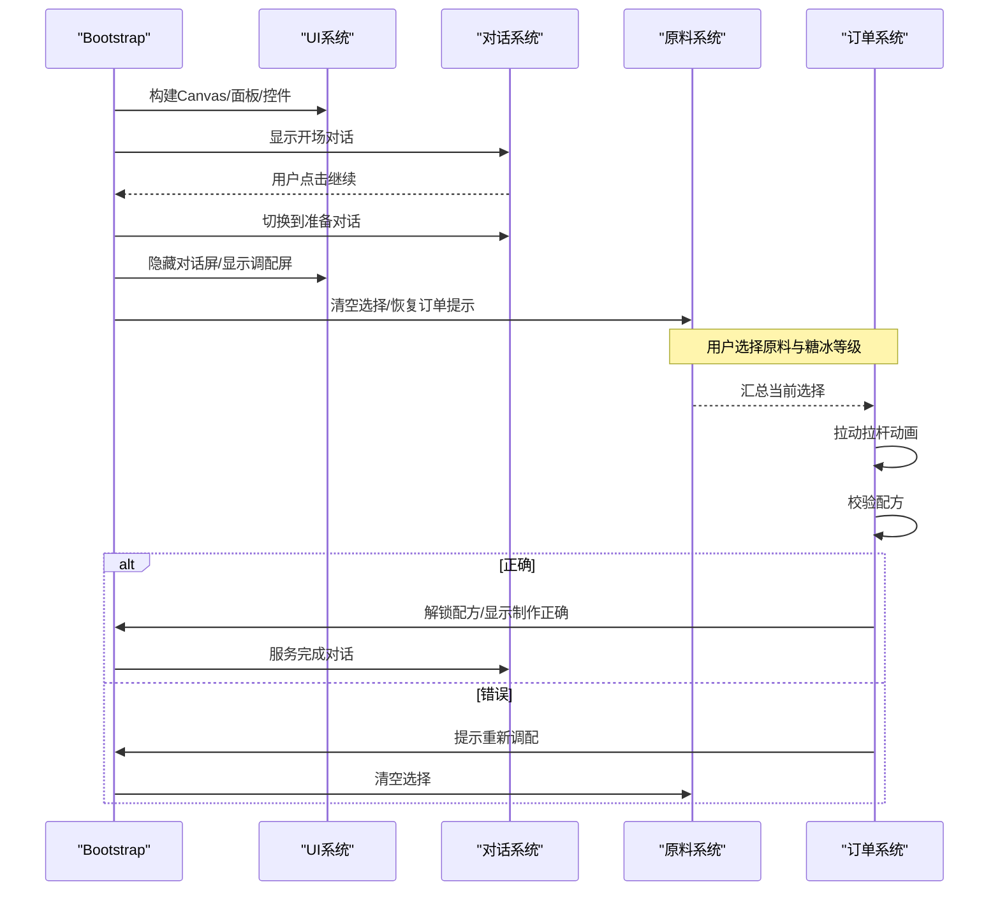
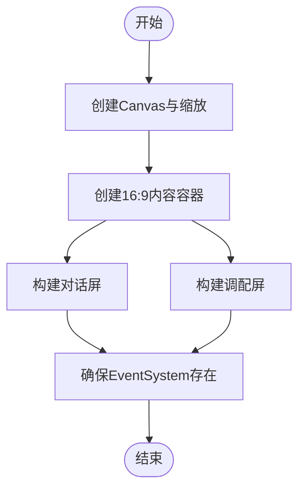
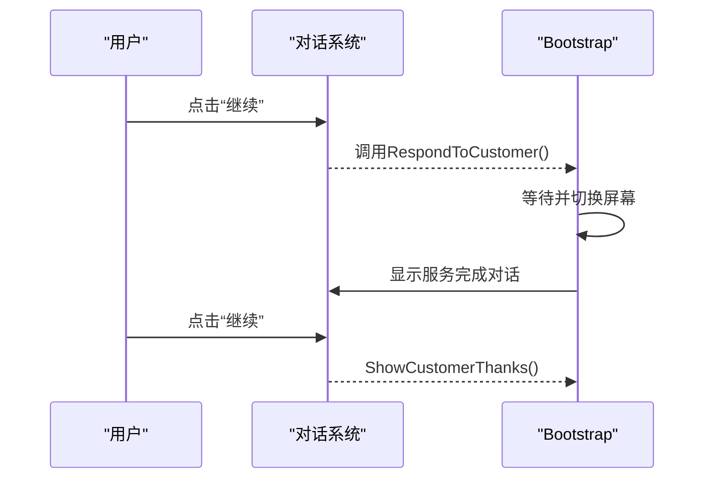
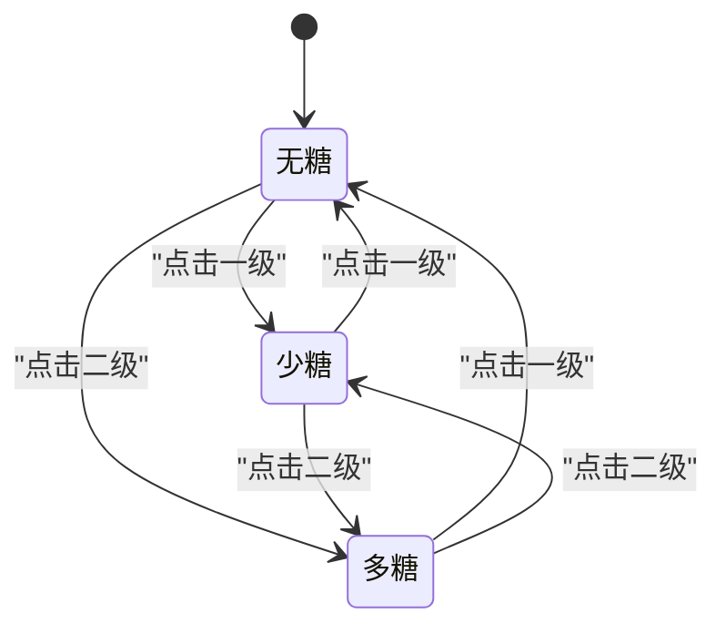
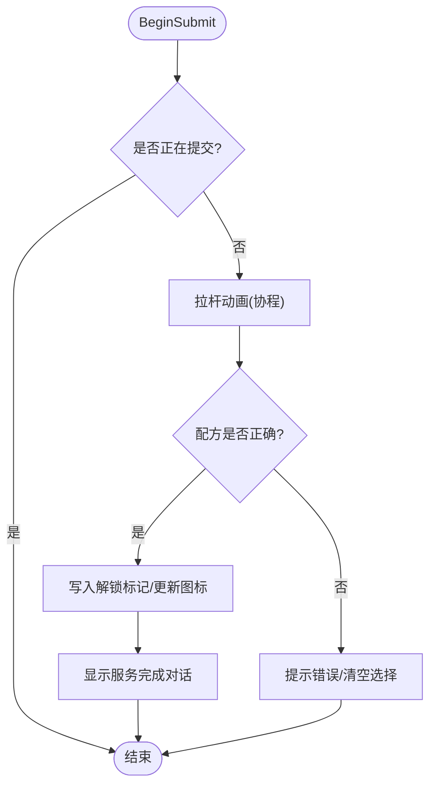
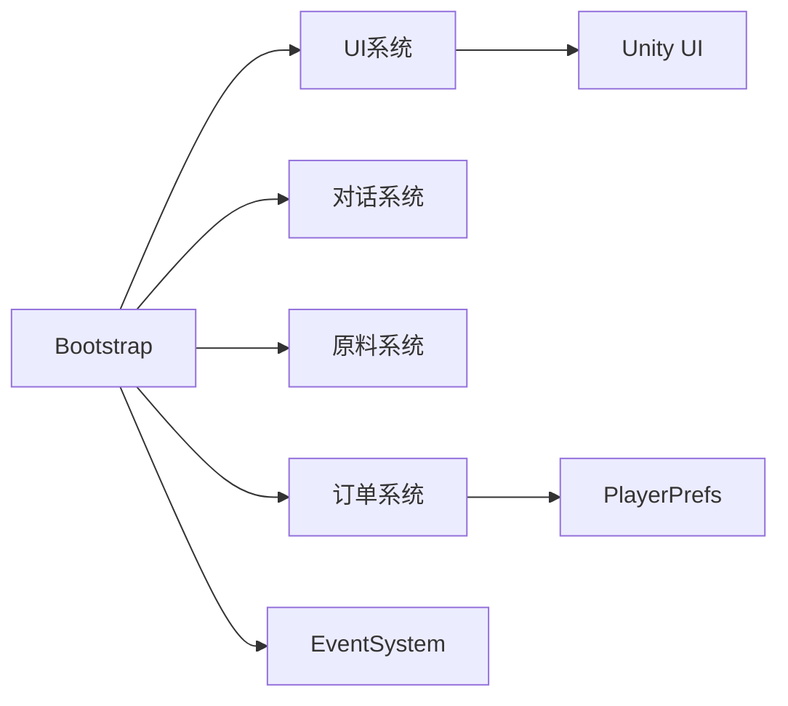

# 核心系统详解

<cite>
**本文引用的文件**
- [MilkTeaDemoBootstrap.cs](file://Assets/Scripts/MilkTeaDemoBootstrap.cs)
</cite>

## 目录
1. [简介](#简介)
2. [项目结构](#项目结构)
3. [核心组件](#核心组件)
4. [架构总览](#架构总览)
5. [详细组件分析](#详细组件分析)
6. [依赖关系分析](#依赖关系分析)
7. [性能考量](#性能考量)
8. [故障排查指南](#故障排查指南)
9. [结论](#结论)
10. [附录](#附录)

## 简介
本技术文档围绕奶茶店模拟经营的核心系统展开，重点解析主控制器 MilkTeaDemoBootstrap 的架构设计与实现细节。该系统在单一脚本中集成了 UI 系统、对话系统、原料管理系统与订单处理流程，通过清晰的职责划分与数据流组织，实现了“顾客下单—原料选择—机器封装—结果反馈”的完整闭环。文档同时总结关键设计模式的应用（单例、状态机、命令），并提供扩展建议与性能优化实践，帮助开发者快速理解并在此基础上进行二次开发。

## 项目结构
当前工程采用极简结构：所有逻辑集中在一个 Bootstrap 脚本中，运行时动态构建 UI 树，无需预制体或外部资源依赖。整体由以下模块组成：
- UI 构建器：负责创建 Canvas、面板、文本、按钮等 UI 元素，并设置布局与样式。
- 对话系统：管理对话显示、按钮回调与场景切换。
- 原料管理系统：维护茶底、奶底、配料的选择以及糖度、冰度的等级状态。
- 订单处理系统：校验最终配方是否符合订单需求，驱动动画与结果反馈。

图表来源
- [MilkTeaDemoBootstrap.cs:83-114](file://Assets/Scripts/MilkTeaDemoBootstrap.cs#L83-L114)
- [MilkTeaDemoBootstrap.cs:116-192](file://Assets/Scripts/MilkTeaDemoBootstrap.cs#L116-L192)
- [MilkTeaDemoBootstrap.cs:314-359](file://Assets/Scripts/MilkTeaDemoBootstrap.cs#L314-L359)
- [MilkTeaDemoBootstrap.cs:220-312](file://Assets/Scripts/MilkTeaDemoBootstrap.cs#L220-L312)
- [MilkTeaDemoBootstrap.cs:465-514](file://Assets/Scripts/MilkTeaDemoBootstrap.cs#L465-L514)

章节来源
- [MilkTeaDemoBootstrap.cs:83-114](file://Assets/Scripts/MilkTeaDemoBootstrap.cs#L83-L114)
- [MilkTeaDemoBootstrap.cs:116-192](file://Assets/Scripts/MilkTeaDemoBootstrap.cs#L116-L192)

## 核心组件
- 主控制器（MilkTeaDemoBootstrap）
  - 职责：生命周期管理、UI 初始化、对话调度、原料状态维护、订单提交与结果处理。
  - 关键点：运行时创建 UI；使用枚举与字典管理类别与选项；协程控制时序与动画。
- UI 系统
  - 职责：创建 Canvas、缩放适配、面板布局、文本渲染、按钮交互、边框效果。
  - 关键点：统一尺寸与锚点设置；动态字体回退；自动注入 EventSystem。
- 对话系统
  - 职责：显示说话人、台词、按钮文案；绑定点击回调；切换对话阶段。
  - 关键点：集中配置方法；可空回调控制按钮可用性；阶段切换通过启用/禁用屏幕实现。
- 原料管理系统
  - 职责：三类原料（茶底、奶底、配料）的展示与选择；糖度与冰度等级切换；选择摘要更新。
  - 关键点：按类别分组的面板与图片映射；级别状态机；联动订单提示。
- 订单处理系统
  - 职责：拉杆动画、配方校验、成功/失败分支、解锁持久化、服务对话触发。
  - 关键点：防重复提交锁；协程驱动动画；本地存储记录解锁状态。

章节来源
- [MilkTeaDemoBootstrap.cs:8-726](file://Assets/Scripts/MilkTeaDemoBootstrap.cs#L8-L726)

## 架构总览
系统以单例化的启动入口为根节点，Awake 时完成全局初始化与界面搭建，随后进入对话引导，再转入调配界面。调配界面包含订单提示、配方手册、原料选择区、机器操作区。用户完成选择后触发提交流程，系统进行动画与校验，输出结果并回到对话阶段。

图表来源
- [MilkTeaDemoBootstrap.cs:62-81](file://Assets/Scripts/MilkTeaDemoBootstrap.cs#L62-L81)
- [MilkTeaDemoBootstrap.cs:314-359](file://Assets/Scripts/MilkTeaDemoBootstrap.cs#L314-L359)
- [MilkTeaDemoBootstrap.cs:465-514](file://Assets/Scripts/MilkTeaDemoBootstrap.cs#L465-L514)

## 详细组件分析

### UI 系统
- 构建流程
  - 创建 Canvas、Scaler、Raycaster，设置全屏背景与 16:9 内容容器。
  - 分别构建对话屏与调配屏，并在各自区域内添加面板、文本、按钮与装饰元素。
- 控件工厂
  - 提供统一的 CreatePanel/CreateText/CreateButton 等方法，封装 RectTransform 设置、颜色、字体、Outline 边框等。
  - 自动注入 EventSystem，确保按钮交互可用。
- 字体策略
  - 优先尝试系统中文常用字体，失败则回退到内置 Arial。

图表来源
- [MilkTeaDemoBootstrap.cs:83-114](file://Assets/Scripts/MilkTeaDemoBootstrap.cs#L83-L114)
- [MilkTeaDemoBootstrap.cs:697-718](file://Assets/Scripts/MilkTeaDemoBootstrap.cs#L697-L718)

章节来源
- [MilkTeaDemoBootstrap.cs:83-114](file://Assets/Scripts/MilkTeaDemoBootstrap.cs#L83-L114)
- [MilkTeaDemoBootstrap.cs:616-695](file://Assets/Scripts/MilkTeaDemoBootstrap.cs#L616-L695)
- [MilkTeaDemoBootstrap.cs:697-718](file://Assets/Scripts/MilkTeaDemoBootstrap.cs#L697-L718)

### 对话系统
- 显示与交互
  - 通过 ConfigureDialogue 统一设置说话人、台词、按钮文案与点击回调。
  - 按钮可交互性由回调是否为空决定。
- 阶段流转
  - 开场对话 → 主角回应 → 延迟切换至调配屏 → 服务完成对话 → 顾客感谢 → 可重置体验。
- 数据流向
  - 对话阶段仅负责 UI 表现与流程推进，不持有业务状态。

图表来源
- [MilkTeaDemoBootstrap.cs:314-359](file://Assets/Scripts/MilkTeaDemoBootstrap.cs#L314-L359)

章节来源
- [MilkTeaDemoBootstrap.cs:314-359](file://Assets/Scripts/MilkTeaDemoBootstrap.cs#L314-L359)

### 原料管理系统
- 类别与选项
  - 使用枚举 IngredientCategory 区分茶底、奶底、配料。
  - 每个类别对应独立面板与选项图片字典，便于高亮选中项。
- 选择与状态
  - 选择某选项即写入对应字段（selectedTea/Milk/Topping）。
  - 糖度与冰度采用三态（0/1/2）的状态机，NextLevel 根据点击索引计算下一状态。
- 视图同步
  - UpdateChoiceVisuals 将选中项高亮。
  - UpdateSelectionSummary 实时汇总已选内容与糖冰等级。
  - RestoreOrderReminder 在切换类别或修改糖冰时刷新订单提示。

图表来源
- [MilkTeaDemoBootstrap.cs:413-442](file://Assets/Scripts/MilkTeaDemoBootstrap.cs#L413-L442)

章节来源
- [MilkTeaDemoBootstrap.cs:220-312](file://Assets/Scripts/MilkTeaDemoBootstrap.cs#L220-L312)
- [MilkTeaDemoBootstrap.cs:361-463](file://Assets/Scripts/MilkTeaDemoBootstrap.cs#L361-L463)
- [MilkTeaDemoBootstrap.cs:516-535](file://Assets/Scripts/MilkTeaDemoBootstrap.cs#L516-L535)

### 订单处理系统
- 提交流程
  - 防重复提交锁 isSubmitting 避免并发提交。
  - 协程驱动拉杆旋转动画，完成后进行配方校验。
- 校验规则
  - 固定目标配方：红茶 + 鲜奶 + 珍珠 + 少糖 + 少冰。
  - 正确则写入解锁标记并更新配方图标，随后进入服务完成对话。
  - 错误则提示重新调配并清空选择。
- 持久化
  - 使用 PlayerPrefs 保存解锁标记，用于后续显示配方图标。

图表来源
- [MilkTeaDemoBootstrap.cs:465-514](file://Assets/Scripts/MilkTeaDemoBootstrap.cs#L465-L514)

章节来源
- [MilkTeaDemoBootstrap.cs:465-514](file://Assets/Scripts/MilkTeaDemoBootstrap.cs#L465-L514)

## 依赖关系分析
- 内部依赖
  - UI 系统被 Bootstrap 直接调用以构建界面。
  - 对话系统与原料系统通过 Bootstrap 的方法进行状态同步与视图刷新。
  - 订单处理系统依赖原料系统的当前选择与本地存储。
- 外部依赖
  - Unity UI 框架（Canvas、Text、Button、Image、Outline）。
  - 输入系统（EventSystem、StandaloneInputModule）。
  - 本地存储（PlayerPrefs）。

图表来源
- [MilkTeaDemoBootstrap.cs:83-114](file://Assets/Scripts/MilkTeaDemoBootstrap.cs#L83-L114)
- [MilkTeaDemoBootstrap.cs:697-718](file://Assets/Scripts/MilkTeaDemoBootstrap.cs#L697-L718)
- [MilkTeaDemoBootstrap.cs:490-497](file://Assets/Scripts/MilkTeaDemoBootstrap.cs#L490-L497)

章节来源
- [MilkTeaDemoBootstrap.cs:83-114](file://Assets/Scripts/MilkTeaDemoBootstrap.cs#L83-L114)
- [MilkTeaDemoBootstrap.cs:697-718](file://Assets/Scripts/MilkTeaDemoBootstrap.cs#L697-L718)
- [MilkTeaDemoBootstrap.cs:490-497](file://Assets/Scripts/MilkTeaDemoBootstrap.cs#L490-L497)

## 性能考量
- UI 构建成本
  - 运行时创建大量 GameObject 与组件，建议在首次加载后缓存引用，避免重复查找。
  - 使用对象池复用按钮与面板，减少 GC 压力。
- 协程与动画
  - 协程每帧执行轻量级插值，注意控制循环次数与时间步长，避免阻塞主线程。
- 字符串与文本
  - 频繁更新 Text 可能引发重排，建议批量更新或使用 StringBuilder 拼接后再赋值。
- 本地存储
  - PlayerPrefs 读写开销较低但应避免频繁调用，可在提交成功后统一保存。
- 字体与渲染
  - 动态字体生成一次即可，避免重复创建；必要时考虑使用图集与静态字体提升渲染效率。

[本节为通用性能建议，不直接分析具体代码文件]

## 故障排查指南
- 无法点击按钮
  - 检查是否已创建 EventSystem；若不存在，Bootstrap 会自动注入。
  - 确认按钮所在 Canvas 的 Raycaster 已启用且排序层级合理。
- 中文显示异常
  - 检查动态字体创建是否成功；若失败会回退到 Arial，可能导致中文乱码。
  - 确保运行环境具备所需中文字体名称。
- 配方始终判定错误
  - 核对目标配方常量与用户选择是否一致；检查糖度与冰度等级映射。
  - 查看本地存储是否被其他逻辑覆盖。
- 界面错位或比例异常
  - 检查 CanvasScaler 的参考分辨率与匹配模式；确认 16:9 容器的 AspectRatioFitter 设置。

章节来源
- [MilkTeaDemoBootstrap.cs:697-718](file://Assets/Scripts/MilkTeaDemoBootstrap.cs#L697-L718)
- [MilkTeaDemoBootstrap.cs:490-514](file://Assets/Scripts/MilkTeaDemoBootstrap.cs#L490-L514)
- [MilkTeaDemoBootstrap.cs:83-114](file://Assets/Scripts/MilkTeaDemoBootstrap.cs#L83-L114)

## 结论
本系统以单脚本集中式架构实现了奶茶店模拟经营的核心流程，涵盖 UI、对话、原料管理与订单处理四大子系统。通过清晰的数据流与职责划分，系统在可扩展性与可维护性之间取得平衡。结合状态机与命令式交互，用户操作直观且易于扩展。未来可在保持现有接口的前提下，引入更多配方、更复杂的订单队列与异步任务，以提升游戏深度与玩法丰富度。

[本节为总结性内容，不直接分析具体代码文件]

## 附录

### 设计模式应用
- 单例模式
  - 启动阶段通过 RuntimeInitializeOnLoadMethod 检测并创建唯一实例，保证全局唯一的主控制器。
- 状态机模式
  - 糖度与冰度采用三态状态机，NextLevel 根据点击索引在不同状态间切换。
- 命令模式
  - 按钮点击通过委托 Action 封装行为，ConfigureDialogue 与 CreateButton 将用户操作抽象为可配置的命令。

章节来源
- [MilkTeaDemoBootstrap.cs:62-81](file://Assets/Scripts/MilkTeaDemoBootstrap.cs#L62-L81)
- [MilkTeaDemoBootstrap.cs:413-442](file://Assets/Scripts/MilkTeaDemoBootstrap.cs#L413-L442)
- [MilkTeaDemoBootstrap.cs:348-359](file://Assets/Scripts/MilkTeaDemoBootstrap.cs#L348-L359)
- [MilkTeaDemoBootstrap.cs:649-670](file://Assets/Scripts/MilkTeaDemoBootstrap.cs#L649-L670)

### 扩展建议
- 新增配方
  - 扩展配方数据结构与校验逻辑，支持多页配方展示与切换。
- 多订单并行
  - 引入订单队列与状态机，支持同时处理多个顾客需求。
- 资源管理
  - 将运行时创建的 UI 替换为预制体与资源池，提升性能与可配置性。
- 数据持久化
  - 将解锁标记与进度迁移至更健壮的存档方案，支持跨会话保存。

[本节为概念性扩展建议，不直接分析具体代码文件]