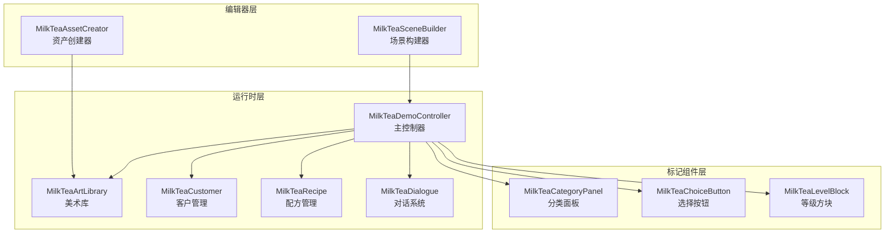
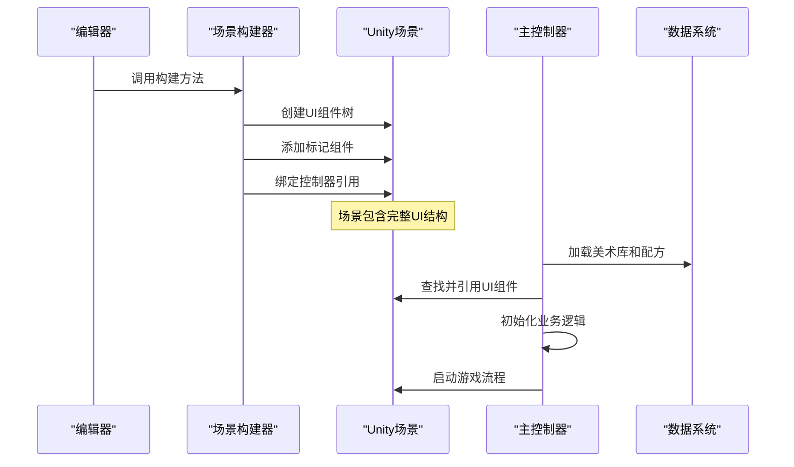
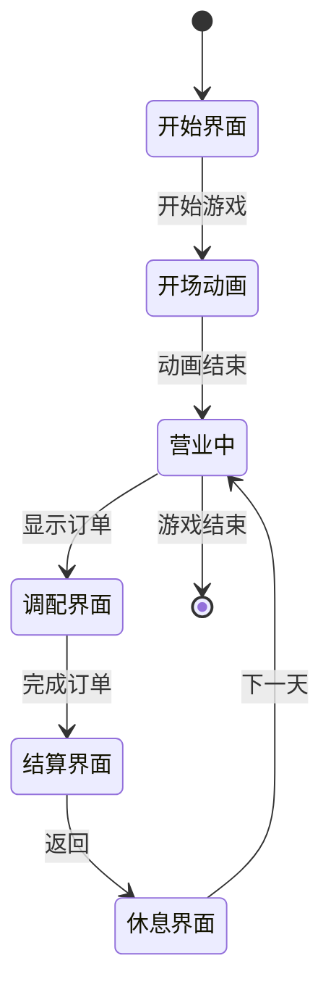
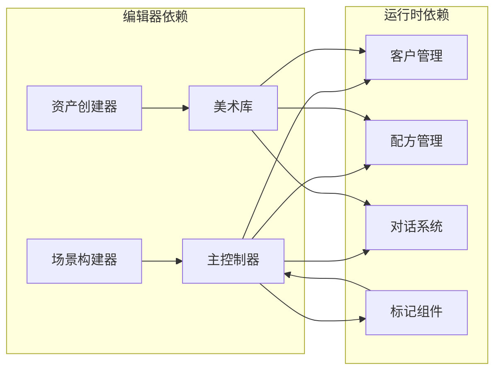

# 核心系统详解

<cite>
**本文引用的文件**
- [MilkTeaDemoController.cs](file://Assets/Scripts/MilkTeaDemoController.cs)
- [MilkTeaCustomer.cs](file://Assets/Scripts/MilkTeaCustomer.cs)
- [MilkTeaRecipe.cs](file://Assets/Scripts/MilkTeaRecipe.cs)
- [MilkTeaDialogue.cs](file://Assets/Scripts/MilkTeaDialogue.cs)
- [MilkTeaArtLibrary.cs](file://Assets/Scripts/MilkTeaArtLibrary.cs)
- [MilkTeaCategoryPanel.cs](file://Assets/Scripts/MilkTeaCategoryPanel.cs)
- [MilkTeaChoiceButton.cs](file://Assets/Scripts/MilkTeaChoiceButton.cs)
- [MilkTeaLevelBlock.cs](file://Assets/Scripts/MilkTeaLevelBlock.cs)
- [MilkTeaSceneBuilder.cs](file://Assets/Editor/MilkTeaSceneBuilder.cs)
- [MilkTeaAssetCreator.cs](file://Assets/Editor/MilkTeaAssetCreator.cs)
</cite>

## 更新摘要
**变更内容**
- 从 Bootstrap 模式迁移到模块化架构，使用 MilkTeaDemoController 作为主运行时控制器
- 新增独立的组件系统：场景构建器、资产创建器、客户管理、配方处理
- 重构 UI 系统为编辑器构建 + 运行时控制的分离模式
- 增强数据驱动设计，支持动态配方和客户配置

## 目录
1. [简介](#简介)
2. [项目结构](#项目结构)
3. [核心组件](#核心组件)
4. [架构总览](#架构总览)
5. [详细组件分析](#详细组件分析)
6. [依赖关系分析](#依赖关系分析)
7. [性能考量](#性能考量)
8. [故障排查指南](#故障排查指南)
9. [结论](#结论)
10. [附录](#附录)

## 简介
本技术文档围绕奶茶店模拟经营的核心系统展开，重点解析新的模块化架构设计。系统已从单一 Bootstrap 脚本重构为以 MilkTeaDemoController 为主控制器的多组件架构，实现了界面构建与运行逻辑的清晰分离。该系统通过编辑器工具生成 UI，运行时控制器负责业务逻辑，支持动态配方、客户管理和对话系统，提供了高度可扩展的奶茶店模拟经营框架。

## 项目结构
新架构采用分层设计，将 UI 构建、业务逻辑、数据管理完全分离：

**图表来源**
- [MilkTeaSceneBuilder.cs:17-55](file://Assets/Editor/MilkTeaSceneBuilder.cs#L17-L55)
- [MilkTeaAssetCreator.cs:13-45](file://Assets/Editor/MilkTeaAssetCreator.cs#L13-L45)
- [MilkTeaDemoController.cs:25-195](file://Assets/Scripts/MilkTeaDemoController.cs#L25-L195)

**章节来源**
- [MilkTeaSceneBuilder.cs:17-55](file://Assets/Editor/MilkTeaSceneBuilder.cs#L17-L55)
- [MilkTeaAssetCreator.cs:13-45](file://Assets/Editor/MilkTeaAssetCreator.cs#L13-L45)

## 核心组件

### 主控制器（MilkTeaDemoController）
- **职责**：协调所有子系统，管理游戏流程状态，处理用户输入和业务逻辑
- **关键特性**：
  - 不再直接创建 UI，而是引用场景中已存在的组件
  - 支持多种屏幕和界面状态管理
  - 集成对话系统、原料选择、订单处理等核心功能
  - 提供设置系统和开场动画支持

### 编辑器构建系统
- **MilkTeaSceneBuilder**：在编辑器中一键生成完整 UI 场景
- **MilkTeaAssetCreator**：自动生成配方、对话、客户等数据资产

### 数据管理系统
- **MilkTeaArtLibrary**：集中管理所有美术资源和配置数据
- **MilkTeaCustomer**：定义顾客信息、点单内容和个性化对话
- **MilkTeaRecipe**：描述奶茶配方和相关信息
- **MilkTeaDialogue**：管理对话流程和台词内容

### 标记组件系统
- **MilkTeaCategoryPanel**：标识原料分类容器
- **MilkTeaChoiceButton**：标记原料选择按钮及其属性
- **MilkTeaLevelBlock**：标识糖度和冰度调节方块

**章节来源**
- [MilkTeaDemoController.cs:25-195](file://Assets/Scripts/MilkTeaDemoController.cs#L25-L195)
- [MilkTeaSceneBuilder.cs:17-55](file://Assets/Editor/MilkTeaSceneBuilder.cs#L17-L55)
- [MilkTeaAssetCreator.cs:13-45](file://Assets/Editor/MilkTeaAssetCreator.cs#L13-L45)

## 架构总览
新架构采用"编辑器构建 + 运行时控制"的分层设计，实现了关注点分离和高度可配置性：

**图表来源**
- [MilkTeaSceneBuilder.cs:38-55](file://Assets/Editor/MilkTeaSceneBuilder.cs#L38-L55)
- [MilkTeaDemoController.cs:196-206](file://Assets/Scripts/MilkTeaDemoController.cs#L196-L206)

## 详细组件分析

### 主控制器架构
MilkTeaDemoController 作为系统的核心协调者，管理多个界面状态和业务逻辑：

**图表来源**
- [MilkTeaDemoController.cs:709-758](file://Assets/Scripts/MilkTeaDemoController.cs#L709-L758)
- [MilkTeaDemoController.cs:615-699](file://Assets/Scripts/MilkTeaDemoController.cs#L615-L699)

### 编辑器构建系统
编辑器工具提供了完整的自动化构建能力：

#### 场景构建器 (MilkTeaSceneBuilder)
- **功能**：一键生成包含所有UI元素的完整场景
- **特性**：
  - 自动创建 Canvas、Scaler、EventSystem
  - 构建对话屏、调配屏、结算屏、休息屏等界面
  - 添加标记组件供运行时识别
  - 支持自定义美术资源替换

#### 资产创建器 (MilkTeaAssetCreator)
- **功能**：自动生成配方、对话、客户等数据资产
- **特性**：
  - 创建10款预设奶茶配方
  - 生成默认对话模板
  - 创建示例客户数据
  - 维护美术库配置

**章节来源**
- [MilkTeaSceneBuilder.cs:38-55](file://Assets/Editor/MilkTeaSceneBuilder.cs#L38-L55)
- [MilkTeaAssetCreator.cs:44-112](file://Assets/Editor/MilkTeaAssetCreator.cs#L44-L112)

### 数据驱动系统
系统采用 ScriptableObject 实现数据与逻辑的完全分离：

#### 美术库 (MilkTeaArtLibrary)
- **作用**：集中管理所有美术资源和配置
- **内容**：字体、背景图、角色立绘、配方列表、客户列表、对话模板

#### 客户管理 (MilkTeaCustomer)
- **作用**：定义顾客信息和个性化需求
- **特性**：支持自定义对话、立绘、点单内容和偏好设置

#### 配方系统 (MilkTeaRecipe)
- **作用**：描述奶茶配方和展示信息
- **特性**：支持图标、名称、成分配置和顾客关联

**章节来源**
- [MilkTeaArtLibrary.cs:11-84](file://Assets/Scripts/MilkTeaArtLibrary.cs#L11-L84)
- [MilkTeaCustomer.cs:10-37](file://Assets/Scripts/MilkTeaCustomer.cs#L10-L37)
- [MilkTeaRecipe.cs:8-32](file://Assets/Scripts/MilkTeaRecipe.cs#L8-L32)

### 标记组件系统
通过轻量级标记组件实现运行时识别和交互：

#### 分类面板 (MilkTeaCategoryPanel)
- **作用**：标识原料分类容器的类型
- **使用**：运行时控制器根据此标记显示/隐藏对应面板

#### 选择按钮 (MilkTeaChoiceButton)
- **作用**：标记原料选择按钮及其属性
- **特性**：包含类别和选项名称，用于运行时事件绑定

#### 等级方块 (MilkTeaLevelBlock)
- **作用**：标识糖度和冰度调节方块
- **特性**：区分糖度/冰度和方块索引，支持状态切换

**章节来源**
- [MilkTeaCategoryPanel.cs:7-11](file://Assets/Scripts/MilkTeaCategoryPanel.cs#L7-L11)
- [MilkTeaChoiceButton.cs:7-12](file://Assets/Scripts/MilkTeaChoiceButton.cs#L7-L12)
- [MilkTeaLevelBlock.cs:7-12](file://Assets/Scripts/MilkTeaLevelBlock.cs#L7-L12)

## 依赖关系分析
新架构建立了清晰的依赖层次：

**图表来源**
- [MilkTeaSceneBuilder.cs:100-150](file://Assets/Editor/MilkTeaSceneBuilder.cs#L100-L150)
- [MilkTeaDemoController.cs:196-206](file://Assets/Scripts/MilkTeaDemoController.cs#L196-L206)

**章节来源**
- [MilkTeaSceneBuilder.cs:100-150](file://Assets/Editor/MilkTeaSceneBuilder.cs#L100-L150)
- [MilkTeaDemoController.cs:196-206](file://Assets/Scripts/MilkTeaDemoController.cs#L196-L206)

## 性能考量
新架构在性能方面进行了多项优化：

### 内存管理
- **对象池化**：UI 组件在编辑器中预创建，运行时仅激活/禁用
- **资源加载**：使用 Resources.Load 按需加载数据，避免一次性加载
- **引用缓存**：控制器缓存常用组件引用，减少查找开销

### 渲染优化
- **静态批处理**：编辑器生成的 UI 结构支持静态批处理
- **图集优化**：美术库支持 Sprite 图集，减少 Draw Call
- **字体优化**：动态字体创建一次后复用

### 计算优化
- **延迟初始化**：非关键逻辑延迟到需要时执行
- **协程优化**：使用协程处理耗时操作，避免阻塞主线程
- **状态缓存**：频繁访问的状态进行缓存，减少重复计算

## 故障排查指南

### 编辑器问题
- **场景构建失败**：检查 Unity 版本兼容性，确保必要的包已安装
- **资产创建错误**：确认 Resources 目录权限正确，路径配置无误

### 运行时问题
- **UI 组件未找到**：检查场景是否正确构建，控制器引用是否完整
- **数据加载失败**：验证美术库和资源文件是否存在于 Resources 目录
- **对话系统异常**：检查对话数据结构完整性，确保必填字段已设置

### 性能问题
- **帧率下降**：检查是否有过多实时创建的 GameObject
- **内存泄漏**：确认协程正确停止，事件监听器正确移除
- **资源占用过高**：优化美术资源大小，使用合适的压缩格式

**章节来源**
- [MilkTeaSceneBuilder.cs:706-714](file://Assets/Editor/MilkTeaSceneBuilder.cs#L706-L714)
- [MilkTeaDemoController.cs:196-206](file://Assets/Scripts/MilkTeaDemoController.cs#L196-L206)

## 结论
新的模块化架构成功实现了奶茶店模拟经营系统的重构，通过编辑器构建与运行时控制的分离，大幅提升了系统的可维护性和扩展性。MilkTeaDemoController 作为核心协调者，有效管理各个子系统，而数据驱动的架构使得内容创作更加灵活便捷。这种设计模式为未来的功能扩展奠定了坚实基础，支持更复杂的业务逻辑和更丰富的用户体验。

## 附录

### 设计模式应用

#### 工厂模式
- **场景构建器**：使用工厂方法创建各种 UI 组件
- **资产创建器**：批量生成数据资产实例

#### 观察者模式
- **事件系统**：按钮点击通过委托机制处理
- **状态同步**：UI 状态变化时自动更新相关显示

#### 策略模式
- **配方校验**：支持不同的配方匹配策略
- **对话播放**：可配置的对话播放策略

#### 命令模式
- **用户操作**：将用户输入封装为可执行的命令
- **撤销重做**：支持操作历史的记录和执行

**章节来源**
- [MilkTeaSceneBuilder.cs:600-650](file://Assets/Editor/MilkTeaSceneBuilder.cs#L600-L650)
- [MilkTeaDemoController.cs:956-967](file://Assets/Scripts/MilkTeaDemoController.cs#L956-L967)

### 扩展建议

#### 功能扩展
- **多人模式**：支持多玩家同时经营不同店铺
- **成就系统**：添加成就和奖励机制
- **商店系统**：实现道具购买和升级功能
- **天气系统**：添加天气变化对经营的影响

#### 技术优化
- **异步加载**：实现资源的异步加载和流式传输
- **网络同步**：支持多人在线数据和状态同步
- **云端存档**：实现云存储和跨设备进度同步
- **数据分析**：集成用户行为分析和性能监控

#### 内容扩展
- **更多配方**：扩展奶茶种类和制作方式
- **丰富剧情**：增加故事线和角色互动
- **季节活动**：推出限定活动和特殊配方
- **社区功能**：支持玩家分享和交换配方

**章节来源**
- [MilkTeaDemoController.cs:115-116](file://Assets/Scripts/MilkTeaDemoController.cs#L115-L116)
- [MilkTeaAssetCreator.cs:128-190](file://Assets/Editor/MilkTeaAssetCreator.cs#L128-L190)