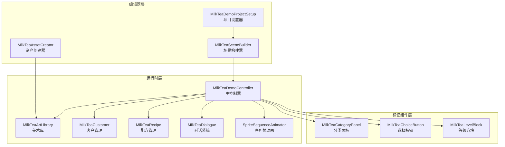
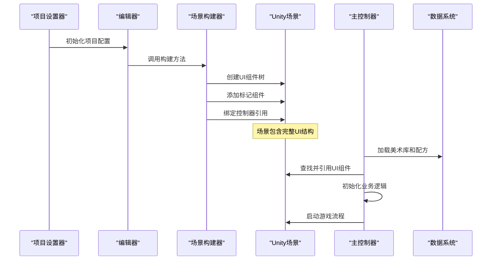
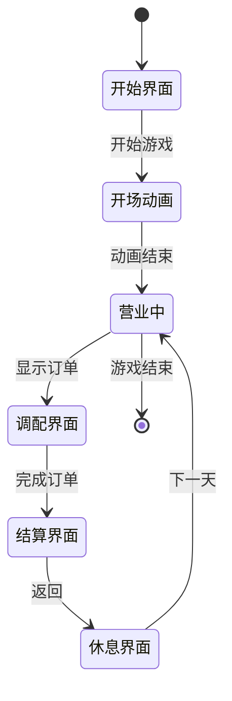
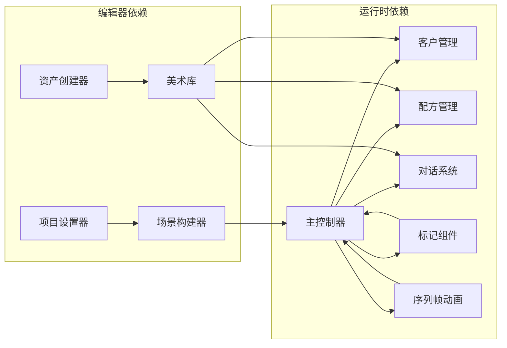

# 核心系统详解

<cite>
**本文引用的文件**
- [MilkTeaDemoController.cs](file://Assets/Scripts/MilkTeaDemoController.cs)
- [MilkTeaCustomer.cs](file://Assets/Scripts/MilkTeaCustomer.cs)
- [MilkTeaRecipe.cs](file://Assets/Scripts/MilkTeaRecipe.cs)
- [MilkTeaDialogue.cs](file://Assets/Scripts/MilkTeaDialogue.cs)
- [MilkTeaArtLibrary.cs](file://Assets/Scripts/MilkTeaArtLibrary.cs)
- [MilkTeaCategoryPanel.cs](file://Assets/Scripts/MilkTeaCategoryPanel.cs)
- [MilkTeaChoiceButton.cs](file://Assets/Scripts/MilkTeaChoiceButton.cs)
- [MilkTeaLevelBlock.cs](file://Assets/Scripts/MilkTeaLevelBlock.cs)
- [SpriteSequenceAnimator.cs](file://Assets/Scripts/SpriteSequenceAnimator.cs)
- [MilkTeaSceneBuilder.cs](file://Assets/Editor/MilkTeaSceneBuilder.cs)
- [MilkTeaAssetCreator.cs](file://Assets/Editor/MilkTeaAssetCreator.cs)
- [MilkTeaDemoProjectSetup.cs](file://Assets/Editor/MilkTeaDemoProjectSetup.cs)
</cite>

## 更新摘要
**变更内容**
- 编辑器构建系统得到全面增强，支持更灵活的场景管理和视觉资产配置
- 艺术库系统扩展，新增更多美术资源字段和配置选项
- 项目设置器自动配置Unity项目环境，提升开发体验
- UI构建系统支持动态替换和增量更新机制
- 新增序列帧动画系统，支持角色立绘动画效果

## 目录
1. [简介](#简介)
2. [项目结构](#项目结构)
3. [核心组件](#核心组件)
4. [架构总览](#架构总览)
5. [详细组件分析](#详细组件分析)
6. [依赖关系分析](#依赖关系分析)
7. [性能考量](#性能考量)
8. [故障排查指南](#故障排查指南)
9. [结论](#结论)
10. [附录](#附录)

## 简介
本技术文档围绕奶茶店模拟经营的核心系统展开，重点解析增强的模块化架构设计。系统已从单一 Bootstrap 脚本重构为以 MilkTeaDemoController 为主控制器的多组件架构，实现了界面构建与运行逻辑的清晰分离。该系统通过增强的编辑器工具生成 UI，运行时控制器负责业务逻辑，支持动态配方、客户管理、对话系统和序列帧动画，提供了高度可扩展的奶茶店模拟经营框架。

## 项目结构
新架构采用分层设计，将 UI 构建、业务逻辑、数据管理完全分离：

```mermaid
graph TB
subgraph "编辑器层"
A["MilkTeaSceneBuilder<br/>场景构建器"]
B["MilkTeaAssetCreator<br/>资产创建器"]
C["MilkTeaDemoProjectSetup<br/>项目设置器"]
end
subgraph "运行时层"
D["MilkTeaDemoController<br/>主控制器"]
E["MilkTeaArtLibrary<br/>美术库"]
F["MilkTeaCustomer<br/>客户管理"]
G["MilkTeaRecipe<br/>配方管理"]
H["MilkTeaDialogue<br/>对话系统"]
I["SpriteSequenceAnimator<br/>序列帧动画"]
end
subgraph "标记组件层"
J["MilkTeaCategoryPanel<br/>分类面板"]
K["MilkTeaChoiceButton<br/>选择按钮"]
L["MilkTeaLevelBlock<br/>等级方块"]
end
A --> D
B --> E
C --> A
D --> E
D --> F
D --> G
D --> H
D --> I
D --> J
D --> K
D --> L
```

**图表来源**
- [MilkTeaSceneBuilder.cs:19-72](file://Assets/Editor/MilkTeaSceneBuilder.cs#L19-L72)
- [MilkTeaAssetCreator.cs:13-112](file://Assets/Editor/MilkTeaAssetCreator.cs#L13-L112)
- [MilkTeaDemoProjectSetup.cs:8-55](file://Assets/Editor/MilkTeaDemoProjectSetup.cs#L8-L55)
- [MilkTeaDemoController.cs:26-200](file://Assets/Scripts/MilkTeaDemoController.cs#L26-L200)

**章节来源**
- [MilkTeaSceneBuilder.cs:19-72](file://Assets/Editor/MilkTeaSceneBuilder.cs#L19-L72)
- [MilkTeaAssetCreator.cs:13-112](file://Assets/Editor/MilkTeaAssetCreator.cs#L13-L112)
- [MilkTeaDemoProjectSetup.cs:8-55](file://Assets/Editor/MilkTeaDemoProjectSetup.cs#L8-L55)

## 核心组件

### 主控制器（MilkTeaDemoController）
- **职责**：协调所有子系统，管理游戏流程状态，处理用户输入和业务逻辑
- **关键特性**：
  - 不再直接创建 UI，而是引用场景中已存在的组件
  - 支持多种屏幕和界面状态管理
  - 集成对话系统、原料选择、订单处理等核心功能
  - 提供设置系统和开场动画支持
  - 管理序列帧动画播放

### 增强的编辑器构建系统
- **MilkTeaSceneBuilder**：在编辑器中一键生成完整 UI 场景，支持增量更新
- **MilkTeaAssetCreator**：自动生成配方、对话、客户等数据资产
- **MilkTeaDemoProjectSetup**：自动配置 Unity 项目环境和场景设置

### 增强的数据管理系统
- **MilkTeaArtLibrary**：集中管理所有美术资源和配置数据，支持更多视觉资产
- **MilkTeaCustomer**：定义顾客信息、点单内容和个性化对话
- **MilkTeaRecipe**：描述奶茶配方和相关信息
- **MilkTeaDialogue**：管理对话流程和台词内容

### 标记组件系统
- **MilkTeaCategoryPanel**：标识原料分类容器
- **MilkTeaChoiceButton**：标记原料选择按钮及其属性
- **MilkTeaLevelBlock**：标识糖度和冰度调节方块

### 新增动画系统
- **SpriteSequenceAnimator**：通用 UI 序列帧播放器，支持角色立绘动画

**章节来源**
- [MilkTeaDemoController.cs:26-200](file://Assets/Scripts/MilkTeaDemoController.cs#L26-L200)
- [MilkTeaSceneBuilder.cs:19-72](file://Assets/Editor/MilkTeaSceneBuilder.cs#L19-L72)
- [MilkTeaAssetCreator.cs:13-112](file://Assets/Editor/MilkTeaAssetCreator.cs#L13-L112)
- [MilkTeaDemoProjectSetup.cs:8-55](file://Assets/Editor/MilkTeaDemoProjectSetup.cs#L8-L55)
- [SpriteSequenceAnimator.cs:11-132](file://Assets/Scripts/SpriteSequenceAnimator.cs#L11-L132)

## 架构总览
新架构采用"编辑器构建 + 运行时控制"的分层设计，实现了关注点分离和高度可配置性：

```mermaid
sequenceDiagram
participant Project as "项目设置器"
participant Editor as "编辑器"
participant Builder as "场景构建器"
participant Scene as "Unity场景"
participant Controller as "主控制器"
participant Data as "数据系统"
Project->>Editor : 初始化项目配置
Editor->>Builder : 调用构建方法
Builder->>Scene : 创建UI组件树
Builder->>Scene : 添加标记组件
Builder->>Scene : 绑定控制器引用
Note over Scene : 场景包含完整UI结构
Controller->>Data : 加载美术库和配方
Controller->>Scene : 查找并引用UI组件
Controller->>Controller : 初始化业务逻辑
Controller->>Scene : 启动游戏流程
```

**图表来源**
- [MilkTeaDemoProjectSetup.cs:15-55](file://Assets/Editor/MilkTeaDemoProjectSetup.cs#L15-L55)
- [MilkTeaSceneBuilder.cs:52-72](file://Assets/Editor/MilkTeaSceneBuilder.cs#L52-L72)
- [MilkTeaDemoController.cs:196-206](file://Assets/Scripts/MilkTeaDemoController.cs#L196-L206)

## 详细组件分析

### 增强的主控制器架构
MilkTeaDemoController 作为系统的核心协调者，管理多个界面状态和业务逻辑：

```mermaid
stateDiagram-v2
[*] --> 开始界面
开始界面 --> 开场动画 : 开始游戏
开场动画 --> 营业中 : 动画结束
营业中 --> 调配界面 : 显示订单
调配界面 --> 结算界面 : 完成订单
结算界面 --> 休息界面 : 返回
休息界面 --> 营业中 : 下一天
营业中 --> [*] : 游戏结束
```

**图表来源**
- [MilkTeaDemoController.cs:709-758](file://Assets/Scripts/MilkTeaDemoController.cs#L709-L758)
- [MilkTeaDemoController.cs:615-699](file://Assets/Scripts/MilkTeaDemoController.cs#L615-L699)

### 增强的编辑器构建系统
编辑器工具提供了完整的自动化构建能力：

#### 项目设置器 (MilkTeaDemoProjectSetup)
- **功能**：自动配置 Unity 项目环境和场景设置
- **特性**：
  - 自动设置项目名称、公司名和窗口配置
  - 确保演示场景存在并添加到构建设置
  - 首次启动时自动打开演示场景

#### 场景构建器 (MilkTeaSceneBuilder)
- **功能**：一键生成包含所有UI元素的完整场景
- **特性**：
  - 自动创建 Canvas、Scaler、EventSystem
  - 构建对话屏、调配屏、结算屏、休息屏等界面
  - 添加标记组件供运行时识别
  - 支持自定义美术资源替换
  - 支持增量更新和保留手动调整

#### 资产创建器 (MilkTeaAssetCreator)
- **功能**：自动生成配方、对话、客户等数据资产
- **特性**：
  - 创建10款预设奶茶配方
  - 生成默认对话模板
  - 创建示例客户数据
  - 维护美术库配置

**章节来源**
- [MilkTeaDemoProjectSetup.cs:8-55](file://Assets/Editor/MilkTeaDemoProjectSetup.cs#L8-L55)
- [MilkTeaSceneBuilder.cs:52-72](file://Assets/Editor/MilkTeaSceneBuilder.cs#L52-L72)
- [MilkTeaAssetCreator.cs:44-112](file://Assets/Editor/MilkTeaAssetCreator.cs#L44-L112)

### 增强的数据驱动系统
系统采用 ScriptableObject 实现数据与逻辑的完全分离：

#### 增强的美术库 (MilkTeaArtLibrary)
- **作用**：集中管理所有美术资源和配置
- **新增内容**：
  - 更多视觉资产字段（按钮皮肤、装饰元素）
  - 角色布局配置（位置、尺寸）
  - 文字颜色配置
  - 原料图标映射
  - 客人出场表
  - 默认对话模板

#### 客户管理 (MilkTeaCustomer)
- **作用**：定义顾客信息和个性化需求
- **特性**：支持自定义对话、立绘、点单内容和偏好设置

#### 配方系统 (MilkTeaRecipe)
- **作用**：描述奶茶配方和展示信息
- **特性**：支持图标、名称、成分配置和顾客关联

**章节来源**
- [MilkTeaArtLibrary.cs:11-125](file://Assets/Scripts/MilkTeaArtLibrary.cs#L11-L125)
- [MilkTeaCustomer.cs:10-47](file://Assets/Scripts/MilkTeaCustomer.cs#L10-L47)
- [MilkTeaRecipe.cs:8-32](file://Assets/Scripts/MilkTeaRecipe.cs#L8-L32)

### 标记组件系统
通过轻量级标记组件实现运行时识别和交互：

#### 分类面板 (MilkTeaCategoryPanel)
- **作用**：标识原料分类容器的类型
- **使用**：运行时控制器根据此标记显示/隐藏对应面板

#### 选择按钮 (MilkTeaChoiceButton)
- **作用**：标记原料选择按钮及其属性
- **特性**：包含类别和选项名称，用于运行时事件绑定

#### 等级方块 (MilkTeaLevelBlock)
- **作用**：标识糖度和冰度调节方块
- **特性**：区分糖度/冰度和方块索引，支持状态切换

**章节来源**
- [MilkTeaCategoryPanel.cs:7-11](file://Assets/Scripts/MilkTeaCategoryPanel.cs#L7-L11)
- [MilkTeaChoiceButton.cs:7-12](file://Assets/Scripts/MilkTeaChoiceButton.cs#L7-L12)
- [MilkTeaLevelBlock.cs:7-12](file://Assets/Scripts/MilkTeaLevelBlock.cs#L7-L12)

### 新增序列帧动画系统
SpriteSequenceAnimator 提供了通用的序列帧动画播放功能：

#### 序列帧动画器 (SpriteSequenceAnimator)
- **作用**：通用 UI 序列帧播放器，挂在带 Image 的物体上
- **特性**：
  - 按帧率循环切换 sprite
  - 支持静态图和动画图并存
  - 可配置的播放参数（帧率、循环、自动播放）
  - 运行时动态注入帧数据
  - 自动管理动画生命周期

**章节来源**
- [SpriteSequenceAnimator.cs:11-132](file://Assets/Scripts/SpriteSequenceAnimator.cs#L11-L132)

## 依赖关系分析
新架构建立了清晰的依赖层次：

```mermaid
graph LR
subgraph "编辑器依赖"
A[项目设置器] --> B[场景构建器]
C[资产创建器] --> D[美术库]
end
subgraph "运行时依赖"
B --> E[主控制器]
E --> F[客户管理]
E --> G[配方管理]
E --> H[对话系统]
E --> I[标记组件]
E --> J[序列帧动画]
end
D --> F
D --> G
D --> H
I --> E
J --> E
```

**图表来源**
- [MilkTeaDemoProjectSetup.cs:8-55](file://Assets/Editor/MilkTeaDemoProjectSetup.cs#L8-L55)
- [MilkTeaSceneBuilder.cs:19-72](file://Assets/Editor/MilkTeaSceneBuilder.cs#L19-L72)
- [MilkTeaAssetCreator.cs:13-112](file://Assets/Editor/MilkTeaAssetCreator.cs#L13-L112)
- [MilkTeaDemoController.cs:26-200](file://Assets/Scripts/MilkTeaDemoController.cs#L26-L200)

**章节来源**
- [MilkTeaDemoProjectSetup.cs:8-55](file://Assets/Editor/MilkTeaDemoProjectSetup.cs#L8-L55)
- [MilkTeaSceneBuilder.cs:19-72](file://Assets/Editor/MilkTeaSceneBuilder.cs#L19-L72)
- [MilkTeaAssetCreator.cs:13-112](file://Assets/Editor/MilkTeaAssetCreator.cs#L13-L112)
- [MilkTeaDemoController.cs:26-200](file://Assets/Scripts/MilkTeaDemoController.cs#L26-L200)

## 性能考量
新架构在性能方面进行了多项优化：

### 内存管理
- **对象池化**：UI 组件在编辑器中预创建，运行时仅激活/禁用
- **资源加载**：使用 Resources.Load 按需加载数据，避免一次性加载
- **引用缓存**：控制器缓存常用组件引用，减少查找开销
- **动画优化**：序列帧动画仅在需要时播放，避免不必要的计算

### 渲染优化
- **静态批处理**：编辑器生成的 UI 结构支持静态批处理
- **图集优化**：美术库支持 Sprite 图集，减少 Draw Call
- **字体优化**：动态字体创建一次后复用
- **动画优化**：序列帧动画使用高效的 Update 循环

### 计算优化
- **延迟初始化**：非关键逻辑延迟到需要时执行
- **协程优化**：使用协程处理耗时操作，避免阻塞主线程
- **状态缓存**：频繁访问的状态进行缓存，减少重复计算
- **增量更新**：场景构建支持增量更新，避免重复创建

## 故障排查指南

### 编辑器问题
- **场景构建失败**：检查 Unity 版本兼容性，确保必要的包已安装
- **资产创建错误**：确认 Resources 目录权限正确，路径配置无误
- **项目设置失败**：检查 Unity 编辑器权限和项目文件访问权限

### 运行时问题
- **UI 组件未找到**：检查场景是否正确构建，控制器引用是否完整
- **数据加载失败**：验证美术库和资源文件是否存在于 Resources 目录
- **对话系统异常**：检查对话数据结构完整性，确保必填字段已设置
- **动画播放异常**：检查序列帧数据是否正确配置，帧数是否足够

### 性能问题
- **帧率下降**：检查是否有过多实时创建的 GameObject
- **内存泄漏**：确认协程正确停止，事件监听器正确移除
- **资源占用过高**：优化美术资源大小，使用合适的压缩格式
- **动画卡顿**：检查序列帧数量是否过多，帧率设置是否合理

**章节来源**
- [MilkTeaSceneBuilder.cs:52-72](file://Assets/Editor/MilkTeaSceneBuilder.cs#L52-L72)
- [MilkTeaDemoProjectSetup.cs:27-55](file://Assets/Editor/MilkTeaDemoProjectSetup.cs#L27-L55)
- [SpriteSequenceAnimator.cs:101-132](file://Assets/Scripts/SpriteSequenceAnimator.cs#L101-L132)

## 结论
新的模块化架构成功实现了奶茶店模拟经营系统的重构，通过增强的编辑器构建与运行时控制的分离，大幅提升了系统的可维护性和扩展性。MilkTeaDemoController 作为核心协调者，有效管理各个子系统，而数据驱动的架构使得内容创作更加灵活便捷。新增的序列帧动画系统和增强的美术库配置为未来的功能扩展奠定了坚实基础，支持更复杂的业务逻辑和更丰富的用户体验。

## 附录

### 设计模式应用

#### 工厂模式
- **场景构建器**：使用工厂方法创建各种 UI 组件
- **资产创建器**：批量生成数据资产实例
- **项目设置器**：自动创建和配置项目资源

#### 观察者模式
- **事件系统**：按钮点击通过委托机制处理
- **状态同步**：UI 状态变化时自动更新相关显示
- **动画系统**：序列帧动画状态变化通知

#### 策略模式
- **配方校验**：支持不同的配方匹配策略
- **对话播放**：可配置的对话播放策略
- **动画播放**：可配置的动画播放策略

#### 命令模式
- **用户操作**：将用户输入封装为可执行的命令
- **撤销重做**：支持操作历史的记录和执行

**章节来源**
- [MilkTeaSceneBuilder.cs:52-72](file://Assets/Editor/MilkTeaSceneBuilder.cs#L52-L72)
- [MilkTeaAssetCreator.cs:44-112](file://Assets/Editor/MilkTeaAssetCreator.cs#L44-L112)
- [MilkTeaDemoProjectSetup.cs:27-55](file://Assets/Editor/MilkTeaDemoProjectSetup.cs#L27-L55)
- [SpriteSequenceAnimator.cs:49-80](file://Assets/Scripts/SpriteSequenceAnimator.cs#L49-L80)

### 扩展建议

#### 功能扩展
- **多人模式**：支持多玩家同时经营不同店铺
- **成就系统**：添加成就和奖励机制
- **商店系统**：实现道具购买和升级功能
- **天气系统**：添加天气变化对经营的影响
- **社交功能**：支持玩家间交流和竞争

#### 技术优化
- **异步加载**：实现资源的异步加载和流式传输
- **网络同步**：支持多人在线数据和状态同步
- **云端存档**：实现云存储和跨设备进度同步
- **数据分析**：集成用户行为分析和性能监控
- **热重载**：支持运行时修改和测试

#### 内容扩展
- **更多配方**：扩展奶茶种类和制作方式
- **丰富剧情**：增加故事线和角色互动
- **季节活动**：推出限定活动和特殊配方
- **社区功能**：支持玩家分享和交换配方
- **自定义主题**：允许玩家自定义界面主题

**章节来源**
- [MilkTeaDemoController.cs:115-116](file://Assets/Scripts/MilkTeaDemoController.cs#L115-L116)
- [MilkTeaAssetCreator.cs:128-190](file://Assets/Editor/MilkTeaAssetCreator.cs#L128-L190)
- [MilkTeaArtLibrary.cs:92-105](file://Assets/Scripts/MilkTeaArtLibrary.cs#L92-L105)