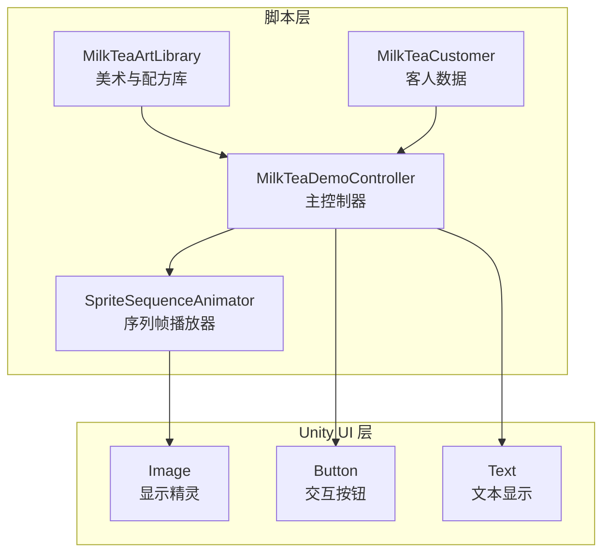
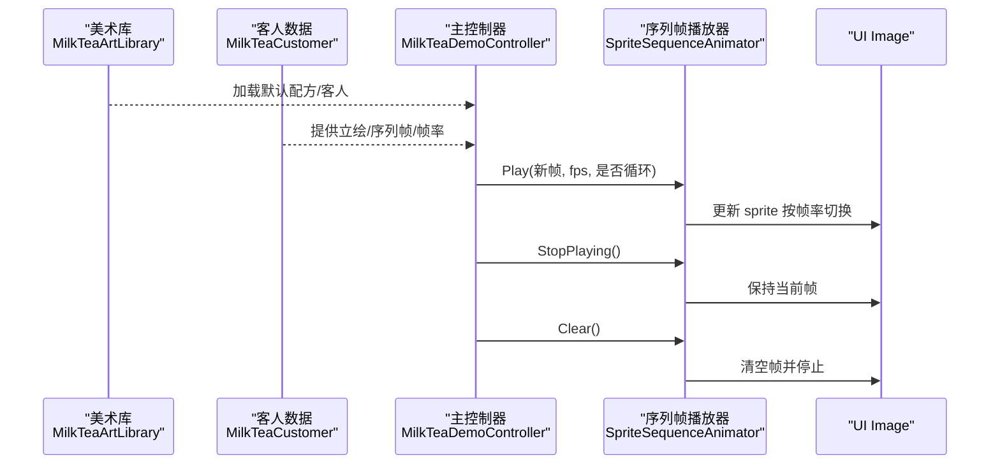
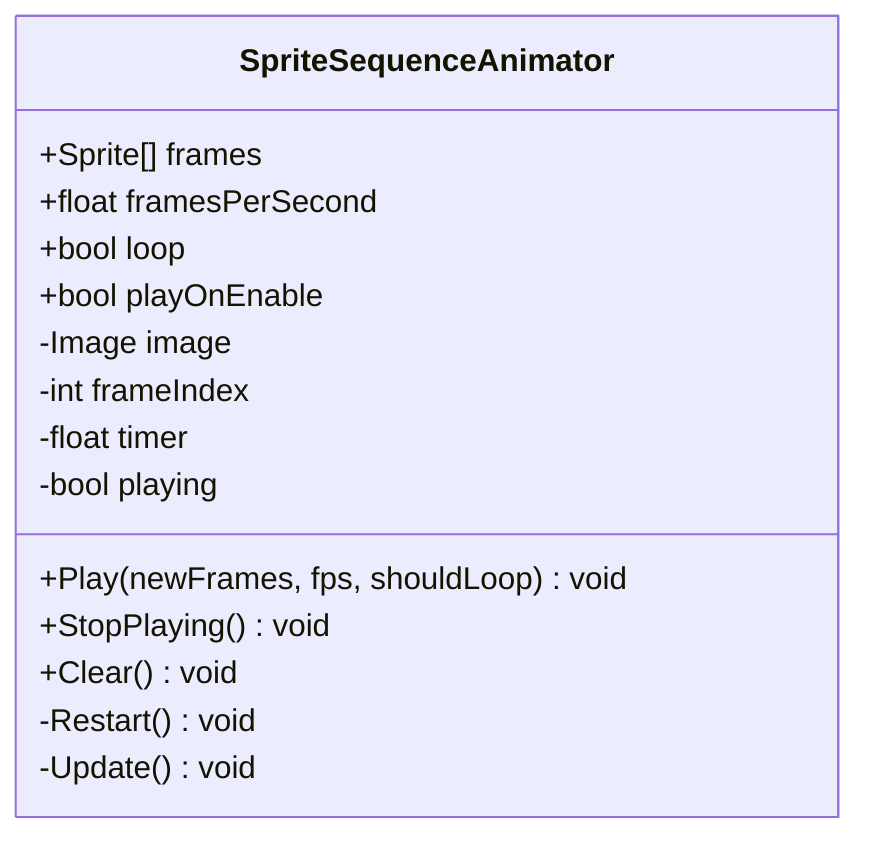
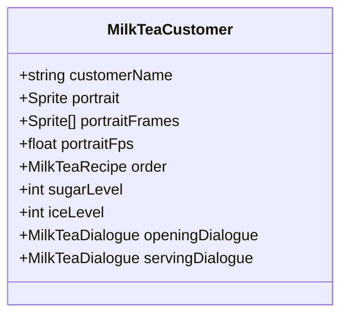
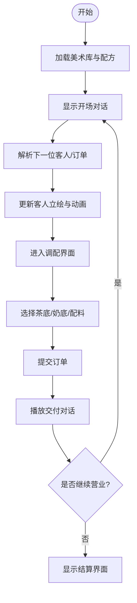
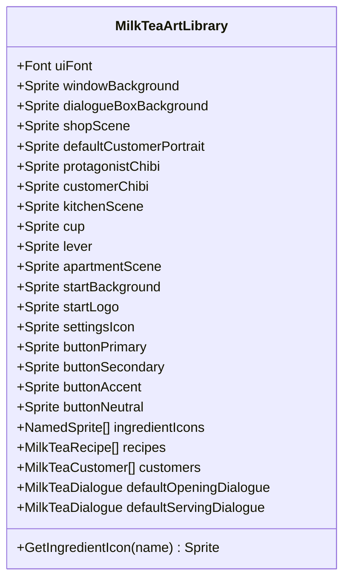
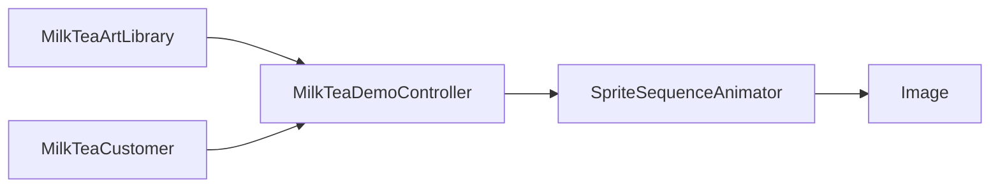

# 精灵序列动画系统

<cite>
**本文引用的文件**   
- [SpriteSequenceAnimator.cs](file://Assets/Scripts/SpriteSequenceAnimator.cs)
- [MilkTeaCustomer.cs](file://Assets/Scripts/MilkTeaCustomer.cs)
- [MilkTeaDemoController.cs](file://Assets/Scripts/MilkTeaDemoController.cs)
- [MilkTeaArtLibrary.cs](file://Assets/Scripts/MilkTeaArtLibrary.cs)
</cite>

## 目录
1. [引言](#引言)
2. [项目结构](#项目结构)
3. [核心组件](#核心组件)
4. [架构总览](#架构总览)
5. [详细组件分析](#详细组件分析)
6. [依赖关系分析](#依赖关系分析)
7. [性能与优化建议](#性能与优化建议)
8. [故障排查指南](#故障排查指南)
9. [结论](#结论)

## 引言
本文件聚焦奶茶店模拟经营项目中的“精灵序列动画系统”，该系统以通用 UI 序列帧播放器为核心，负责在对话界面中按帧率循环播放客人立绘的动画。其设计目标是：
- 将动画数据（序列帧、帧率、是否循环）与运行时显示解耦；
- 支持静态立绘与动态序列帧无缝切换；
- 通过外部控制器注入帧数据，避免场景重建导致的数据丢失；
- 为奶茶店 Demo 的客人出场、点单、交付等流程提供一致的视觉表现。

## 项目结构
围绕精灵序列动画系统的代码主要位于 Assets/Scripts 目录下，关键文件如下：
- SpriteSequenceAnimator.cs：通用序列帧播放器，挂载到带 Image 的 UI 对象上；
- MilkTeaCustomer.cs：客人数据，包含静态立绘、序列帧、帧率及点单信息；
- MilkTeaDemoController.cs：Demo 主控制器，负责流程编排、UI 绑定、调用动画播放；
- MilkTeaArtLibrary.cs：美术与配方总库，集中管理资源与默认配置。

**图表来源**
- [SpriteSequenceAnimator.cs:1-132](file://Assets/Scripts/SpriteSequenceAnimator.cs#L1-L132)
- [MilkTeaCustomer.cs:1-44](file://Assets/Scripts/MilkTeaCustomer.cs#L1-L44)
- [MilkTeaDemoController.cs:1-800](file://Assets/Scripts/MilkTeaDemoController.cs#L1-L800)
- [MilkTeaArtLibrary.cs:1-96](file://Assets/Scripts/MilkTeaArtLibrary.cs#L1-L96)

**章节来源**
- [SpriteSequenceAnimator.cs:1-132](file://Assets/Scripts/SpriteSequenceAnimator.cs#L1-L132)
- [MilkTeaCustomer.cs:1-44](file://Assets/Scripts/MilkTeaCustomer.cs#L1-L44)
- [MilkTeaDemoController.cs:1-800](file://Assets/Scripts/MilkTeaDemoController.cs#L1-L800)
- [MilkTeaArtLibrary.cs:1-96](file://Assets/Scripts/MilkTeaArtLibrary.cs#L1-L96)

## 核心组件
本节对四个核心脚本进行职责说明与关键点梳理：
- SpriteSequenceAnimator：通用 UI 序列帧播放器，负责按帧率更新 Image.sprite，支持循环与非循环模式，并提供 Play/StopPlaying/Clear 等方法控制播放状态；
- MilkTeaCustomer：ScriptableObject 数据类，定义客人的身份、静态立绘、序列帧、帧率以及点单偏好（糖度、冰度、饮品）；
- MilkTeaDemoController：主控制器，负责场景切换、对话流程、原料选择、结算与设置等逻辑，并驱动客人立绘动画；
- MilkTeaArtLibrary：美术与配方总库，集中管理 UI 素材、配方列表、客人出场表与默认对话。

**章节来源**
- [SpriteSequenceAnimator.cs:1-132](file://Assets/Scripts/SpriteSequenceAnimator.cs#L1-L132)
- [MilkTeaCustomer.cs:1-44](file://Assets/Scripts/MilkTeaCustomer.cs#L1-L44)
- [MilkTeaDemoController.cs:1-800](file://Assets/Scripts/MilkTeaDemoController.cs#L1-L800)
- [MilkTeaArtLibrary.cs:1-96](file://Assets/Scripts/MilkTeaArtLibrary.cs#L1-L96)

## 架构总览
精灵序列动画系统在奶茶店 Demo 中的整体协作关系如下：
- MilkTeaArtLibrary 提供默认美术与配方数据；
- MilkTeaCustomer 作为客人数据源，携带静态立绘与序列帧；
- MilkTeaDemoController 根据当前订单与客人数据，决定何时展示对话与调配界面，并调用 SpriteSequenceAnimator 播放或停止动画；
- SpriteSequenceAnimator 仅关注 Image 的 sprite 更新，不关心业务逻辑。

**图表来源**
- [MilkTeaArtLibrary.cs:1-96](file://Assets/Scripts/MilkTeaArtLibrary.cs#L1-L96)
- [MilkTeaCustomer.cs:1-44](file://Assets/Scripts/MilkTeaCustomer.cs#L1-L44)
- [MilkTeaDemoController.cs:1-800](file://Assets/Scripts/MilkTeaDemoController.cs#L1-L800)
- [SpriteSequenceAnimator.cs:1-132](file://Assets/Scripts/SpriteSequenceAnimator.cs#L1-L132)

## 详细组件分析

### SpriteSequenceAnimator 组件分析
该组件是一个通用的 UI 序列帧播放器，挂载到带 Image 的 GameObject 上，核心行为包括：
- 初始化阶段获取 Image 引用；
- OnEnable 时根据 playOnEnable 决定是否自动从头播放；
- OnDisable 时停止播放；
- Play 方法接收新的帧列表、帧率与循环标志，清理旧帧并重启播放；
- StopPlaying 停止播放但保留当前帧；
- Clear 清空帧并停止，避免下次启用时重播；
- Update 中按帧率累加时间，推进 frameIndex，处理循环与非循环结束逻辑，并更新 Image.sprite。

**图表来源**
- [SpriteSequenceAnimator.cs:1-132](file://Assets/Scripts/SpriteSequenceAnimator.cs#L1-L132)

**章节来源**
- [SpriteSequenceAnimator.cs:1-132](file://Assets/Scripts/SpriteSequenceAnimator.cs#L1-L132)

### MilkTeaCustomer 数据模型分析
该 ScriptableObject 定义了客人实体及其点单信息，关键字段包括：
- customerName：客人名称；
- portrait：静态立绘；
- portraitFrames：序列帧列表，≥2 帧则播放动画；
- portraitFps：立绘动画帧率；
- order：想要的饮品（决定正确答案）；
- sugarLevel/iceLevel：糖度与冰度；
- openingDialogue/servingDialogue：可选的对话数据。

**图表来源**
- [MilkTeaCustomer.cs:1-44](file://Assets/Scripts/MilkTeaCustomer.cs#L1-L44)

**章节来源**
- [MilkTeaCustomer.cs:1-44](file://Assets/Scripts/MilkTeaCustomer.cs#L1-L44)

### MilkTeaDemoController 流程与动画集成
主控制器负责：
- 从美术库加载资源与配方；
- 构建默认配方与客人顺序；
- 管理对话流程与调配界面；
- 根据当前订单与客人数据更新立绘与动画；
- 调用 SpriteSequenceAnimator.Play/StopPlaying/Clear 控制动画状态。

**图表来源**
- [MilkTeaDemoController.cs:1-800](file://Assets/Scripts/MilkTeaDemoController.cs#L1-L800)

**章节来源**
- [MilkTeaDemoController.cs:1-800](file://Assets/Scripts/MilkTeaDemoController.cs#L1-L800)

### MilkTeaArtLibrary 资源组织
美术库集中管理：
- UI 字体与背景；
- 对话与调配场景素材；
- 按钮皮肤；
- 原料图标；
- 配方列表；
- 客人出场表；
- 默认对话。

**图表来源**
- [MilkTeaArtLibrary.cs:1-96](file://Assets/Scripts/MilkTeaArtLibrary.cs#L1-L96)

**章节来源**
- [MilkTeaArtLibrary.cs:1-96](file://Assets/Scripts/MilkTeaArtLibrary.cs#L1-L96)

## 依赖关系分析
精灵序列动画系统的依赖关系如下：
- SpriteSequenceAnimator 依赖 Unity UI 的 Image 组件；
- MilkTeaCustomer 依赖 MilkTeaRecipe 与 MilkTeaDialogue（由其他脚本定义）；
- MilkTeaDemoController 依赖 MilkTeaArtLibrary、MilkTeaCustomer、MilkTeaRecipe、MilkTeaDialogue 与 SpriteSequenceAnimator；
- MilkTeaArtLibrary 聚合所有美术与数据资源，被主控制器读取。

**图表来源**
- [MilkTeaArtLibrary.cs:1-96](file://Assets/Scripts/MilkTeaArtLibrary.cs#L1-L96)
- [MilkTeaCustomer.cs:1-44](file://Assets/Scripts/MilkTeaCustomer.cs#L1-L44)
- [MilkTeaDemoController.cs:1-800](file://Assets/Scripts/MilkTeaDemoController.cs#L1-L800)
- [SpriteSequenceAnimator.cs:1-132](file://Assets/Scripts/SpriteSequenceAnimator.cs#L1-L132)

**章节来源**
- [MilkTeaArtLibrary.cs:1-96](file://Assets/Scripts/MilkTeaArtLibrary.cs#L1-L96)
- [MilkTeaCustomer.cs:1-44](file://Assets/Scripts/MilkTeaCustomer.cs#L1-L44)
- [MilkTeaDemoController.cs:1-800](file://Assets/Scripts/MilkTeaDemoController.cs#L1-L800)
- [SpriteSequenceAnimator.cs:1-132](file://Assets/Scripts/SpriteSequenceAnimator.cs#L1-L132)

## 性能与优化建议
- 帧率控制：SpriteSequenceAnimator 使用固定帧率更新，避免每帧都强制刷新；当帧数不足 2 帧时直接停止动画，减少无意义计算；
- 内存与资源：序列帧数据放在 ScriptableObject 中，运行时通过 Play 注入，避免场景重建丢失；
- UI 渲染：Image.type 设置为 Simple 并启用 preserveAspect，确保序列帧显示稳定；
- 生命周期：OnDisable 时停止播放，避免后台持续更新；
- 扩展性：可考虑批量更新多个 Image 或使用对象池复用序列帧播放器，降低分配开销。

[本节为通用指导，无需具体文件引用]

## 故障排查指南
常见问题与定位思路：
- 动画未播放：检查 SpriteSequenceAnimator.frames 是否为空或仅 1 帧；确认 Play 是否被调用且传入有效帧列表；
- 动画卡住：检查 Update 中 frames.Count 与 playing 状态；确认是否在 StopPlaying 后仍期望继续播放；
- 立绘显示异常：确认 Image 组件存在且未被禁用；检查 Reset 时 image.sprite 是否正确设置；
- 数据丢失：确认序列帧数据是否保存在 ScriptableObject 中并通过 Play 注入；
- 主控制器未触发：检查 MilkTeaDemoController 的 Awake/Wire 流程是否正常执行，以及 UI 按钮事件是否绑定。

**章节来源**
- [SpriteSequenceAnimator.cs:1-132](file://Assets/Scripts/SpriteSequenceAnimator.cs#L1-L132)
- [MilkTeaDemoController.cs:1-800](file://Assets/Scripts/MilkTeaDemoController.cs#L1-L800)

## 结论
精灵序列动画系统以轻量、可复用的方式实现了 UI 序列帧播放能力，并与奶茶店 Demo 的业务流程紧密集成。通过将动画数据与运行时显示解耦，系统既支持静态立绘又支持动态序列帧，同时具备良好的可扩展性与稳定性。在实际使用中，建议遵循以下实践：
- 始终通过 Play 注入帧数据，避免直接修改内部状态；
- 在不需要动画时调用 StopPlaying 或 Clear，防止意外重播；
- 将序列帧与帧率配置集中在 ScriptableObject 中，便于编辑与维护；
- 结合主控制器的流程编排，确保动画与对话、调配等界面状态一致。

[本节为总结性内容，无需具体文件引用]