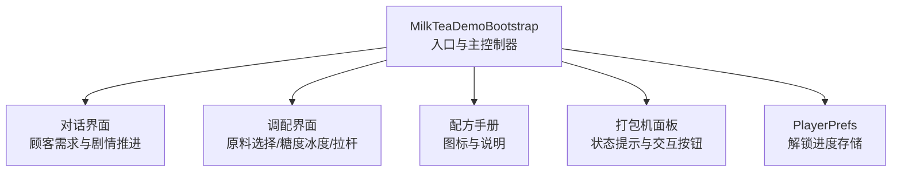
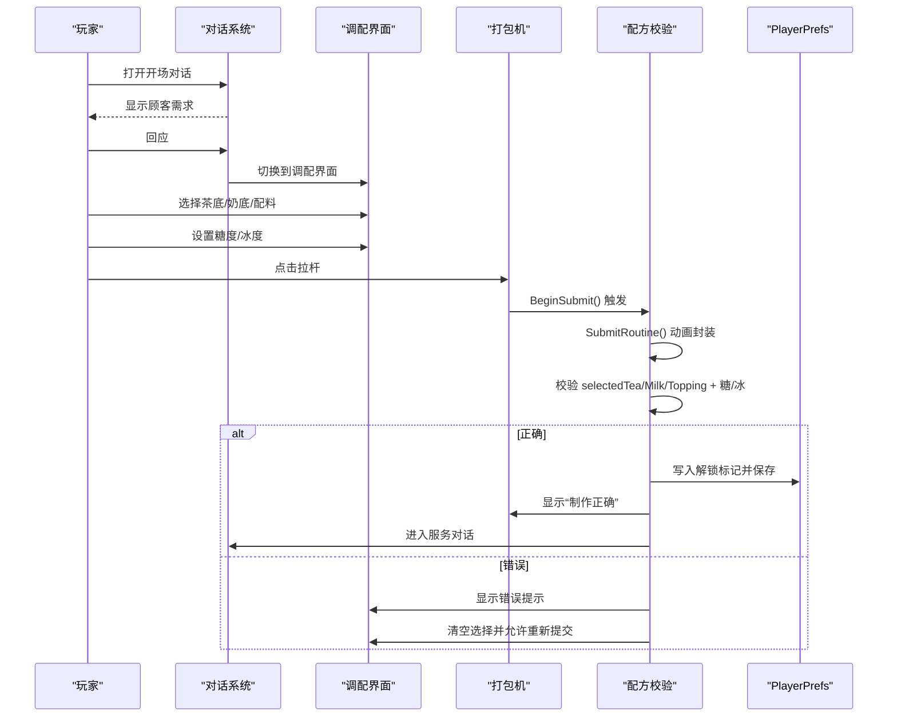
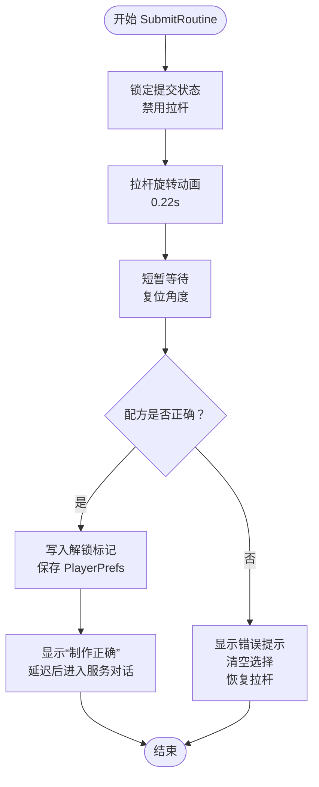
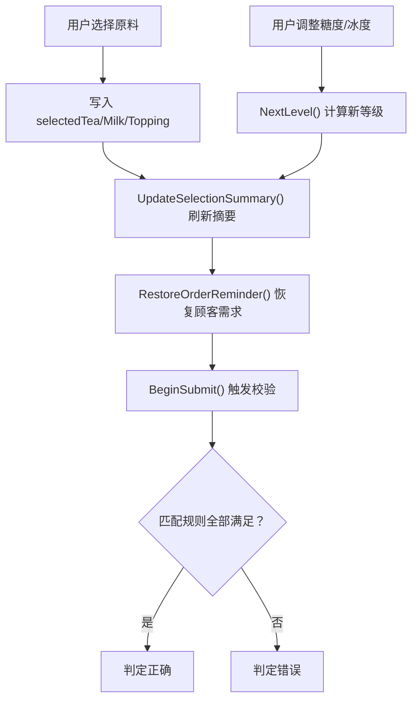
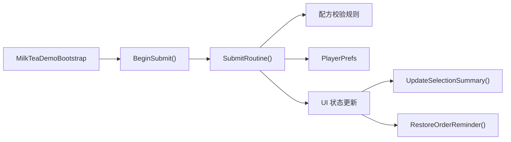

# 订单处理流程

<cite>
**本文引用的文件**   
- [MilkTeaDemoBootstrap.cs](file://Assets/Scripts/MilkTeaDemoBootstrap.cs)
</cite>

## 目录
1. [简介](#简介)
2. [项目结构](#项目结构)
3. [核心组件](#核心组件)
4. [架构总览](#架构总览)
5. [详细组件分析](#详细组件分析)
6. [依赖关系分析](#依赖关系分析)
7. [性能与体验优化](#性能与体验优化)
8. [故障排查指南](#故障排查指南)
9. [结论](#结论)
10. [附录：扩展与自定义](#附录扩展与自定义)

## 简介
本技术文档围绕奶茶店模拟经营中的“订单处理流程”展开，重点解析以下关键能力：
- 提交触发：BeginSubmit() 如何防止重复提交并启动异步处理。
- 异步处理：SubmitRoutine() 的动画、校验、结果分支与状态恢复。
- 配方验证逻辑：selectedTea、selectedMilk、selectedTopping 与糖度、冰度的匹配规则。
- 进度保存机制：使用 PlayerPrefs 存储已解锁配方，并在界面中持久化显示。
- 错误处理流程：配方错误的提示展示与重新调配引导。
- 扩展方案：订单数据模型扩展与验证规则自定义方法。
- 性能与体验优化建议：UI 更新频率、协程开销、输入防抖与反馈增强。

该实现以单脚本驱动 UI 与业务逻辑，适合快速原型与教学演示；在后续扩展时可逐步拆分为更清晰的模块。

## 项目结构
当前工程为 Unity 项目，核心逻辑集中在单一脚本中，负责：
- 运行时自动创建宿主对象与事件系统。
- 动态构建对话界面与调配界面。
- 管理原料选择、糖度冰度调节、拉杆提交、配方验证与解锁进度。

图表来源
- [MilkTeaDemoBootstrap.cs:62-81](file://Assets/Scripts/MilkTeaDemoBootstrap.cs#L62-L81)
- [MilkTeaDemoBootstrap.cs:83-114](file://Assets/Scripts/MilkTeaDemoBootstrap.cs#L83-L114)
- [MilkTeaDemoBootstrap.cs:116-192](file://Assets/Scripts/MilkTeaDemoBootstrap.cs#L116-L192)
- [MilkTeaDemoBootstrap.cs:490-514](file://Assets/Scripts/MilkTeaDemoBootstrap.cs#L490-L514)

章节来源
- [MilkTeaDemoBootstrap.cs:62-114](file://Assets/Scripts/MilkTeaDemoBootstrap.cs#L62-L114)
- [MilkTeaDemoBootstrap.cs:116-192](file://Assets/Scripts/MilkTeaDemoBootstrap.cs#L116-L192)

## 核心组件
- 入口与初始化
  - 场景加载后自动创建宿主对象与 EventSystem，确保 UI 可交互。
  - 构建 Canvas、缩放策略、背景与内容容器。
- 对话系统
  - 控制开场对话、回应与结束感谢，驱动进入调配界面。
- 调配界面
  - 原料分类（茶底、奶底、配料）与选项网格布局。
  - 糖度与冰度三档切换（无糖/少糖/多糖，去冰/少冰/多冰）。
  - 选择汇总文本实时刷新。
- 打包机与提交
  - 拉杆按钮绑定 BeginSubmit()，触发 SubmitRoutine() 动画与校验。
  - 正确时解锁配方并进入服务对话；错误时提示并清空选择。
- 配方手册
  - 根据 PlayerPrefs 显示已解锁配方的图标与文字。

章节来源
- [MilkTeaDemoBootstrap.cs:62-81](file://Assets/Scripts/MilkTeaDemoBootstrap.cs#L62-L81)
- [MilkTeaDemoBootstrap.cs:314-359](file://Assets/Scripts/MilkTeaDemoBootstrap.cs#L314-L359)
- [MilkTeaDemoBootstrap.cs:220-266](file://Assets/Scripts/MilkTeaDemoBootstrap.cs#L220-L266)
- [MilkTeaDemoBootstrap.cs:295-312](file://Assets/Scripts/MilkTeaDemoBootstrap.cs#L295-L312)
- [MilkTeaDemoBootstrap.cs:465-514](file://Assets/Scripts/MilkTeaDemoBootstrap.cs#L465-L514)
- [MilkTeaDemoBootstrap.cs:543-549](file://Assets/Scripts/MilkTeaDemoBootstrap.cs#L543-L549)

## 架构总览
整体流程从“顾客下单”开始，经过“对话确认”，进入“调配界面”，用户完成原料与口味选择后点击“拉杆”提交，系统进行“动画封装 + 配方校验”，最终给出“成功解锁/失败重试”的结果。

图表来源
- [MilkTeaDemoBootstrap.cs:314-359](file://Assets/Scripts/MilkTeaDemoBootstrap.cs#L314-L359)
- [MilkTeaDemoBootstrap.cs:465-514](file://Assets/Scripts/MilkTeaDemoBootstrap.cs#L465-L514)
- [MilkTeaDemoBootstrap.cs:490-514](file://Assets/Scripts/MilkTeaDemoBootstrap.cs#L490-L514)

## 详细组件分析

### 提交触发：BeginSubmit()
- 作用
  - 防止重复提交：通过 isSubmitting 标志位避免多次启动协程。
  - 启动异步处理：调用 StartCoroutine(SubmitRoutine())。
- 关键点
  - 仅在未提交中时启动协程，保证线程安全与 UI 一致性。
  - 与拉杆按钮绑定，作为用户交互入口。

章节来源
- [MilkTeaDemoBootstrap.cs:465-471](file://Assets/Scripts/MilkTeaDemoBootstrap.cs#L465-L471)
- [MilkTeaDemoBootstrap.cs:307-311](file://Assets/Scripts/MilkTeaDemoBootstrap.cs#L307-L311)

### 异步处理：SubmitRoutine()
- 阶段划分
  - 动画阶段：拉杆旋转动画，持续约 0.22 秒，帧级更新。
  - 等待阶段：短暂停顿后复位拉杆角度。
  - 校验阶段：对比所选原料与糖/冰等级。
  - 分支处理：
    - 正确：写入解锁标记、更新配方图标、显示成功状态、延迟后进入服务对话。
    - 错误：显示内心独白与顾客需求提醒、机器状态提示“请重新调配”、清空选择、恢复按钮可交互。
- 状态管理
  - isSubmitting 用于锁定提交过程。
  - leverButton.interactable 控制拉杆可用性。
  - machineStatus 提供即时反馈。

图表来源
- [MilkTeaDemoBootstrap.cs:473-514](file://Assets/Scripts/MilkTeaDemoBootstrap.cs#L473-L514)

章节来源
- [MilkTeaDemoBootstrap.cs:473-514](file://Assets/Scripts/MilkTeaDemoBootstrap.cs#L473-L514)

### 配方验证算法
- 匹配规则
  - selectedTea == "红茶"
  - selectedMilk == "鲜奶"
  - selectedTopping == "珍珠"
  - sugarLevel == 1（少糖）
  - iceLevel == 1（少冰）
- 数据来源
  - 原料选择：SelectIngredient() 将用户选择写入对应字段。
  - 糖度/冰度：ChangeLevel() 与 NextLevel() 在三档之间循环切换。
- 可视化反馈
  - UpdateSelectionSummary() 实时显示当前选择与口味。
  - RestoreOrderReminder() 在每次变更后恢复顾客需求提示。

图表来源
- [MilkTeaDemoBootstrap.cs:381-399](file://Assets/Scripts/MilkTeaDemoBootstrap.cs#L381-L399)
- [MilkTeaDemoBootstrap.cs:413-442](file://Assets/Scripts/MilkTeaDemoBootstrap.cs#L413-L442)
- [MilkTeaDemoBootstrap.cs:457-463](file://Assets/Scripts/MilkTeaDemoBootstrap.cs#L457-L463)
- [MilkTeaDemoBootstrap.cs:490-491](file://Assets/Scripts/MilkTeaDemoBootstrap.cs#L490-L491)

章节来源
- [MilkTeaDemoBootstrap.cs:381-399](file://Assets/Scripts/MilkTeaDemoBootstrap.cs#L381-L399)
- [MilkTeaDemoBootstrap.cs:413-442](file://Assets/Scripts/MilkTeaDemoBootstrap.cs#L413-L442)
- [MilkTeaDemoBootstrap.cs:457-463](file://Assets/Scripts/MilkTeaDemoBootstrap.cs#L457-L463)
- [MilkTeaDemoBootstrap.cs:490-491](file://Assets/Scripts/MilkTeaDemoBootstrap.cs#L490-L491)

### 进度保存机制：PlayerPrefs
- 解锁键
  - 常量 UnlockKey 标识经典珍珠奶茶是否已解锁。
- 写入时机
  - 配方校验成功后，设置值为 1 并立即 Save()。
- 读取与显示
  - UpdateRecipeIcon() 读取值并更新配方手册图标与样式。
- 初始状态
  - 首次运行默认未解锁，图标显示问号。

章节来源
- [MilkTeaDemoBootstrap.cs:17-17](file://Assets/Scripts/MilkTeaDemoBootstrap.cs#L17-L17)
- [MilkTeaDemoBootstrap.cs:490-497](file://Assets/Scripts/MilkTeaDemoBootstrap.cs#L490-L497)
- [MilkTeaDemoBootstrap.cs:543-549](file://Assets/Scripts/MilkTeaDemoBootstrap.cs#L543-L549)

### 错误处理流程
- 错误提示
  - 修改订单提醒区标题与内容为“主角（内心）”与“这么做好像不正确”。
  - 机器状态显示“请重新调配”，颜色改为警示色。
- 引导逻辑
  - ClearSelections() 清空所有选择与等级，重置分类到茶底。
  - 恢复机器状态文案与颜色。
  - 重新启用拉杆按钮，允许再次提交。

章节来源
- [MilkTeaDemoBootstrap.cs:503-511](file://Assets/Scripts/MilkTeaDemoBootstrap.cs#L503-L511)
- [MilkTeaDemoBootstrap.cs:516-529](file://Assets/Scripts/MilkTeaDemoBootstrap.cs#L516-L529)

## 依赖关系分析
- 内部依赖
  - BeginSubmit() 依赖 SubmitRoutine()。
  - SubmitRoutine() 依赖 SelectIngredient()/ChangeLevel() 产生的状态。
  - UpdateRecipeIcon() 依赖 PlayerPrefs。
- 外部依赖
  - Unity UI 组件：Text、Button、Image、Canvas、EventSystem。
  - Unity 持久化：PlayerPrefs。
- 耦合性
  - 当前实现将 UI 构建、状态管理与业务校验集中在同一脚本，耦合度高但便于原型开发。
  - 可扩展为独立的数据模型与验证器，降低耦合。

图表来源
- [MilkTeaDemoBootstrap.cs:465-514](file://Assets/Scripts/MilkTeaDemoBootstrap.cs#L465-L514)
- [MilkTeaDemoBootstrap.cs:457-463](file://Assets/Scripts/MilkTeaDemoBootstrap.cs#L457-L463)
- [MilkTeaDemoBootstrap.cs:531-535](file://Assets/Scripts/MilkTeaDemoBootstrap.cs#L531-L535)

章节来源
- [MilkTeaDemoBootstrap.cs:465-514](file://Assets/Scripts/MilkTeaDemoBootstrap.cs#L465-L514)
- [MilkTeaDemoBootstrap.cs:457-463](file://Assets/Scripts/MilkTeaDemoBootstrap.cs#L457-L463)
- [MilkTeaDemoBootstrap.cs:531-535](file://Assets/Scripts/MilkTeaDemoBootstrap.cs#L531-L535)

## 性能与体验优化
- 动画与协程
  - 拉杆动画使用 Time.deltaTime 逐帧更新，注意在低端设备上减少额外计算。
  - 若未来增加复杂动画或粒子效果，建议使用 Animator 或 Tween 库以减少手动插值。
- UI 更新频率
  - 每次选择或等级变化都会刷新摘要与提示，属于轻量操作；如扩展大量选项，可考虑增量更新或缓存文本。
- 输入防抖
  - 当前通过 isSubmitting 防止重复提交；可进一步对原料选择与等级切换做短时防抖，避免频繁刷新。
- 用户体验
  - 错误提示中加入具体差异项（例如“糖度应为少糖”），提升可理解性。
  - 成功时加入简短音效或震动反馈，增强成就感。
  - 配方手册支持翻页与搜索，便于扩展多配方场景。

[本节为通用优化建议，不直接分析具体文件]

## 故障排查指南
- 无法显示中文
  - 检查字体创建逻辑是否能找到系统字体；回退到 Arial。
  - 确认平台字体支持情况。
- 对话框不响应
  - 确认 EventSystem 已创建且 StandaloneInputModule 存在。
- 拉杆不可用
  - 检查 isSubmitting 状态与 leverButton.interactable 设置。
- 解锁进度未保存
  - 检查 PlayerPrefs.SetInt 与 Save() 是否执行。
  - 确认 UpdateRecipeIcon() 被调用。
- 配方校验失败
  - 核对 selectedTea/Milk/Topping 与糖/冰等级是否符合预期。
  - 检查 RestoreOrderReminder() 是否被调用以恢复提示。

章节来源
- [MilkTeaDemoBootstrap.cs:697-708](file://Assets/Scripts/MilkTeaDemoBootstrap.cs#L697-L708)
- [MilkTeaDemoBootstrap.cs:710-718](file://Assets/Scripts/MilkTeaDemoBootstrap.cs#L710-L718)
- [MilkTeaDemoBootstrap.cs:473-514](file://Assets/Scripts/MilkTeaDemoBootstrap.cs#L473-L514)
- [MilkTeaDemoBootstrap.cs:490-497](file://Assets/Scripts/MilkTeaDemoBootstrap.cs#L490-L497)
- [MilkTeaDemoBootstrap.cs:531-535](file://Assets/Scripts/MilkTeaDemoBootstrap.cs#L531-L535)

## 结论
本实现以简洁的单脚本架构完成了奶茶店模拟经营的订单处理流程，涵盖：
- 提交触发与异步处理。
- 配方验证与进度保存。
- 错误提示与重新调配引导。
在保持易用的同时，具备良好的扩展空间。建议在后续迭代中引入数据模型与验证器分离，以提升可维护性与测试覆盖。

[本节为总结性内容，不直接分析具体文件]

## 附录：扩展与自定义

### 订单数据模型扩展
- 新增字段
  - 温度档位、甜度档位、配料组合、杯型、包装方式等。
- 数据结构建议
  - 定义 Order 类，包含 Tea、Milk、Toppings[]、Sugar、Ice、CupType 等属性。
  - 定义 Recipe 类，描述目标配方与解锁条件。
- 状态管理
  - 将 selectedTea/Milk/Topping 与 sugarLevel/iceLevel 迁移至 Order 实例。
  - 使用枚举替代字符串比较，提高可读性与安全性。

[本节为概念性扩展建议，不直接分析具体文件]

### 验证规则的自定义方法
- 规则引擎
  - 定义 IValidationRule 接口，包含 IsSatisfied(Order) bool。
  - 内置规则：基础配方匹配、糖/冰等级匹配、配料兼容性。
- 规则组合
  - 使用 And/Or 组合多个规则，支持复杂订单校验。
- 配置化
  - 将规则与配方定义放入 JSON 或 ScriptableObject，便于策划编辑。
- 示例思路
  - 将当前的硬编码校验替换为规则列表遍历，返回第一个失败原因以便提示。

[本节为概念性扩展建议，不直接分析具体文件]

### 性能优化建议
- 批量 UI 更新
  - 合并多次选择变更后的摘要刷新，减少 Text 赋值次数。
- 资源预加载
  - 配方图标与字体预加载，避免运行时创建导致的卡顿。
- 协程节流
  - 对频繁触发的协程进行节流或取消旧任务，避免堆积。

[本节为通用优化建议，不直接分析具体文件]