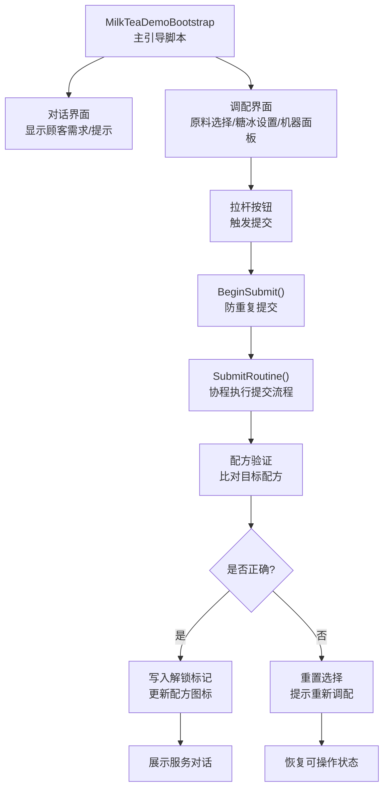
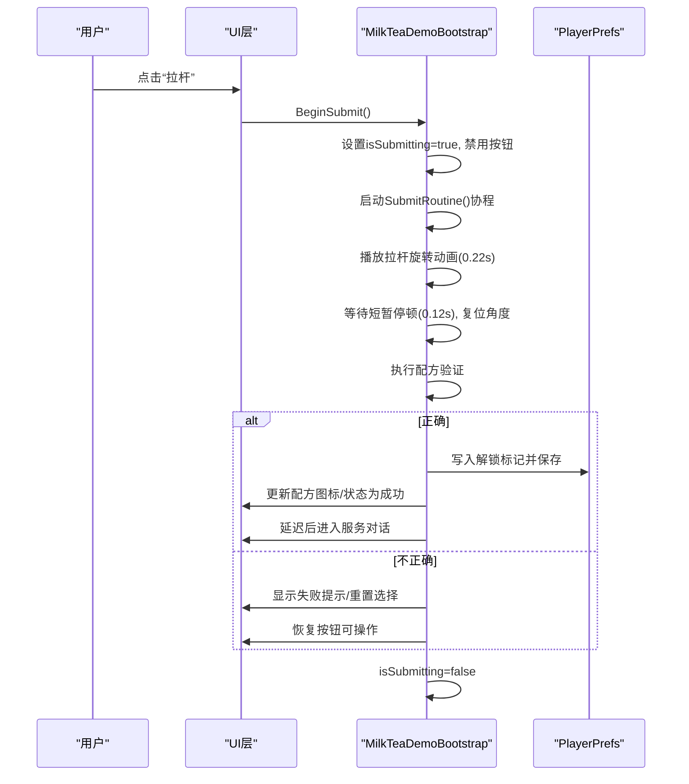
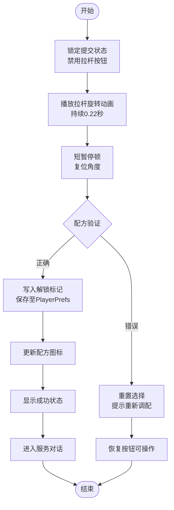
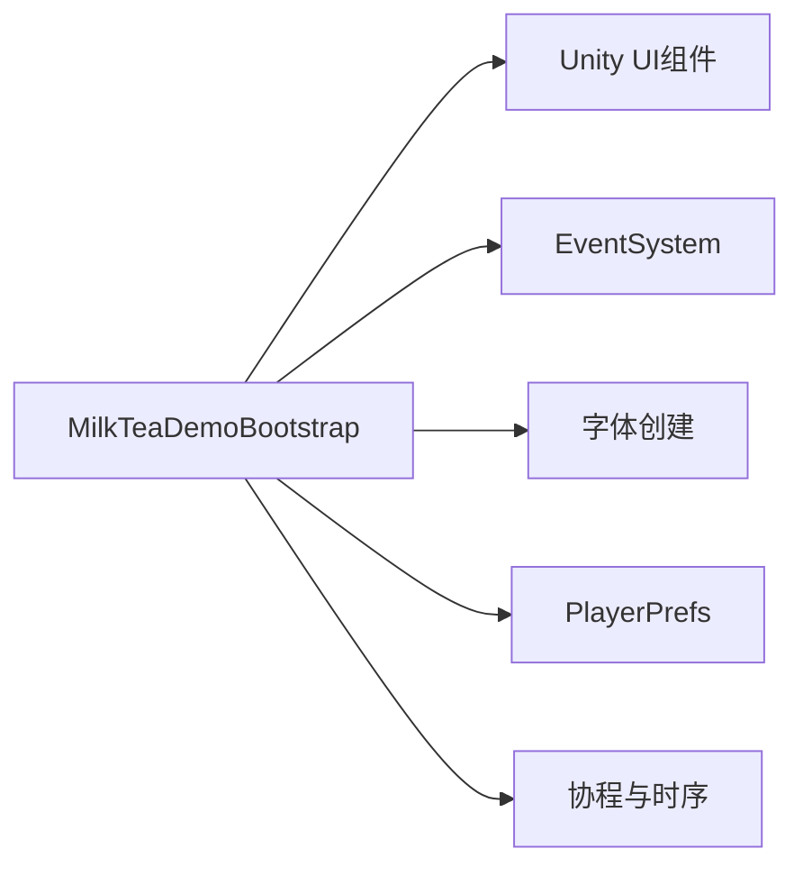

# 订单处理流程

<cite>
**本文引用的文件**
- [MilkTeaDemoBootstrap.cs](file://Assets/Scripts/MilkTeaDemoBootstrap.cs)
</cite>

## 目录
1. [简介](#简介)
2. [项目结构](#项目结构)
3. [核心组件](#核心组件)
4. [架构总览](#架构总览)
5. [详细组件分析](#详细组件分析)
6. [依赖关系分析](#依赖关系分析)
7. [性能考虑](#性能考虑)
8. [故障排查指南](#故障排查指南)
9. [结论](#结论)
10. [附录](#附录)

## 简介
本技术文档围绕奶茶店模拟经营项目的“订单处理流程”展开，重点解析提交订单的核心逻辑：BeginSubmit()与SubmitRoutine()方法。内容涵盖配方验证算法、错误处理机制、结果反馈系统、PlayerPrefs数据持久化（解锁状态保存与加载）、动画效果实现（拉杆旋转与界面切换过渡），并提供扩展新配方与修改验证规则的方法，以及性能优化与用户体验改进建议。

## 项目结构
本项目采用单脚本驱动演示的方式，所有UI与交互逻辑集中在一个引导脚本中，通过运行时动态创建Canvas、面板、文本与按钮，构建对话界面与调配界面，并处理用户输入与订单提交流程。

图表来源
- [MilkTeaDemoBootstrap.cs:314-346](file://Assets/Scripts/MilkTeaDemoBootstrap.cs#L314-L346)
- [MilkTeaDemoBootstrap.cs:465-514](file://Assets/Scripts/MilkTeaDemoBootstrap.cs#L465-L514)

章节来源
- [MilkTeaDemoBootstrap.cs:62-81](file://Assets/Scripts/MilkTeaDemoBootstrap.cs#L62-L81)
- [MilkTeaDemoBootstrap.cs:83-192](file://Assets/Scripts/MilkTeaDemoBootstrap.cs#L83-L192)

## 核心组件
- 引导与初始化
  - 场景启动后自动创建宿主对象并挂载引导脚本，确保全局唯一实例。
  - 在Awake中创建中文字体、确保事件系统存在、构建界面并显示开场对话。
- 界面构建
  - 动态创建Canvas、缩放器、背景与16:9内容区域。
  - 对话界面：包含顾客头像占位、店铺俯视图、对话框与继续按钮。
  - 调配界面：包含订单提醒、原料选择区（茶底/奶底/配料）、糖度与冰度滑块、打包机状态与拉杆按钮。
- 交互与状态
  - 原料类别切换、单项选择、糖冰等级切换、选择汇总更新。
  - 拉杆点击触发提交，提交过程中禁用按钮并播放拉杆旋转动画。
- 提交与验证
  - BeginSubmit()防止重复提交，调用SubmitRoutine()协程。
  - SubmitRoutine()执行拉杆动画、校验配方、持久化解锁状态、更新UI并进入服务对话或重置。

章节来源
- [MilkTeaDemoBootstrap.cs:62-81](file://Assets/Scripts/MilkTeaDemoBootstrap.cs#L62-L81)
- [MilkTeaDemoBootstrap.cs:83-192](file://Assets/Scripts/MilkTeaDemoBootstrap.cs#L83-L192)
- [MilkTeaDemoBootstrap.cs:361-463](file://Assets/Scripts/MilkTeaDemoBootstrap.cs#L361-L463)
- [MilkTeaDemoBootstrap.cs:465-514](file://Assets/Scripts/MilkTeaDemoBootstrap.cs#L465-L514)

## 架构总览
整体流程以“对话→调配→提交→反馈”为主线，使用协程控制时序与动画，结合UI状态与PlayerPrefs完成解锁状态的跨会话持久化。

图表来源
- [MilkTeaDemoBootstrap.cs:465-514](file://Assets/Scripts/MilkTeaDemoBootstrap.cs#L465-L514)
- [MilkTeaDemoBootstrap.cs:314-346](file://Assets/Scripts/MilkTeaDemoBootstrap.cs#L314-L346)

## 详细组件分析

### 订单提交核心：BeginSubmit() 与 SubmitRoutine()
- BeginSubmit()
  - 作用：入口方法，防止重复提交。若当前未处于提交状态则启动协程。
  - 关键点：isSubmitting标志用于节流；调用SubmitRoutine()。
- SubmitRoutine()
  - 作用：协程执行完整的提交流程，包括动画、验证、持久化与反馈。
  - 关键步骤：
    - 锁定按钮并更新机器状态文案。
    - 播放拉杆旋转动画：在固定时长内逐步改变localRotation的Z轴角度，形成下拉效果。
    - 短暂停顿后复位角度。
    - 配方验证：将当前选择的茶底、奶底、配料与糖冰等级与目标配方进行比对。
    - 结果分支：
      - 正确：写入解锁标记到PlayerPrefs并立即Save，更新配方图标，显示成功状态，延迟后进入服务对话。
      - 错误：更新订单提醒为失败提示，重置选择，恢复按钮可操作。
    - 释放锁：isSubmitting=false。

图表来源
- [MilkTeaDemoBootstrap.cs:465-514](file://Assets/Scripts/MilkTeaDemoBootstrap.cs#L465-L514)

章节来源
- [MilkTeaDemoBootstrap.cs:465-514](file://Assets/Scripts/MilkTeaDemoBootstrap.cs#L465-L514)

### 配方验证算法
- 目标配方定义：
  - 茶底：红茶
  - 奶底：鲜奶
  - 配料：珍珠
  - 糖度：少糖（等级1）
  - 冰度：少冰（等级1）
- 验证逻辑：
  - 将当前选择的茶底、奶底、配料字符串与糖冰等级与目标值逐一比对。
  - 全部匹配则判定为正确，否则为错误。
- 复杂度：
  - 时间复杂度O(1)，仅涉及常数次比较。
  - 空间复杂度O(1)。

章节来源
- [MilkTeaDemoBootstrap.cs:490-491](file://Assets/Scripts/MilkTeaDemoBootstrap.cs#L490-L491)

### 错误处理机制与结果反馈系统
- 错误处理：
  - 提交期间禁用拉杆按钮，避免重复提交。
  - 配方不匹配时，清空选择并提示重新调配，恢复按钮可操作。
- 结果反馈：
  - 成功：机器状态文案与颜色变化，配方图标更新，随后进入服务对话。
  - 失败：订单提醒区域显示失败提示与目标需求，机器状态提示重新调配。

章节来源
- [MilkTeaDemoBootstrap.cs:473-514](file://Assets/Scripts/MilkTeaDemoBootstrap.cs#L473-L514)
- [MilkTeaDemoBootstrap.cs:531-535](file://Assets/Scripts/MilkTeaDemoBootstrap.cs#L531-L535)

### PlayerPrefs数据持久化：解锁状态的保存与加载
- 保存：
  - 当配方验证正确时，写入解锁键对应的整型值为1，并立即保存。
- 加载：
  - 更新配方图标时读取该键，默认值为0；根据是否解锁决定图标文字、字号与颜色。
- 键名：
  - 使用常量键名以避免硬编码不一致。

章节来源
- [MilkTeaDemoBootstrap.cs:495-497](file://Assets/Scripts/MilkTeaDemoBootstrap.cs#L495-L497)
- [MilkTeaDemoBootstrap.cs:543-549](file://Assets/Scripts/MilkTeaDemoBootstrap.cs#L543-L549)
- [MilkTeaDemoBootstrap.cs:17-17](file://Assets/Scripts/MilkTeaDemoBootstrap.cs#L17-L17)

### 动画效果实现：拉杆旋转与界面切换过渡
- 拉杆旋转动画：
  - 在协程中以固定时长逐步插值Z轴旋转角度，形成下拉拉杆的视觉效果。
  - 动画结束后短暂停顿并复位角度，保证视觉连贯。
- 界面切换过渡：
  - 对话界面与调配界面通过SetActive切换显示。
  - 进入调配界面前清空选择并恢复订单提醒，确保状态一致。

章节来源
- [MilkTeaDemoBootstrap.cs:479-488](file://Assets/Scripts/MilkTeaDemoBootstrap.cs#L479-L488)
- [MilkTeaDemoBootstrap.cs:327-334](file://Assets/Scripts/MilkTeaDemoBootstrap.cs#L327-L334)

### 扩展新配方与修改验证规则
- 新增配方步骤：
  - 在界面中增加新的配方页或条目（如配方手册区域）。
  - 为目标配方定义目标值（茶底、奶底、配料、糖度、冰度）。
  - 在验证逻辑中添加对应分支，按目标值进行比对。
  - 如需解锁不同配方，可使用不同的PlayerPrefs键名分别记录解锁状态。
- 修改验证规则：
  - 调整目标值或添加额外约束（如必须选择特定配料组合）。
  - 保持验证逻辑的O(1)特性，避免复杂计算。
- 注意事项：
  - 保持键名常量集中管理，便于维护。
  - 更新UI显示与提示文案，确保用户理解当前目标。

章节来源
- [MilkTeaDemoBootstrap.cs:490-491](file://Assets/Scripts/MilkTeaDemoBootstrap.cs#L490-L491)
- [MilkTeaDemoBootstrap.cs:543-549](file://Assets/Scripts/MilkTeaDemoBootstrap.cs#L543-L549)

## 依赖关系分析
- 内部依赖
  - 界面构建依赖：CreatePanel、CreateText、CreateButton等工具方法。
  - 状态管理依赖：currentCategory、selectedTea/Milk/Topping、sugarLevel/iceLevel、isSubmitting。
  - 协程依赖：SubmitRoutine()使用Time.deltaTime与WaitForSeconds控制时序。
- 外部依赖
  - Unity UI：Canvas、Text、Button、Image、Outline等。
  - 事件系统：EventSystem与StandaloneInputModule。
  - 字体：动态创建中文字体，回退到内置Arial。
  - 存储：PlayerPrefs用于解锁状态持久化。

图表来源
- [MilkTeaDemoBootstrap.cs:697-718](file://Assets/Scripts/MilkTeaDemoBootstrap.cs#L697-L718)
- [MilkTeaDemoBootstrap.cs:473-514](file://Assets/Scripts/MilkTeaDemoBootstrap.cs#L473-L514)

章节来源
- [MilkTeaDemoBootstrap.cs:697-718](file://Assets/Scripts/MilkTeaDemoBootstrap.cs#L697-L718)
- [MilkTeaDemoBootstrap.cs:473-514](file://Assets/Scripts/MilkTeaDemoBootstrap.cs#L473-L514)

## 性能考虑
- 动画与协程
  - 使用固定时长与帧增量控制动画，避免每帧分配过多对象。
  - 建议在后续版本中使用Animation或DOTween等动画库以获得更流畅与可配置的效果。
- UI更新频率
  - 仅在状态变化时更新UI文本与颜色，减少不必要的重绘。
- 存储I/O
  - PlayerPrefs.Save()在成功路径调用一次即可，避免频繁写盘。
- 资源与字体
  - 动态字体创建已做异常回退，生产环境建议预置字体资源以提升稳定性。

[本节提供通用指导，无需具体文件引用]

## 故障排查指南
- 拉杆无响应
  - 检查isSubmitting是否被错误锁定；确认BeginSubmit()与SubmitRoutine()中的状态切换。
- 配方始终判定为错误
  - 核对目标配方值与用户选择是否一致；检查糖冰等级映射是否正确。
- 解锁状态未保存
  - 确认PlayerPrefs键名一致；检查Save()是否被调用；清理缓存后重试。
- 界面切换异常
  - 检查dialogueScreen与mixingScreen的SetActive状态；确认进入调配界面前的清空选择逻辑。

章节来源
- [MilkTeaDemoBootstrap.cs:465-514](file://Assets/Scripts/MilkTeaDemoBootstrap.cs#L465-L514)
- [MilkTeaDemoBootstrap.cs:516-529](file://Assets/Scripts/MilkTeaDemoBootstrap.cs#L516-L529)
- [MilkTeaDemoBootstrap.cs:543-549](file://Assets/Scripts/MilkTeaDemoBootstrap.cs#L543-L549)

## 结论
本项目的订单处理流程以单一脚本为核心，通过协程与UI状态管理实现了清晰的提交、验证与反馈闭环。BeginSubmit()与SubmitRoutine()构成了提交流程的关键节点，配合PlayerPrefs完成解锁状态的持久化。动画与界面切换提升了用户体验。未来可通过引入动画库、结构化配方管理与多配方支持进一步提升可扩展性与表现力。

[本节总结性内容，无需具体文件引用]

## 附录
- 关键方法与职责速查
  - BeginSubmit()：入口节流，启动协程。
  - SubmitRoutine()：协程执行动画、验证、持久化与反馈。
  - SelectIngredient()/ChangeLevel()：更新选择与等级，刷新UI。
  - RestoreOrderReminder()：恢复订单提醒文案。
  - UpdateRecipeIcon()：根据解锁状态更新配方图标。
- 扩展建议
  - 将目标配方与验证规则抽取为配置表或数据结构，便于热更新与多配方支持。
  - 为不同配方定义独立解锁键，避免覆盖冲突。
  - 增加音效与粒子效果增强沉浸感。

章节来源
- [MilkTeaDemoBootstrap.cs:381-463](file://Assets/Scripts/MilkTeaDemoBootstrap.cs#L381-L463)
- [MilkTeaDemoBootstrap.cs:465-514](file://Assets/Scripts/MilkTeaDemoBootstrap.cs#L465-L514)
- [MilkTeaDemoBootstrap.cs:531-549](file://Assets/Scripts/MilkTeaDemoBootstrap.cs#L531-L549)