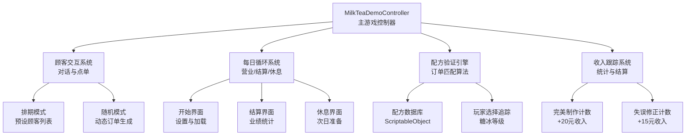
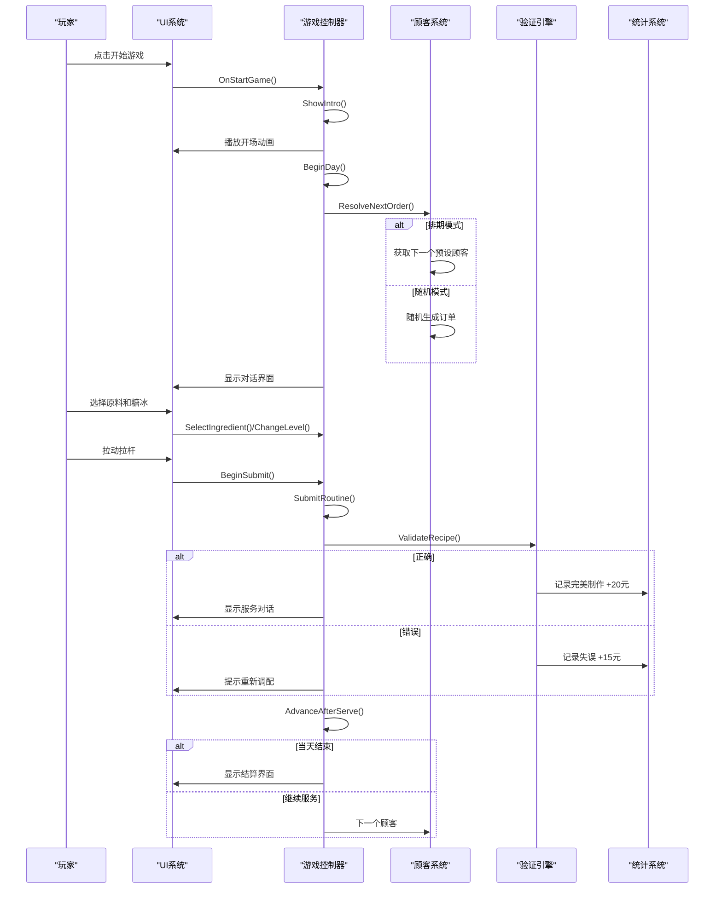
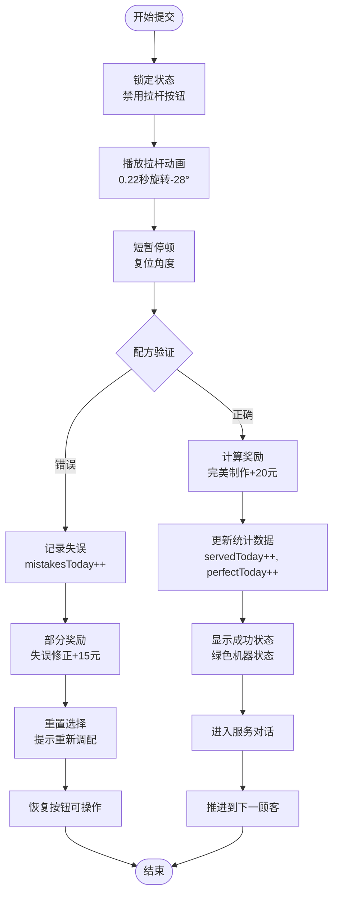
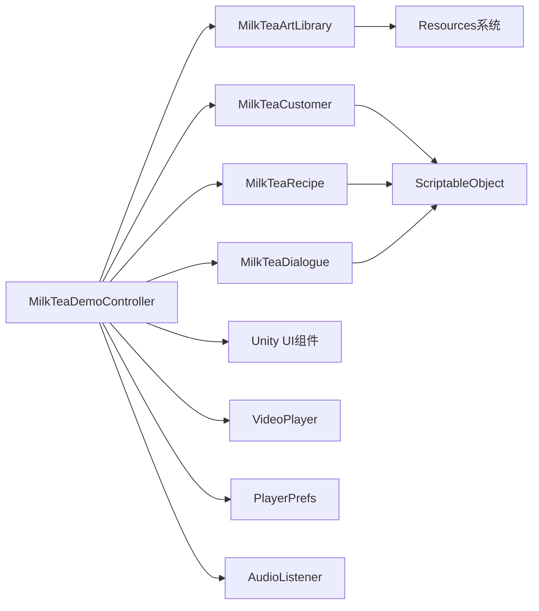

# 订单处理流程

<cite>
**本文引用的文件**
- [MilkTeaDemoController.cs](file://Assets/Scripts/MilkTeaDemoController.cs)
- [MilkTeaCustomer.cs](file://Assets/Scripts/MilkTeaCustomer.cs)
- [MilkTeaArtLibrary.cs](file://Assets/Scripts/MilkTeaArtLibrary.cs)
- [MilkTeaRecipe.cs](file://Assets/Scripts/MilkTeaRecipe.cs)
- [MilkTeaDialogue.cs](file://Assets/Scripts/MilkTeaDialogue.cs)
</cite>

## 更新摘要
**变更内容**
- 更新了核心控制器架构，从单一引导脚本升级为完整的游戏控制器
- 新增了顾客交互系统，支持排期模式和随机点单模式
- 实现了每日循环机制，包括营业开始、结算和休息界面
- 添加了收入跟踪系统，记录完美制作、操作失误和营收统计
- 增强了配方验证算法，支持更复杂的订单需求
- 完善了PlayerPrefs数据持久化，支持设置保存和解锁状态管理
- 扩展了动画效果，包括开场动画、拉杆旋转和界面切换过渡

## 目录
1. [简介](#简介)
2. [项目结构](#项目结构)
3. [核心组件](#核心组件)
4. [架构总览](#架构总览)
5. [详细组件分析](#详细组件分析)
6. [依赖关系分析](#依赖关系分析)
7. [性能考虑](#性能考虑)
8. [故障排查指南](#故障排查指南)
9. [结论](#结论)
10. [附录](#附录)

## 简介
本技术文档围绕奶茶店模拟经营项目的增强版订单处理流程展开，重点解析由MilkTeaDemoController.cs管理的完整游戏循环。新版本包含了顾客交互系统、每日循环机制、收入跟踪功能，以及支持随机订单生成和排期客户模式的多种游戏玩法状态。文档深入分析了BeginSubmit()和SubmitRoutine()方法的实现逻辑，包括增强的配方验证算法、错误处理机制、结果反馈系统和PlayerPrefs数据持久化。

## 项目结构
项目采用模块化架构设计，以MilkTeaDemoController为核心控制器，通过ScriptableObject资源管理配方、顾客和对话数据。系统支持两种主要模式：排期模式（按预设顾客列表顺序服务）和随机模式（从可用配方中随机生成订单）。

**图表来源**
- [MilkTeaDemoController.cs:18-24](file://Assets/Scripts/MilkTeaDemoController.cs#L18-L24)
- [MilkTeaDemoController.cs:482-516](file://Assets/Scripts/MilkTeaDemoController.cs#L482-L516)
- [MilkTeaDemoController.cs:615-699](file://Assets/Scripts/MilkTeaDemoController.cs#L615-L699)

## 核心组件

### 游戏控制器架构
- **MilkTeaDemoController**: 主游戏控制器，管理所有游戏状态和业务流程
- **MilkTeaCustomer**: 顾客数据结构，定义每个顾客的订单需求和个性化对话
- **MilkTeaArtLibrary**: 美术资源库，集中管理所有Sprite、配方和顾客数据
- **MilkTeaRecipe**: 配方数据结构，定义奶茶的原料组合和显示信息
- **MilkTeaDialogue**: 对话系统，支持多行对话和占位符替换

### 订单处理核心
- **BeginSubmit()**: 提交入口方法，防止重复提交并启动协程
- **SubmitRoutine()**: 协程执行器，处理动画、验证、奖励计算和状态更新
- **ResolveNextOrder()**: 订单解析器，支持排期和随机两种模式
- **AdvanceAfterServe()**: 服务推进器，控制顾客流转和结算触发

### 数据持久化系统
- **PlayerPrefs集成**: 设置保存（音量、分辨率、语言）、解锁状态管理
- **配置管理**: 运行时字体应用、UI主题色管理
- **状态恢复**: 游戏加载时恢复用户设置和已解锁配方

**章节来源**
- [MilkTeaDemoController.cs:18-24](file://Assets/Scripts/MilkTeaDemoController.cs#L18-L24)
- [MilkTeaDemoController.cs:196-206](file://Assets/Scripts/MilkTeaDemoController.cs#L196-L206)
- [MilkTeaCustomer.cs:3-36](file://Assets/Scripts/MilkTeaCustomer.cs#L3-L36)
- [MilkTeaArtLibrary.cs:5-64](file://Assets/Scripts/MilkTeaArtLibrary.cs#L5-L64)

## 架构总览
整体架构采用控制器-视图分离模式，MilkTeaDemoController作为中央协调器，管理游戏状态机、输入处理和业务逻辑。数据层通过ScriptableObject实现配置驱动，支持运行时动态加载和修改。

**图表来源**
- [MilkTeaDemoController.cs:739-758](file://Assets/Scripts/MilkTeaDemoController.cs#L739-L758)
- [MilkTeaDemoController.cs:482-516](file://Assets/Scripts/MilkTeaDemoController.cs#L482-L516)
- [MilkTeaDemoController.cs:1082-1148](file://Assets/Scripts/MilkTeaDemoController.cs#L1082-L1148)
- [MilkTeaDemoController.cs:640-699](file://Assets/Scripts/MilkTeaDemoController.cs#L640-L699)

## 详细组件分析

### 增强的订单提交系统：BeginSubmit() 与 SubmitRoutine()
- **BeginSubmit()增强**
  - 作用：防重复提交入口，检查isSubmitting状态后启动协程
  - 改进：支持更流畅的按钮状态管理和视觉反馈
- **SubmitRoutine()增强**
  - 作用：协程执行完整提交流程，包含动画、验证、奖励计算和状态更新
  - 关键步骤：
    - 锁定提交状态并禁用拉杆按钮
    - 播放拉杆旋转动画（0.22秒内从0°到-28°）
    - 短暂停顿后复位角度
    - 执行增强的配方验证算法
    - 根据结果更新统计数据：完美制作+20元，失误修正+15元
    - 更新机器状态文案和颜色反馈
    - 进入服务对话或重置选择

**图表来源**
- [MilkTeaDemoController.cs:1082-1148](file://Assets/Scripts/MilkTeaDemoController.cs#L1082-L1148)

**章节来源**
- [MilkTeaDemoController.cs:1082-1148](file://Assets/Scripts/MilkTeaDemoController.cs#L1082-L1148)

### 增强的配方验证算法
- **目标配方定义增强**
  - 支持从MilkTeaCustomer对象动态获取订单需求
  - 糖度：0无糖 / 1少糖 / 2多糖
  - 冰度：0去冰 / 1少冰 / 2多冰
  - 茶底、奶底、配料字符串精确匹配
- **验证逻辑增强**
  - 同时验证基础原料和糖冰等级
  - 支持currentOrderHadMistake标记，用于区分首次尝试和修正尝试
  - 返回布尔值表示是否完全匹配
- **复杂度优化**
  - 时间复杂度O(1)，仅涉及常数次比较
  - 空间复杂度O(1)，无额外内存分配

**章节来源**
- [MilkTeaDemoController.cs:1114-1116](file://Assets/Scripts/MilkTeaDemoController.cs#L1114-L1116)
- [MilkTeaDemoController.cs:482-516](file://Assets/Scripts/MilkTeaDemoController.cs#L482-L516)

### 增强的错误处理机制与结果反馈系统
- **错误处理增强**
  - 提交期间禁用拉杆按钮，避免重复提交
  - 配方不匹配时记录失误次数，允许玩家修正
  - 提供详细的错误提示，显示目标需求
- **结果反馈增强**
  - 成功：机器状态变为绿色"制作正确！"，延迟0.8秒后进入服务对话
  - 失败：机器状态变为珊瑚色"请重新调配"，清空选择并提示重新制作
  - 收入反馈：完美制作获得20元，失误修正获得15元
- **统计跟踪增强**
  - servedToday：今日出杯总数
  - perfectToday：完美制作次数
  - mistakesToday：操作失误次数
  - earningsToday：今日总收入

**章节来源**
- [MilkTeaDemoController.cs:1118-1148](file://Assets/Scripts/MilkTeaDemoController.cs#L1118-L1148)
- [MilkTeaDemoController.cs:667-673](file://Assets/Scripts/MilkTeaDemoController.cs#L667-L673)

### 增强的PlayerPrefs数据持久化：设置与解锁状态管理
- **设置持久化增强**
  - VolumePref：主音量设置（0-1范围）
  - ResolutionPref：屏幕分辨率索引
  - LanguagePref：语言设置索引
  - 自动加载和应用设置
- **解锁状态管理增强**
  - UnlockPrefix常量前缀："MilkTeaDemo.Unlock."
  - 使用配方索引作为键名后缀
  - SetUnlocked()方法写入并立即保存
  - IsUnlocked()方法读取默认值为0
- **数据完整性**
  - 所有设置变更后立即调用PlayerPrefs.Save()
  - 支持运行时字体回退机制
  - 异常安全的资源加载

**章节来源**
- [MilkTeaDemoController.cs:39-43](file://Assets/Scripts/MilkTeaDemoController.cs#L39-L43)
- [MilkTeaDemoController.cs:890-930](file://Assets/Scripts/MilkTeaDemoController.cs#L890-L930)
- [MilkTeaDemoController.cs:1234-1243](file://Assets/Scripts/MilkTeaDemoController.cs#L1234-L1243)

### 增强的动画效果实现：开场动画、拉杆旋转与界面切换
- **开场动画系统增强**
  - 支持VideoPlayer视频播放和倒计时两种模式
  - 可配置的introCountdownSeconds时长
  - SkipButton跳过功能
  - 自动清理视频事件监听器
- **拉杆旋转动画增强**
  - 在协程中以固定时长逐步插值Z轴旋转角度
  - 从0°平滑旋转到-28°，持续0.22秒
  - 动画结束后短暂停顿并复位角度
- **界面切换过渡增强**
  - 对话界面与调配界面通过SetActive切换
  - 支持结算界面、休息界面、设置面板等多界面管理
  - 进入调配界面前清空选择并恢复订单提醒

**章节来源**
- [MilkTeaDemoController.cs:760-871](file://Assets/Scripts/MilkTeaDemoController.cs#L760-L871)
- [MilkTeaDemoController.cs:1096-1112](file://Assets/Scripts/MilkTeaDemoController.cs#L1096-L1112)
- [MilkTeaDemoController.cs:531-542](file://Assets/Scripts/MilkTeaDemoController.cs#L531-L542)

### 增强的每日循环系统：顾客交互、收入跟踪与状态管理
- **每日循环增强**
  - BeginDay()：重置当日统计数据，初始化顾客游标
  - CustomersToday()：动态确定当日顾客数量
  - AdvanceAfterServe()：服务完成后推进到下一顾客或结算
  - GoNextDay()：进入下一天，dayNumber递增
- **顾客交互系统增强**
  - ResolveNextOrder()：支持排期和随机两种模式
  - 排期模式：按art.customers列表顺序循环服务
  - 随机模式：从recipes数组随机选择配方
  - currentOrderHadMistake：标记当前订单是否有过失误
- **收入跟踪系统增强**
  - 完美制作：+20元，perfectToday++
  - 失误修正：+15元，mistakesToday++
  - 结算界面显示详细统计数据
  - 支持跨日期的收入累计

**章节来源**
- [MilkTeaDemoController.cs:615-699](file://Assets/Scripts/MilkTeaDemoController.cs#L615-L699)
- [MilkTeaDemoController.cs:482-516](file://Assets/Scripts/MilkTeaDemoController.cs#L482-L516)

### 扩展新配方与修改验证规则的方法
- **新增配方步骤增强**
  - 在MilkTeaArtLibrary中添加新的MilkTeaRecipe实例
  - 或使用BuildDefaultRecipes()方法添加硬编码配方
  - 为配方设置displayName、teaBase、milkBase、topping等属性
  - 可选：设置customerPortrait、icon、iconLabel等视觉元素
- **修改验证规则增强**
  - 调整目标值或添加额外约束（如必须选择特定配料组合）
  - 修改糖度和冰度的映射关系
  - 保持验证逻辑的O(1)特性，避免复杂计算
- **顾客系统扩展**
  - 创建新的MilkTeaCustomer实例，定义个性化订单
  - 设置openingDialogue和servingDialogue实现剧情对话
  - 支持自定义顾客名称和立绘

**章节来源**
- [MilkTeaDemoController.cs:384-445](file://Assets/Scripts/MilkTeaDemoController.cs#L384-L445)
- [MilkTeaCustomer.cs:10-36](file://Assets/Scripts/MilkTeaCustomer.cs#L10-L36)
- [MilkTeaArtLibrary.cs:54-64](file://Assets/Scripts/MilkTeaArtLibrary.cs#L54-L64)

## 依赖关系分析
- **内部依赖增强**
  - 界面构建依赖：通过SceneBuilder预构建的UI组件引用
  - 状态管理依赖：currentCategory、selectedTea/Milk/Topping、sugarLevel/iceLevel、isSubmitting
  - 协程依赖：SubmitRoutine()使用Time.deltaTime与WaitForSeconds控制时序
  - 资源依赖：MilkTeaArtLibrary集中管理所有美术和资源
- **外部依赖增强**
  - Unity UI：Canvas、Text、Button、Image、Outline等组件
  - 事件系统：EventSystem与StandaloneInputModule
  - 视频播放：VideoPlayer组件支持开场动画
  - 存储：PlayerPrefs用于设置和解锁状态持久化
  - 音频：AudioListener.volume控制主音量

**图表来源**
- [MilkTeaDemoController.cs:196-206](file://Assets/Scripts/MilkTeaDemoController.cs#L196-L206)
- [MilkTeaArtLibrary.cs:5-64](file://Assets/Scripts/MilkTeaArtLibrary.cs#L5-L64)
- [MilkTeaDemoController.cs:890-930](file://Assets/Scripts/MilkTeaDemoController.cs#L890-L930)

**章节来源**
- [MilkTeaDemoController.cs:196-206](file://Assets/Scripts/MilkTeaDemoController.cs#L196-L206)
- [MilkTeaDemoController.cs:890-930](file://Assets/Scripts/MilkTeaDemoController.cs#L890-L930)

## 性能考虑
- **动画与协程优化**
  - 使用固定时长与帧增量控制动画，避免每帧分配过多对象
  - 视频播放使用事件驱动而非轮询，减少CPU占用
  - 建议在后续版本中使用Animation或DOTween等动画库以获得更流畅的效果
- **UI更新频率优化**
  - 仅在状态变化时更新UI文本与颜色，减少不必要的重绘
  - 批量更新相关UI元素，减少Draw Call
- **存储I/O优化**
  - PlayerPrefs.Save()在设置变更时调用，避免频繁写盘
  - 解锁状态使用整型值存储，减少序列化开销
- **资源管理优化**
  - 动态字体创建已做异常回退，生产环境建议预置字体资源
  - 美术资源通过ScriptableObject集中管理，支持按需加载
- **内存管理**
  - 协程结束时及时清理事件监听器
  - 使用using语句或手动Dispose释放临时对象

[本节提供通用指导，无需具体文件引用]

## 故障排查指南
- **拉杆无响应**
  - 检查isSubmitting是否被错误锁定；确认BeginSubmit()与SubmitRoutine()中的状态切换
  - 验证leverButton的interactable状态和onClick监听器是否正确绑定
- **配方始终判定为错误**
  - 核对目标配方值与用户选择是否一致；检查糖冰等级映射是否正确
  - 验证currentOrderHadMistake标记的逻辑分支
- **解锁状态未保存**
  - 确认PlayerPrefs键名一致；检查Save()是否被调用；清理缓存后重试
  - 验证SetUnlocked()方法的调用时机
- **界面切换异常**
  - 检查dialogueScreen与mixingScreen的SetActive状态；确认进入调配界面前的清空选择逻辑
  - 验证多界面管理逻辑，确保正确的界面层级
- **每日循环问题**
  - 检查CustomersToday()方法的逻辑，确认排期和随机模式的正确性
  - 验证AdvanceAfterServe()的推进逻辑和结算触发条件
- **收入统计错误**
  - 检查perfectToday和mistakesToday的计数逻辑
  - 验证earningsToday的累加计算，确认20元和15元的正确分配

**章节来源**
- [MilkTeaDemoController.cs:1082-1148](file://Assets/Scripts/MilkTeaDemoController.cs#L1082-L1148)
- [MilkTeaDemoController.cs:615-699](file://Assets/Scripts/MilkTeaDemoController.cs#L615-L699)
- [MilkTeaDemoController.cs:1234-1243](file://Assets/Scripts/MilkTeaDemoController.cs#L1234-L1243)

## 结论
奶茶店模拟经营项目的订单处理流程已从简单的单脚本演示升级为完整的游戏系统。MilkTeaDemoController作为核心控制器，实现了丰富的游戏功能包括顾客交互、每日循环、收入跟踪和多种玩法模式。增强的BeginSubmit()和SubmitRoutine()方法构成了提交流程的关键节点，配合完善的PlayerPrefs数据持久化系统，确保了用户体验的连贯性和数据的完整性。

系统的模块化设计使得扩展新配方、修改验证规则和添加新功能变得相对容易。通过ScriptableObject资源管理，开发者可以灵活配置游戏内容而无需修改代码。未来可通过引入更高级的动画库、结构化配方管理系统和云端存档功能进一步提升游戏的可扩展性和表现力。

[本节总结性内容，无需具体文件引用]

## 附录
- **关键方法与职责速查**
  - BeginSubmit()：入口节流，启动协程
  - SubmitRoutine()：协程执行动画、验证、持久化与反馈
  - ResolveNextOrder()：订单解析，支持排期和随机模式
  - AdvanceAfterServe()：服务推进，控制顾客流转
  - BeginDay()：每日开始，重置统计数据
  - ShowSettlement()：结算显示，展示业绩统计
  - SelectIngredient()/ChangeLevel()：更新选择与等级，刷新UI
  - RestoreOrderReminder()：恢复订单提醒文案
  - UpdateRecipeManual()：根据解锁状态更新配方图标
- **扩展建议**
  - 将目标配方与验证规则抽取为配置表或数据结构，便于热更新与多配方支持
  - 为不同配方定义独立解锁键，避免覆盖冲突
  - 增加音效与粒子效果增强沉浸感
  - 实现云端存档功能，支持跨设备进度同步
  - 添加成就系统和排行榜功能
  - 支持更多糖度和冰度选项
  - 实现特殊事件和随机事件系统

**章节来源**
- [MilkTeaDemoController.cs:1082-1148](file://Assets/Scripts/MilkTeaDemoController.cs#L1082-L1148)
- [MilkTeaDemoController.cs:615-699](file://Assets/Scripts/MilkTeaDemoController.cs#L615-L699)
- [MilkTeaDemoController.cs:1179-1204](file://Assets/Scripts/MilkTeaDemoController.cs#L1179-L1204)