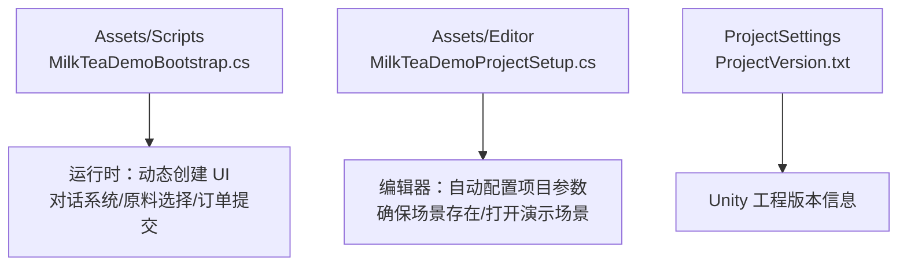
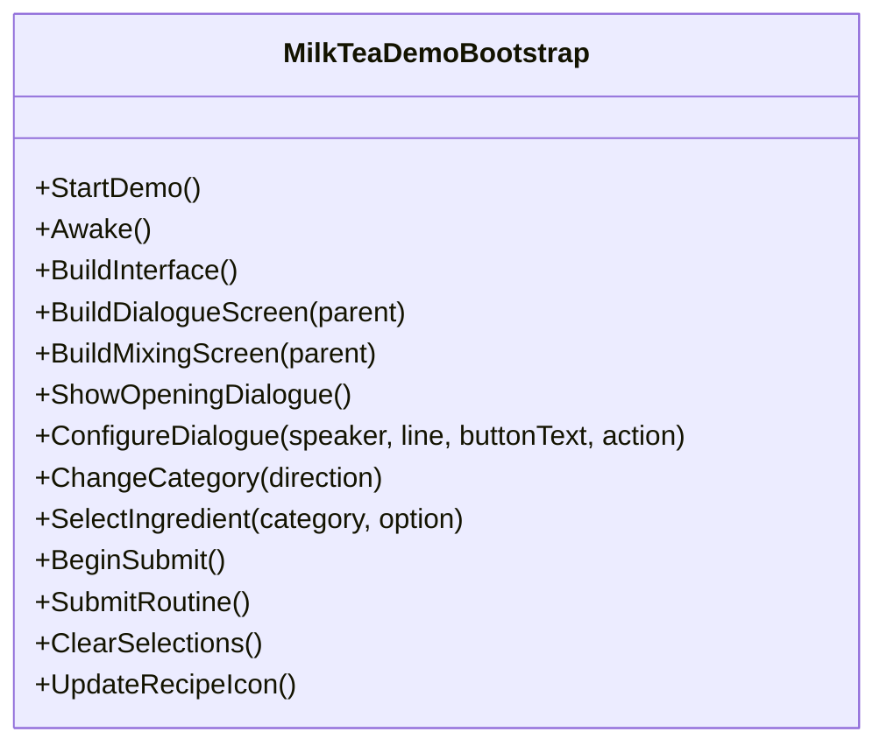
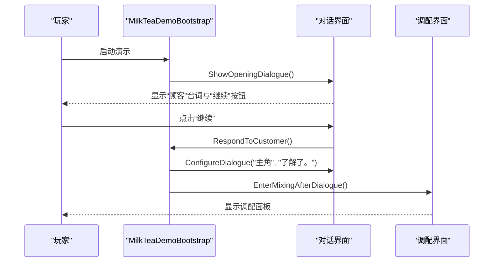
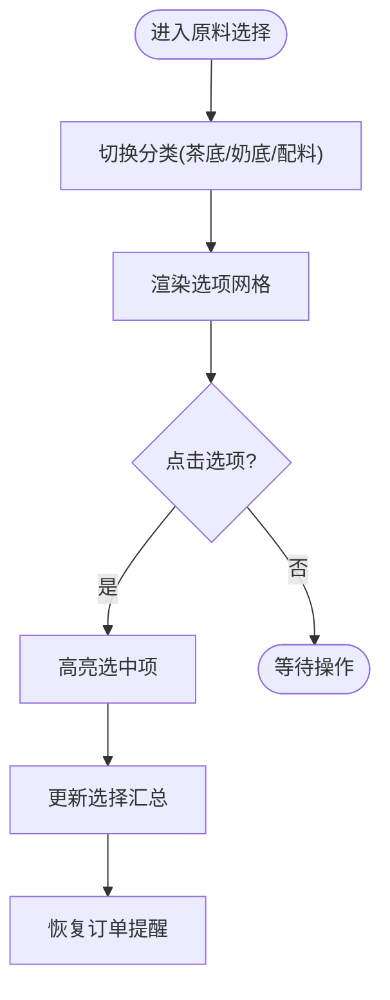
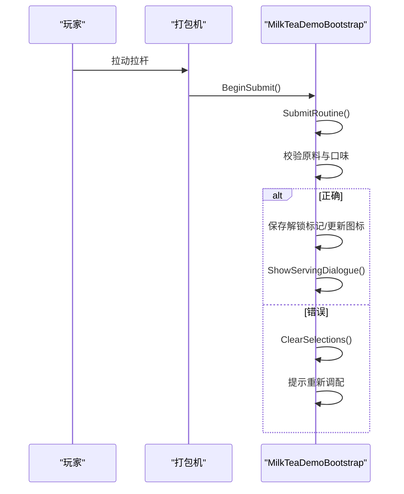
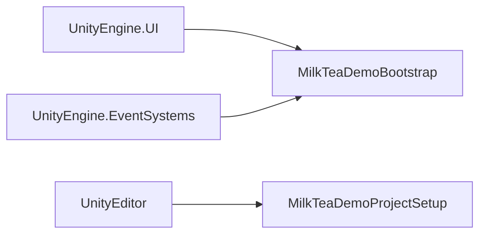

# 项目概述

<cite>
**本文引用的文件**   
- [MilkTeaDemoBootstrap.cs](file://Assets/Scripts/MilkTeaDemoBootstrap.cs)
- [MilkTeaDemoProjectSetup.cs](file://Assets/Editor/MilkTeaDemoProjectSetup.cs)
</cite>

## 目录
1. [引言](#引言)
2. [项目结构](#项目结构)
3. [核心组件](#核心组件)
4. [架构总览](#架构总览)
5. [详细组件分析](#详细组件分析)
6. [依赖关系分析](#依赖关系分析)
7. [性能与可扩展性](#性能与可扩展性)
8. [故障排查指南](#故障排查指南)
9. [结论](#结论)
10. [附录：游戏流程示例](#附录游戏流程示例)

## 引言
本项目是一个基于 Unity 的奶茶店模拟经营小游戏演示，旨在帮助初学者快速理解 UI 程序化构建、对话系统、原料管理与订单处理等基础概念。项目通过单脚本驱动的方式，在运行时动态创建 Canvas、面板、按钮和文本，实现“顾客下单—选择原料—调配饮品—封装出杯”的完整流程，并辅以简单的状态机模式组织界面切换与交互逻辑。

整体设计理念强调：
- 程序化 UI 构建：不依赖预制体，全部由代码生成，便于学习与扩展。
- 状态机模式：以“对话界面/调配界面”为状态，配合回调控制流程跳转。
- 单例式引导：使用全局入口类管理生命周期与全局配置（如字体、事件系统）。

适用场景：Unity 入门学习、UI 动态生成实践、简单状态机与数据校验流程演练。

## 项目结构
项目采用最小化结构，核心逻辑集中在脚本中，编辑器侧提供一键初始化与场景管理。

图表来源
- [MilkTeaDemoBootstrap.cs:8-81](file://Assets/Scripts/MilkTeaDemoBootstrap.cs#L8-L81)
- [MilkTeaDemoProjectSetup.cs:8-55](file://Assets/Editor/MilkTeaDemoProjectSetup.cs#L8-L55)

章节来源
- [MilkTeaDemoBootstrap.cs:8-81](file://Assets/Scripts/MilkTeaDemoBootstrap.cs#L8-L81)
- [MilkTeaDemoProjectSetup.cs:8-55](file://Assets/Editor/MilkTeaDemoProjectSetup.cs#L8-L55)

## 核心组件
- 启动与引导
  - 运行时自动创建宿主对象并挂载主控制器，避免重复实例化。
  - 确保 EventSystem 存在，防止 UI 交互失效。
  - 动态创建中文字体，兼容多平台显示。
- 界面系统
  - 动态创建 Canvas、背景、内容容器、对话框与调配面板。
  - 统一的颜色主题与边框效果，保证视觉一致性。
- 对话系统
  - 支持说话人、台词、按钮文案与回调动作。
  - 用于开场引导、服务完成与重玩提示。
- 原料与配方
  - 三类原料：茶底、奶底、配料；支持分类切换与多选高亮。
  - 糖度与冰度三档调节，实时汇总展示。
  - 配方手册仅作为当前 Demo 的静态说明。
- 订单处理
  - 根据顾客需求进行原料与口味校验。
  - 正确制作后解锁配方图标并进入服务对话；错误则清空选择并提示重新调配。

章节来源
- [MilkTeaDemoBootstrap.cs:62-81](file://Assets/Scripts/MilkTeaDemoBootstrap.cs#L62-L81)
- [MilkTeaDemoBootstrap.cs:83-114](file://Assets/Scripts/MilkTeaDemoBootstrap.cs#L83-L114)
- [MilkTeaDemoBootstrap.cs:116-156](file://Assets/Scripts/MilkTeaDemoBootstrap.cs#L116-L156)
- [MilkTeaDemoBootstrap.cs:158-192](file://Assets/Scripts/MilkTeaDemoBootstrap.cs#L158-L192)
- [MilkTeaDemoBootstrap.cs:194-312](file://Assets/Scripts/MilkTeaDemoBootstrap.cs#L194-L312)
- [MilkTeaDemoBootstrap.cs:314-359](file://Assets/Scripts/MilkTeaDemoBootstrap.cs#L314-L359)
- [MilkTeaDemoBootstrap.cs:361-549](file://Assets/Scripts/MilkTeaDemoBootstrap.cs#L361-L549)

## 架构总览
项目采用“单控制器 + 运行时 UI 生成”的轻量架构。主控制器负责：
- 生命周期管理（Awake/Start）
- UI 树构建（Canvas/Panel/Button/Text）
- 状态切换（对话界面 ↔ 调配界面）
- 数据校验（原料与口味匹配）
- 持久化（解锁配方标记）

图表来源
- [MilkTeaDemoBootstrap.cs:8-725](file://Assets/Scripts/MilkTeaDemoBootstrap.cs#L8-L725)

章节来源
- [MilkTeaDemoBootstrap.cs:8-725](file://Assets/Scripts/MilkTeaDemoBootstrap.cs#L8-L725)

## 详细组件分析

### 启动器与引导
- 自动启动：通过运行时初始化方法检测是否已存在实例，不存在则创建宿主对象并挂载控制器。
- 环境准备：确保 EventSystem 存在，避免 UI 无法响应点击。
- 字体适配：优先尝试系统中文字体，失败回退到内置 Arial。

章节来源
- [MilkTeaDemoBootstrap.cs:62-81](file://Assets/Scripts/MilkTeaDemoBootstrap.cs#L62-L81)
- [MilkTeaDemoBootstrap.cs:697-718](file://Assets/Scripts/MilkTeaDemoBootstrap.cs#L697-L718)

### 动态 UI 构建
- Canvas 与缩放：设置 ScreenSpaceOverlay 渲染模式，按 1920x1080 参考分辨率自适应。
- 布局容器：使用宽高比约束与拉伸锚点，保证在不同屏幕比例下稳定显示。
- 通用控件工厂：提供 CreatePanel/CreateText/CreateButton 等方法，统一样式与行为。

章节来源
- [MilkTeaDemoBootstrap.cs:83-114](file://Assets/Scripts/MilkTeaDemoBootstrap.cs#L83-L114)
- [MilkTeaDemoBootstrap.cs:616-695](file://Assets/Scripts/MilkTeaDemoBootstrap.cs#L616-L695)

### 对话系统
- 数据结构：说话人、台词、按钮文案、回调动作。
- 流程控制：开场对话 → 确认接单 → 进入调配界面 → 服务完成 → 感谢与重玩。
- 交互安全：按钮可交互状态由回调是否存在决定，避免空引用。

图表来源
- [MilkTeaDemoBootstrap.cs:314-359](file://Assets/Scripts/MilkTeaDemoBootstrap.cs#L314-L359)
- [MilkTeaDemoBootstrap.cs:327-334](file://Assets/Scripts/MilkTeaDemoBootstrap.cs#L327-L334)

章节来源
- [MilkTeaDemoBootstrap.cs:314-359](file://Assets/Scripts/MilkTeaDemoBootstrap.cs#L314-L359)

### 原料选择与配方展示
- 分类切换：茶底/奶底/配料三类，通过枚举与索引循环切换。
- 选项网格：根据列数计算行高与间距，动态生成按钮与标签。
- 选择反馈：选中项高亮，底部汇总实时更新。
- 配方手册：静态展示当前 Demo 的配方说明与图标占位。

图表来源
- [MilkTeaDemoBootstrap.cs:220-293](file://Assets/Scripts/MilkTeaDemoBootstrap.cs#L220-L293)
- [MilkTeaDemoBootstrap.cs:361-411](file://Assets/Scripts/MilkTeaDemoBootstrap.cs#L361-L411)
- [MilkTeaDemoBootstrap.cs:457-463](file://Assets/Scripts/MilkTeaDemoBootstrap.cs#L457-L463)
- [MilkTeaDemoBootstrap.cs:531-535](file://Assets/Scripts/MilkTeaDemoBootstrap.cs#L531-L535)

章节来源
- [MilkTeaDemoBootstrap.cs:194-312](file://Assets/Scripts/MilkTeaDemoBootstrap.cs#L194-L312)
- [MilkTeaDemoBootstrap.cs:361-411](file://Assets/Scripts/MilkTeaDemoBootstrap.cs#L361-L411)
- [MilkTeaDemoBootstrap.cs:457-463](file://Assets/Scripts/MilkTeaDemoBootstrap.cs#L457-L463)
- [MilkTeaDemoBootstrap.cs:531-535](file://Assets/Scripts/MilkTeaDemoBootstrap.cs#L531-L535)

### 订单处理与封装动画
- 输入校验：检查茶底、奶底、配料与糖度、冰度是否符合顾客需求。
- 封装动画：拉杆旋转进度条，完成后给出成功或失败反馈。
- 结果处理：
  - 成功：保存解锁标记、更新配方图标、进入服务对话。
  - 失败：清空选择、提示重新调配。

图表来源
- [MilkTeaDemoBootstrap.cs:465-514](file://Assets/Scripts/MilkTeaDemoBootstrap.cs#L465-L514)
- [MilkTeaDemoBootstrap.cs:516-529](file://Assets/Scripts/MilkTeaDemoBootstrap.cs#L516-L529)
- [MilkTeaDemoBootstrap.cs:543-549](file://Assets/Scripts/MilkTeaDemoBootstrap.cs#L543-L549)

章节来源
- [MilkTeaDemoBootstrap.cs:465-514](file://Assets/Scripts/MilkTeaDemoBootstrap.cs#L465-L514)
- [MilkTeaDemoBootstrap.cs:516-529](file://Assets/Scripts/MilkTeaDemoBootstrap.cs#L516-L529)
- [MilkTeaDemoBootstrap.cs:543-549](file://Assets/Scripts/MilkTeaDemoBootstrap.cs#L543-L549)

### 编辑器初始化
- 首次运行自动设置公司名称、产品名称、窗口尺寸与全屏模式。
- 确保演示场景存在，并将其加入 Build Settings。
- 提供菜单项“打开演示场景”，方便快速调试。

章节来源
- [MilkTeaDemoProjectSetup.cs:8-55](file://Assets/Editor/MilkTeaDemoProjectSetup.cs#L8-L55)
- [MilkTeaDemoProjectSetup.cs:57-68](file://Assets/Editor/MilkTeaDemoProjectSetup.cs#L57-L68)

## 依赖关系分析
- 运行时依赖
  - UnityEngine.UI：Canvas、Button、Text、Image、Outline 等 UI 组件。
  - UnityEngine.EventSystems：EventSystem 与 StandaloneInputModule。
- 编辑器依赖
  - UnityEditor：MenuItem、Scene 管理、PlayerSettings 配置。
- 耦合与内聚
  - 所有 UI 与逻辑集中在单一控制器，降低模块间耦合，提高内聚性。
  - 通过回调与枚举解耦状态切换与业务逻辑。

图表来源
- [MilkTeaDemoBootstrap.cs:1-7](file://Assets/Scripts/MilkTeaDemoBootstrap.cs#L1-L7)
- [MilkTeaDemoProjectSetup.cs:1-7](file://Assets/Editor/MilkTeaDemoProjectSetup.cs#L1-L7)

章节来源
- [MilkTeaDemoBootstrap.cs:1-7](file://Assets/Scripts/MilkTeaDemoBootstrap.cs#L1-L7)
- [MilkTeaDemoProjectSetup.cs:1-7](file://Assets/Editor/MilkTeaDemoProjectSetup.cs#L1-L7)

## 性能与可扩展性
- 性能特性
  - 运行时一次性构建 UI，避免频繁 Instantiate/Destroy。
  - 使用协程处理短动画与延时，不阻塞主线程。
  - 颜色与样式集中管理，减少重复计算。
- 可扩展建议
  - 将配方与订单数据抽离为 ScriptableObject 或 JSON，便于扩展更多饮品。
  - 引入简单状态机类封装“对话/调配/结算”状态，提升可读性与可维护性。
  - 将 UI 工厂方法抽取为独立工具类，进一步解耦控制器职责。

[本节为通用指导，不涉及具体文件分析]

## 故障排查指南
- UI 无响应
  - 检查 EventSystem 是否被创建；若缺失，控制器会自动补建。
  - 确认 Button 的 onClick 监听是否正确添加。
- 中文显示异常
  - 检查字体创建是否成功；若系统字体不可用，会回退到内置 Arial。
- 无法进入调配界面
  - 检查对话回调链是否完整，尤其是“继续”按钮的 Action。
- 订单校验失败
  - 核对选择的茶底、奶底、配料与糖度、冰度是否与顾客需求一致。
- 编辑器菜单无效
  - 确认脚本位于 Assets/Editor 目录，且 Unity 处于编辑器模式。

章节来源
- [MilkTeaDemoBootstrap.cs:697-718](file://Assets/Scripts/MilkTeaDemoBootstrap.cs#L697-L718)
- [MilkTeaDemoBootstrap.cs:314-359](file://Assets/Scripts/MilkTeaDemoBootstrap.cs#L314-L359)
- [MilkTeaDemoBootstrap.cs:465-514](file://Assets/Scripts/MilkTeaDemoBootstrap.cs#L465-L514)
- [MilkTeaDemoProjectSetup.cs:20-25](file://Assets/Editor/MilkTeaDemoProjectSetup.cs#L20-L25)

## 结论
本项目以极简结构展示了 Unity 游戏开发中的关键基础能力：动态 UI 构建、对话系统、原料管理与订单校验。通过单控制器与状态机模式，实现了从“顾客下单”到“出杯服务”的完整闭环，适合作为 Unity 初学者的入门案例。在此基础上，可逐步引入数据驱动、状态机框架与资源管理，向更复杂的经营模拟游戏演进。

[本节为总结性内容，不涉及具体文件分析]

## 附录：游戏流程示例
- 开场对话：顾客提出“经典珍珠奶茶 · 少糖 · 少冰”。
- 原料选择：依次选择茶底（红茶）、奶底（鲜奶）、配料（珍珠），并设置糖度（少糖）、冰度（少冰）。
- 封装出杯：拉动拉杆，系统校验通过后显示“制作正确”，进入服务对话。
- 服务完成：主角告知“您的奶茶做好了”，顾客致谢，可选择“重新体验”。

章节来源
- [MilkTeaDemoBootstrap.cs:314-359](file://Assets/Scripts/MilkTeaDemoBootstrap.cs#L314-L359)
- [MilkTeaDemoBootstrap.cs:361-411](file://Assets/Scripts/MilkTeaDemoBootstrap.cs#L361-L411)
- [MilkTeaDemoBootstrap.cs:465-514](file://Assets/Scripts/MilkTeaDemoBootstrap.cs#L465-L514)