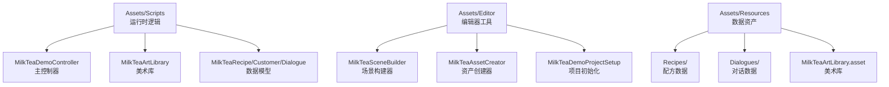
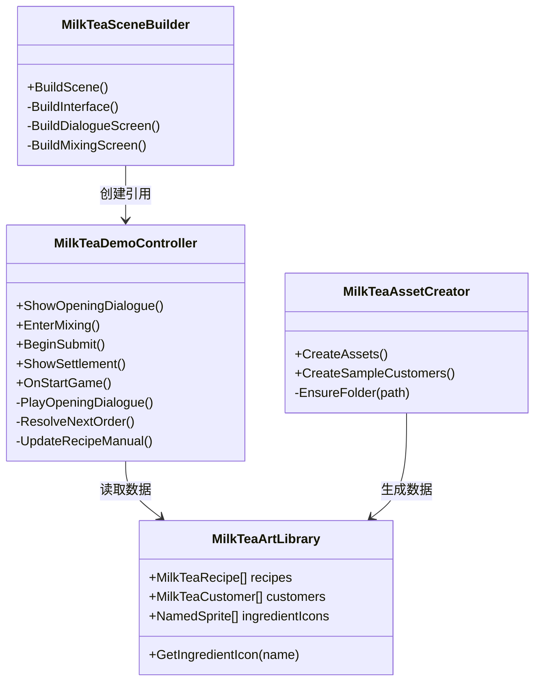
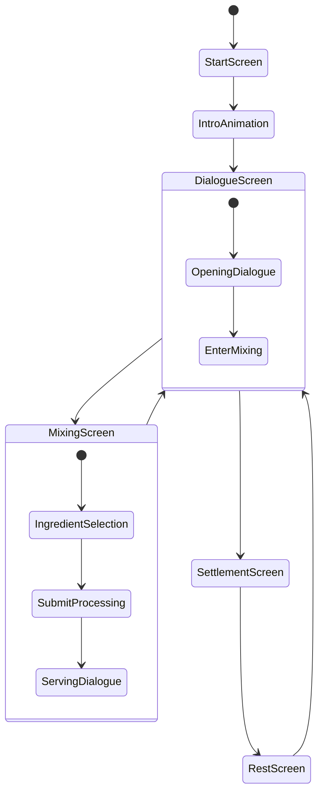
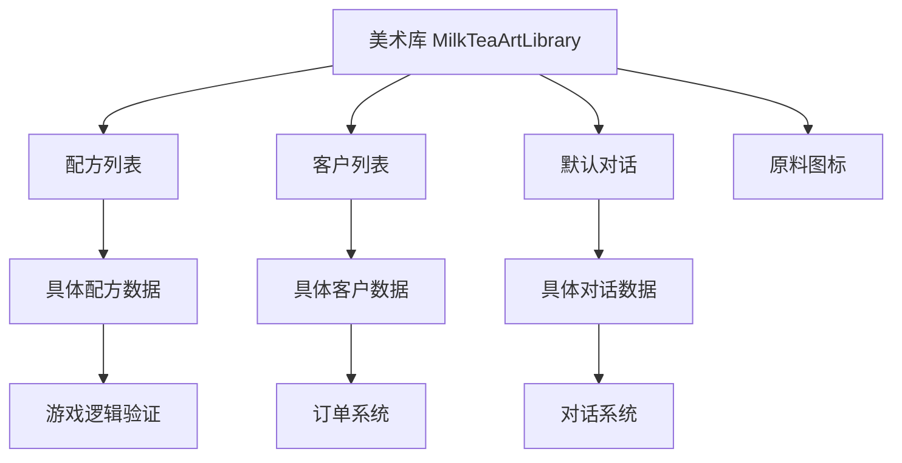
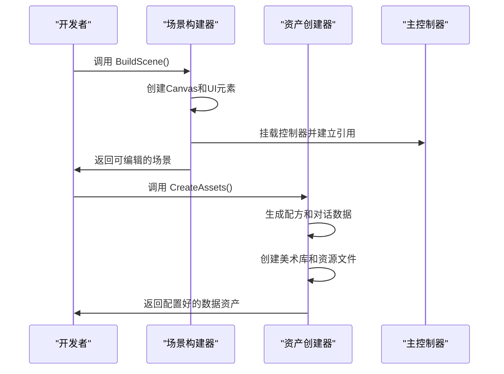
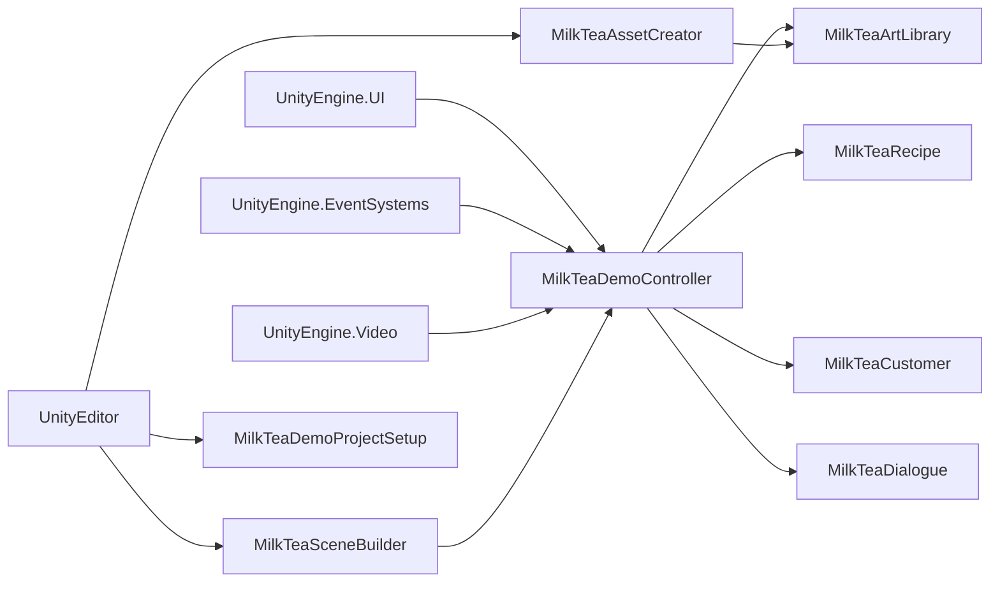

# 项目概述

<cite>
**本文引用的文件**   
- [MilkTeaDemoController.cs](file://Assets/Scripts/MilkTeaDemoController.cs)
- [MilkTeaArtLibrary.cs](file://Assets/Scripts/MilkTeaArtLibrary.cs)
- [MilkTeaRecipe.cs](file://Assets/Scripts/MilkTeaRecipe.cs)
- [MilkTeaCustomer.cs](file://Assets/Scripts/MilkTeaCustomer.cs)
- [MilkTeaDialogue.cs](file://Assets/Scripts/MilkTeaDialogue.cs)
- [MilkTeaChoiceButton.cs](file://Assets/Scripts/MilkTeaChoiceButton.cs)
- [MilkTeaCategoryPanel.cs](file://Assets/Scripts/MilkTeaCategoryPanel.cs)
- [MilkTeaSceneBuilder.cs](file://Assets/Editor/MilkTeaSceneBuilder.cs)
- [MilkTeaAssetCreator.cs](file://Assets/Editor/MilkTeaAssetCreator.cs)
- [MilkTeaDemoProjectSetup.cs](file://Assets/Editor/MilkTeaDemoProjectSetup.cs)
</cite>

## 更新摘要
**变更内容**   
- 从单脚本架构迁移到模块化架构，包含多个专门化的控制器和编辑器工具
- 引入数据驱动的资产管理系统，使用ScriptableObject存储配方、对话和客户数据
- 新增编辑器工具用于场景构建和数据资产管理
- 实现完整的游戏循环系统，包括开始界面、结算界面和休息界面
- 支持多语言设置、分辨率调整和音量控制等高级功能

## 目录
1. [引言](#引言)
2. [项目结构](#项目结构)
3. [核心组件](#核心组件)
4. [架构总览](#架构总览)
5. [详细组件分析](#详细组件分析)
6. [依赖关系分析](#依赖关系分析)
7. [性能与可扩展性](#性能与可扩展性)
8. [故障排查指南](#故障排查指南)
9. [结论](#结论)
10. [附录：游戏流程示例](#附录游戏流程示例)

## 引言
本项目是一个基于 Unity 的奶茶店模拟经营游戏，采用现代化的模块化架构设计。项目通过数据驱动的方式管理游戏内容，使用 ScriptableObject 存储配方、对话和客户信息，配合专门的编辑器工具进行场景构建和资源管理。游戏实现了完整的奶茶制作流程，包括顾客点单、原料选择、糖冰调节、封装出杯等环节，并支持多语言、分辨率设置和音量控制等高级功能。

整体设计理念强调：
- **模块化架构**：将运行时逻辑、编辑器工具和数据结构分离，提高代码可维护性
- **数据驱动设计**：使用 ScriptableObject 管理游戏内容，便于策划配置和扩展
- **程序化UI生成**：通过编辑器工具自动生成场景界面，支持运行时动态调整
- **完整游戏循环**：实现从开始菜单到结算界面的完整业务流程

适用场景：Unity 中级学习、模块化架构实践、数据驱动游戏开发、编辑器工具开发。

## 项目结构
项目采用清晰的模块化结构，分为运行时脚本、编辑器工具和资源数据三个主要部分：



**图表来源**
- [MilkTeaDemoController.cs:25-24](file://Assets/Scripts/MilkTeaDemoController.cs#L25-L24)
- [MilkTeaSceneBuilder.cs:17-16](file://Assets/Editor/MilkTeaSceneBuilder.cs#L17-L16)
- [MilkTeaAssetCreator.cs:13-12](file://Assets/Editor/MilkTeaAssetCreator.cs#L13-L12)

**章节来源**
- [MilkTeaDemoController.cs:25-24](file://Assets/Scripts/MilkTeaDemoController.cs#L25-L24)
- [MilkTeaSceneBuilder.cs:17-16](file://Assets/Editor/MilkTeaSceneBuilder.cs#L17-L16)
- [MilkTeaAssetCreator.cs:13-12](file://Assets/Editor/MilkTeaAssetCreator.cs#L13-L12)

## 核心组件

### 运行时控制器
- **MilkTeaDemoController**：主控制器，负责游戏状态管理、UI交互和业务逻辑
- **MilkTeaArtLibrary**：美术库，集中管理所有Sprite资源和游戏数据
- **数据模型**：MilkTeaRecipe（配方）、MilkTeaCustomer（客户）、MilkTeaDialogue（对话）

### 编辑器工具
- **MilkTeaSceneBuilder**：一键生成完整游戏场景界面
- **MilkTeaAssetCreator**：批量创建和管理游戏数据资产
- **MilkTeaDemoProjectSetup**：项目初始化和环境配置

### UI标记组件
- **MilkTeaChoiceButton**：原料选择按钮标记
- **MilkTeaCategoryPanel**：原料分类面板标记
- **MilkTeaLevelBlock**：糖度冰度等级块标记

**章节来源**
- [MilkTeaDemoController.cs:25-24](file://Assets/Scripts/MilkTeaDemoController.cs#L25-L24)
- [MilkTeaArtLibrary.cs:11-10](file://Assets/Scripts/MilkTeaArtLibrary.cs#L11-L10)
- [MilkTeaSceneBuilder.cs:17-16](file://Assets/Editor/MilkTeaSceneBuilder.cs#L17-L16)
- [MilkTeaAssetCreator.cs:13-12](file://Assets/Editor/MilkTeaAssetCreator.cs#L13-L12)

## 架构总览
项目采用分层架构设计，运行时逻辑与编辑器工具完全分离，数据通过ScriptableObject统一管理：



**图表来源**
- [MilkTeaDemoController.cs:25-24](file://Assets/Scripts/MilkTeaDemoController.cs#L25-L24)
- [MilkTeaArtLibrary.cs:11-10](file://Assets/Scripts/MilkTeaArtLibrary.cs#L11-L10)
- [MilkTeaSceneBuilder.cs:17-16](file://Assets/Editor/MilkTeaSceneBuilder.cs#L17-L16)
- [MilkTeaAssetCreator.cs:13-12](file://Assets/Editor/MilkTeaAssetCreator.cs#L13-L12)

**章节来源**
- [MilkTeaDemoController.cs:25-24](file://Assets/Scripts/MilkTeaDemoController.cs#L25-L24)
- [MilkTeaArtLibrary.cs:11-10](file://Assets/Scripts/MilkTeaArtLibrary.cs#L11-L10)
- [MilkTeaSceneBuilder.cs:17-16](file://Assets/Editor/MilkTeaSceneBuilder.cs#L17-L16)
- [MilkTeaAssetCreator.cs:13-12](file://Assets/Editor/MilkTeaAssetCreator.cs#L13-L12)

## 详细组件分析

### 主控制器 MilkTeaDemoController
作为游戏的核心控制器，负责管理整个游戏的生命周期和状态流转：

- **界面管理**：控制对话界面、调配界面、结算界面、休息界面和开始界面的显示切换
- **订单处理**：解析顾客需求，验证原料选择和口味配置的正确性
- **配方系统**：管理配方手册的翻页和展示，支持图标和详细信息显示
- **游戏循环**：实现天数的推进、营业统计和结算逻辑
- **设置系统**：处理音量、分辨率、语言等游戏设置



**图表来源**
- [MilkTeaDemoController.cs:447-480](file://Assets/Scripts/MilkTeaDemoController.cs#L447-L480)
- [MilkTeaDemoController.cs:531-542](file://Assets/Scripts/MilkTeaDemoController.cs#L531-L542)
- [MilkTeaDemoController.cs:652-679](file://Assets/Scripts/MilkTeaDemoController.cs#L652-L679)

**章节来源**
- [MilkTeaDemoController.cs:25-24](file://Assets/Scripts/MilkTeaDemoController.cs#L25-L24)
- [MilkTeaDemoController.cs:447-480](file://Assets/Scripts/MilkTeaDemoController.cs#L447-L480)
- [MilkTeaDemoController.cs:531-542](file://Assets/Scripts/MilkTeaDemoController.cs#L531-L542)

### 数据驱动系统
项目采用ScriptableObject实现数据驱动设计：

- **MilkTeaRecipe**：定义每款奶茶的配方要求，包括茶底、奶底、配料等
- **MilkTeaCustomer**：表示特定顾客的点单需求和个性化对话
- **MilkTeaDialogue**：管理游戏中的对话流程，支持占位符替换
- **MilkTeaArtLibrary**：集中管理所有美术资源和游戏数据



**图表来源**
- [MilkTeaArtLibrary.cs:54-63](file://Assets/Scripts/MilkTeaArtLibrary.cs#L54-L63)
- [MilkTeaRecipe.cs:8-31](file://Assets/Scripts/MilkTeaRecipe.cs#L8-L31)
- [MilkTeaCustomer.cs:10-36](file://Assets/Scripts/MilkTeaCustomer.cs#L10-L36)
- [MilkTeaDialogue.cs:11-28](file://Assets/Scripts/MilkTeaDialogue.cs#L11-L28)

**章节来源**
- [MilkTeaArtLibrary.cs:11-84](file://Assets/Scripts/MilkTeaArtLibrary.cs#L11-L84)
- [MilkTeaRecipe.cs:8-32](file://Assets/Scripts/MilkTeaRecipe.cs#L8-L32)
- [MilkTeaCustomer.cs:10-37](file://Assets/Scripts/MilkTeaCustomer.cs#L10-L37)
- [MilkTeaDialogue.cs:11-29](file://Assets/Scripts/MilkTeaDialogue.cs#L11-L29)

### 编辑器工具系统
提供强大的编辑器扩展功能：

- **MilkTeaSceneBuilder**：一键生成完整的游戏场景，包括所有UI元素和布局
- **MilkTeaAssetCreator**：批量创建和管理游戏数据资产，支持模板化生成
- **MilkTeaDemoProjectSetup**：自动配置项目设置，确保开发环境一致性



**图表来源**
- [MilkTeaSceneBuilder.cs:38-55](file://Assets/Editor/MilkTeaSceneBuilder.cs#L38-L55)
- [MilkTeaAssetCreator.cs:44-112](file://Assets/Editor/MilkTeaAssetCreator.cs#L44-L112)
- [MilkTeaSceneBuilder.cs:87-150](file://Assets/Editor/MilkTeaSceneBuilder.cs#L87-L150)

**章节来源**
- [MilkTeaSceneBuilder.cs:17-729](file://Assets/Editor/MilkTeaSceneBuilder.cs#L17-L729)
- [MilkTeaAssetCreator.cs:13-265](file://Assets/Editor/MilkTeaAssetCreator.cs#L13-L265)
- [MilkTeaDemoProjectSetup.cs:9-71](file://Assets/Editor/MilkTeaDemoProjectSetup.cs#L9-L71)

### UI标记系统
通过轻量级标记组件实现UI与逻辑的解耦：

- **MilkTeaChoiceButton**：标记原料选择按钮，记录所属类别和选项名称
- **MilkTeaCategoryPanel**：标记原料分类容器，支持分类切换显示
- **MilkTeaLevelBlock**：标记糖度冰度等级块，支持等级切换高亮

**章节来源**
- [MilkTeaChoiceButton.cs:7-11](file://Assets/Scripts/MilkTeaChoiceButton.cs#L7-L11)
- [MilkTeaCategoryPanel.cs:7-10](file://Assets/Scripts/MilkTeaCategoryPanel.cs#L7-L10)

## 依赖关系分析
项目采用松耦合的依赖关系设计：



**图表来源**
- [MilkTeaDemoController.cs:1-7](file://Assets/Scripts/MilkTeaDemoController.cs#L1-L7)
- [MilkTeaSceneBuilder.cs:1-10](file://Assets/Editor/MilkTeaSceneBuilder.cs#L1-L10)
- [MilkTeaAssetCreator.cs:1-6](file://Assets/Editor/MilkTeaAssetCreator.cs#L1-L6)

**章节来源**
- [MilkTeaDemoController.cs:1-7](file://Assets/Scripts/MilkTeaDemoController.cs#L1-L7)
- [MilkTeaSceneBuilder.cs:1-10](file://Assets/Editor/MilkTeaSceneBuilder.cs#L1-L10)
- [MilkTeaAssetCreator.cs:1-6](file://Assets/Editor/MilkTeaAssetCreator.cs#L1-L6)

## 性能与可扩展性
项目在设计上充分考虑了性能和可扩展性：

### 性能优化
- **数据预加载**：在Awake阶段一次性加载所有必要数据，避免运行时频繁Resource.Load
- **UI复用**：通过标记组件和反射机制减少重复代码，提高UI构建效率
- **协程异步**：使用协程处理动画和延时操作，不阻塞主线程
- **内存管理**：合理使用对象池和垃圾回收，避免频繁的Instantiate/Destroy

### 扩展建议
- **插件化架构**：将不同功能模块拆分为独立插件，支持热插拔
- **配置中心**：引入配置文件管理系统，支持运行时动态配置
- **本地化框架**：扩展多语言支持，支持更多语言和文本格式
- **存档系统**：实现游戏进度保存和加载功能
- **成就系统**：添加成就和奖励机制，增强游戏趣味性

## 故障排查指南

### 常见问题及解决方案

#### 场景无法打开
- **检查场景路径**：确认 Assets/Scenes/MilkTeaDemo.unity 是否存在
- **重新构建场景**：使用编辑器菜单 "奶茶店 Demo → 构建演示场景界面"
- **清理旧场景**：删除现有场景后重新生成

#### 数据资产缺失
- **生成数据资产**：使用 "奶茶店 Demo → 生成或更新数据资产"
- **检查Resources目录**：确认 Assets/Resources 下存在必要的.asset文件
- **刷新资源**：在Unity中执行 Assets → Refresh

#### UI显示异常
- **检查字体设置**：确认 MilkTeaArtLibrary 中的 uiFont 是否正确设置
- **验证控件引用**：检查 MilkTeaDemoController 中的公共字段是否已赋值
- **重置场景**：重新运行场景构建器以重建UI结构

#### 订单校验失败
- **核对配方数据**：检查 MilkTeaRecipe 中的 teaBase、milkBase、topping 字段
- **验证客户订单**：确认 MilkTeaCustomer 中的 order 和 sugarLevel/iceLevel
- **检查字符串匹配**：确保选择的原料名称与配方定义完全一致

**章节来源**
- [MilkTeaSceneBuilder.cs:38-55](file://Assets/Editor/MilkTeaSceneBuilder.cs#L38-L55)
- [MilkTeaAssetCreator.cs:44-112](file://Assets/Editor/MilkTeaAssetCreator.cs#L44-L112)
- [MilkTeaDemoController.cs:384-416](file://Assets/Scripts/MilkTeaDemoController.cs#L384-L416)

## 结论
本项目展示了现代Unity游戏开发的最佳实践，通过模块化架构、数据驱动设计和编辑器工具扩展，构建了一个功能完整的奶茶店模拟经营游戏。项目的核心价值在于：

1. **架构示范**：清晰的分层架构和职责分离，易于维护和扩展
2. **数据驱动**：使用ScriptableObject实现灵活的内容管理
3. **工具链完善**：提供完整的编辑器工具，提升开发效率
4. **学习价值**：涵盖Unity开发的多个重要概念和实践技巧

该项目适合作为Unity中级开发者的学习案例，帮助理解模块化游戏架构、编辑器工具开发和数据驱动设计的实际应用。

## 附录：游戏流程示例

### 完整游戏流程
1. **启动游戏**：点击"开始游戏"进入开场动画
2. **顾客点单**：显示顾客需求，包括饮品类型、糖度和冰度
3. **原料选择**：依次选择茶底、奶底和配料
4. **口味调节**：设置糖度和冰度等级
5. **封装出杯**：拉动拉杆进行封装，系统验证配方正确性
6. **服务完成**：显示服务对话，顾客表示感谢
7. **日结算**：显示当日营业统计和收入
8. **休息过渡**：回到出租屋休息，准备下一天营业

### 数据配置示例
```yaml
配方: 经典珍珠奶茶
  茶底: 红茶
  奶底: 鲜奶  
  配料: 珍珠
  图标标签: 珍珠
  
客户: 上班族小林
  订单: 经典珍珠奶茶
  糖度: 少糖(1)
  冰度: 少冰(1)
  开场对话: 老板，来杯{drink}，我赶时间！
```

**章节来源**
- [MilkTeaDemoController.cs:447-480](file://Assets/Scripts/MilkTeaDemoController.cs#L447-L480)
- [MilkTeaDemoController.cs:531-542](file://Assets/Scripts/MilkTeaDemoController.cs#L531-L542)
- [MilkTeaDemoController.cs:652-679](file://Assets/Scripts/MilkTeaDemoController.cs#L652-L679)
- [MilkTeaAssetCreator.cs:143-189](file://Assets/Editor/MilkTeaAssetCreator.cs#L143-L189)